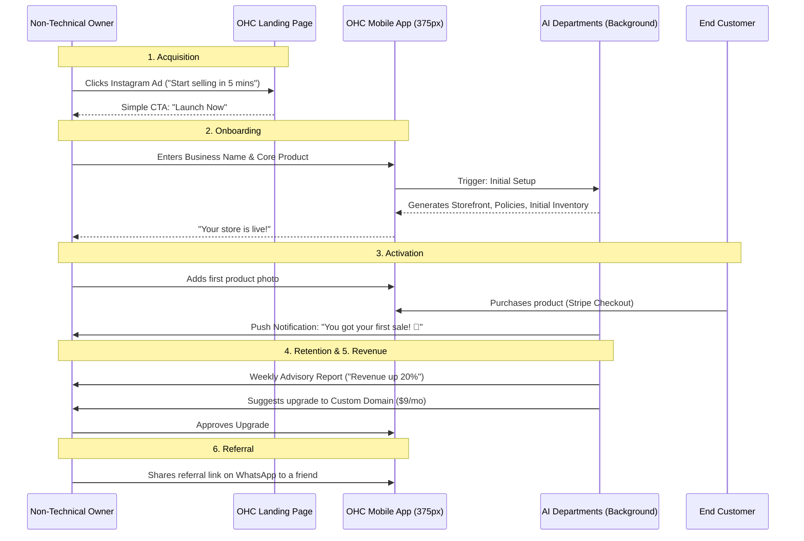
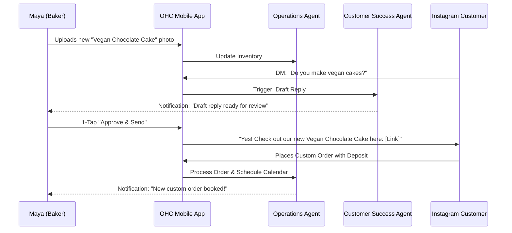

# Issue Brief: End-to-End Business Journey Architecture for OHC

## Title
Business Journey Architecture 🚀 (Acquisition to Referral)

## Problem Statement
Small business owners—often entirely non-technical (like Maya the Baker or Carlos the Handyman)—experience significant friction during the lifecycle of launching and running their business on traditional platforms. They face a steep learning curve from the moment of discovery, through onboarding, first sales, and eventual business scaling. We need a unified architectural model of the **end-to-end user journey** (Acquisition, Onboarding, Activation, Retention, Revenue, Referral) that explicitly removes technical jargon and leverages autonomous AI agents to invisibly handle complexity at every stage.

## Research Report
- **Goal:** Design the complete end-to-end business journey mapping how non-technical personas interact with the OHC platform, ensuring all friction points are resolved via background AI agents.
- **Acquisition:** Users discover OHC through organic search, targeted Instagram/TikTok ads, or friend referrals. The primary CTA must be simple ("Launch your business in 5 minutes").
- **Onboarding:** Must be a guided wizard capturing only essential details (business name, primary offering, payment method). Defer complex configurations (e.g., custom domains, advanced SEO) to AI agents or later stages.
- **Activation:** Defined as the moment the user successfully adds their first product/service and receives their first payment. This is the "Aha!" moment.
- **Retention:** Sustained through daily actionable insights. The Business Advisory Agent sends push notifications ("You had 3 bookings today!", "Consider offering a weekend discount.") to keep the user engaged.
- **Revenue:** The trigger for upgrading from Free to Starter or Pro. Presented contextually when a user hits a milestone (e.g., reaching 10 products or requiring a custom domain).
- **Referral:** A built-in viral loop where successful owners (like Priya the Boutique Owner) share an exclusive referral link to fellow business owners.
- **Friction Points Addressed:**
  - *Friction:* "I don't know how to build a website." -> *Solution:* Marketing & Advertising Agent automatically designs the storefront based on the onboarding wizard inputs.
  - *Friction:* "I'm overwhelmed by customer messages." -> *Solution:* Customer Success Agent drafts replies for 1-tap approval.

## Design Doc

### User Journey Diagrams (Mermaid.js)

#### 1. General User Journey Flow

#### 2. Persona Focus: Maya (The Home Baker)

### Architecture Constraints
- **Mobile-First Validation:** Every step of this journey must be achievable via a 375px mobile screen. Complex multi-step forms must be broken down or handled by AI.
- **Progressive Profiling:** Do not demand all data upfront during onboarding. Rely on the AI to infer missing details or prompt the user organically over time.
- **Contextual Notifications:** The system must orchestrate notifications carefully to avoid spam. Use the KAIROS Orchestrator to batch "Advisory" insights.

## Implementation Prompt
"Implement the foundational User Journey telemetry and notification hooks across the OHC frontend and backend.
1. Create a lightweight Onboarding Wizard in the Flutter application that captures minimal business data.
2. Integrate a 'Journey Milestone' tracker in the backend (Postgres) that emits events (e.g., `milestone:first_sale`, `milestone:10_products`) to the Teammate Mesh.
3. Configure the Business Advisory Agent to listen for these milestone events and generate contextual push notifications (e.g., upgrade prompts, referral nudges).
Ensure all UI flows are strictly optimized for a 375px mobile viewport."

## Priority
P1

## Estimated Scope
Medium
