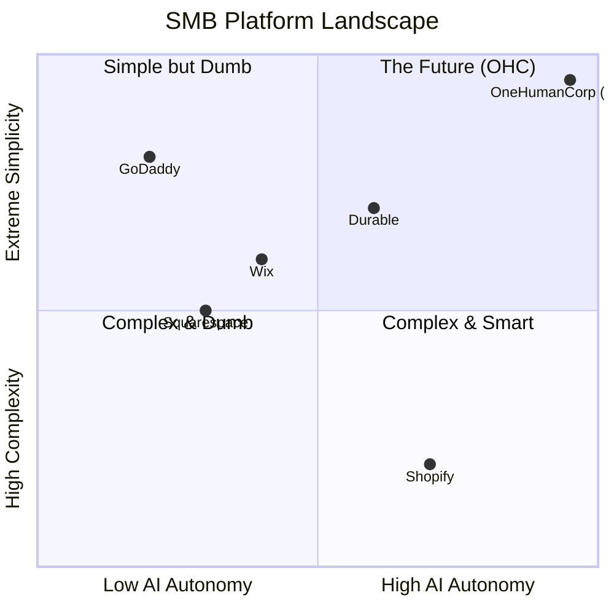
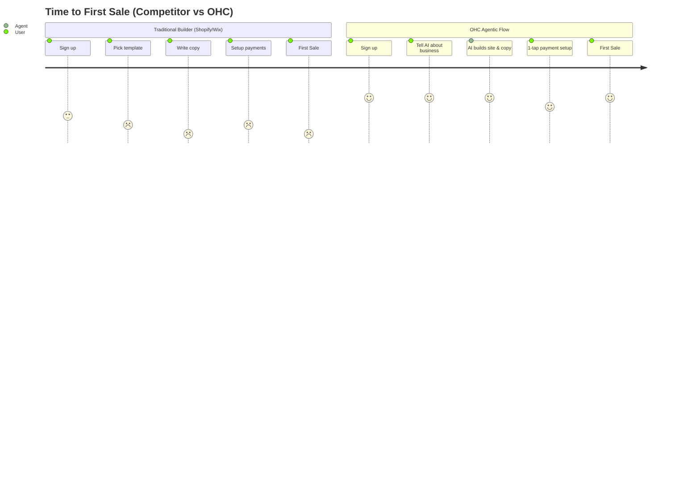

# 🔮 Oracle: SMB Platform Market Dominance & AI Integration Strategy

## Problem Statement
Small business owners—bakers, handymen, boutique owners, and service providers—want to sell their products and services online, but the current platforms are built for web designers or full-time e-commerce managers. They are overwhelmed by the setup process, frustrated by managing multiple disconnected tools (scheduling, payments, CRM, social media), and feel unsupported. They don't want a "tool" to build a website; they want an invisible partner that manages the digital complexity of their business while they focus on their craft.

## Research Report

### Track 1: Deep Competitor Audit
Based on website analysis and market sentiment:
- **Shopify**: Industry standard for e-commerce. Great for scaling, but complex for beginners. Has introduced "Sidekick" (an AI chatbot, but not an autonomous agent). Poor mobile setup experience.
- **Wix**: Flexible and easier to start with Wix ADI, but the AI is focused on one-time site generation rather than ongoing business management.
- **Squarespace**: Beautiful, design-first templates. Blueprint AI helps with initial generation. Strong for portfolios and creative services, but lacks deep operational AI.
- **GoDaddy (Airo)**: Simple, focuses on domain+basic site+logo generation. However, it is shallow, known for aggressive upselling, and lacks powerful post-launch tools.
- **Zyro / Hostinger Builder**: Budget-friendly, basic AI generation tools, but thin on comprehensive business management features.
- **Durable**: AI generates a website in 30 seconds. Positions itself as the "AI business builder" with CRM and invoicing, but lacks deep vertical-specific operational depth.

### Track 2: SMB User Pain Point Research
Ranked list of Top 10 SMB Pain Points (Based on App Store, Reddit, and Trustpilot sentiment):
1. **"Setting it up takes too long"** - Overwhelming number of settings to go live.
2. **"I don't know what to write"** - Blank page anxiety for product descriptions and "About Us" pages.
3. **"Managing inventory across channels is a nightmare"** - Keeping Instagram DMs and website stock in sync.
4. **"Customer messages get lost"** - Missing leads from Instagram, WhatsApp, and email.
5. **"Mobile apps are just dashboards"** - Cannot easily build or manage the *entire* business from a smartphone.
6. **"It's too expensive"** - No meaningful free tier for micro-businesses just testing the waters.
7. **"Booking and scheduling are clunky"** - Service businesses struggle to integrate calendars with payments seamlessly.
8. **"I forget to follow up with leads"** - Leaving money on the table due to manual CRM.
9. **"Marketing is a full-time job"** - No time to create social posts or emails.
10. **"The tools don't talk to each other"** - Point-of-sale, website, and accounting are fragmented.

### Track 3: AI Differentiation Strategy (Manifesto)
OHC will leapfrog the market by moving from *Generative AI* (Wix ADI, Durable) to *Agentic AI*.
**The 5 AI Automations OHC Will Implement:**
1. **Auto-Replying Agent**: Connects to Instagram/WhatsApp to answer FAQs and book appointments autonomously (Saves 2+ hours/day).
2. **Auto-Content Generator**: Creates product descriptions and SEO tags from a single smartphone photo (Saves 30 min/upload).
3. **Auto-Social Marketer**: Drafts and schedules weekly Instagram/Facebook posts based on new inventory or open slots.
4. **Auto-Follow-Up**: Recovers abandoned carts and follows up with past clients for re-booking.
5. **Insights Oracle**: Weekly SMS summarizing business health ("You had 5 bookings this week. Let's run a promo next week? Reply YES to launch").

### Track 4: Market Sizing & Strategic Direction
- **TAM**: 33M+ small businesses in the US alone; 400M+ globally. Roughly 30% do not have a functional website, and 70% are dissatisfied with their current tech stack.
- **Beachhead Market**: Service-based Solo-preneurs (e.g., Handymen, Cleaners, Tutors like Leo and Carlos). They have high LTV, immediate need for scheduling + payments, and are underserved by Shopify's product-first focus.
- **Geographic Expansion**: Start English-first (US/UK/AUS), then rapidly localize to Spanish (LATAM) and Portuguese (Brazil) where mobile-first entrepreneurship is exploding.

### Track 5: Feature Gap Matrix

| Feature | Shopify | Wix | Squarespace | Durable | OHC (Current) | OHC (Target Advantage) |
| :--- | :--- | :--- | :--- | :--- | :--- | :--- |
| **Site Generation** | Manual / Themes | AI (Wix ADI) | Blueprint AI | AI (30s) | Manual | AI-Generated in < 10 mins |
| **Mobile Management** | Dashboard only | Basic edits | Basic edits | Dashboard | - | 100% Mobile-Native |
| **Invisible AI Agents**| Chatbot (Sidekick) | No | No | Basic Assistant | No | Full Autonomous Swarm |
| **Unified Inbox** | Add-on | Yes | No | CRM | No | Native, Multi-channel |
| **Zero-Setup CRM** | Basic | Yes | Basic | Yes | No | Agent-Managed CRM |

---

## Persona Mappings

- **Maya (Baker, 28)**: Needs seamless Instagram DM to order flow. OHC Advantage: Auto-reply agent takes the order via DM and creates the invoice.
- **Carlos (Handyman, 42)**: Needs mobile-first booking and quoting. OHC Advantage: SMS-based scheduling and one-tap invoicing from his truck.
- **Priya (Boutique, 35)**: Needs inventory sync. OHC Advantage: Snap a photo of clothes, AI writes the description, prices it, and syncs to web.
- **Leo (Tutor, 22)**: Needs subscription billing. OHC Advantage: Automated recurring payments and automated class reminders.
- **Fatima (Food Cart, 50)**: Needs extreme simplicity. OHC Advantage: Plain language UI, big buttons, push notifications for orders, zero tech jargon.

---

## Visual Excellence: Market Landscape & Architecture

### Competitive Landscape

### User Journey Comparison

---

## Design Doc

**Architecture:**
- **Entity Types**: BusinessProfile, AgentTask, CustomerInteraction, InventoryItem, BookingSlot.
- **Key Relationships**: A BusinessProfile owns multiple AgentTasks. CustomerInteractions trigger AgentTasks (e.g., DM received -> Agent replies).
- **Integration Points**: Meta Graph API (Instagram/WhatsApp), Stripe (Payments), OpenAI/Anthropic (Agent Brain).

**UI / UX Flow (Mobile First - 375px):**
1. **Onboarding Screen**: Chat interface. "What's your business name and what do you do?"
2. **Loading Screen**: Glassmorphism effect, blur 15px. "Agents are building your store..."
3. **Main Dashboard**: Big metrics (Sales Today, Open Messages). Sticky profile toggle for Advanced Mode.
4. **Action Center**: Plain language. "Add a product" -> Opens camera.
5. **Agent Hub**: Toggle switches to turn on/off "Auto-Reply to DMs", "Auto-Follow Up".

**AI Integration Points:**
- **Vision AI**: Processes uploaded photos to extract product details.
- **NLP Swarm**: Listens to webhooks from integrated social channels to draft and send replies.
- **Cron Agents**: Nightly jobs to analyze metrics and generate insights for the owner.

---

## Implementation Prompt

**Critical User Journey (CUJ): The "10-Minute Launch & Agent Setup"**
Implement the core onboarding and agent-activation flow for a new user.
1. The user creates an account and is presented with a simple, chat-like interface to describe their business.
2. The system generates a basic business profile and a placeholder storefront.
3. The user lands on the mobile-first dashboard (375px optimized, utilizing the GlassCard layout and OHC premium CSS tokens).
4. The user navigates to the "Agent Hub" and toggles on the "Auto-Reply Agent".
5. The UI must hide complex API configurations behind a Progressive Disclosure toggle (Advanced Mode). In Simple Mode, it just says "Let AI answer common questions."

**Acceptance Criteria:**
- The flow is fully navigable on a 375px viewport.
- The UI adheres to the Grandmother Test (plain language, no technical jargon in Simple Mode).
- The "Agent Hub" component uses premium motion (entrance ≤ 300ms, exit ≤ 200ms).
- A mock test demonstrates the state change when the user enables the agent.
- 100% unit test coverage for new UI components.

## Priority
P0

## Estimated Scope
Medium
