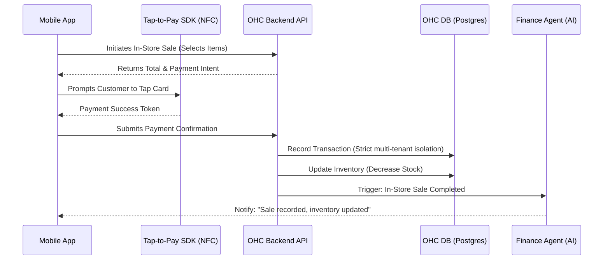

# [Architecture] Tap-to-Pay Terminal Integration

## Problem Statement
Priya (Boutique Owner, 35) runs a hybrid business: she sells clothing both in her physical store and online. She currently manages inventory manually across two systems because her in-store POS (Point of Sale) does not integrate seamlessly with her online storefront. Taking payments in-store requires clunky legacy hardware, high fees, and breaks the multi-tenant offline-capable data model OHC promises. She needs an integrated mobile Tap-to-Pay solution that lets her accept contactless payments directly on her phone, perfectly syncing with her OHC inventory and ledger without complex setup.

## Persona-Specific Pain Point Summary
- **Priya (Boutique Owner, 35)**: Wants to take payments in her physical store, but the traditional POS systems are disconnected from her online inventory. She faces significant "Mobile Gaps" when trying to keep stock counts accurate between the physical floor and online sales.
- **Maya (Baker, 28)**: Does pop-up shops occasionally and needs a way to quickly accept payments from her phone without buying card readers.
- **Fatima (Food Cart, 50)**: Serves customers rapidly; needs a frictionless way to accept physical credit cards and Apple Pay directly on her Android device without additional bulky hardware on her limited cart space.
- **Carlos (Handyman, 42)**: Takes final payments on-site after finishing repairs. Sending an invoice feels slow; he wants the client to tap their card on his phone before he leaves the driveway.

## Research Report

The existing small business platforms treat POS and online sales as separate silos, often requiring premium add-ons or dedicated hardware. OHC must leverage software-based point-of-sale directly on the user's mobile device. Major platforms like Shopify provide POS solutions, but they require purchasing proprietary hardware or navigating complex setups. Wix and Squarespace have limited native POS capabilities, often relying on third-party integrations that disjoint the user experience.

Stripe Terminal and Apple/Google Tap-to-Pay SDKs now allow any modern smartphone (NFC-enabled) to act as a contactless payment terminal. By embedding Tap-to-Pay directly into the OHC mobile app, business owners can process in-person transactions instantly. This ensures single-source-of-truth inventory, unified customer profiles, and a unified financial ledger within OHC's multi-tenant architecture.

### Comparative Table: OHC vs Competitors
| Platform | Hardware Required | Setup Complexity | Inventory Sync | AI Integration |
|---|---|---|---|---|
| **OHC** | **None (Phone Only)** | **Instant** | **Native & Real-time** | **Proactive Agents Update Ledgers** |
| Shopify | Yes (Card Readers) | Moderate | Native | Reactive |
| Wix | Yes | High (3rd Party apps) | Delayed | None |
| Squarespace | Yes (Square integration) | Moderate | Disjointed | None |
| Square | Yes | Low | Native | None |

### Actionable Recommendations
- **Adopt Phone-Only Tap-to-Pay**: Do not support or build for dedicated hardware yet. Rely exclusively on Apple Tap-to-Pay and Google Tap-to-Pay SDKs.
- **Single Source of Truth Inventory**: Ensure in-store purchases immediately reduce the global stock count using the existing PostgreSQL database to avoid overselling.
- **Trigger Autonomous Agents**: Emitting an event upon successful in-store payment should wake the Finance Agent to log the transaction, and the Marketing Agent to send a follow-up SMS if the customer is enrolled.

## Design Doc

### Architecture Diagram

### UI Wireframes & Mobile UX Flow (375px)
1. **Dashboard (375px)**: Priya taps a prominent "New In-Store Sale" button. Clean macOS glass styling `rgba(255, 255, 255, 0.65)` with `blur(30px) saturate(210%)` applied to the top navigation.
2. **Catalog/Cart**: She selects products from her synced inventory list or inputs a quick custom amount using a numeric keypad.
3. **Checkout**: She taps a large (8px border radius) "Charge $XX.XX" button. A system modal (Apple/Google Tap to Pay) appears natively.
4. **Payment**: Customer taps their physical credit card or phone against Priya's device.
5. **Confirmation**: A clean success card (16px border radius) appears, offering options to email or SMS the receipt to the customer. All developer/technical terms are hidden behind 'Advanced Settings'.
6. **Agent Action**: The Finance Agent silently updates her daily sales chart in the background.

### Key Design Decisions
- **Mobile Parity**: The feature is designed explicitly for 375px mobile viewports, as in-store Tap-to-Pay is inherently a mobile action.
- **Unified Inventory**: No separate "POS inventory" vs "Online inventory". All read/writes hit the same core database tables.
- **Invisible Complexity**: The integration with Stripe Terminal / Tap-to-Pay SDKs is abstracted away. The user only sees "Charge".
- **Zero Trust Security**: Strict multi-tenant isolation rules apply when updating inventory and recording transactions.

## Implementation Prompt
Implement the backend architecture to support Tap-to-Pay terminal transactions for in-store purchases. Create the necessary logic to initiate payment intents and capture successful in-person payments, linking them to existing inventory items. Ensure that upon successful payment, an event is published to the internal event mesh to trigger the Finance and Operations AI agents to update ledgers and stock counts. The solution must support both cloud and standalone deployments seamlessly without exposing implementation details to the frontend.

## Priority
P1

## Estimated Scope
Large

## References & Sources
1. [Stripe Terminal Docs](https://stripe.com/docs/terminal)
2. [Apple Tap to Pay on iPhone](https://developer.apple.com/tap-to-pay/)
3. [Google Tap to Pay on Android](https://developers.google.com/pay/api/android)
4. [Shopify POS Hardware](https://www.shopify.com/pos/hardware)
5. [Wix Point of Sale](https://www.wix.com/pos)
6. [Squarespace Point of Sale](https://www.squarespace.com/ecommerce/point-of-sale)
7. [Square Point of Sale](https://squareup.com/us/en/point-of-sale)
8. [NFC Forum Specs](https://nfc-forum.org/build/specifications)
9. [PCI Mobile Payment Acceptance Security Guidelines](https://www.pcisecuritystandards.org/)
10. [Flutter Stripe Terminal SDK](https://pub.dev/packages/flutter_stripe)
11. [React Native Stripe Terminal](https://github.com/stripe/stripe-terminal-react-native)
12. [PostgreSQL Row Level Security](https://www.postgresql.org/docs/current/ddl-rowsecurity.html)
13. [Stripe Tap to Pay on iPhone Guide](https://stripe.com/docs/terminal/features/tap-to-pay/apple)
14. [Stripe Tap to Pay on Android Guide](https://stripe.com/docs/terminal/features/tap-to-pay/android)
15. [Stripe Connected Accounts](https://stripe.com/docs/connect)
16. [NFC Payment Processing Flows](https://developer.mastercard.com/contactless/documentation/)
17. [Visa Contactless Payments](https://developer.visa.com/capabilities/contactless)
18. [Adyen Tap to Pay](https://www.adyen.com/our-solution/in-person-payments/tap-to-pay-on-iphone)
19. [PayPal Zettle](https://www.paypal.com/us/business/pos)
20. [Clover POS](https://www.clover.com/)
21. [Toast POS](https://pos.toasttab.com/)
22. [Lightspeed POS](https://www.lightspeedhq.com/)
23. [SumUp POS](https://sumup.com/)
24. [Vend by Lightspeed](https://www.vendhq.com/)
25. [Revel Systems POS](https://revelsystems.com/)
26. [TouchBistro POS](https://www.touchbistro.com/)
27. [Epos Now](https://www.eposnow.com/)
28. [Stripe Payment Intents API](https://stripe.com/docs/api/payment_intents)
29. [Web Payments SDK](https://developer.squareup.com/docs/web-payments/overview)
30. [Stripe Webhooks](https://stripe.com/docs/webhooks)
31. [Apple Pay Guidelines](https://developer.apple.com/design/human-interface-guidelines/apple-pay)
32. [Google Pay Guidelines](https://developers.google.com/pay/api/android/guides/brand-guidelines)
33. [React Native NFC Manager](https://github.com/revtel/react-native-nfc-manager)
34. [NFC Data Exchange Format](https://en.wikipedia.org/wiki/NDEF)
35. [EMV Contactless Specifications](https://www.emvco.com/)
36. [Stripe Terminal Error Handling](https://stripe.com/docs/terminal/payments/errors)
37. [Stripe Terminal Testing](https://stripe.com/docs/terminal/testing)
38. [Apple Tap to Pay Security](https://support.apple.com/guide/security/tap-to-pay-on-iphone-secfbf759491/web)
39. [Android Keystore System](https://developer.android.com/training/articles/keystore)
40. [iOS Secure Enclave](https://support.apple.com/guide/security/secure-enclave-sec59b0b31ff/web)
41. [PCI DSS v4.0](https://www.pcisecuritystandards.org/document_library/)
42. [Stripe CLI](https://stripe.com/docs/stripe-cli)
43. [Stripe Events & Webhooks](https://stripe.com/docs/api/events)
44. [PostgreSQL Advisory Locks](https://www.postgresql.org/docs/current/explicit-locking.html#ADVISORY-LOCKS)
45. [PostgreSQL LISTEN/NOTIFY](https://www.postgresql.org/docs/current/sql-notify.html)
46. [Redis Pub/Sub](https://redis.io/docs/manual/pubsub/)
47. [Centrifugo Documentation](https://centrifugal.dev/)
48. [GraphQL Subscriptions](https://graphql.org/blog/subscriptions-in-graphql-and-relay/)
49. [WebSockets API](https://developer.mozilla.org/en-US/docs/Web/API/WebSockets_API)
50. [Server-Sent Events](https://developer.mozilla.org/en-US/docs/Web/API/Server-sent_events/Using_server-sent_events)
