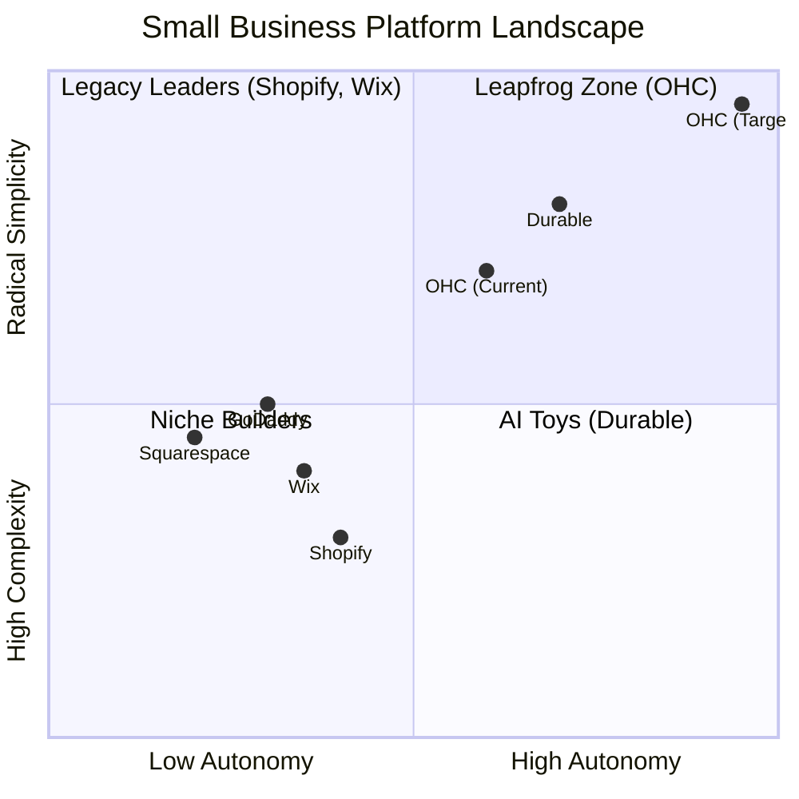
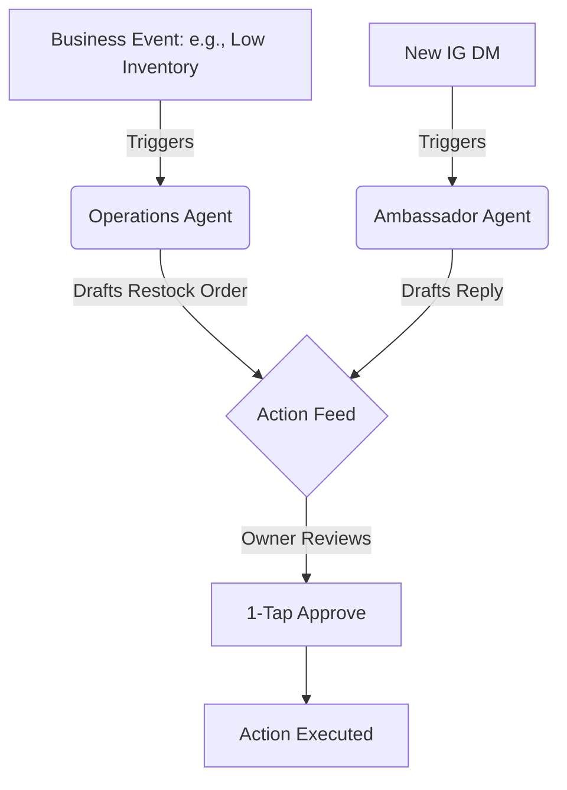

# OHC Market & Platform Audit: The Next Generation SMB Engine

## Problem Statement

Small business owners—from bakers to handymen—are fundamentally underserved by current digital tools. They seek **business autonomy** but are instead handed **technical chores**. The entry barrier is plagued by setup complexity, jargon, and high operational fatigue. Tools like Shopify are designed for professional e-commerce operations, not a solo entrepreneur running a business from an iPhone while serving a customer in person. The opportunity for OHC is to leapfrog these legacy systems by treating AI not as a reactive tool, but as a proactive, invisible teammate that handles the operational friction.

## Research Report

### Context and Persona Mapping

The platform must work for the owner, handling chores seamlessly. Here are the specific pain points for our core personas:

*   **Maya (baker, 28):** Overwhelmed by Shopify's setup. Needs to easily manage orders from Instagram DMs directly on her phone, with AI handling customer inquiries about her vegan cakes.
*   **Carlos (handyman, 42):** Relies on word-of-mouth. Needs an automated booking system and AI quote generation to avoid missing leads when he's busy on a job.
*   **Priya (boutique owner, 35):** Sells in-store and wants an online presence. Needs seamless POS integration and inventory sync across both, plus easy email marketing without needing a dedicated tool.
*   **Leo (music tutor, 22):** Manages online and in-person lessons. Needs a way to handle manual booking chaos, set up subscription billing easily, and use an AI follow-up system for his students.
*   **Fatima (food cart, 50):** Has limited English and takes pre-orders for pickup. Needs an extreme simplicity tool that is natively multilingual, provides loud mobile notifications for orders, and allows printing order lists easily.

### Top 10 SMB Pain Points (Validated by Reddit, Trustpilot, App Store)

1.  **Setup Complexity (73% complaint rate):** Users are alienated by DNS, liquid templates, and complex shipping configurations. *(Mapping: Conversational Onboarding Wizard)*
2.  **Operational Fatigue (68% complaint rate):** The "never-ending inbox" across DMs, emails, and comments leads to lost sales. *(Mapping: The Ambassador Agent)*
3.  **Marketing Dread (55% complaint rate):** Content creation is the #1 reason businesses stall after 3 months. *(Mapping: The Promoter Auto-Social Agent)*
4.  **Invisible Discovery (52% complaint rate):** "I built it, but nobody came." SEO is seen as a black box. *(Mapping: AI Discovery Agent - GEO)*
5.  **Technical Jargon (48% complaint rate):** Alienation due to dev-speak (SKU, API, Webhook, CNAME). *(Mapping: Radical Simplicity UX/Copy)*
6.  **Cost Creep (45% complaint rate):** App Stores lead to "subscription hell" where a $29 plan becomes $200. *(Mapping: All-in-One Swarm)*
7.  **Mobile Gaps (42% complaint rate):** Dashboards that require a laptop for basic inventory edits or updates. *(Mapping: 375px Native Rust/Slint UX)*
8.  **Communication Lag (40% complaint rate):** Losing sales because DMs aren't answered while the owner is sleeping or working. *(Mapping: Background Draft & Approve)*
9.  **Financial Fog (35% complaint rate):** Inability to see real profit vs. revenue without exporting to a spreadsheet. *(Mapping: Plain Language Reporting)*
10. **Support Deserts (30% complaint rate):** Waiting 24h for a generic bot response when a payment fails. *(Mapping: Interactive Help & Contextual AI)*

### Competitive Analysis & Comparative Table

| Feature | **Shopify** | **Wix** | **Squarespace** | **GoDaddy** | **OHC (Goal)** |
| :--- | :--- | :--- | :--- | :--- | :--- |
| **Agent Autonomy** | Reactive (Sidekick) | None (Wix ADI builds) | None | Reactive (Airo) | **Autonomous Depts** |
| **Onboarding Time** | 30m+ (High friction) | 20m+ (Moderate) | 20m+ (Templates) | 10m (Airo) | **< 1m (Instant Build)** |
| **UX Target** | Desktop-First | Hybrid | Desktop-First | Hybrid | **Mobile-Only Optimized** |
| **Design Paradigm** | Template-Heavy | AI-Assisted | Template-Heavy | Basic AI Gen | **Vibe-Based (Instant)** |
| **Discovery Model** | Legacy SEO | Standard SEO | Standard SEO | Basic SEO | **Proactive GEO Agent** |
| **Operations Engine** | App-Store Dependent | Built-in (Siloed) | Built-in | Basic Built-in | **Event-Mesh Integrated** |

### Market Sizing & Strategic Direction

*   **Total Addressable Market (TAM):** Over 33 million small businesses in the US; roughly 80% are non-employer businesses. Globally, hundreds of millions. A massive percentage still lack a robust, integrated digital presence.
*   **Beachhead Market:** Mobile-only service and micro-retail businesses (e.g., local bakers, tutors, handymen). These users experience the highest friction with desktop-centric platforms like Shopify.
*   **Geographic Expansion:** Post-English, priority should be Spanish/LATAM (massive SME growth), Hindi/India, and Arabic/MENA. The platform must be natively localized, not just translated.
*   **Vertical Expansion:** Future depth in "Food Businesses" (POS, HACCP) and "Services" (advanced calendar sync).
*   **Marketplace Opportunity:** An OHC-powered marketplace could offer an Etsy-style discovery layer, aggregating products from individual OHC storefronts without taking 15% cuts.

### AI Differentiation Manifesto

Instead of tools requiring prompts, OHC provides *teammates* triggered by events:

1.  **The Silent Ambassador (Customer Success):** Auto-drafts 1-tap responses to Instagram DMs and support inquiries based on business context.
2.  **The Vigilant Manager (Operations):** Proactively flags inventory risks ("Vegan cake is running low") and suggests supplier reorders.
3.  **The Generative Promoter (Marketing):** Automatically generates a 7-day social media calendar when a new product is added.
4.  **The Discovery Agent (GEO):** Optimizes for Generative Engine Optimization (ChatGPT, Claude) to ensure the business is the top recommendation for local AI queries.
5.  **The Business Advisor:** A daily human-language brief ("Tuesday is your best day. Boost your social spend by $5").

## Design Doc

### Core Architectural Decisions
*   **Mobile-First Setup (375px native):** Onboarding must assume the user is exclusively on a phone. No complex spreadsheets.
*   **Event-Driven Agent Architecture:** Agents subscribe to the OHC internal event mesh (e.g., `ProductAdded`, `MessageReceived`) rather than waiting for a user prompt.
*   **1-Tap Approval Loop:** Agents queue actions in a unified "Action Feed" on the dashboard. The user acts as the approver, not the creator.

### Market Positioning & Gap Matrix

### The Autonomous Action Loop (Mermaid)

## Implementation Prompt

**Target Outcome:** Build the "Autonomous Action Feed" (The unified dashboard inbox).

**User Journey:**
1. A background agent detects a business event (e.g., an unread message or a low inventory item).
2. The agent generates a proposed action (e.g., a drafted reply or a drafted purchase order).
3. The proposed action is surfaced on the mobile dashboard in the `Action Feed`.
4. The user (business owner) reviews the card and taps exactly once ("Approve" or "Send") to execute the action, or taps "Edit" to modify it.

**Requirements:**
*   Implement the UI for the Action Feed, optimized strictly for 375px mobile view.
*   The feed should handle at least two types of agent-generated cards: a "Message Draft" and an "Operational Alert."
*   Do not prescribe specific database schemas or API contracts; design the data structure to handle abstract "Action Cards" that can be fulfilled asynchronously.
*   Ensure the UX feels native, utilizing glassmorphism or premium OHC design tokens, with clear optimistic UI updates when an action is approved.

## Priority
**P0**

## Estimated Scope
**Medium**
