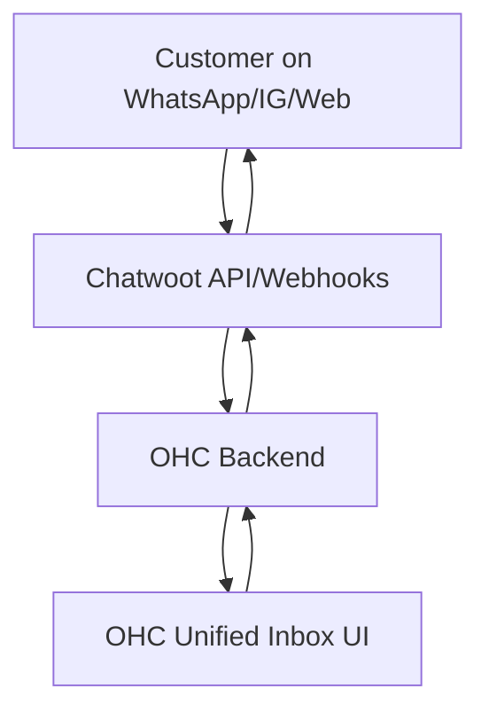
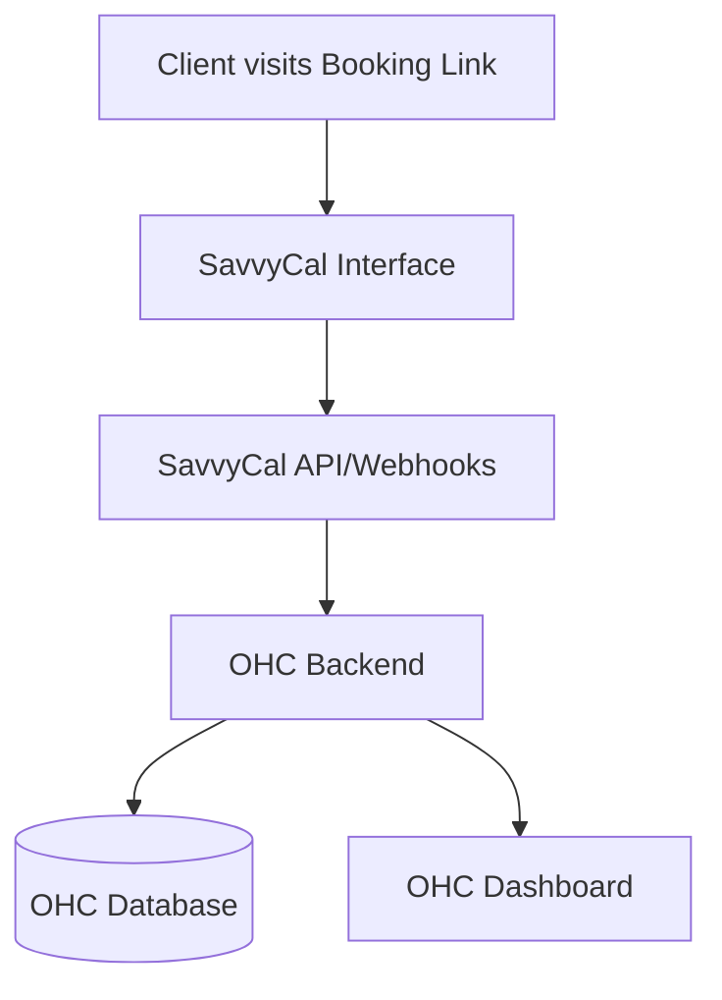
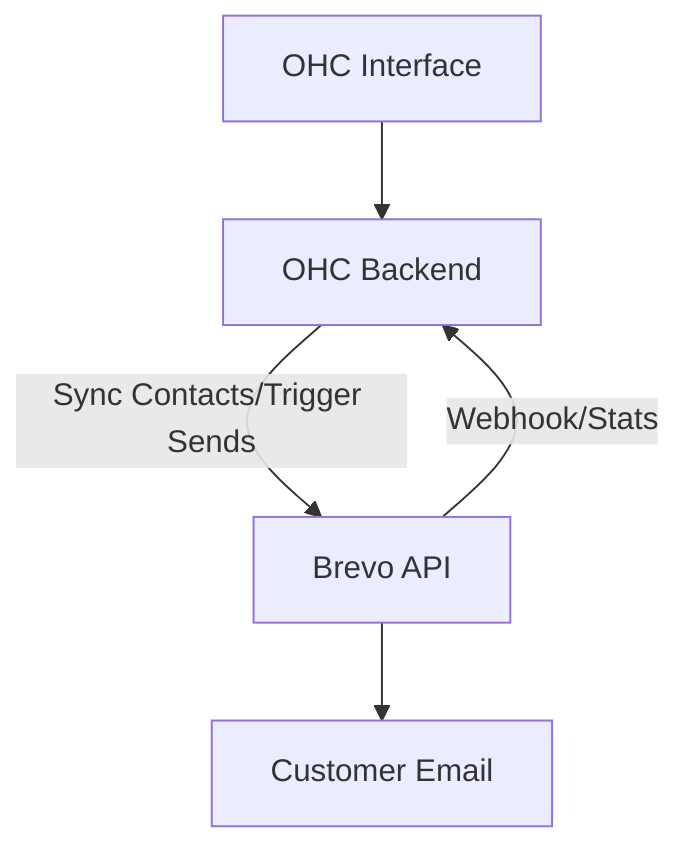
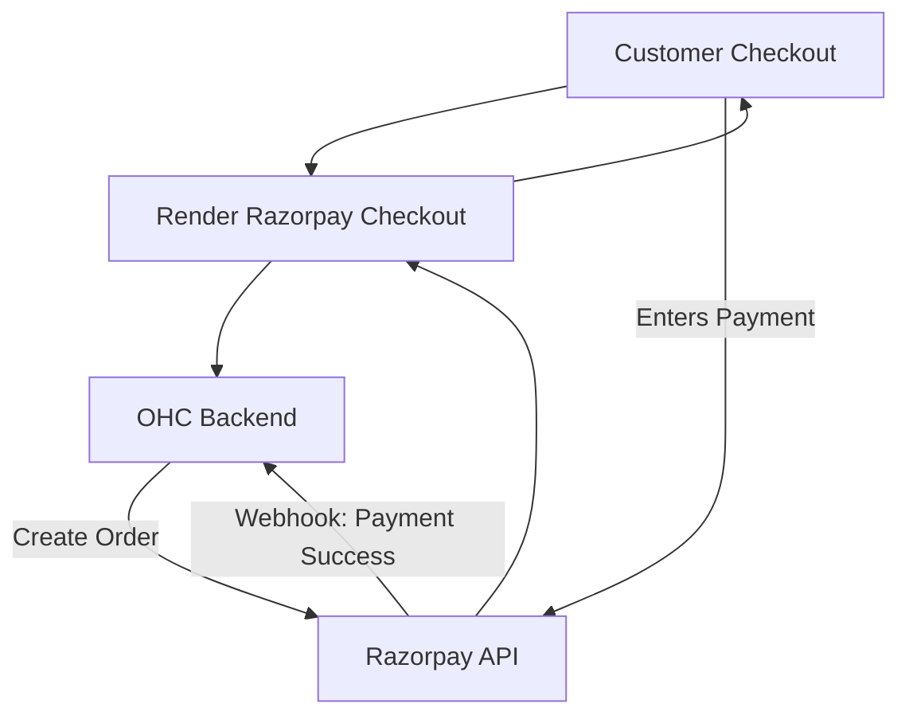
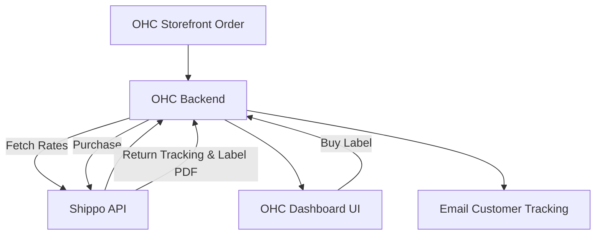
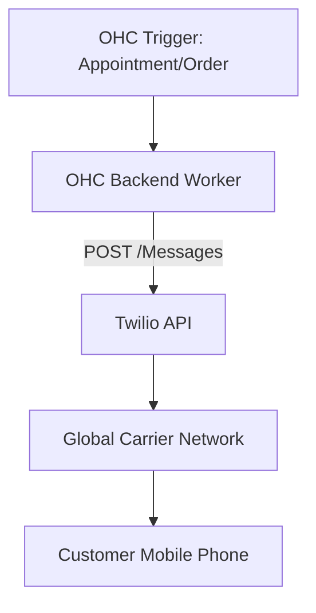
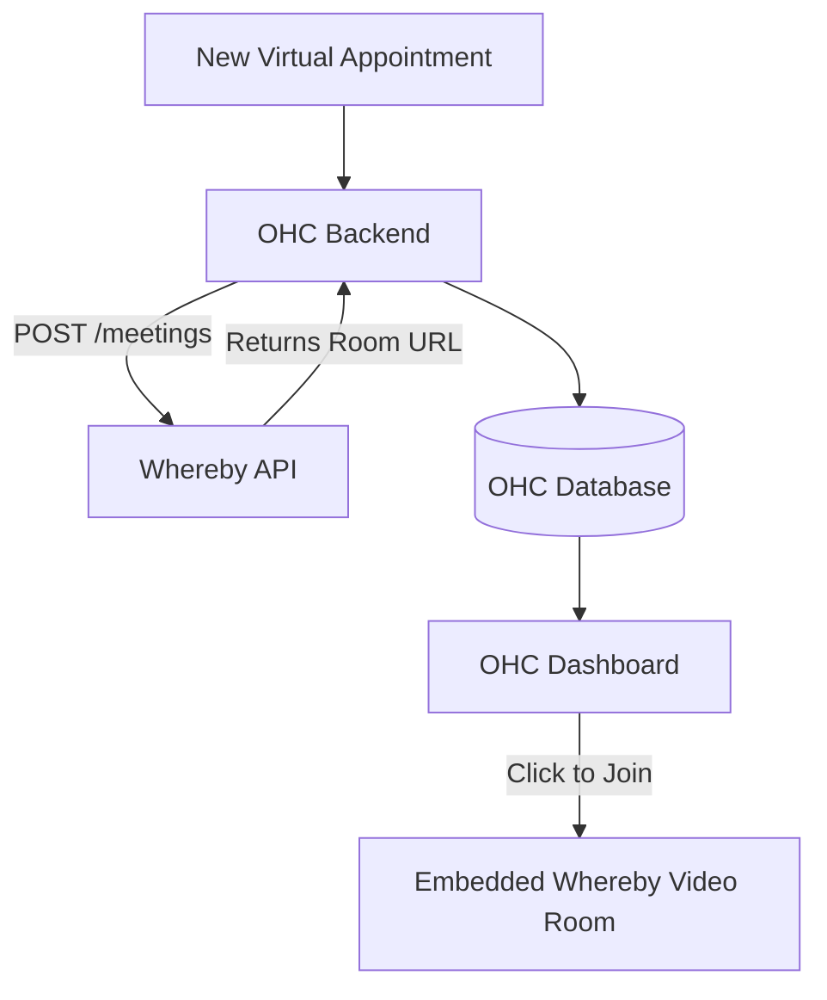

# Scout: Tool Integration Research Q4

**Role:** Principal Integrations Engineer (L7)
**Mission:** Evaluate tools that solve real problems for small business owners in both Cloud and Standalone environments.

This report summarizes findings and integration briefs for 7 tool categories.

---

## 1. Social Media Integration: Chatwoot

**Problem Statement:** Small business owners often struggle to manage customer communications scattered across various platforms like Instagram DMs, Facebook comments, WhatsApp, and website live chat. Juggling multiple apps leads to delayed responses, missed sales opportunities, and poor customer service. They need a single, unified inbox to view and reply to all customer messages efficiently, without technical complexity.

**Research Report:** Chatwoot is an open-source, omnichannel customer support platform designed to centralize conversations from live chat, email, Facebook, Instagram, WhatsApp, Twitter, Line, Telegram, and SMS.
- **Ease of Use**: It provides a clean, modern interface that is easy for non-technical users to navigate. The centralized dashboard is intuitive and reduces context-switching.
- **Pricing**: Chatwoot offers a generous free "Hacker" tier (up to 2 agents, 500 conversations/month) which is ideal for very small businesses. Paid plans start at $19/agent/month (Startups), providing unlimited conversations and access to all channels. They also offer self-hosted options which can be cost-effective for larger teams with IT resources.
- **Reputation**: Highly regarded in the open-source community as a solid alternative to Intercom or Zendesk, holding a 4.5+ rating on G2 and over 25k stars on GitHub.
- **Environment Support**: Chatwoot's API and webhooks make it suitable for Cloud environments. Because it is open-source and self-hostable, it is also highly compatible with Standalone (local, private) environments where data sovereignty is a priority.

**Design Doc:**
The integration will connect OHC's unified inbox interface with Chatwoot's platform.
1.  **Account Provisioning**: When a business owner opts into the "Unified Inbox" feature, an OHC background agent will handle the OAuth flow or API key configuration to connect their social media accounts to a Chatwoot instance.
2.  **Message Syncing**: Incoming messages from connected channels (e.g., Instagram, WhatsApp) will be received by Chatwoot and relayed to the OHC interface via webhooks or API polling.
3.  **Unified UI**: The business owner will interact with a simplified inbox within the OHC dashboard.
4.  **Outgoing Messages**: Replies sent from the OHC dashboard will be routed through Chatwoot's API to the respective social platform.

**Implementation Prompt:**
Implement a unified inbox experience using Chatwoot as the underlying message routing engine. The user should be able to connect their Instagram and WhatsApp accounts through a simple setup wizard in the OHC dashboard. Once connected, all incoming messages should appear in a single, chronological feed. The user must be able to read and reply to these messages directly from the OHC interface, with replies accurately appearing on the customer's native app. The integration must support both cloud deployments (connecting to Chatwoot Cloud) and standalone mode (connecting to a local/self-hosted Chatwoot instance).

**Priority:** P1
**Estimated Scope:** Medium

---
## 2. Calendar & Scheduling: SavvyCal

**Problem Statement:** Small business owners, especially consultants, freelancers, and service providers, lose significant time going back-and-forth over email or text to find a meeting time that works for everyone. Existing tools can feel impersonal or clunky. They need a simple, professional way to share their availability and let clients book appointments automatically, avoiding double-bookings.

**Research Report:** SavvyCal is a modern scheduling tool designed to make finding a time to meet collaborative and easy.
- **Ease of Use**: SavvyCal excels in user experience. It offers a unique "Calendar Overlay" feature that allows recipients to overlay their own calendar on top of the sender's link, making it incredibly easy to spot mutual free time. The interface for creating links and setting availability is clean and intuitive.
- **Pricing**: Pricing starts at $12/user/month (Basic) which includes unlimited calendars and links. The Premium plan ($20/user/month) adds custom domains and paid bookings (via Stripe). There is no permanent free tier, only a trial.
- **Reputation**: It is highly regarded by users for its modern design and focus on reducing the friction of scheduling, often cited as a more recipient-friendly alternative to tools like Calendly.
- **Environment Support**: SavvyCal is a cloud-based SaaS product. Integration relies on their webhooks and API. It is well-suited for Cloud environments. For Standalone modes, it requires internet access to connect to the SavvyCal API.

**Design Doc:**
The integration will embed SavvyCal's booking experience into the OHC platform and sync appointment data.
1.  **Configuration**: The business owner connects their SavvyCal account via OAuth within the OHC settings.
2.  **Link Generation/Embedding**: OHC can automatically fetch the user's active scheduling links and allow them to easily embed a booking widget on their OHC-hosted storefront or share links via the OHC inbox.
3.  **Event Sync**: Webhooks from SavvyCal will notify OHC when a new meeting is booked, rescheduled, or canceled.
4.  **Dashboard Display**: Upcoming appointments will be displayed on the business owner's daily OHC dashboard.

**Implementation Prompt:**
Integrate SavvyCal to handle appointment scheduling. Provide a settings page where users can authenticate with their SavvyCal account. Once connected, display their upcoming appointments on the main OHC dashboard by listening to SavvyCal webhooks for new bookings and cancellations. Allow the user to easily copy their primary scheduling link or generate a generic embed code directly from the OHC interface to share with clients. Ensure graceful error handling if the SavvyCal API is unreachable.

**Priority:** P1
**Estimated Scope:** Medium

---

## 3. Email Marketing: Brevo

**Problem Statement:** Small business owners struggle to keep their customer lists organized and engage with them effectively. Sending newsletters, promotional offers, or transactional emails requires exporting data to a separate, often complex, email marketing tool. They need an integrated solution to manage contacts and send professional emails directly tied to their customer data.

**Research Report:** Brevo (formerly Sendinblue) is a comprehensive customer relationship management (CRM) suite offering email marketing, SMS, WhatsApp campaigns, and automation.
- **Ease of Use**: Brevo provides a drag-and-drop email editor and pre-built templates that make it accessible for non-technical users. Its interface combines marketing campaigns and transactional emails, which simplifies management.
- **Pricing**: They offer a strong "Free forever" plan that includes unlimited contacts and up to 300 emails per day. Paid plans start at $9/month (Starter) for higher sending volumes and removal of the Brevo logo, making it very budget-friendly for small businesses.
- **Reputation**: Brevo is widely recognized as a robust, affordable alternative to Mailchimp. It is praised for its deliverability and all-in-one approach (combining email, SMS, and basic CRM features).
- **Environment Support**: As a SaaS platform, it relies on API integrations. It is perfect for Cloud deployments. For Standalone modes, the OHC backend will need outbound internet access to communicate with the Brevo API to sync contacts and trigger sends.

**Design Doc:**
The integration will sync the OHC customer list with Brevo and allow triggering of basic campaigns or transactional emails.
1.  **Authentication**: The user connects their Brevo account via API key in the OHC settings.
2.  **Contact Sync**: OHC maintains a two-way sync or pushes customer data (emails, names, tags) to a designated Brevo list.
3.  **Campaign Management**: While complex design happens in Brevo, OHC can display recent campaign performance (open rates, click rates) on the dashboard.
4.  **Transactional Triggers**: OHC can use Brevo's SMTP relay or API to send automated receipts, welcome emails, or booking confirmations.

**Implementation Prompt:**
Integrate Brevo to handle outbound marketing and transactional emails. Build a synchronization mechanism that keeps an OHC customer list updated within a linked Brevo account. Provide an interface in OHC to view high-level metrics for recent Brevo campaigns. Ensure that transactional emails generated by OHC (e.g., appointment confirmations, receipts) can be routed through Brevo's API to ensure high deliverability. The solution must handle API rate limits and connection errors gracefully.

**Priority:** P2
**Estimated Scope:** Large

---
## 4. Payment Processing: Razorpay

**Problem Statement:** Small businesses operating in or selling to the Indian market need a reliable, localized payment processor. Global solutions like Stripe may not fully support preferred local payment methods like UPI or specific regional cards, leading to cart abandonment. Business owners need a seamless way to accept local payments and get settled quickly.

**Research Report:** Razorpay is a leading full-stack financial services company in India, offering a comprehensive payment gateway.
- **Ease of Use**: Razorpay offers user-friendly payment links, payment pages, and invoice generation tools that require zero coding from the business owner to use natively. Its dashboard is comprehensive for tracking settlements.
- **Pricing**: Pricing is transparent, typically starting at 2.9% + $0.30 per transaction for international cards, with lower rates (Standard plan) for domestic Indian transactions (e.g., specific percentage for domestic cards, low fixed fees for UPI).
- **Reputation**: Highly trusted in the Indian ecosystem, powering millions of businesses. It is known for high success rates, robust APIs, and extensive support for Indian payment methods (UPI, Netbanking, RuPay).
- **Environment Support**: Razorpay is a cloud-based API service. It integrates well into Cloud architectures. Standalone mode requires an active internet connection to process payments via Razorpay's servers.

**Design Doc:**
The integration will enable OHC users to accept payments via Razorpay.
1.  **Onboarding**: Users link their Razorpay account or create a new one through the OHC settings via API keys.
2.  **Checkout Flow**: When an OHC transaction occurs (e.g., an invoice is paid, or a storefront item is bought), OHC calls the Razorpay API to generate an order and render the checkout UI (Razorpay Standard Checkout or Payment Links).
3.  **Webhooks**: Razorpay sends a webhook to the OHC backend to confirm payment success or failure.
4.  **Reporting**: OHC records the transaction status and displays successful payments in the user's dashboard.

**Implementation Prompt:**
Implement a payment integration with Razorpay to support users targeting the Indian market. The integration should allow the generation of payment links or integration of the Razorpay checkout flow directly into OHC-hosted pages. Securely handle API keys and implement robust webhook listeners to verify payment status before marking invoices or orders as paid within the OHC system. Ensure the UI clearly communicates payment status to both the business owner and the customer.

**Priority:** P1
**Estimated Scope:** Medium

---

## 5. Shipping & Logistics: Shippo

**Problem Statement:** E-commerce small business owners spend too much time calculating shipping rates, buying postage, and manually copying tracking numbers to customers. They need a centralized system that compares carrier rates, generates shipping labels easily, and automates tracking updates, saving time and reducing shipping costs.

**Research Report:** Shippo is a multi-carrier shipping software that connects businesses to over 40 global carriers (USPS, UPS, FedEx, DHL, etc.) through a single platform.
- **Ease of Use**: Shippo is highly user-friendly. It allows users to quickly compare rates, print labels in bulk, and manage returns from a clean dashboard.
- **Pricing**: Shippo offers a "Starter" plan that is free to use (no monthly fee) and provides access to heavily discounted carrier rates; you only pay postage plus a small per-label fee if using your own carrier accounts. Pro plans start at $17/mo for removing branding and advanced features.
- **Reputation**: It is widely trusted by over 100,000 businesses. It is known for its robust API, reliability, and the significant discounts it offers on USPS and UPS rates.
- **Environment Support**: Shippo is an API-first cloud service. It requires internet connectivity to fetch live rates and generate labels, making it suitable for Cloud and online Standalone modes.

**Design Doc:**
The integration will allow OHC users to manage fulfillments without leaving the platform.
1.  **Carrier Connection**: The user connects their Shippo account (or OHC provisions a white-labeled one).
2.  **Order Sync**: When a product is sold, the order details (weight, dimensions, destination) are sent to the Shippo API.
3.  **Rate Fetching & Label Creation**: OHC displays available rates. The user selects a rate, and OHC triggers the Shippo API to purchase the label.
4.  **Tracking**: Shippo returns a tracking URL, which OHC automatically emails to the customer and displays in the order dashboard.

**Implementation Prompt:**
Integrate Shippo to provide shipping rate calculation and label generation. The OHC dashboard should allow users to view pending orders, input package dimensions, fetch live rates from Shippo, and purchase a label. The generated label PDF must be easily printable from the browser. Furthermore, automate the process of updating the order status to "Shipped" and sending the tracking information provided by Shippo to the customer.

**Priority:** P1
**Estimated Scope:** Medium

---
## 6. SMS & Notifications: Twilio

**Problem Statement:** Small businesses, especially those serving non-technical demographics or operating internationally, need to reach customers reliably. Emails are often ignored, while SMS has a near-100% open rate. Business owners need a way to send automated appointment reminders, order updates, and critical alerts directly to customers' phones to reduce no-shows and improve service.

**Research Report:** Twilio is the industry leader in cloud communications platforms, providing APIs for SMS, voice, WhatsApp, and more.
- **Ease of Use**: Twilio is an API-first product designed for developers, meaning the end-user (the business owner) will never see Twilio directly. They will interact entirely through the OHC interface, making it completely frictionless for them.
- **Pricing**: Twilio uses a pay-as-you-go model. Prices vary by country, but sending an SMS in the US costs around $0.0079 per message. It is highly cost-effective and scales perfectly with business usage.
- **Reputation**: Twilio is the gold standard for CPaaS (Communications Platform as a Service). It offers unmatched global carrier connectivity, high deliverability, and strict compliance handling (like A2P 10DLC in the US).
- **Environment Support**: Twilio's REST APIs are perfect for Cloud environments. Standalone instances simply require outbound internet access to make HTTP POST requests to Twilio's servers to dispatch messages.

**Design Doc:**
The integration will utilize Twilio to dispatch outgoing SMS notifications triggered by OHC events.
1.  **Configuration**: The OHC Cloud environment maintains a master Twilio account, or Standalone users enter their own Twilio Account SID and Auth Token.
2.  **Triggers**: Background jobs in OHC (e.g., "Appointment starts in 24 hours") trigger a notification event.
3.  **Dispatch**: The OHC backend formats the message and sends a request to the Twilio SMS API.
4.  **Delivery**: Twilio routes the message to the global telecom network.

**Implementation Prompt:**
Integrate the Twilio SMS API to handle system-generated text messages. Implement an event listener in the OHC backend that triggers an SMS dispatch when specific conditions are met (e.g., an order status changes to "Ready for Pickup", or a calendar appointment is 24 hours away). Provide a settings interface for business owners to customize the text templates for these notifications. Ensure the integration gracefully handles delivery failures and respects opt-out (STOP) requests automatically.

**Priority:** P0
**Estimated Scope:** Small

---

## 7. Video Conferencing: Whereby

**Problem Statement:** Coaches, tutors, and telehealth providers need to conduct online sessions with clients. Requiring clients to download thick applications like Zoom or Microsoft Teams creates technical barriers, delays meetings, and frustrates non-technical users. They need a simple, one-click video solution that runs directly in the browser.

**Research Report:** Whereby is a privacy-first video meetings platform that focuses on ease of use. It offers both standalone meetings and an "Embedded" API product.
- **Ease of Use**: Whereby's primary advantage is that it requires absolutely no downloads or logins for guests. Meetings run entirely in the browser (WebRTC). The interface is minimalistic and highly reliable.
- **Pricing**: For API/Embedded use, Whereby offers a free tier (2,000 participant minutes/mo), and a "Build" plan starting at $9.99/mo with pay-as-you-go minutes. This makes it very affordable for small businesses conducting occasional 1-on-1 sessions.
- **Reputation**: Highly respected in Europe for its strict GDPR compliance and privacy-by-design approach. It is known for excellent developer experience and reliable WebRTC performance.
- **Environment Support**: As a cloud-hosted WebRTC service, it is perfect for Cloud deployments. The OHC Standalone client can generate meeting links via the API and embed the Whereby iframe directly into the local desktop UI.

**Design Doc:**
The integration will use Whereby Embedded to generate and host video rooms within OHC.
1.  **Room Generation**: When a virtual appointment is booked (e.g., via the SavvyCal integration), the OHC backend calls the Whereby API to create a unique, secure room URL.
2.  **Link Distribution**: OHC saves this URL to the appointment record and sends it to the customer via SMS/Email.
3.  **Hosting**: At the time of the meeting, the business owner can click "Join Session" in their OHC dashboard, which opens the Whereby room in a clean, branded iframe or a new tab.

**Implementation Prompt:**
Integrate the Whereby API to enable one-click video consultations. Create a background service that automatically provisions a new Whereby room URL whenever a virtual appointment is scheduled. Add a "Start Video Session" button to the OHC daily dashboard that appears 5 minutes before a scheduled meeting. When clicked, this button should open the Whereby room directly within the OHC interface using Whereby's embedded iframe, keeping the user inside the OHC ecosystem. Ensure the room URLs are securely managed and expire after the meeting ends.

**Priority:** P2
**Estimated Scope:** Small
