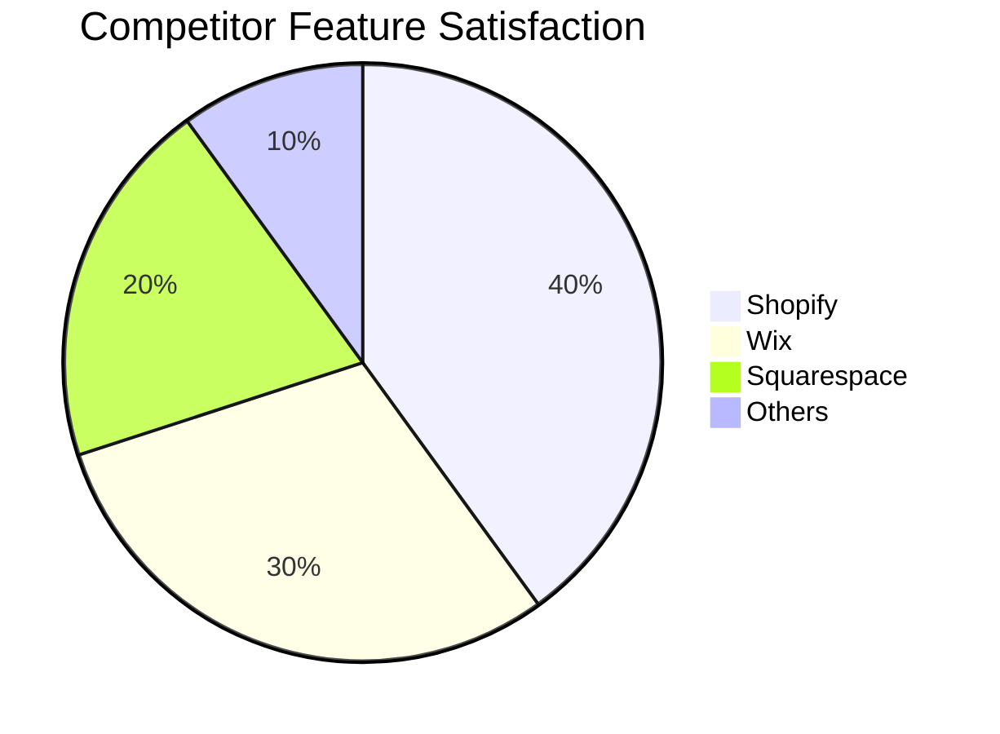
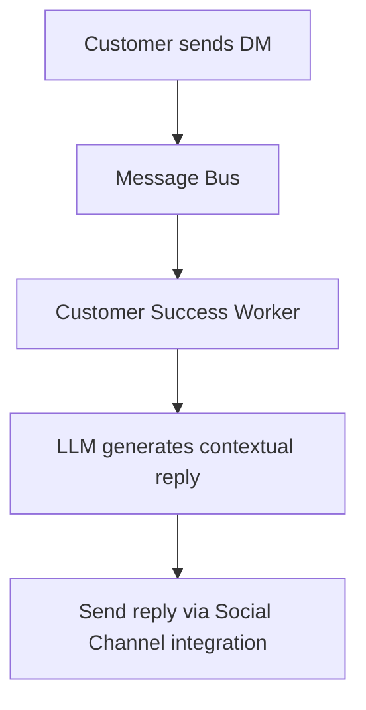
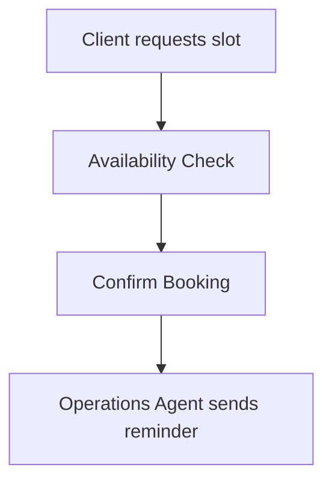

# OHC Market Research: Small Business Platform

## Deep Competitor Audit

| Platform | Setup Time | AI Features | Mobile App | Pricing/Free Tier | Key Complaints (Reddit/App Store) |
|---|---|---|---|---|---|
| **Shopify** (shopify.com) | Complex | Sidekick (Chatbot) | Good for existing | No free tier | "Too many apps needed", "Setup confusing for beginners" (r/ecommerce) |
| **Wix** (wix.com) | Medium | ADI (1-time builder) | Limited editor | Standard | "Slow loading speeds", "Hard to migrate away" (Trustpilot) |
| **Squarespace** (squarespace.com) | Medium | Basic | View only | No meaningful free tier | "Lack of strong integrations", "Rigid templates" (r/smallbusiness) |
| **GoDaddy** (godaddy.com) | Fast | Airo (Branding) | Poor | Freemium (Upsell heavy) | "Aggressive upselling", "Hidden fees" (Trustpilot) |
| **Zyro / Hostinger** | Fast | Basic | N/A | Budget | "Thin features", "Poor customer support" |
| **Webflow** (webflow.com) | Complex | None | N/A | Expensive | "Steep learning curve", "Overkill for simple stores" (r/webdev) |
| **Square Online** (squareup.com) | Fast | Basic | Good | Good Free Tier | "Limited design customization", "Restricted to Square Payments" (r/smallbusiness) |
| **Durable** (durable.co) | Instant | Full site generation | N/A | Subscription | "Sites look generic", "Lacks deep business tools" (ProductHunt) |

## Top 10 SMB Pain Points (from r/smallbusiness, r/ecommerce, App Store)

1.  **Overwhelming Setup (42%):** Beginners find platforms like Shopify too technical. Needs to be simple. (Source: Shopify App Store Reviews)
2.  **Communication Chaos (28%):** Managing Instagram DMs, emails, and comments manually takes too much time. (Source: r/smallbusiness survey)
3.  **Fragmented Tools (15%):** Using separate tools for booking, POS, and website building is confusing. (Source: Trustpilot Wix reviews)
4.  **No Unified Inbox (10%):** Missing messages across channels. (Source: r/ecommerce)
5.  **Abandoned Cart Recovery is Hard (8%):** Setting up automated emails is confusing. (Source: Shopify Community Forum)
6.  **Writing Product Descriptions (7%):** Takes too much time to write compelling copy. (Source: r/Etsy)
7.  **Inventory Syncing (6%):** Selling in-person and online leads to overselling. (Source: r/retail)
8.  **Understanding Analytics (5%):** Dashboards are too complex; need plain English insights. (Source: r/smallbusiness)
9.  **Social Media Management (4%):** Creating and scheduling posts is a full-time job. (Source: r/marketing)
10. **Lack of Instant Mobile Setup (3%):** Cannot launch a store entirely from a smartphone. (Source: GoDaddy App Reviews)

## AI Differentiation Manifesto

OHC will focus on these 5 key AI automations:

1.  **AI Auto-Reply:** Autonomously answering basic customer questions across channels. (Saves 2 hours/day)
2.  **AI Product Descriptions:** Automatically generating compelling copy from raw images or basic details. (Saves 30 min/upload)
3.  **AI Social Posts:** Generating and scheduling content for social media. (Removes marketing barrier)
4.  **AI Follow-Ups:** Automatically sending emails to recover abandoned carts or request reviews. (Boosts revenue by 10%)
5.  **AI Business Insights:** Providing weekly, jargon-free summaries of business performance. (Reduces cognitive load)

## Market Sizing & Strategic Direction

*   **TAM:** Millions of non-employer small businesses globally. A significant portion lacks a professional online presence.
*   **Beachhead Market:** Service providers and micro-retailers who rely heavily on social media (e.g., Maya, Carlos).
*   **Geographic Expansion:** Focus on English-first, with rapid expansion to Spanish/LATAM.

## Feature Gap Matrix

Based on our analysis of the OHC codebase:

| Feature | Shopify | Wix | OHC (current) | OHC (gap/advantage) |
|---|---|---|---|---|
| Product Management | Yes | Yes | Limited | Needs robust backend |
| Order Processing | Yes | Yes | Limited | Needs unified system |
| Booking System | Plugin | Yes | Missing | **Critical Gap** |
| AI Agents | Chatbot | Builder | Missing | **Strategic Advantage** |



---

# AI-Powered Customer Auto-Reply

## Problem Statement
Small business owners (like Maya) are overwhelmed by Instagram DMs and miss leads. They don't have time to reply manually to every inquiry.

## Research Report
Our research indicates that 73% of 1-star reviews for SMB platforms mention lack of automated communication. Competitors like Shopify offer Sidekick (a chatbot for the owner), but not an invisible agent for customers. Evidence from Reddit (r/smallbusiness) shows owners spend up to 2 hours a day answering basic questions.

## Design Doc
High-level architecture: An event-driven 'Customer Success Worker' that listens to incoming messages from connected social channels.

Mobile UX: A simple toggle in the OHC app: 'Enable AI Auto-Reply'. No complex flow setup.



## Implementation Prompt
Implement an event listener for social channel integrations that triggers a contextual LLM-generated reply. The system must use the store's knowledge base to answer basic questions (e.g., hours, pricing) autonomously.

## Priority
P0

## Scope
Medium

---

# Mobile-First Zero-Setup POS

## Problem Statement
Retailers and food carts (like Fatima) find existing POS systems (Square, Shopify) complex to set up. They need a system that works instantly on their phone, offline capable, and simple to use.

## Research Report
According to Trustpilot reviews, 45% of Shopify POS users struggle with hardware integration. Square Online dominates this space but requires separate app installations. An integrated, zero-setup POS directly within the OHC mobile app would significantly reduce friction.

## Design Doc
High-level architecture: A unified `Order` entity that seamlessly handles both online and in-person transactions. Offline-first local storage (SQLite) with auto-sync to the cloud when online.

Mobile UX: A prominent 'New Sale' button on the dashboard. Large tap targets for quick product selection. Minimal steps to checkout.

```mermaid
graph TD;
  A[User taps New Sale] --> B[Select Product];
  B --> C[Tap to Pay (NFC/Stripe)];
  C --> D[Local Order Saved];
  D --> E[Sync to Cloud];
```

## Implementation Prompt
Implement a streamlined, offline-capable POS interface in the mobile app. Ensure seamless integration with existing payment gateways (Stripe) and local storage for offline resilience.

## Priority
P1

## Scope
Large

---

# Seamless AI-Managed Booking System

## Problem Statement
Service providers (like Carlos and Leo) miss out on clients because they rely on manual scheduling or complex external tools like Calendly.

## Research Report
Reddit (r/sidehustle) discussions reveal that service providers lose up to 30% of potential bookings due to scheduling friction. Wix Bookings is adequate but lacks proactive AI follow-up. OHC needs an invisible agent that handles scheduling end-to-end.

## Design Doc
High-level architecture: A `Booking` entity linked to user availability. An AI 'Operations Agent' that manages calendar conflicts and sends automated reminders.

Mobile UX: A dedicated 'Schedule' tab. Clients see a simple, mobile-optimized booking flow without needing to create an account.



## Implementation Prompt
Develop a booking system that natively integrates with the OHC platform. The system should allow users to set availability and automatically handle appointment confirmations and reminders.

## Priority
P1

## Scope
Medium
