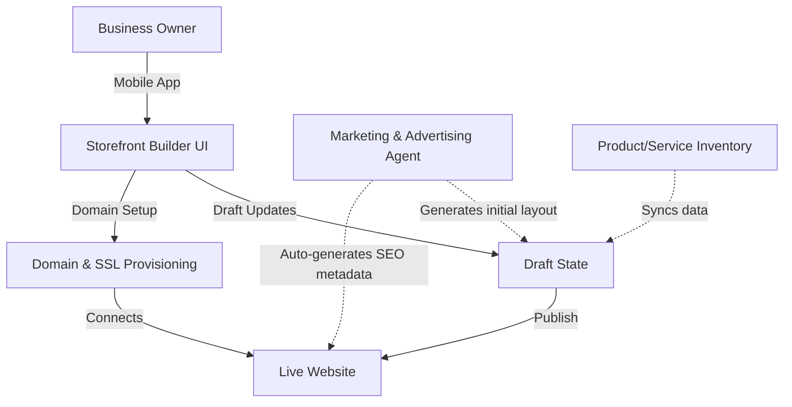

# Issue Brief: Website & Storefront Builder Architecture

## Title
Website & Storefront Builder Architecture: Mobile-First, AI-Driven Drag-and-Drop Creation

## Problem Statement
Small business owners like Maya (the baker) and Carlos (the handyman) need professional websites to showcase their offerings and accept orders/bookings. However, existing website builders (like Wix, Squarespace, or Shopify) are overly complex, requiring hours of setup, technical configuration (DNS, SSL, SEO), and are primarily designed for desktop. Our non-technical users need a way to go from zero to a live, beautiful, mobile-optimized storefront in under 10 minutes, using only their phone, with AI doing the heavy lifting.

## Research Report
- **Goal**: Architect a website and storefront builder that is radically simple, mobile-first, and heavily augmented by AI, removing the need for technical jargon or manual configuration.
- **Findings**:
  - **Mobile-First Urgency**: Most small business owners manage their business exclusively via their smartphone.
  - **Content Blocks**: A limited but highly polished set of content blocks (Hero, Product Grid, Testimonials, Service List, Booking Calendar, Contact Form) covers 99% of use cases.
  - **The "Blank Canvas" Problem**: Users freeze when faced with a blank page. The builder must start with an AI-generated template populated with contextual content.
  - **Publishing & Domains**: Connecting domains and provisioning SSL certificates is a major drop-off point. It must be abstracted away.
- **Competitive Analysis**:
  - **Shopify**: Powerful but complex. Requires significant time and often a desktop to customize themes properly.
  - **Wix/Squarespace**: Flexible but unstructured, leading to easily broken mobile layouts. Complex SEO settings.
  - **GoDaddy**: Fast setup but rigid templates and upsells on basic features like SSL.
  - **OHC Advantage**: OHC's builder is intrinsically tied to the business model (products, services) and uses AI to generate the site *before* the user even enters the builder. Customization is constrained to ensure aesthetic excellence (Glassmorphism, premium typography) on all devices.

## Design Doc

### Content Blocks
The builder revolves around structured, unbreakable content blocks:
- **Hero**: High-impact image/video, headline, subheadline, and primary Call to Action (e.g., "Order Now", "Book a Quote").
- **Product Grid**: Dynamically synced with the business's inventory. Auto-formats based on image aspect ratios.
- **Service List**: Clean listing of services with prices and "Book" buttons.
- **Testimonials**: Auto-populated from the Customer Success agent's review collection.
- **Booking Calendar**: Direct integration with the Operations agent's scheduling system.
- **Contact/Lead Form**: Feeds directly into the Sales agent's inbox.
- **Text/Image Split**: For "About Us" or story sections.

### Templates and Customization
- **AI-Generated Base**: The Marketing & Advertising agent generates the initial site based on the user's business type (e.g., Bakery vs. Handyman).
- **Theme Tokens**: Customization is handled via global design tokens (Primary Color, Font Pairing, Corner Radius). The user cannot manually move elements pixel-by-pixel, ensuring the design never breaks.
- **Mobile First**: The builder interface itself operates perfectly on a 375px screen, using bottom sheets for block settings.

### Publishing & Infrastructure (UX Perspective)
- **Draft vs. Live**: Changes are auto-saved as drafts. A prominent "Publish" button instantly updates the live site.
- **Custom Domains**: Users enter their desired domain (e.g., `mayascakes.com`). If they don't own it, OHC purchases it via an integrated flow. If they do, an AI agent provides plain-language instructions for DNS updates.
- **SSL**: Automatically provisioned and renewed invisibly.

### SEO (Generative Engine Optimization)
- **Invisible SEO**: Users never see "Meta Tags" or "Alt Text" fields.
- **AI Automation**: The Marketing agent automatically generates optimal schema markup, titles, and descriptions based on the business context and product catalog.

### Architecture Diagram

### Mobile UX Flow (375px)
1. **Entry**: User taps "Edit Website" on the dashboard.
2. **Preview Mode**: The main screen shows a live preview of the site (mobile view).
3. **Block Reordering**: User taps a "Rearrange" icon to drag blocks up or down in a list view.
4. **Block Editing**: User taps a specific block on the preview. A bottom sheet slides up with simple toggles (e.g., "Show Prices", "Change Background Image").
5. **Publishing**: A floating action button (FAB) reads "Publish Changes". Tapping it shows a success confetti animation.

## Implementation Prompt
**To Implementer Agent:**
Implement the mobile-first Website & Storefront Builder UI and the underlying state management for drafts and publishing. Build the core content blocks (Hero, Product Grid, Service List, Testimonials) using the OHC premium design system (Glassmorphism, correct typography). Create the UX flow that allows a user to edit these blocks via a bottom-sheet interface on a 375px screen. Ensure that the preview updates instantly (optimistic UI) and that there is a clear "Publish" action that transitions the draft state to live. Implement the plain-language domain connection flow. Do not prescribe the specific database schema for storing the site structure or the CDN implementation; focus on the unified API contract, the drag-and-drop/reordering UX, and ensuring the interface is usable by a non-technical user. Provide comprehensive E2E tests using Playwright that simulate a user editing a block and publishing the site.

## Priority
P0

## Estimated Scope
Large
