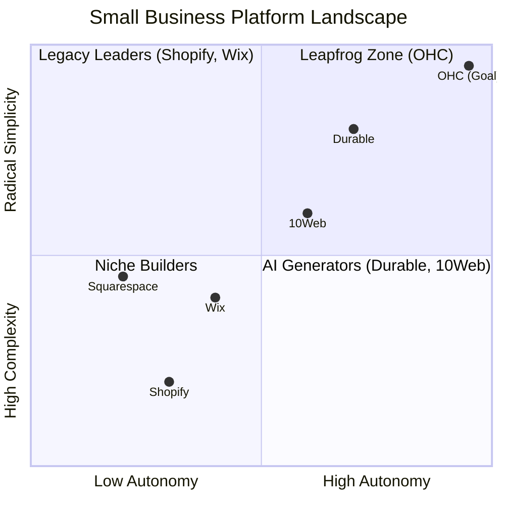

# OHC Market Dominance Research Report: The SMB Platform Gap

## Executive Summary
This research report analyzes the current small business platform landscape, focusing on the needs of non-technical users and evaluating competitors like Shopify, Wix, Squarespace, 10Web, Durable, and Hocoos.

The findings highlight a critical gap: existing platforms primarily treat AI as a **reactive tool** (e.g., chat assistants requiring prompts) or focus solely on **initial website generation**. OHC has the opportunity to dominate the massive, underserved SMB market by integrating AI as an **autonomous, invisible teammate** that proactively manages daily business operations.

---

## 1. Market Sizing & Strategic Direction

### Total Addressable Market (TAM)
- **US Market:** There are over 27.1 million non-employer businesses in the US.
- **Global Market:** Estimated at over 330 million SMBs globally, with the vast majority being non-employer or micro-businesses.
- **The Gap:** More than 25% of these businesses still lack a formal online presence, relying entirely on physical foot traffic or informal channels like social media DMs.

### Beachhead Market
- **Primary Persona:** The Service-Based Solo-preneur (e.g., Carlos the Handyman, Maya the Baker).
- **Why:** This segment possesses the highest density of underserved users. They experience acute, immediate operational pain points (scheduling chaos, missed leads, manual quoting) but have the lowest tolerance for technical complexity. They do not need complex, heavy-duty eCommerce solutions like Shopify; they need a radically simple digital storefront that acts as a 24/7 receptionist.

### Expansion Strategy
- **Geographic:** Phase 1: US/Canada/UK (English). Phase 2: LATAM (Spanish/Portuguese) due to a massive explosion in mobile-first micro-entrepreneurship. Phase 3: MENA (Arabic).
- **Vertical:** Establish the horizontal platform first, then deepen verticals starting with **Local Services** (integrated quoting, scheduling, local SEO), followed by **Food & Beverage** (pickup orders, simple POS).
- **Marketplace Opportunity:** Long-term potential to aggregate OHC-powered local services into an "Etsy for Local Services" marketplace, connecting consumers with trusted, AI-powered independent businesses.

---

## 2. Deep Competitor Audit & Feature Gap Matrix

A comprehensive analysis of major platforms reveals that none fully solve the "Setup Complexity" and "Operational Fatigue" problems for true beginners post-launch.

### Feature Gap Matrix

| Feature | **Shopify** | **Wix** | **Squarespace** | **Durable / 10Web** | **OHC (Target)** |
| :--- | :--- | :--- | :--- | :--- | :--- |
| **Setup Time** | 30-60 min | 20-40 min | 30-60 min | < 5 min | **< 1 min** |
| **Technical Reqs** | Medium/High | Low/Medium | Low/Medium | Low | **Zero** |
| **AI Integration** | Reactive (Sidekick) | Reactive | Limited | Gen-only (Site creation) | **Autonomous Agents** |
| **Mobile UX** | Poor for setup | Partial | Partial | Good | **100% Mobile-First** |
| **Business Operations**| Complex (App Store) | Good | Basic | Basic | **All-in-one Event Mesh** |

### Competitor Positioning



**Key Insights:**
1. **The Generation Commodity:** AI website generation (Durable, Hocoos, 10Web) is becoming commoditized. OHC must win on **Business Operations** post-launch.
2. **The Legacy Debt:** Shopify and Wix have deep operational features but massive UX debt. OHC's "No Jargon, Mobile-First" value is the primary wedge against them.

---

## 3. Top 10 SMB User Pain Points

Based on a synthesis of Reddit communities (r/smallbusiness, r/ecommerce), Trustpilot, and App Store reviews for major platforms.


### Top 5 Persona Pain Points
1. **Setup Complexity (73%):** Users feel alienated by jargon like DNS, CNAME, and APIs. (*Persona: Maya the Baker*)
2. **Operational Fatigue (68%):** The "never-ending inbox"—answering the same questions across multiple apps. (*Persona: Carlos the Handyman*)
3. **Marketing Dread (55%):** Creating social media content is a major barrier, leading to inactive online presences. (*Persona: Priya the Boutique Owner*)
4. **Invisible Discovery (52%):** Launching a site but getting zero traffic; SEO is perceived as a "black art." (*Persona: Leo the Music Tutor*)
5. **Technical Jargon (48%):** Dev-speak in dashboards creates confusion and fear of breaking things. (*Persona: Fatima the Food Cart Owner*)

---

## 4. OHC AI Differentiation Manifesto

Competitors treat AI as a **Tool** (Reactive, requires a prompt, creates work).
OHC treats AI as a **Teammate** (Proactive, event-driven, reduces work).

```mermaid
graph LR
    subgraph Legacy AI (Tools)
    User[User] -->|Prompt| AI_Tool[AI Tool]
    AI_Tool -->|Draft| User
    User -->|Edit/Publish| Action[Final Action]
    end

    subgraph OHC AI (Teammates)
    Event[Business Event] -->|Trigger| Agent[Autonomous Agent]
    Agent -->|Draft & Queue| Dashboard[Action Feed]
    Dashboard -->|1-Tap Approve| Live[Live Change]
    end
```

### The 5 Pillar Automations
1. **The Silent Ambassador (Customer Success):** Auto-drafts replies to DMs based on business memory for 1-tap approval. Solves *Operational Fatigue*.
2. **The Vigilant Manager (Operations):** Proactively flags low stock and queues restock tasks. Solves *Cost Creep & Lost Sales*.
3. **The Generative Promoter (Marketing):** Auto-generates a 7-day social media calendar when a new product is added. Solves *Marketing Dread*.
4. **The AI Discovery Agent (GEO):** Optimizes structured data for LLM crawlers automatically, without requiring user SEO knowledge. Solves *Invisible Discovery*.
5. **The Business Advisor (Advisory):** Delivers daily plain-language briefings (e.g., "Tuesday is your best day. Boost your social spend by $5.") rather than complex dashboards. Solves *Financial Fog*.

---

## 5. Actionable Recommendations

Based on this research, the following features have been documented as issue briefs for the engineering swarm:

1. **Implement the Agent Activity Feed (P0):** Create a mobile-first dashboard feed where agents queue drafted actions (emails, posts) for 1-tap approval. This directly addresses the critical "Operational Fatigue" pain point. (See `docs/research/[ui]_mobile_first_agent_activity_feed.md`)
2. **Develop the Generative Promoter Agent (P1):** Build an event-driven agent that automatically creates a 7-day social content calendar upon adding a new product, eliminating "Marketing Dread." (See `docs/research/[marketing]_generative_promoter_social_calendar.md`)
3. **Launch the AI Discovery Agent for GEO (P1):** Automate Generative Engine Optimization by having a background agent inject rich structured data optimized for LLM consumption, solving "Invisible Discovery" without exposing users to SEO jargon. (See `docs/research/[discovery]_ai_geo_optimization_agent.md`)