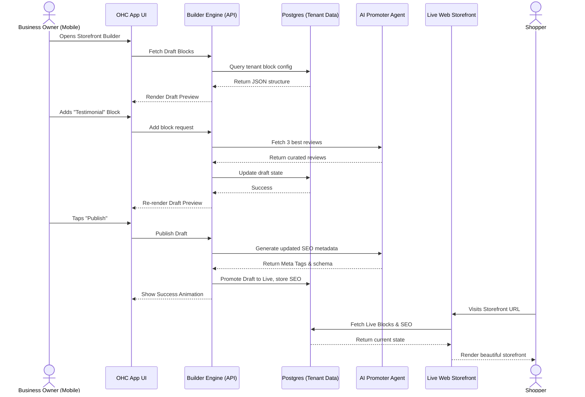

# [Architecture] Website & Storefront Builder

## Problem Statement

Small business owners—from bakers to handymen to food cart operators—need a professional online presence to attract customers, take orders, and establish credibility. However, existing website builders like Shopify, Wix, and Squarespace are too complex for non-technical users. They require understanding concepts like themes, layouts, sections, margins, and DNS settings.

Our personas (Maya the Baker, Carlos the Handyman, Priya the Boutique Owner) need a beautiful, fully functional storefront that goes live in minutes, directly from their mobile phones. They don't want to design a website; they want to *have* a website. The builder must provide sensible defaults, guided customization, and intelligent content generation driven by the AI Marketing Agent ("The Promoter").

## Research Report

**Competitive Landscape:**
- **Shopify:** Powerful e-commerce features but overwhelming setup. Requires desktop for serious customization. Themes are rigid unless code is edited.
- **Wix:** High customization but easy to create poor designs. The mobile editor is often an afterthought and frustrating to use.
- **Squarespace:** Beautiful templates, but editing via mobile is limited. Content blocks require too many taps to configure.
- **GoDaddy (Airo):** Faster setup, but the end result looks generic and lacks deep integration with booking/custom orders.

**Key Findings:**
1. **Decision Fatigue:** Users abandon setup when faced with blank canvases or too many template choices.
2. **Mobile Constraint:** 100% of the build and edit process must happen comfortably on a 375px wide screen (mobile phone). This forces a linear, block-based approach rather than free-form drag-and-drop.
3. **Content First:** The hardest part of building a site is writing copy and finding images. The builder must generate these automatically based on brief business descriptions.
4. **Instant Gratification:** Publishing must be immediate. Technical hurdles like DNS propagation and SSL provisioning must be entirely hidden.

## Design Doc

### 1. Architectural Philosophy & UX Design
The builder is not a "drag-and-drop canvas." It is a structured **Content Block Manager**. A website is simply a vertical stack of pre-designed, premium blocks.

#### Content Blocks
Users construct their site by stacking blocks. Each block is constrained to ensure aesthetic excellence (Glassmorphism, proper spacing, typography constraints).
- **Hero Block:** The main hook. Large AI-generated or uploaded image, clear value proposition, and a primary CTA ("Order Now", "Book Appointment").
- **Product/Service Grid:** Displays items synced directly from the Operations department (Maya's cakes, Carlos's services). Sold-out or inactive items are handled automatically.
- **Text & Image:** Storytelling block. "About Us" or mission statement.
- **Testimonials:** Reviews synced from the Customer Success department.
- **Booking Calendar:** Direct integration for service-based businesses (Leo's guitar lessons).
- **Contact/Lead Form:** Simple inquiry capture that routes directly to the Sales & Acquisition department's inbox.
- **Location & Hours:** Google Maps integration and dynamic open/closed status.
- **Link-in-Bio Layout:** A specialized, simplified block stack optimized for TikTok/Instagram profiles.

#### Template Engine & Customization
- **No "Themes"**: Instead of themes, we use a global **Design System Token Set**. Users select a "Vibe" (e.g., Playful, Elegant, Industrial, Minimalist). This changes the global color palette, font pairings (Outfit + Inter), and border radii across all blocks instantly.
- **Guided Customization:** Users cannot arbitrarily change the padding of a single button. They can only tweak global tokens or swap block order. This guarantees the site never "breaks" aesthetically.

#### Publishing Workflow (Draft -> Live)
- **Real-time Preview:** The builder interface IS the website. Editing a block updates the preview instantly.
- **Draft State:** Changes are auto-saved as drafts. The live site is untouched until the user taps "Publish".
- **One-Tap Publish:** Taps "Publish" -> Draft state promotes to Live state. The live storefront reflects the new block arrangement instantly.

#### Automated SEO ("The Promoter")
- No manual meta tag entry. The AI Promoter department automatically generates `title`, `description`, and structured schema data based on the business profile, products, and location.
- Images are automatically compressed, converted to WebP, and assigned alt-text by the AI.
- Sitemaps are auto-generated and submitted to search engines when the site goes live.

#### Custom Domains & SSL Provisioning
- **Default:** Every business gets an instant `.ohc.store` subdomain (e.g., `mayascakes.ohc.store`).
- **Custom Domains:** If the user upgrades to Starter/Pro, they can buy a domain directly in the app or connect an existing one. The technical provisioning (DNS records, SSL certificate generation, CDN propagation) happens entirely in the background. The user just sees a progress spinner and a "Your domain is ready!" message.

### 2. Architecture Diagram (Mermaid.js)

### 3. Mobile UX Flow
1. **Home Tab:** User taps "Edit Storefront".
2. **Editor View:** Shows the current draft site exactly as it looks on mobile. A floating "Add Block" button sits at the bottom.
3. **Block Menu:** Tapping "Add Block" slides up a bottom sheet with block types (Hero, Products, Testimonials, etc.).
4. **Configuration:** Tapping a block opens a minimal form (e.g., upload photo, change title). Keyboard uses native numeric/text inputs.
5. **Reordering:** Long-press a block to drag it up or down in the stack.
6. **Publishing:** A sticky "Publish Changes" bar appears at the top when un-published drafts exist. Tapping it shows a confirmation and a premium success animation.

## Implementation Prompt
**To the Implementer Agent:**
Implement the core data structures and backend services for the Storefront Builder. Focus on creating a robust block-stacking system where a storefront is represented as an ordered list of typed blocks.

**Key Requirements:**
- **Draft vs. Live State:** Implement separate storage or state flags so a user can safely edit their draft without affecting the live site until "Publish" is invoked.
- **Block Taxonomy:** Define standard block types (Hero, ProductGrid, Text, Booking, etc.) that can be seamlessly interpreted by the frontend.
- **AI Integration Hook:** Ensure the publish flow triggers an asynchronous event to the AI Promoter department to regenerate SEO metadata.
- **Mobile First Data:** The API must return the site configuration in a way that the mobile app can render natively without requiring a webview.

## Priority & Scope
- **Priority:** P0 (Critical path for onboarding)
- **Estimated Scope:** Large
