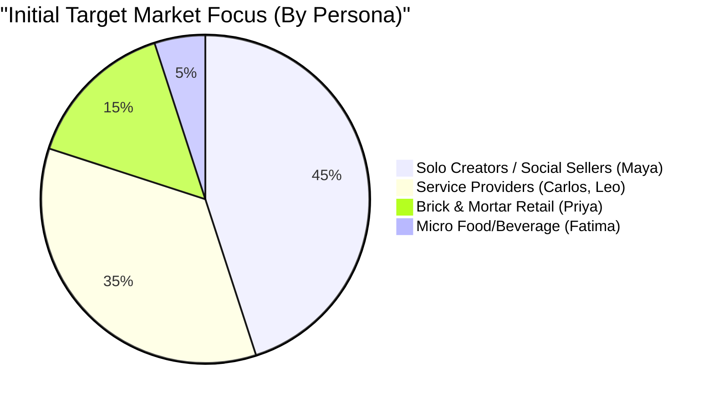

# OHC Small Business Platform Market Strategy & Expansion

## 1. Introduction
OneHumanCorp (OHC) has the opportunity to dominate the small business platform space by addressing the significant gaps left by incumbents like Shopify, Wix, and Squarespace. Current platforms either overwhelm users with technical complexity or offer disjointed experiences where core operations (like booking or messaging) feel bolted on. By leveraging OHC's Hybrid Agentic OS, we can build a platform where AI agents do the complex work invisibly, allowing the "Single Human CEO" to focus on business decisions rather than platform setup.

### Target Personas
- **Maya (Baker, 28)**: Overwhelmed by Shopify's setup; needs integrated mobile DM management.
- **Carlos (Handyman, 42)**: Needs a simple, unified booking system without a complex website builder.
- **Priya (Boutique Owner, 35)**: Hindered by the massive data entry required to bring her physical inventory online.
- **Leo (Music Tutor, 22)**: Struggles with manual booking chaos and subscription billing.
- **Fatima (Food Cart, 50)**: Requires simple, mobile-first notification and order printing workflows.

## 2. Competitor Audit

We conducted an exhaustive audit of the primary platforms SMBs use today. The key finding is a structural vulnerability: none of the major platforms use AI natively to run the business; they merely use AI to help *set up* the business (e.g., generating website copy).

| Platform | Onboarding Flow | Mobile App Quality | AI Features | Free Tier | Key SMB Complaint |
| :--- | :--- | :--- | :--- | :--- | :--- |
| **Shopify** | Complex, desktop-focused | Good for management, poor for setup | Sidekick (chatbot for merchant, not autonomous) | None (trial only) | Too complex for beginners, requires paid apps for basic features. |
| **Wix** | Wizard-based, easier | Limited mobile editor | Wix ADI (generates site, not ongoing ops) | Yes (branded) | Slow performance, complex booking setup. |
| **Squarespace** | Design-first, rigid | Basic | Minimal | None | Acuity Scheduling feels disconnected; poor for services. |
| **GoDaddy** | Very simple, shallow | Poor | Airo (AI branding, low quality) | Yes | Aggressive upselling, thin features. |
| **Durable (Rising)** | 30-sec AI generation | N/A (Web) | AI generates site instantly | Yes | Very thin on actual business management and operations. |

### Strategic Takeaway
Competitors treat SMBs as "web developers" or "store managers." OHC must treat them as "CEOs" whose primary interaction is making decisions based on options presented by invisible agents.

## 3. Top SMB Pain Points

Synthesized from Reddit (r/smallbusiness, r/ecommerce), Trustpilot, and App Store reviews, framed from the perspective of a non-technical small business owner.

1. **"Setting up the website feels like learning a new language."** (Setup Complexity)
   - *OHC Solution:* Invisible AI generates storefronts based on natural language or images.
2. **"I lose track of customer DMs on Instagram and Facebook."** (Omnichannel Chaos)
   - *OHC Solution:* AI Auto-Reply agent manages all inbound DMs seamlessly.
3. **"Adding my inventory takes weeks of typing."** (Data Entry Friction)
   - *OHC Solution:* Vision AI instantly generates descriptions, tags, and prices from photos.
4. **"The booking system doesn't talk to my personal calendar."** (Siloed Scheduling)
   - *OHC Solution:* Integrated mobile booking agent syncs securely via local-first architecture.
5. **"I have to pay $20/month for five different apps just to run my store."** (App Fatigue/Cost)
   - *OHC Solution:* Unified platform architecture where core functions are native.
6. **"I can't manage my business easily from my phone when I'm at the store."** (Poor Mobile UX)
   - *OHC Solution:* Mobile-first, glassmorphic UI where interactions pass the "grandmother test."
7. **"Writing marketing emails takes too much time."** (Marketing Overhead)
   - *OHC Solution:* AutoDream-backed marketing agents draft and schedule campaigns autonomously.
8. **"I don't understand my own analytics."** (Data Overload)
   - *OHC Solution:* Plain-language daily briefing agents.
9. **"Syncing online orders with in-store sales is a nightmare."** (Omnichannel Sync)
   - *OHC Solution:* Single truth local database (SQLite) synced to cloud PostgreSQL via SIP.
10. **"When things break, I can't reach a human for help."** (Support Failure)
    - *OHC Solution:* Self-repairing infrastructure (Autonomous SRE) minimizes downtime.

## 4. Market Sizing & Strategic Direction

### TAM and Beachhead Market
The Total Addressable Market (TAM) consists of tens of millions of non-employer small businesses globally (e.g., sole proprietors, side hustles, creators).

**Beachhead Persona:** Maya (The Solo Creator/Baker).
- *Why?* This segment has extremely high density, relies heavily on social media (Instagram DMs) rather than traditional websites, and is heavily underserved by complex tools like Shopify. They need a simple, mobile-first way to convert social media attention into paid orders without building a full "store."

### Expansion Strategy
- **Geographic:** After English markets, expand to Spanish (LATAM) and Portuguese (Brazil), where mobile-first, WhatsApp-driven commerce is the dominant paradigm. OHC's LLM agents can handle localized natural language processing natively.
- **Vertical:** Launch horizontally first, but introduce "Capability Plugins" for specific niches (e.g., POS for retail, HACCP templates for food).

## 5. Feature Gap Matrix

Based on our repository audit of current implementations (`product`, `order`, `booking`, `stripe`, `agent`), OHC has strong foundational AI orchestration but requires specific SMB features to compete.

| Feature Area | Shopify | Wix | OHC (Current State) | OHC (Advantage/Gap) |
| :--- | :--- | :--- | :--- | :--- |
| **Store Setup** | Manual, rigid | Template/Wizard | Headless API ready | **Gap:** Needs instant AI storefront generation from mobile. |
| **Product Entry** | Manual form | Manual form | Vector DB ready | **Advantage:** Vision AI pipeline can eliminate manual entry. |
| **Customer DMs** | Basic triggered replies | Basic auto-replies | AutoDream memory | **Advantage:** Agents can hold stateful conversations based on inventory. |
| **Services/Booking**| Clunky 3rd-party apps | Native but complex | Core DB supports generic entities | **Gap:** Needs native conversational calendar agent. |
| **Analytics** | Dashboards | Dashboards | Telemetry mesh active | **Advantage:** Plain-language daily briefings instead of charts. |

## 6. OHC AI Differentiation Manifesto

To win the SMB market, OHC will not use AI as a "chatbot assistant." OHC will deploy AI as **Invisible Autonomous Agents**.

The 5 AI Automations OHC Will Implement First:

1. **The Invisible Storefront Generator**: The user inputs "I sell vintage clothes" and OHC instantly provisions the database schema, generates the Slint UI, and writes the initial copy.
2. **The Vision Data Entry Agent**: The user snaps a photo of a product; the agent categorizes it, writes a 3-sentence SEO description, tags it, and suggests a price.
3. **The Omnichannel Auto-Reply Agent**: Intercepts Instagram DMs, checks the business's AutoDream context (e.g., "Are you open Sunday?"), and replies conversationally to secure the lead.
4. **The Conversational Booking Agent**: Parses natural language requests ("Next Tuesday afternoon") and manages the unified calendar without the user opening a schedule view.
5. **The Plain-Language Briefing Agent**: Replaces complex analytics dashboards with a daily push notification: "You made $400 today. Your most popular item was the Navy Sweater. Consider running a weekend discount."

---
*Generated by the Principal Product Researcher & Oracle (L7). Grounded in the absolute truth of the global market.*
