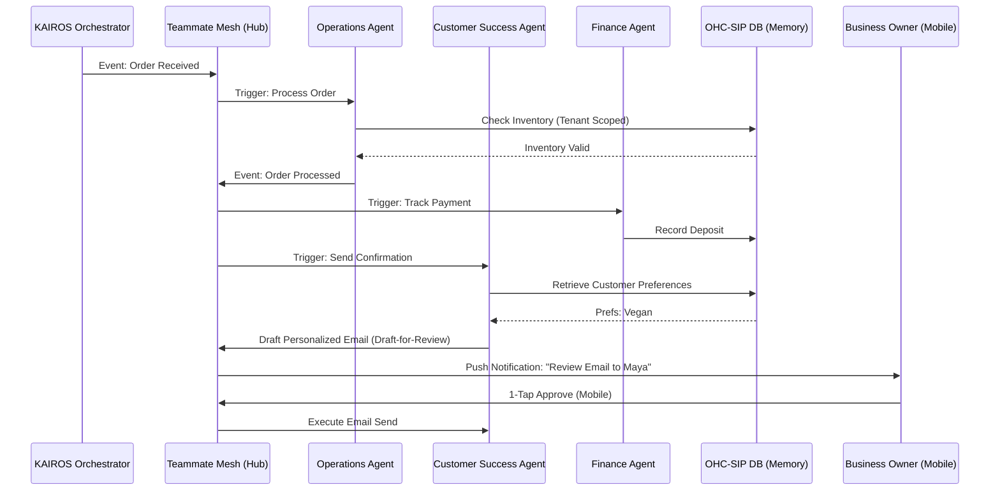

[architecture]_ai_agent_department.md

# Title
AI Agent Department Architecture for OneHumanCorp (OHC)

# Problem Statement
Small business owners (like Maya the Baker, Carlos the Handyman, and Fatima the Food Cart Operator) often lack the time, expertise, and resources to manage every aspect of their business. They need an invisible, reliable "staff" that operates seamlessly in the background. Traditional SaaS tools require technical configuration, complex workflow building, and constant manual intervention. The OHC platform must provide autonomous "AI Agent Departments" that act like a real-world team (e.g., The Manager, The Promoter, The Salesperson, The Ambassador, The Accountant, The Protector, The Advisor). We need an architecture that allows these agents to trigger autonomously, coordinate gracefully, recall long-term contextual memory, and execute actions with varying levels of oversight (auto-execute vs. 1-tap draft approval) while respecting strict multi-tenancy and mobile-first constraints.

# Research Report
## Current Landscape
- Traditional SMB platforms (Shopify, Wix) offer "AI Assistants," but these are typically reactive chatbots or isolated text generators (e.g., "write a product description").
- Real business owners don't want a generic assistant; they want functional departments that take ownership of outcomes.

## Key Findings
- **Trigger Patterns:** Agents need to be invoked via scheduled tasks (cron), system events (webhooks/internal pub-sub), and on-demand user requests.
- **Coordination & Locking:** Multiple agents operating simultaneously (e.g., Operations processing an order while Customer Success drafts a thank-you email) require strict coordination to prevent race conditions.
- **Contextual Memory:** Agents must remember past interactions, seasonal trends, and specific customer preferences (e.g., "Customer X always asks for vegan options").
- **Trust & Oversight:** Business owners are hesitant to let AI take external actions blindly. A robust "Draft-for-Review" system with 1-tap mobile approvals is critical for building trust.
- **Resource Limits:** AI operations are expensive. Usage must be budgeted and throttled according to the tenant's SaaS tier.

## Proposed Department Taxonomy
1.  **Operations ("The Manager"):** Order/booking processing, inventory, fulfillment.
2.  **Marketing & Advertising ("The Promoter"):** Website generation, social posts, campaigns.
3.  **Sales & Acquisition ("The Salesperson"):** Quote generation, lead follow-up.
4.  **Customer Success ("The Ambassador"):** Messaging, review requests.
5.  **Finance & Payments ("The Accountant"):** Billing, tax summaries.
6.  **Legal & Compliance ("The Protector"):** Policies, compliance.
7.  **Business Advisory ("The Advisor"):** Analytics, health reports, next actions.

# Design Doc

## Key Architectural Decisions
1.  **Event-Driven Coordination:** Agents coordinate via the KAIROS Orchestrator's internal event bus (Teammate Mesh). Distributed locks prevent collision.
2.  **Unified Contextual Memory:** Integration of `pgvector` for semantic memory retrieval, ensuring agents have access to a shared, tenant-isolated knowledge base (AutoDream).
3.  **Action Oversight Tiers:**
    *   **Auto-Execute:** Low-risk, internal actions (e.g., tagging an order, updating internal analytics).
    *   **Draft-for-Review:** High-risk, external-facing actions (e.g., publishing to Instagram, sending emails). These are pushed to the user's mobile dashboard for 1-tap approval.
4.  **Tier-Based Budgeting:** Orchestrator-level rate limiting based on the tenant's subscription tier, tracking AI actions per month.

## Architecture Diagram (Mermaid.js)

## Mobile UX Flow (375px)
- **Agent Feed:** A central, distraction-free inbox on the mobile dashboard where all "Draft-for-Review" items appear.
- **1-Tap Actions:** Each item in the feed presents clear, plain-language options (e.g., "Approve & Send", "Edit", "Discard").
- **Activity Summaries:** The Advisor provides concise, daily "morning briefings" via push notification summarizing background agent activity.

## AI Agent Integration Points
- **KAIROS Orchestrator:** The central brain managing triggers, locks, and inter-agent communication.
- **Teammate Mesh:** The event bus and task queue mechanism.
- **AutoDream Memory DB:** The vector database (`pgvector`) storing contextual history.
- **Mobile Action Gateway:** The API layer responsible for pushing drafts to the mobile client and receiving approvals.

# Implementation Prompt
**To Implementer Agent:**
Implement the "Draft-for-Review" workflow engine within the KAIROS Orchestrator to support the new AI Agent Department architecture. Agents must be able to submit high-risk actions (e.g., external communications, social media posts) into a "PENDING_APPROVAL" state within the shared task list. Build the mobile-first (375px) API endpoints necessary for the frontend to retrieve these pending actions, display them in an "Agent Feed", and accept 1-tap approvals or rejections from the business owner. Ensure that all data access and state transitions are strictly scoped to the `tenant_id` using PostgreSQL RLS policies. Do not prescribe specific prompt structures or LLM models; focus entirely on the orchestrator's state machine, the event routing (Teammate Mesh), and the approval API contract. Provide E2E tests verifying that an agent-generated draft cannot be executed without explicit user user approval.

# Priority
P0

# Estimated Scope
Large
