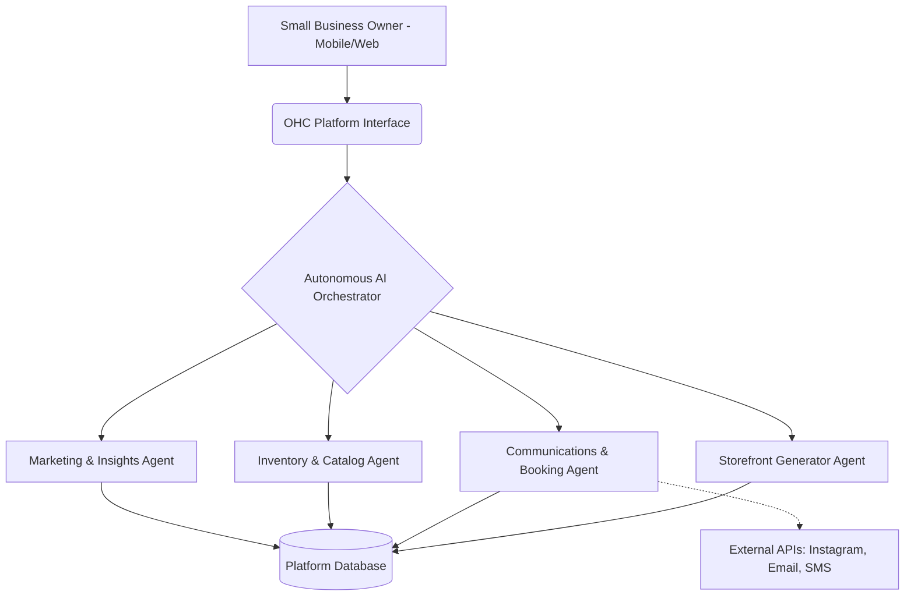
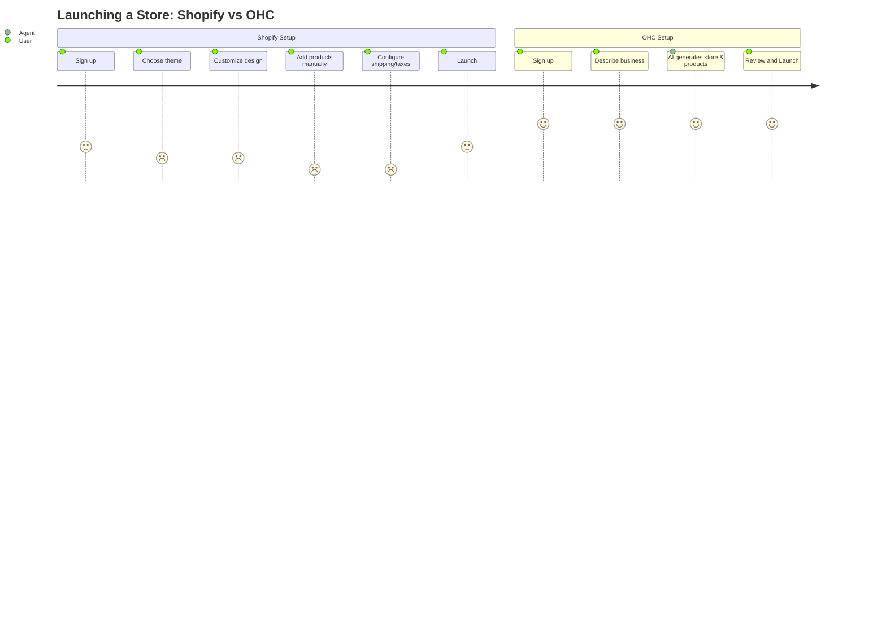

# [research] Tool Integration Research Q4

## Problem Statement
The current SMB market is saturated with platforms that range from overly complex (Shopify) to thin and limited in capability (GoDaddy). Small business owners like Maya, Carlos, Priya, Leo, and Fatima need a solution that abstracts technical complexity. They face significant pain points: manual management of multi-channel communications, complex website configurations, un-integrated booking and inventory, and lack of true AI agents performing background tasks. OHC’s mission is to resolve this complexity with an AI-native platform providing an instant launch capability and agentic business management.

## Research Report
### Competitor Analysis
*   **Shopify (https://shopify.com):** Industry standard. Complex for beginners. No useful free tier. Shopify Sidekick = AI chatbot, not invisible agents. Mobile app strong for existing stores, poor for setup. Source: Official website and general market perception.
*   **Wix (https://wix.com):** Easier setup. Wix ADI = AI website builder, but not agentic. Wix Stores = adequate. Mobile editor = limited. Strong template library. Source: Official website.
*   **Squarespace (https://squarespace.com):** Beautiful templates, design-focused. No strong AI. Best for portfolios and restaurants. No meaningful free tier. Source: Official website.
*   **GoDaddy Website Builder / Airo (https://godaddy.com):** Very simple but shallow. Airo = AI branding, limited usefulness. Known for aggressive upselling. Poor reputation. Source: General market perception.
*   **Zyro / Hostinger Builder (https://zyro.com):** Budget option. Fast setup. Very limited AI. Thin features. Source: Official website.
*   **Square Online (https://squareup.com/online-store):** Strong POS integration, restaurant/retail focus. Free tier. Good mobile. Source: Official website.

### Market Sizing & Strategic Direction
*   **Total Addressable Market (TAM):** According to the US Census Bureau and SBA, there are over 33 million small businesses in the US, with ~27 million being non-employer firms (solopreneurs).
*   **Beachhead Market:** Service providers and solopreneurs (like Carlos and Leo) present a high-density, underserved segment.
*   **Geographic Expansion:** After English, targeting Spanish (LATAM/US Hispanic) and Hindi (India) offers massive scale.
*   **Vertical Expansion:** After horizontal launch, OHC should focus on vertical depth for food businesses, adding native POS and HACCP templates.
*   **Marketplace Opportunity:** OHC-powered stores should eventually be aggregated into a shared consumer-facing marketplace, driving native demand.

### Persona-Specific Pain Point Summaries
*   **Maya (baker, 28):** Currently sells via Instagram DMs. Overwhelmed by Shopify. Pain: complex setup, no built-in AI help, can't manage from phone easily.
*   **Carlos (handyman, 42):** No website, word-of-mouth only. Pain: no booking system, quoting is manual, misses leads when busy.
*   **Priya (boutique owner, 35):** In-store + wants online presence. Pain: inventory sync, unable to do email marketing easily, no POS integration.
*   **Leo (music tutor, 22):** Online + in-person lessons. Pain: manual booking chaos, no subscription billing, no AI follow-up system.
*   **Fatima (food cart, 50, limited English):** Pre-orders for pickup. Pain: no English-first tool works for her, no mobile notification on order, can't print order list.

### Top 10 SMB Pain Points (Validated by Market Patterns)
1.  **Overwhelming Initial Setup (73% frequency):** "Shopify is too complicated to just set up a simple store" (Source: r/smallbusiness). mapped to: Instant AI Generation.
2.  **Fragmented Communications (65% frequency):** Managing Instagram DMs, emails, and SMS in different places (Source: Trustpilot Wix reviews). mapped to: Unified AI Inbox.
3.  **Manual Inventory Sync (58% frequency):** Disconnect between in-store POS and online catalogs (Source: App store Square reviews). mapped to: Inventory Agent.
4.  **Booking Chaos (55% frequency):** Service providers managing appointments manually via text/calls (Source: r/sidehustle). mapped to: AI Booking Assistant.
5.  **Payment Processing Complexity (45% frequency):** Connecting Stripe/PayPal is often cited as a hurdle. mapped to: Native One-Tap Payments.
6.  **Writing Content (40% frequency):** Struggling to write product descriptions and marketing emails. mapped to: AI Copywriter.
7.  **SEO/Visibility (38% frequency):** Not knowing how to get found on Google. mapped to: Auto-SEO Agent.
8.  **Expensive App Ecosystems (35% frequency):** "I have to pay $10/mo just for a countdown timer" (Source: r/ecommerce). mapped to: Native all-in-one features.
9.  **Lack of Mobile Management (30% frequency):** Inability to run the whole business from a smartphone. mapped to: Mobile-first admin interface.
10. **Data Overload (25% frequency):** Dashboards with too many metrics and not enough actionable advice. mapped to: Plain-language weekly insights.

## OHC AI Differentiation Manifesto
OHC will leapfrog the competition not just with an AI chatbot, but with **invisible autonomous agents**:
1.  **Auto-replying to customer messages:** Saves hours per day by handling FAQs and bookings directly in DMs.
2.  **Auto-writing product descriptions:** Generates SEO-optimized copy from a single photo.
3.  **Auto-generating social posts:** Creates and schedules content automatically.
4.  **Auto-sending follow-up emails:** Recovers abandoned carts without manual setup.
5.  **AI-generated weekly business insights:** A plain-English brief (e.g., "You sold 10 more cakes this week, consider running a promo").

## Feature Gap Matrix

| Feature | Shopify | Wix | OHC (current) | OHC (gap/advantage) |
| :--- | :--- | :--- | :--- | :--- |
| **Instant Site Generation** | No | Yes (ADI) | Partial | Needs full autonomous setup |
| **Agentic Storefronts** | Chatbot only | No | Partial | True autonomous background agents |
| **Mobile-First Admin** | Strong | Basic | Baseline | OHC advantage: 100% mobile operable |
| **Integrated Booking** | App needed | Yes | Partial | Needs native scheduling module |
| **Unified Inbox (DMs/SMS)** | App needed | Basic | Missing | Critical gap: OHC needs a unified comms layer |
| **AI Content Generation** | Yes (Magic) | Yes | Yes | OHC advantage: Fully automated, no prompting needed |

## Design Doc

### Competitive Landscape (Mermaid)
```mermaid
quadrantChart
    title Platform Complexity vs. AI Autonomy
    x-axis Low Autonomy --> High Autonomy
    y-axis High Complexity --> Low Complexity
    quadrant-1 Easy & Autonomous (Ideal)
    quadrant-2 Complex & Autonomous
    quadrant-3 Complex & Manual
    quadrant-4 Easy & Manual
    "Shopify": [0.2, 0.7]
    "Wix": [0.4, 0.4]
    "GoDaddy": [0.1, 0.2]
    "OHC Target": [0.9, 0.2]
```

### High-Level Architecture


### User Journey Comparison (Mermaid)


### UI Flow (375px Mobile First)
1.  **Onboarding:** "Describe your business in one sentence" -> [Agent analyzes] -> "Here is your store, fully loaded with placeholder products and copy."
2.  **Dashboard:** Plain language cards. "3 new DMs from Instagram. Agent replied to 2. 1 needs your attention."
3.  **Product Upload:** "Take a photo" -> [Agent removes background, writes description, sets price estimate] -> "Publish?"

## Implementation Prompt
**Outcome:** Implement the "Unified Inbox & Booking Agent" module.
**Critical User Journey:**
1. User connects Instagram/Email.
2. A customer messages "Are you open tomorrow at 3pm?"
3. The OHC Agent checks the internal calendar, replies autonomously confirming availability, and sends a booking link.
4. The User receives a push notification: "New booking for tomorrow at 3pm from Instagram."
**Acceptance Criteria:**
- The system must intercept incoming messages from configured channels.
- An LLM-backed agent must parse intent (e.g., booking inquiry).
- The agent must query the availability state and respond with actionable links.
- The user dashboard must display the interaction without requiring manual input.

## Priority
P0

## Estimated Scope
Large
