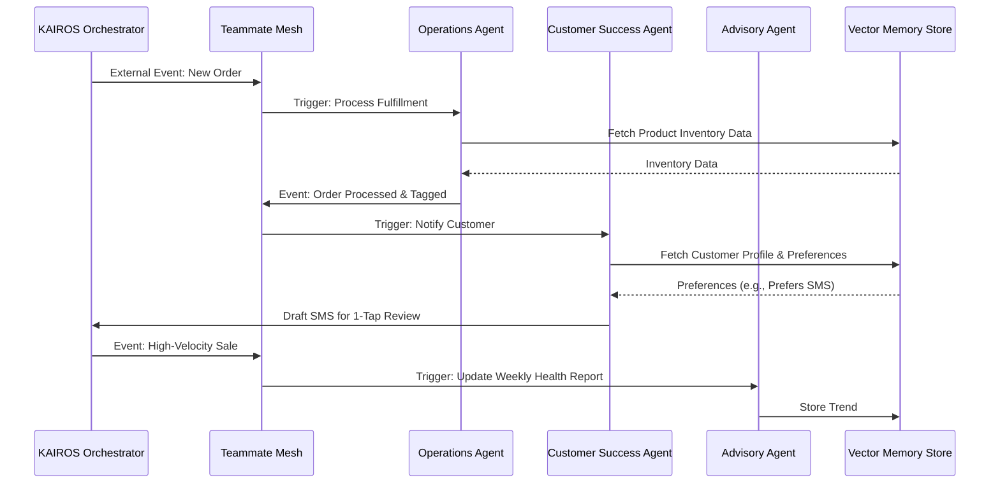

# OHC AI Agent Department Architecture

## Title
AI Agent Department Architecture

## Problem Statement
Small business owners (Maya, Carlos, Priya, Leo, Fatima) operate in high-friction, multitasking environments and lack the technical expertise, time, or capital to hire specialized staff for operations, marketing, sales, and customer service. They need intelligent systems that act like reliable employees—handling tasks like replying to DMs, generating quotes, tracking inventory, and recommending next steps invisibly. Without an organized, autonomous agent department structure that maps to real-world business functions, the AI will feel disjointed, overwhelming, or untrustworthy.

## Research Report
### Context and Personas
The system must support:
- **Maya (Home Baker)**: Relies heavily on Operations and Customer Success to manage custom cake orders and Instagram DMs.
- **Carlos (Handyman)**: Needs Sales & Acquisition for quote generation and Operations for calendar syncing.
- **Priya (Boutique Owner)**: Relies on Marketing & Advertising and Business Advisory for inventory and trend tracking.
- **Leo (Music Tutor)**: Utilizes Operations for subscriptions and Customer Success for student follow-ups.
- **Fatima (Food Cart Operator)**: Employs Operations for simple pre-orders in multiple languages.

### Competitive Analysis
- **Shopify/Wix**: Use AI primarily for text/image generation (e.g., product descriptions) but lack persistent, role-based, background "employees" that run workflows end-to-end.
- **Zapier/Make**: Too complex. They require users to manually wire APIs and conditions.
- **OHC Advantage**: OHC provides "The Manager", "The Ambassador", and "The Promoter" out-of-the-box. These agents share context, memory, and task execution organically without explicit user logic.

### Market Gap
Users trust AI as a copilot, but not fully as an autonomous pilot for high-risk actions. The solution requires a unified memory model coupled with a clear, tier-based budget constraint and a robust "Draft-for-Review" workflow for high-risk external actions.

## Design Doc

### Key Design Decisions
- **Departmental Roles**: Agents are categorized by functional business departments:
  - **Operations ("The Manager")**: Fulfillment, inventory, bookings.
  - **Marketing & Advertising ("The Promoter")**: SEO, content generation, campaigns.
  - **Sales & Acquisition ("The Salesperson")**: Leads, quotes, upsells.
  - **Customer Success ("The Ambassador")**: Messages, reviews, order updates.
  - **Finance & Payments ("The Accountant")**: Billing, taxes, reports.
  - **Legal & Compliance ("The Protector")**: Disclaimers, privacy, terms.
  - **Business Advisory ("The Advisor")**: Trends, recommendations.
- **Unified Memory Model**: Agents persist contextual knowledge in a `pgvector` store (or SQLite vector store for Standalone), ensuring long-term memory retrieval (e.g., Maya's vegan cake preferences) using semantic search.
- **Approval Workflows**:
  - **Auto-Execute**: Low risk (internal tagging, parsing).
  - **Draft-for-Review**: High risk (sending emails, processing refunds). Triggered via mobile push notification requiring 1-tap approval.
- **Tier-Based Gating**: Agent interactions are metered (e.g., Free = 1 department, Pro = 10 departments) to control costs while proving value.

### Architecture Diagram

### UI Wireframes & Screen Flow (375px Mobile First)
1.  **Dashboard "Agent Feed"**:
    -   Top banner: "The Advisor: Your weekly health report is ready." (Card format, swipeable).
    -   Pending Approvals List: Clear, jargon-free items ("The Ambassador drafted a reply to Sarah. Review & Send?").
2.  **Draft-for-Review Screen**:
    -   Displays the AI-generated message or action.
    -   Two large touch targets (≥44x44px): `Approve & Send` (Primary) and `Edit Draft` (Secondary).
3.  **Department Settings Screen**:
    -   Toggle switches to enable/disable specific departments (e.g., Turn off "The Salesperson").
    -   Simple status indicator: "Active", "Paused (Limit Reached)".

### Mobile UX Flow
- The mobile app employs Optimistic UI. When a user approves a draft, the card dismisses immediately, and the KAIROS Orchestrator processes the sync in the background. If a failure occurs, the item returns to the queue with a gentle alert.
- Push notifications summarize actions rather than flooding the device (e.g., "3 Drafts require your attention").

### AI Agent Integration Points
- **Event Mesh Triggers**: KAIROS routes events (e.g., `tenant.order.created`, `tenant.message.received`) to specific departments based on topic subscriptions.
- **Shared Task List**: Agents coordinate handoffs by modifying the state of a single unified KAIROS task entity in the SIPDB/PostgreSQL.
- **Memory Retrieval**: Agents automatically enrich their context window by querying `autodream_memories` before execution.

## Implementation Prompt
**To Implementer Agent:**
Implement the core AI Agent Department routing and approval logic within the KAIROS Orchestrator.
1. Build a routing engine that subscribes to generic system events (`tenant.order.created`, `tenant.message.received`) and correctly delegates the task payload to the appropriate functional agent (Operations, Customer Success, etc.).
2. Implement the "Draft-for-Review" state machine: when an agent determines an action is "High Risk", it must halt execution and yield a `PENDING_APPROVAL` status back to the dashboard.
3. Implement a corresponding 1-tap approval REST/gRPC endpoint that allows the mobile client to resume the agent's task execution.
4. Ensure all database operations are correctly scoped to the `tenant_id` and that the system includes E2E test coverage verifying an agent workflow from event generation to human approval. Do not dictate specific queue libraries or LLM model parameters—focus on the unified business logic and user journey.

## Priority
P0

## Estimated Scope
Large
