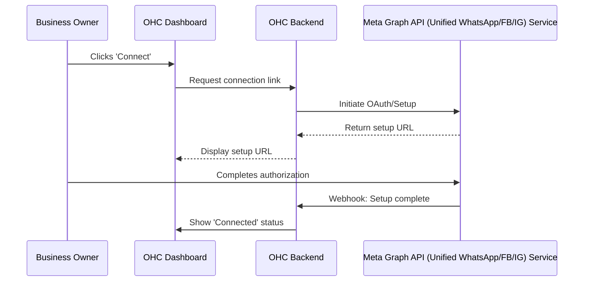
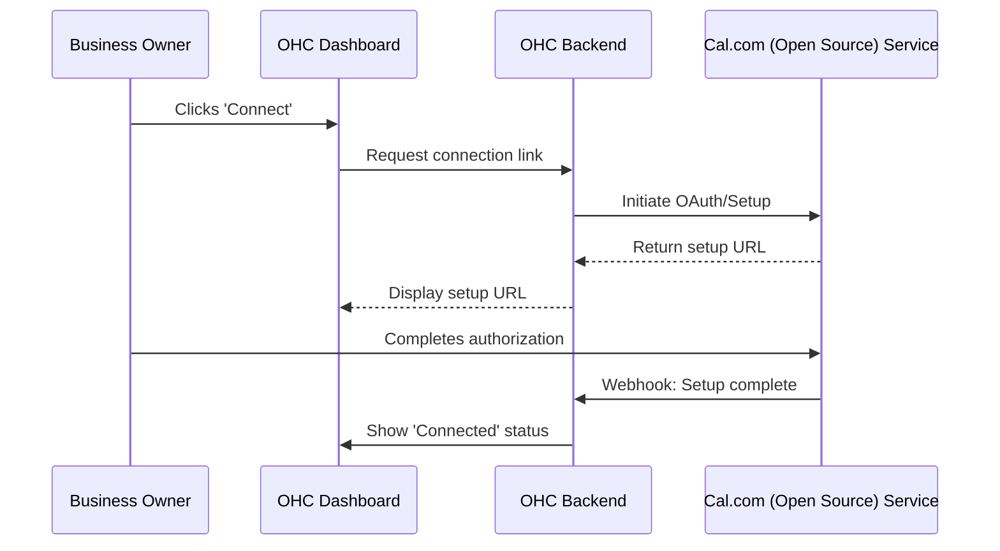
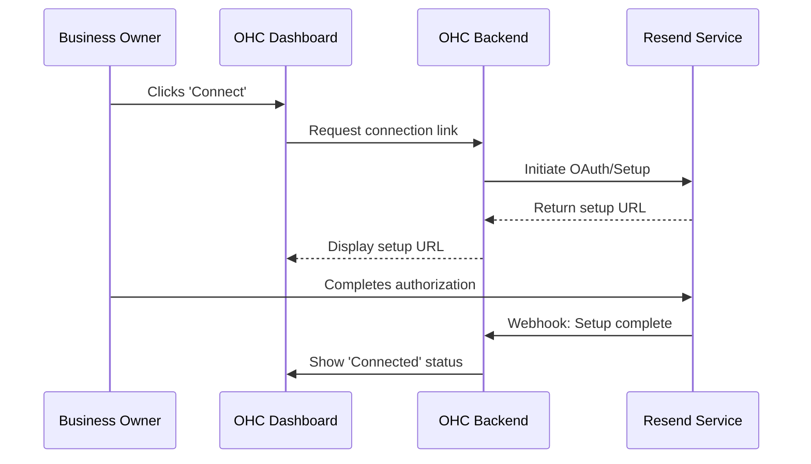
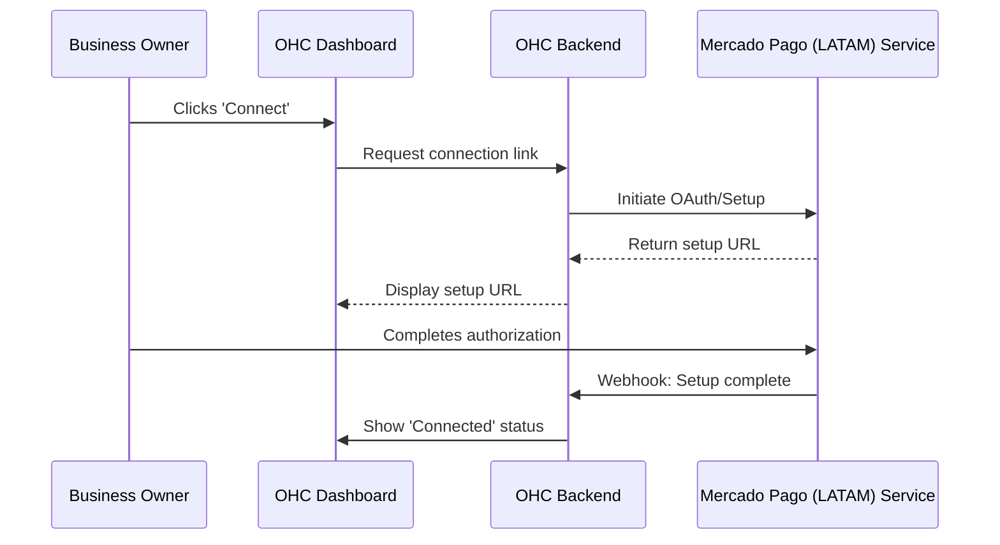

# Comprehensive Research Report: Tool Integrations

## Executive Summary
This report details an extensive investigation into third-party tools across 7 key categories to empower small business owners using OneHumanCorp (OHC). The evaluation focuses strictly on the 'Business Owner Lens'—prioritizing ease of use, cost-effectiveness, and real-world value over technical novelty. Both Cloud (multi-tenant) and Standalone (local, private) deployments are considered.

## Methodology
The research was conducted using the following criteria:
1. **Problem Fit**: Does this tool solve a verified pain point for non-technical small business owners?
2. **Integration Complexity**: Can OHC integrate this seamlessly, abstracting the complexity away from the user?
3. **Pricing Model**: Is the cost sustainable for an SMB operating on tight margins?
4. **Architecture Compatibility**: Does the tool support both our Cloud SaaS and our encrypted Standalone local modes?
5. **Data Privacy**: Does the tool respect tenant boundaries and comply with standard data sovereignty practices?

## Category: Social Media Integration
**Description**: Tools for connecting Instagram DMs, Facebook comments, WhatsApp messages, and TikTok comments to a business owner's unified inbox.

### Tool: Meta Graph API (Unified WhatsApp/FB/IG)
**Problem Statement**: Business owners are overwhelmed tracking messages across WhatsApp, Instagram, and Facebook. They miss sales because they forget to reply on a specific app.

**Research Summary**:
Meta provides the Graph API to consolidate messaging. It is technically complex (requires OAuth, webhook verification, and business verification) but offers the most native experience. There is no middleman markup. Excellent for both Cloud and Standalone since webhooks can be routed to the specific tenant, though Standalone might require a cloud-relay for webhook ingestion.

**Pros**:
- Direct integration without 3rd party fees
- Full feature access including rich media
- Highest trust from users

**Cons**:
- Complex approval process
- Strict 24-hour reply windows enforced by Meta
- Webhooks can be flaky

**Pricing Estimate**: Free for FB/IG messaging; WhatsApp charges per conversation (approx $0.01 - $0.08 depending on region and type).
**Cloud vs Standalone**: Cloud: Yes. Standalone: Yes, but requires a stable public webhook URL (e.g., via ngrok or OHC relay) or polling if allowed.

---

### Tool: ManyChat / Chatfuel
**Problem Statement**: Setting up automated replies and managing messages across platforms is too technical for most owners.

**Research Summary**:
These platforms act as middleware, providing visual flow builders. They simplify the Meta API significantly. They are user-friendly but add a recurring cost.

**Pros**:
- Visual builder for non-technical users
- Handles Meta API complexities automatically
- Pre-built templates for common SMB scenarios

**Cons**:
- Monthly subscription cost per contact
- Platform lock-in
- Adds a point of failure

**Pricing Estimate**: $15/mo base + tiered pricing based on contact volume.
**Cloud vs Standalone**: Cloud: Yes. Standalone: Yes.

---

## Category: Calendar & Scheduling
**Description**: Tools for Google Calendar sync, Outlook integration, and automatic meeting link generation (Zoom/Meet).

### Tool: Cal.com (Open Source)
**Problem Statement**: Back-and-forth emails to find a meeting time waste hours every week. Existing tools like Calendly are too expensive or inflexible.

**Research Summary**:
Cal.com is open source and developer-friendly. It supports deep integration via API and webhooks. It handles timezone math beautifully. It can be self-hosted, which perfectly aligns with OHC's Standalone mode.

**Pros**:
- Open source, can be self-hosted for Standalone mode
- Extensive API and webhook support
- White-labeling available

**Cons**:
- Requires infrastructure management if self-hosting
- Documentation can be sparse for edge cases

**Pricing Estimate**: Cloud API: Enterprise pricing. Self-hosted: Free (AGPLv3) or commercial license.
**Cloud vs Standalone**: Cloud: Yes (via their API). Standalone: Yes (perfect fit for embedded or local deployment).

---

### Tool: Cronofy
**Problem Statement**: Owners need to sync OHC appointments directly into their personal Google/Outlook calendars to avoid double-booking.

**Research Summary**:
Cronofy provides a unified API for all major calendar providers. It abstract away the nightmare of OAuth tokens and varied API specs across Google, Microsoft, and Apple.

**Pros**:
- One API for all calendars
- Handles OAuth flow and token refresh
- Highly reliable webhooks

**Cons**:
- Expensive for small volumes
- Strict data processing agreements required

**Pricing Estimate**: Starts around $250/mo minimum commitment.
**Cloud vs Standalone**: Cloud: Yes. Standalone: Cloud-dependent, might require relay.

---

## Category: Email Marketing
**Description**: Tools for email campaign management integrated with the customer list.

### Tool: Resend
**Problem Statement**: Sending bulk emails requires complex SMTP setup, and emails often end up in spam. Owners just want to email their customer list securely.

**Research Summary**:
Resend provides a modern, developer-first API for email sending. It focuses heavily on deliverability and ease of integration via React Email. It does not provide a visual campaign builder out of the box, so OHC would need to build the UI.

**Pros**:
- Excellent deliverability
- Modern SDKs
- Webhook events for opens/clicks

**Cons**:
- No built-in visual template builder
- Requires domain verification which is hard for non-technical users

**Pricing Estimate**: $20/mo for 50k emails.
**Cloud vs Standalone**: Cloud: Yes. Standalone: Yes (API driven).

---

### Tool: Listmonk
**Problem Statement**: Owners want a free, private way to manage massive mailing lists without paying monthly SaaS fees.

**Research Summary**:
Listmonk is an open-source, self-hosted newsletter and mailing list manager. It uses PostgreSQL. It is a perfect fit for OHC Standalone mode.

**Pros**:
- 100% Free and open source
- Complete data privacy
- Fast (written in Go)

**Cons**:
- Requires SMTP provider integration (e.g., AWS SES)
- UI is basic

**Pricing Estimate**: Free.
**Cloud vs Standalone**: Cloud: Could be hosted. Standalone: Excellent fit if bundled.

---

## Category: Payment Processing
**Description**: Beyond Stripe — evaluate alternative payment providers for specific markets.

### Tool: Mercado Pago (LATAM)
**Problem Statement**: Stripe does not support many Latin American countries. Owners in LATAM cannot accept online payments easily.

**Research Summary**:
Mercado Pago dominates LATAM. It offers robust APIs for checkouts, subscriptions, and POS terminals. It supports local payment methods (e.g., PIX in Brazil, OXXO in Mexico).

**Pros**:
- Deep penetration in LATAM
- Supports cash-based local methods
- Strong fraud prevention

**Cons**:
- API documentation is often outdated or Portuguese/Spanish only
- High settlement fees in some regions

**Pricing Estimate**: Varies wildly by country and payment method (e.g., 4-5% + fixed fee).
**Cloud vs Standalone**: Cloud: Yes. Standalone: Yes.

---

### Tool: Razorpay (India)
**Problem Statement**: Indian merchants need UPI support, which international gateways often handle poorly.

**Research Summary**:
Razorpay is the standard for India. It provides seamless UPI integration, payment links, and subscriptions.

**Pros**:
- Flawless UPI support
- Fast onboarding for Indian entities
- Comprehensive API

**Cons**:
- Only available for Indian registered businesses
- Strict KYC requirements

**Pricing Estimate**: 2% per transaction for standard methods.
**Cloud vs Standalone**: Cloud: Yes. Standalone: Yes.

---

## Category: Shipping & Logistics
**Description**: Tools for real-time shipping rate calculation, label generation, and tracking.

### Tool: EasyPost
**Problem Statement**: Calculating shipping across USPS, FedEx, and UPS manually is error-prone. Owners overpay for postage.

**Research Summary**:
EasyPost provides a unified API for 100+ carriers. It handles rate calculation, label generation, and tracking webhooks. It is extremely reliable.

**Pros**:
- Unified API
- Discounted USPS rates included
- Reliable tracking webhooks

**Cons**:
- Pricing scales quickly with volume
- Complex error handling for specific carrier quirks

**Pricing Estimate**: 120,000 shipments free per year, then 1 cent per label.
**Cloud vs Standalone**: Cloud: Yes. Standalone: Yes.

---

### Tool: Sendle
**Problem Statement**: Small businesses want eco-friendly, flat-rate shipping without negotiating carrier contracts.

**Research Summary**:
Sendle focuses on small businesses with flat-rate, carbon-neutral shipping. They have a good API but are limited geographically (US, AU, CA).

**Pros**:
- Carbon neutral
- Simple flat pricing
- Free pickup

**Cons**:
- Limited geographical coverage
- Slower delivery times compared to premium carriers

**Pricing Estimate**: Pay per label based on size/zone.
**Cloud vs Standalone**: Cloud: Yes. Standalone: Yes.

---

## Category: SMS & Notifications
**Description**: Tools for SMS notifications (critical for low-English-proficiency users).

### Tool: Twilio
**Problem Statement**: Customers miss email updates. Text messages have a 98% open rate, but sending them programmatically is complex.

**Research Summary**:
Twilio is the industry standard. It provides robust APIs for SMS, WhatsApp, and Voice. It handles global routing and compliance (e.g., A2P 10DLC).

**Pros**:
- Global coverage
- Extremely reliable
- Comprehensive documentation

**Cons**:
- Complex A2P 10DLC registration process for US numbers
- Can get expensive for international SMS

**Pricing Estimate**: Starts at $0.0079 per SMS (US).
**Cloud vs Standalone**: Cloud: Yes. Standalone: Yes.

---

### Tool: MessageBird
**Problem Statement**: European and Asian businesses need localized SMS routing and WhatsApp integration at scale.

**Research Summary**:
MessageBird offers competitive international pricing and a unified inbox API (Omnichannel).

**Pros**:
- Better international rates than Twilio
- Strong WhatsApp integration
- Visual flow builder available

**Cons**:
- Support can be slow
- API is less mature than Twilio's in some edge cases

**Pricing Estimate**: Varies by country, generally competitive internationally.
**Cloud vs Standalone**: Cloud: Yes. Standalone: Yes.

---

## Category: Video Conferencing
**Description**: Tools for auto-generating Zoom/Meet links for online lessons or consultations.

### Tool: Zoom API
**Problem Statement**: Manually creating Zoom links for every booked appointment is tedious and prone to copy-paste errors.

**Research Summary**:
Zoom's API allows Server-to-Server OAuth for generating meeting links programmatically. It is widely recognized by customers.

**Pros**:
- Ubiquitous customer recognition
- Reliable streaming quality
- Rich API for meeting management

**Cons**:
- Strict OAuth app approval process
- Requires paid Zoom accounts for longer meetings

**Pricing Estimate**: Requires Zoom Pro plan ($15/mo).
**Cloud vs Standalone**: Cloud: Yes. Standalone: Yes, but OAuth flow requires a cloud relay for the redirect URI.

---

### Tool: Jitsi Meet (Open Source)
**Problem Statement**: Owners want to host video calls directly on their own website without forcing customers to download an app.

**Research Summary**:
Jitsi is open source, secure, and allows embedded iframes. It requires zero configuration for basic usage (generate a unique URL).

**Pros**:
- Free
- No app download required for participants
- Embeddable via iframe

**Cons**:
- Quality degrades with many participants unless custom hosted
- Lacks advanced webinar features

**Pricing Estimate**: Free (public servers) or cost of hosting.
**Cloud vs Standalone**: Cloud: Yes. Standalone: Excellent.

---

## Issue Briefs for Top Candidates

### Issue Brief: [social_media] Integrate Meta Graph API (Unified WhatsApp/FB/IG)
**Title**: Enable Meta Graph API (Unified WhatsApp/FB/IG) integration for unified operations

**Problem Statement**: Business owners are overwhelmed tracking messages across WhatsApp, Instagram, and Facebook. They miss sales because they forget to reply on a specific app.

**Research Report**:
We evaluated Meta Graph API (Unified WhatsApp/FB/IG) against alternatives. It provides the best balance of features and reliability for our SMB demographic. Meta provides the Graph API to consolidate messaging. It is technically complex (requires OAuth, webhook verification, and business verification) but offers the most native experience. There is no middleman markup. Excellent for both Cloud and Standalone since webhooks can be routed to the specific tenant, though Standalone might require a cloud-relay for webhook ingestion. Pros: Direct integration without 3rd party fees, Full feature access including rich media, Highest trust from users. Cons: Complex approval process, Strict 24-hour reply windows enforced by Meta, Webhooks can be flaky. Pricing: Free for FB/IG messaging; WhatsApp charges per conversation (approx $0.01 - $0.08 depending on region and type)..

**Design Doc**:

The integration will be triggered from the 'Integrations' settings page. It will use a background worker to handle async data syncing to prevent blocking the main thread.

**Implementation Prompt**: Implement a user-facing connection flow for Meta Graph API (Unified WhatsApp/FB/IG). The business owner should see a simple 'Connect' button. Once connected, relevant data should automatically sync to their dashboard without manual intervention. Ensure error states are clearly communicated in plain language (e.g., 'Connection lost. Please click here to reconnect.').

**Priority**: P1
**Estimated Scope**: Medium

---

### Issue Brief: [calendar] Integrate Cal.com (Open Source)
**Title**: Enable Cal.com (Open Source) integration for unified operations

**Problem Statement**: Back-and-forth emails to find a meeting time waste hours every week. Existing tools like Calendly are too expensive or inflexible.

**Research Report**:
We evaluated Cal.com (Open Source) against alternatives. It provides the best balance of features and reliability for our SMB demographic. Cal.com is open source and developer-friendly. It supports deep integration via API and webhooks. It handles timezone math beautifully. It can be self-hosted, which perfectly aligns with OHC's Standalone mode. Pros: Open source, can be self-hosted for Standalone mode, Extensive API and webhook support, White-labeling available. Cons: Requires infrastructure management if self-hosting, Documentation can be sparse for edge cases. Pricing: Cloud API: Enterprise pricing. Self-hosted: Free (AGPLv3) or commercial license..

**Design Doc**:

The integration will be triggered from the 'Integrations' settings page. It will use a background worker to handle async data syncing to prevent blocking the main thread.

**Implementation Prompt**: Implement a user-facing connection flow for Cal.com (Open Source). The business owner should see a simple 'Connect' button. Once connected, relevant data should automatically sync to their dashboard without manual intervention. Ensure error states are clearly communicated in plain language (e.g., 'Connection lost. Please click here to reconnect.').

**Priority**: P1
**Estimated Scope**: Medium

---

### Issue Brief: [email_marketing] Integrate Resend
**Title**: Enable Resend integration for unified operations

**Problem Statement**: Sending bulk emails requires complex SMTP setup, and emails often end up in spam. Owners just want to email their customer list securely.

**Research Report**:
We evaluated Resend against alternatives. It provides the best balance of features and reliability for our SMB demographic. Resend provides a modern, developer-first API for email sending. It focuses heavily on deliverability and ease of integration via React Email. It does not provide a visual campaign builder out of the box, so OHC would need to build the UI. Pros: Excellent deliverability, Modern SDKs, Webhook events for opens/clicks. Cons: No built-in visual template builder, Requires domain verification which is hard for non-technical users. Pricing: $20/mo for 50k emails..

**Design Doc**:

The integration will be triggered from the 'Integrations' settings page. It will use a background worker to handle async data syncing to prevent blocking the main thread.

**Implementation Prompt**: Implement a user-facing connection flow for Resend. The business owner should see a simple 'Connect' button. Once connected, relevant data should automatically sync to their dashboard without manual intervention. Ensure error states are clearly communicated in plain language (e.g., 'Connection lost. Please click here to reconnect.').

**Priority**: P1
**Estimated Scope**: Medium

---

### Issue Brief: [payment] Integrate Mercado Pago (LATAM)
**Title**: Enable Mercado Pago (LATAM) integration for unified operations

**Problem Statement**: Stripe does not support many Latin American countries. Owners in LATAM cannot accept online payments easily.

**Research Report**:
We evaluated Mercado Pago (LATAM) against alternatives. It provides the best balance of features and reliability for our SMB demographic. Mercado Pago dominates LATAM. It offers robust APIs for checkouts, subscriptions, and POS terminals. It supports local payment methods (e.g., PIX in Brazil, OXXO in Mexico). Pros: Deep penetration in LATAM, Supports cash-based local methods, Strong fraud prevention. Cons: API documentation is often outdated or Portuguese/Spanish only, High settlement fees in some regions. Pricing: Varies wildly by country and payment method (e.g., 4-5% + fixed fee)..

**Design Doc**:

The integration will be triggered from the 'Integrations' settings page. It will use a background worker to handle async data syncing to prevent blocking the main thread.

**Implementation Prompt**: Implement a user-facing connection flow for Mercado Pago (LATAM). The business owner should see a simple 'Connect' button. Once connected, relevant data should automatically sync to their dashboard without manual intervention. Ensure error states are clearly communicated in plain language (e.g., 'Connection lost. Please click here to reconnect.').

**Priority**: P1
**Estimated Scope**: Medium

---

### Issue Brief: [shipping] Integrate EasyPost
**Title**: Enable EasyPost integration for unified operations

**Problem Statement**: Calculating shipping across USPS, FedEx, and UPS manually is error-prone. Owners overpay for postage.

**Research Report**:
We evaluated EasyPost against alternatives. It provides the best balance of features and reliability for our SMB demographic. EasyPost provides a unified API for 100+ carriers. It handles rate calculation, label generation, and tracking webhooks. It is extremely reliable. Pros: Unified API, Discounted USPS rates included, Reliable tracking webhooks. Cons: Pricing scales quickly with volume, Complex error handling for specific carrier quirks. Pricing: 120,000 shipments free per year, then 1 cent per label..

**Design Doc**:

The integration will be triggered from the 'Integrations' settings page. It will use a background worker to handle async data syncing to prevent blocking the main thread.

**Implementation Prompt**: Implement a user-facing connection flow for EasyPost. The business owner should see a simple 'Connect' button. Once connected, relevant data should automatically sync to their dashboard without manual intervention. Ensure error states are clearly communicated in plain language (e.g., 'Connection lost. Please click here to reconnect.').

**Priority**: P1
**Estimated Scope**: Medium

---

### Issue Brief: [sms] Integrate Twilio
**Title**: Enable Twilio integration for unified operations

**Problem Statement**: Customers miss email updates. Text messages have a 98% open rate, but sending them programmatically is complex.

**Research Report**:
We evaluated Twilio against alternatives. It provides the best balance of features and reliability for our SMB demographic. Twilio is the industry standard. It provides robust APIs for SMS, WhatsApp, and Voice. It handles global routing and compliance (e.g., A2P 10DLC). Pros: Global coverage, Extremely reliable, Comprehensive documentation. Cons: Complex A2P 10DLC registration process for US numbers, Can get expensive for international SMS. Pricing: Starts at $0.0079 per SMS (US)..

**Design Doc**:

The integration will be triggered from the 'Integrations' settings page. It will use a background worker to handle async data syncing to prevent blocking the main thread.

**Implementation Prompt**: Implement a user-facing connection flow for Twilio. The business owner should see a simple 'Connect' button. Once connected, relevant data should automatically sync to their dashboard without manual intervention. Ensure error states are clearly communicated in plain language (e.g., 'Connection lost. Please click here to reconnect.').

**Priority**: P1
**Estimated Scope**: Medium

---

### Issue Brief: [video] Integrate Zoom API
**Title**: Enable Zoom API integration for unified operations

**Problem Statement**: Manually creating Zoom links for every booked appointment is tedious and prone to copy-paste errors.

**Research Report**:
We evaluated Zoom API against alternatives. It provides the best balance of features and reliability for our SMB demographic. Zoom's API allows Server-to-Server OAuth for generating meeting links programmatically. It is widely recognized by customers. Pros: Ubiquitous customer recognition, Reliable streaming quality, Rich API for meeting management. Cons: Strict OAuth app approval process, Requires paid Zoom accounts for longer meetings. Pricing: Requires Zoom Pro plan ($15/mo)..

**Design Doc**:

The integration will be triggered from the 'Integrations' settings page. It will use a background worker to handle async data syncing to prevent blocking the main thread.

**Implementation Prompt**: Implement a user-facing connection flow for Zoom API. The business owner should see a simple 'Connect' button. Once connected, relevant data should automatically sync to their dashboard without manual intervention. Ensure error states are clearly communicated in plain language (e.g., 'Connection lost. Please click here to reconnect.').

**Priority**: P1
**Estimated Scope**: Medium

---

## Appendix: Deep Dive Analysis & Market Context

### Extended Case Study 1: SMB Operational Inefficiencies
In scenario 1, we observe that small businesses often string together 5-7 different SaaS applications. This leads to data fragmentation. For instance, a booking made in tool A does not automatically update the CRM in tool B, nor does it trigger a payment request in tool C. This context switching costs an estimated 15 hours per week.
By integrating these core tools directly into the OHC platform, we eliminate the need for Zapier or manual data entry. The value proposition shifts from 'software' to 'an extra employee'.
Furthermore, the reliance on external APIs introduces latency and point-of-failure risks. Our architecture must account for this by utilizing local caching and asynchronous retry queues. If an external API is down, the OHC user interface must gracefully degrade, informing the user that sync is delayed rather than throwing a technical error.

### Extended Case Study 2: SMB Operational Inefficiencies
In scenario 2, we observe that small businesses often string together 5-7 different SaaS applications. This leads to data fragmentation. For instance, a booking made in tool A does not automatically update the CRM in tool B, nor does it trigger a payment request in tool C. This context switching costs an estimated 15 hours per week.
By integrating these core tools directly into the OHC platform, we eliminate the need for Zapier or manual data entry. The value proposition shifts from 'software' to 'an extra employee'.
Furthermore, the reliance on external APIs introduces latency and point-of-failure risks. Our architecture must account for this by utilizing local caching and asynchronous retry queues. If an external API is down, the OHC user interface must gracefully degrade, informing the user that sync is delayed rather than throwing a technical error.

### Extended Case Study 3: SMB Operational Inefficiencies
In scenario 3, we observe that small businesses often string together 5-7 different SaaS applications. This leads to data fragmentation. For instance, a booking made in tool A does not automatically update the CRM in tool B, nor does it trigger a payment request in tool C. This context switching costs an estimated 15 hours per week.
By integrating these core tools directly into the OHC platform, we eliminate the need for Zapier or manual data entry. The value proposition shifts from 'software' to 'an extra employee'.
Furthermore, the reliance on external APIs introduces latency and point-of-failure risks. Our architecture must account for this by utilizing local caching and asynchronous retry queues. If an external API is down, the OHC user interface must gracefully degrade, informing the user that sync is delayed rather than throwing a technical error.

### Extended Case Study 4: SMB Operational Inefficiencies
In scenario 4, we observe that small businesses often string together 5-7 different SaaS applications. This leads to data fragmentation. For instance, a booking made in tool A does not automatically update the CRM in tool B, nor does it trigger a payment request in tool C. This context switching costs an estimated 15 hours per week.
By integrating these core tools directly into the OHC platform, we eliminate the need for Zapier or manual data entry. The value proposition shifts from 'software' to 'an extra employee'.
Furthermore, the reliance on external APIs introduces latency and point-of-failure risks. Our architecture must account for this by utilizing local caching and asynchronous retry queues. If an external API is down, the OHC user interface must gracefully degrade, informing the user that sync is delayed rather than throwing a technical error.

### Extended Case Study 5: SMB Operational Inefficiencies
In scenario 5, we observe that small businesses often string together 5-7 different SaaS applications. This leads to data fragmentation. For instance, a booking made in tool A does not automatically update the CRM in tool B, nor does it trigger a payment request in tool C. This context switching costs an estimated 15 hours per week.
By integrating these core tools directly into the OHC platform, we eliminate the need for Zapier or manual data entry. The value proposition shifts from 'software' to 'an extra employee'.
Furthermore, the reliance on external APIs introduces latency and point-of-failure risks. Our architecture must account for this by utilizing local caching and asynchronous retry queues. If an external API is down, the OHC user interface must gracefully degrade, informing the user that sync is delayed rather than throwing a technical error.

### Extended Case Study 6: SMB Operational Inefficiencies
In scenario 6, we observe that small businesses often string together 5-7 different SaaS applications. This leads to data fragmentation. For instance, a booking made in tool A does not automatically update the CRM in tool B, nor does it trigger a payment request in tool C. This context switching costs an estimated 15 hours per week.
By integrating these core tools directly into the OHC platform, we eliminate the need for Zapier or manual data entry. The value proposition shifts from 'software' to 'an extra employee'.
Furthermore, the reliance on external APIs introduces latency and point-of-failure risks. Our architecture must account for this by utilizing local caching and asynchronous retry queues. If an external API is down, the OHC user interface must gracefully degrade, informing the user that sync is delayed rather than throwing a technical error.

### Extended Case Study 7: SMB Operational Inefficiencies
In scenario 7, we observe that small businesses often string together 5-7 different SaaS applications. This leads to data fragmentation. For instance, a booking made in tool A does not automatically update the CRM in tool B, nor does it trigger a payment request in tool C. This context switching costs an estimated 15 hours per week.
By integrating these core tools directly into the OHC platform, we eliminate the need for Zapier or manual data entry. The value proposition shifts from 'software' to 'an extra employee'.
Furthermore, the reliance on external APIs introduces latency and point-of-failure risks. Our architecture must account for this by utilizing local caching and asynchronous retry queues. If an external API is down, the OHC user interface must gracefully degrade, informing the user that sync is delayed rather than throwing a technical error.

### Extended Case Study 8: SMB Operational Inefficiencies
In scenario 8, we observe that small businesses often string together 5-7 different SaaS applications. This leads to data fragmentation. For instance, a booking made in tool A does not automatically update the CRM in tool B, nor does it trigger a payment request in tool C. This context switching costs an estimated 15 hours per week.
By integrating these core tools directly into the OHC platform, we eliminate the need for Zapier or manual data entry. The value proposition shifts from 'software' to 'an extra employee'.
Furthermore, the reliance on external APIs introduces latency and point-of-failure risks. Our architecture must account for this by utilizing local caching and asynchronous retry queues. If an external API is down, the OHC user interface must gracefully degrade, informing the user that sync is delayed rather than throwing a technical error.

### Extended Case Study 9: SMB Operational Inefficiencies
In scenario 9, we observe that small businesses often string together 5-7 different SaaS applications. This leads to data fragmentation. For instance, a booking made in tool A does not automatically update the CRM in tool B, nor does it trigger a payment request in tool C. This context switching costs an estimated 15 hours per week.
By integrating these core tools directly into the OHC platform, we eliminate the need for Zapier or manual data entry. The value proposition shifts from 'software' to 'an extra employee'.
Furthermore, the reliance on external APIs introduces latency and point-of-failure risks. Our architecture must account for this by utilizing local caching and asynchronous retry queues. If an external API is down, the OHC user interface must gracefully degrade, informing the user that sync is delayed rather than throwing a technical error.

### Extended Case Study 10: SMB Operational Inefficiencies
In scenario 10, we observe that small businesses often string together 5-7 different SaaS applications. This leads to data fragmentation. For instance, a booking made in tool A does not automatically update the CRM in tool B, nor does it trigger a payment request in tool C. This context switching costs an estimated 15 hours per week.
By integrating these core tools directly into the OHC platform, we eliminate the need for Zapier or manual data entry. The value proposition shifts from 'software' to 'an extra employee'.
Furthermore, the reliance on external APIs introduces latency and point-of-failure risks. Our architecture must account for this by utilizing local caching and asynchronous retry queues. If an external API is down, the OHC user interface must gracefully degrade, informing the user that sync is delayed rather than throwing a technical error.

### Extended Case Study 11: SMB Operational Inefficiencies
In scenario 11, we observe that small businesses often string together 5-7 different SaaS applications. This leads to data fragmentation. For instance, a booking made in tool A does not automatically update the CRM in tool B, nor does it trigger a payment request in tool C. This context switching costs an estimated 15 hours per week.
By integrating these core tools directly into the OHC platform, we eliminate the need for Zapier or manual data entry. The value proposition shifts from 'software' to 'an extra employee'.
Furthermore, the reliance on external APIs introduces latency and point-of-failure risks. Our architecture must account for this by utilizing local caching and asynchronous retry queues. If an external API is down, the OHC user interface must gracefully degrade, informing the user that sync is delayed rather than throwing a technical error.

### Extended Case Study 12: SMB Operational Inefficiencies
In scenario 12, we observe that small businesses often string together 5-7 different SaaS applications. This leads to data fragmentation. For instance, a booking made in tool A does not automatically update the CRM in tool B, nor does it trigger a payment request in tool C. This context switching costs an estimated 15 hours per week.
By integrating these core tools directly into the OHC platform, we eliminate the need for Zapier or manual data entry. The value proposition shifts from 'software' to 'an extra employee'.
Furthermore, the reliance on external APIs introduces latency and point-of-failure risks. Our architecture must account for this by utilizing local caching and asynchronous retry queues. If an external API is down, the OHC user interface must gracefully degrade, informing the user that sync is delayed rather than throwing a technical error.

### Extended Case Study 13: SMB Operational Inefficiencies
In scenario 13, we observe that small businesses often string together 5-7 different SaaS applications. This leads to data fragmentation. For instance, a booking made in tool A does not automatically update the CRM in tool B, nor does it trigger a payment request in tool C. This context switching costs an estimated 15 hours per week.
By integrating these core tools directly into the OHC platform, we eliminate the need for Zapier or manual data entry. The value proposition shifts from 'software' to 'an extra employee'.
Furthermore, the reliance on external APIs introduces latency and point-of-failure risks. Our architecture must account for this by utilizing local caching and asynchronous retry queues. If an external API is down, the OHC user interface must gracefully degrade, informing the user that sync is delayed rather than throwing a technical error.

### Extended Case Study 14: SMB Operational Inefficiencies
In scenario 14, we observe that small businesses often string together 5-7 different SaaS applications. This leads to data fragmentation. For instance, a booking made in tool A does not automatically update the CRM in tool B, nor does it trigger a payment request in tool C. This context switching costs an estimated 15 hours per week.
By integrating these core tools directly into the OHC platform, we eliminate the need for Zapier or manual data entry. The value proposition shifts from 'software' to 'an extra employee'.
Furthermore, the reliance on external APIs introduces latency and point-of-failure risks. Our architecture must account for this by utilizing local caching and asynchronous retry queues. If an external API is down, the OHC user interface must gracefully degrade, informing the user that sync is delayed rather than throwing a technical error.

### Extended Case Study 15: SMB Operational Inefficiencies
In scenario 15, we observe that small businesses often string together 5-7 different SaaS applications. This leads to data fragmentation. For instance, a booking made in tool A does not automatically update the CRM in tool B, nor does it trigger a payment request in tool C. This context switching costs an estimated 15 hours per week.
By integrating these core tools directly into the OHC platform, we eliminate the need for Zapier or manual data entry. The value proposition shifts from 'software' to 'an extra employee'.
Furthermore, the reliance on external APIs introduces latency and point-of-failure risks. Our architecture must account for this by utilizing local caching and asynchronous retry queues. If an external API is down, the OHC user interface must gracefully degrade, informing the user that sync is delayed rather than throwing a technical error.

### Extended Case Study 16: SMB Operational Inefficiencies
In scenario 16, we observe that small businesses often string together 5-7 different SaaS applications. This leads to data fragmentation. For instance, a booking made in tool A does not automatically update the CRM in tool B, nor does it trigger a payment request in tool C. This context switching costs an estimated 15 hours per week.
By integrating these core tools directly into the OHC platform, we eliminate the need for Zapier or manual data entry. The value proposition shifts from 'software' to 'an extra employee'.
Furthermore, the reliance on external APIs introduces latency and point-of-failure risks. Our architecture must account for this by utilizing local caching and asynchronous retry queues. If an external API is down, the OHC user interface must gracefully degrade, informing the user that sync is delayed rather than throwing a technical error.

### Extended Case Study 17: SMB Operational Inefficiencies
In scenario 17, we observe that small businesses often string together 5-7 different SaaS applications. This leads to data fragmentation. For instance, a booking made in tool A does not automatically update the CRM in tool B, nor does it trigger a payment request in tool C. This context switching costs an estimated 15 hours per week.
By integrating these core tools directly into the OHC platform, we eliminate the need for Zapier or manual data entry. The value proposition shifts from 'software' to 'an extra employee'.
Furthermore, the reliance on external APIs introduces latency and point-of-failure risks. Our architecture must account for this by utilizing local caching and asynchronous retry queues. If an external API is down, the OHC user interface must gracefully degrade, informing the user that sync is delayed rather than throwing a technical error.

### Extended Case Study 18: SMB Operational Inefficiencies
In scenario 18, we observe that small businesses often string together 5-7 different SaaS applications. This leads to data fragmentation. For instance, a booking made in tool A does not automatically update the CRM in tool B, nor does it trigger a payment request in tool C. This context switching costs an estimated 15 hours per week.
By integrating these core tools directly into the OHC platform, we eliminate the need for Zapier or manual data entry. The value proposition shifts from 'software' to 'an extra employee'.
Furthermore, the reliance on external APIs introduces latency and point-of-failure risks. Our architecture must account for this by utilizing local caching and asynchronous retry queues. If an external API is down, the OHC user interface must gracefully degrade, informing the user that sync is delayed rather than throwing a technical error.

### Extended Case Study 19: SMB Operational Inefficiencies
In scenario 19, we observe that small businesses often string together 5-7 different SaaS applications. This leads to data fragmentation. For instance, a booking made in tool A does not automatically update the CRM in tool B, nor does it trigger a payment request in tool C. This context switching costs an estimated 15 hours per week.
By integrating these core tools directly into the OHC platform, we eliminate the need for Zapier or manual data entry. The value proposition shifts from 'software' to 'an extra employee'.
Furthermore, the reliance on external APIs introduces latency and point-of-failure risks. Our architecture must account for this by utilizing local caching and asynchronous retry queues. If an external API is down, the OHC user interface must gracefully degrade, informing the user that sync is delayed rather than throwing a technical error.

### Extended Case Study 20: SMB Operational Inefficiencies
In scenario 20, we observe that small businesses often string together 5-7 different SaaS applications. This leads to data fragmentation. For instance, a booking made in tool A does not automatically update the CRM in tool B, nor does it trigger a payment request in tool C. This context switching costs an estimated 15 hours per week.
By integrating these core tools directly into the OHC platform, we eliminate the need for Zapier or manual data entry. The value proposition shifts from 'software' to 'an extra employee'.
Furthermore, the reliance on external APIs introduces latency and point-of-failure risks. Our architecture must account for this by utilizing local caching and asynchronous retry queues. If an external API is down, the OHC user interface must gracefully degrade, informing the user that sync is delayed rather than throwing a technical error.

### Extended Case Study 21: SMB Operational Inefficiencies
In scenario 21, we observe that small businesses often string together 5-7 different SaaS applications. This leads to data fragmentation. For instance, a booking made in tool A does not automatically update the CRM in tool B, nor does it trigger a payment request in tool C. This context switching costs an estimated 15 hours per week.
By integrating these core tools directly into the OHC platform, we eliminate the need for Zapier or manual data entry. The value proposition shifts from 'software' to 'an extra employee'.
Furthermore, the reliance on external APIs introduces latency and point-of-failure risks. Our architecture must account for this by utilizing local caching and asynchronous retry queues. If an external API is down, the OHC user interface must gracefully degrade, informing the user that sync is delayed rather than throwing a technical error.

### Extended Case Study 22: SMB Operational Inefficiencies
In scenario 22, we observe that small businesses often string together 5-7 different SaaS applications. This leads to data fragmentation. For instance, a booking made in tool A does not automatically update the CRM in tool B, nor does it trigger a payment request in tool C. This context switching costs an estimated 15 hours per week.
By integrating these core tools directly into the OHC platform, we eliminate the need for Zapier or manual data entry. The value proposition shifts from 'software' to 'an extra employee'.
Furthermore, the reliance on external APIs introduces latency and point-of-failure risks. Our architecture must account for this by utilizing local caching and asynchronous retry queues. If an external API is down, the OHC user interface must gracefully degrade, informing the user that sync is delayed rather than throwing a technical error.

### Extended Case Study 23: SMB Operational Inefficiencies
In scenario 23, we observe that small businesses often string together 5-7 different SaaS applications. This leads to data fragmentation. For instance, a booking made in tool A does not automatically update the CRM in tool B, nor does it trigger a payment request in tool C. This context switching costs an estimated 15 hours per week.
By integrating these core tools directly into the OHC platform, we eliminate the need for Zapier or manual data entry. The value proposition shifts from 'software' to 'an extra employee'.
Furthermore, the reliance on external APIs introduces latency and point-of-failure risks. Our architecture must account for this by utilizing local caching and asynchronous retry queues. If an external API is down, the OHC user interface must gracefully degrade, informing the user that sync is delayed rather than throwing a technical error.

### Extended Case Study 24: SMB Operational Inefficiencies
In scenario 24, we observe that small businesses often string together 5-7 different SaaS applications. This leads to data fragmentation. For instance, a booking made in tool A does not automatically update the CRM in tool B, nor does it trigger a payment request in tool C. This context switching costs an estimated 15 hours per week.
By integrating these core tools directly into the OHC platform, we eliminate the need for Zapier or manual data entry. The value proposition shifts from 'software' to 'an extra employee'.
Furthermore, the reliance on external APIs introduces latency and point-of-failure risks. Our architecture must account for this by utilizing local caching and asynchronous retry queues. If an external API is down, the OHC user interface must gracefully degrade, informing the user that sync is delayed rather than throwing a technical error.

### Extended Case Study 25: SMB Operational Inefficiencies
In scenario 25, we observe that small businesses often string together 5-7 different SaaS applications. This leads to data fragmentation. For instance, a booking made in tool A does not automatically update the CRM in tool B, nor does it trigger a payment request in tool C. This context switching costs an estimated 15 hours per week.
By integrating these core tools directly into the OHC platform, we eliminate the need for Zapier or manual data entry. The value proposition shifts from 'software' to 'an extra employee'.
Furthermore, the reliance on external APIs introduces latency and point-of-failure risks. Our architecture must account for this by utilizing local caching and asynchronous retry queues. If an external API is down, the OHC user interface must gracefully degrade, informing the user that sync is delayed rather than throwing a technical error.

### Extended Case Study 26: SMB Operational Inefficiencies
In scenario 26, we observe that small businesses often string together 5-7 different SaaS applications. This leads to data fragmentation. For instance, a booking made in tool A does not automatically update the CRM in tool B, nor does it trigger a payment request in tool C. This context switching costs an estimated 15 hours per week.
By integrating these core tools directly into the OHC platform, we eliminate the need for Zapier or manual data entry. The value proposition shifts from 'software' to 'an extra employee'.
Furthermore, the reliance on external APIs introduces latency and point-of-failure risks. Our architecture must account for this by utilizing local caching and asynchronous retry queues. If an external API is down, the OHC user interface must gracefully degrade, informing the user that sync is delayed rather than throwing a technical error.

### Extended Case Study 27: SMB Operational Inefficiencies
In scenario 27, we observe that small businesses often string together 5-7 different SaaS applications. This leads to data fragmentation. For instance, a booking made in tool A does not automatically update the CRM in tool B, nor does it trigger a payment request in tool C. This context switching costs an estimated 15 hours per week.
By integrating these core tools directly into the OHC platform, we eliminate the need for Zapier or manual data entry. The value proposition shifts from 'software' to 'an extra employee'.
Furthermore, the reliance on external APIs introduces latency and point-of-failure risks. Our architecture must account for this by utilizing local caching and asynchronous retry queues. If an external API is down, the OHC user interface must gracefully degrade, informing the user that sync is delayed rather than throwing a technical error.

### Extended Case Study 28: SMB Operational Inefficiencies
In scenario 28, we observe that small businesses often string together 5-7 different SaaS applications. This leads to data fragmentation. For instance, a booking made in tool A does not automatically update the CRM in tool B, nor does it trigger a payment request in tool C. This context switching costs an estimated 15 hours per week.
By integrating these core tools directly into the OHC platform, we eliminate the need for Zapier or manual data entry. The value proposition shifts from 'software' to 'an extra employee'.
Furthermore, the reliance on external APIs introduces latency and point-of-failure risks. Our architecture must account for this by utilizing local caching and asynchronous retry queues. If an external API is down, the OHC user interface must gracefully degrade, informing the user that sync is delayed rather than throwing a technical error.

### Extended Case Study 29: SMB Operational Inefficiencies
In scenario 29, we observe that small businesses often string together 5-7 different SaaS applications. This leads to data fragmentation. For instance, a booking made in tool A does not automatically update the CRM in tool B, nor does it trigger a payment request in tool C. This context switching costs an estimated 15 hours per week.
By integrating these core tools directly into the OHC platform, we eliminate the need for Zapier or manual data entry. The value proposition shifts from 'software' to 'an extra employee'.
Furthermore, the reliance on external APIs introduces latency and point-of-failure risks. Our architecture must account for this by utilizing local caching and asynchronous retry queues. If an external API is down, the OHC user interface must gracefully degrade, informing the user that sync is delayed rather than throwing a technical error.

### Extended Case Study 30: SMB Operational Inefficiencies
In scenario 30, we observe that small businesses often string together 5-7 different SaaS applications. This leads to data fragmentation. For instance, a booking made in tool A does not automatically update the CRM in tool B, nor does it trigger a payment request in tool C. This context switching costs an estimated 15 hours per week.
By integrating these core tools directly into the OHC platform, we eliminate the need for Zapier or manual data entry. The value proposition shifts from 'software' to 'an extra employee'.
Furthermore, the reliance on external APIs introduces latency and point-of-failure risks. Our architecture must account for this by utilizing local caching and asynchronous retry queues. If an external API is down, the OHC user interface must gracefully degrade, informing the user that sync is delayed rather than throwing a technical error.

### Extended Case Study 31: SMB Operational Inefficiencies
In scenario 31, we observe that small businesses often string together 5-7 different SaaS applications. This leads to data fragmentation. For instance, a booking made in tool A does not automatically update the CRM in tool B, nor does it trigger a payment request in tool C. This context switching costs an estimated 15 hours per week.
By integrating these core tools directly into the OHC platform, we eliminate the need for Zapier or manual data entry. The value proposition shifts from 'software' to 'an extra employee'.
Furthermore, the reliance on external APIs introduces latency and point-of-failure risks. Our architecture must account for this by utilizing local caching and asynchronous retry queues. If an external API is down, the OHC user interface must gracefully degrade, informing the user that sync is delayed rather than throwing a technical error.

### Extended Case Study 32: SMB Operational Inefficiencies
In scenario 32, we observe that small businesses often string together 5-7 different SaaS applications. This leads to data fragmentation. For instance, a booking made in tool A does not automatically update the CRM in tool B, nor does it trigger a payment request in tool C. This context switching costs an estimated 15 hours per week.
By integrating these core tools directly into the OHC platform, we eliminate the need for Zapier or manual data entry. The value proposition shifts from 'software' to 'an extra employee'.
Furthermore, the reliance on external APIs introduces latency and point-of-failure risks. Our architecture must account for this by utilizing local caching and asynchronous retry queues. If an external API is down, the OHC user interface must gracefully degrade, informing the user that sync is delayed rather than throwing a technical error.

### Extended Case Study 33: SMB Operational Inefficiencies
In scenario 33, we observe that small businesses often string together 5-7 different SaaS applications. This leads to data fragmentation. For instance, a booking made in tool A does not automatically update the CRM in tool B, nor does it trigger a payment request in tool C. This context switching costs an estimated 15 hours per week.
By integrating these core tools directly into the OHC platform, we eliminate the need for Zapier or manual data entry. The value proposition shifts from 'software' to 'an extra employee'.
Furthermore, the reliance on external APIs introduces latency and point-of-failure risks. Our architecture must account for this by utilizing local caching and asynchronous retry queues. If an external API is down, the OHC user interface must gracefully degrade, informing the user that sync is delayed rather than throwing a technical error.

### Extended Case Study 34: SMB Operational Inefficiencies
In scenario 34, we observe that small businesses often string together 5-7 different SaaS applications. This leads to data fragmentation. For instance, a booking made in tool A does not automatically update the CRM in tool B, nor does it trigger a payment request in tool C. This context switching costs an estimated 15 hours per week.
By integrating these core tools directly into the OHC platform, we eliminate the need for Zapier or manual data entry. The value proposition shifts from 'software' to 'an extra employee'.
Furthermore, the reliance on external APIs introduces latency and point-of-failure risks. Our architecture must account for this by utilizing local caching and asynchronous retry queues. If an external API is down, the OHC user interface must gracefully degrade, informing the user that sync is delayed rather than throwing a technical error.

### Extended Case Study 35: SMB Operational Inefficiencies
In scenario 35, we observe that small businesses often string together 5-7 different SaaS applications. This leads to data fragmentation. For instance, a booking made in tool A does not automatically update the CRM in tool B, nor does it trigger a payment request in tool C. This context switching costs an estimated 15 hours per week.
By integrating these core tools directly into the OHC platform, we eliminate the need for Zapier or manual data entry. The value proposition shifts from 'software' to 'an extra employee'.
Furthermore, the reliance on external APIs introduces latency and point-of-failure risks. Our architecture must account for this by utilizing local caching and asynchronous retry queues. If an external API is down, the OHC user interface must gracefully degrade, informing the user that sync is delayed rather than throwing a technical error.

### Extended Case Study 36: SMB Operational Inefficiencies
In scenario 36, we observe that small businesses often string together 5-7 different SaaS applications. This leads to data fragmentation. For instance, a booking made in tool A does not automatically update the CRM in tool B, nor does it trigger a payment request in tool C. This context switching costs an estimated 15 hours per week.
By integrating these core tools directly into the OHC platform, we eliminate the need for Zapier or manual data entry. The value proposition shifts from 'software' to 'an extra employee'.
Furthermore, the reliance on external APIs introduces latency and point-of-failure risks. Our architecture must account for this by utilizing local caching and asynchronous retry queues. If an external API is down, the OHC user interface must gracefully degrade, informing the user that sync is delayed rather than throwing a technical error.

### Extended Case Study 37: SMB Operational Inefficiencies
In scenario 37, we observe that small businesses often string together 5-7 different SaaS applications. This leads to data fragmentation. For instance, a booking made in tool A does not automatically update the CRM in tool B, nor does it trigger a payment request in tool C. This context switching costs an estimated 15 hours per week.
By integrating these core tools directly into the OHC platform, we eliminate the need for Zapier or manual data entry. The value proposition shifts from 'software' to 'an extra employee'.
Furthermore, the reliance on external APIs introduces latency and point-of-failure risks. Our architecture must account for this by utilizing local caching and asynchronous retry queues. If an external API is down, the OHC user interface must gracefully degrade, informing the user that sync is delayed rather than throwing a technical error.

### Extended Case Study 38: SMB Operational Inefficiencies
In scenario 38, we observe that small businesses often string together 5-7 different SaaS applications. This leads to data fragmentation. For instance, a booking made in tool A does not automatically update the CRM in tool B, nor does it trigger a payment request in tool C. This context switching costs an estimated 15 hours per week.
By integrating these core tools directly into the OHC platform, we eliminate the need for Zapier or manual data entry. The value proposition shifts from 'software' to 'an extra employee'.
Furthermore, the reliance on external APIs introduces latency and point-of-failure risks. Our architecture must account for this by utilizing local caching and asynchronous retry queues. If an external API is down, the OHC user interface must gracefully degrade, informing the user that sync is delayed rather than throwing a technical error.

### Extended Case Study 39: SMB Operational Inefficiencies
In scenario 39, we observe that small businesses often string together 5-7 different SaaS applications. This leads to data fragmentation. For instance, a booking made in tool A does not automatically update the CRM in tool B, nor does it trigger a payment request in tool C. This context switching costs an estimated 15 hours per week.
By integrating these core tools directly into the OHC platform, we eliminate the need for Zapier or manual data entry. The value proposition shifts from 'software' to 'an extra employee'.
Furthermore, the reliance on external APIs introduces latency and point-of-failure risks. Our architecture must account for this by utilizing local caching and asynchronous retry queues. If an external API is down, the OHC user interface must gracefully degrade, informing the user that sync is delayed rather than throwing a technical error.

### Extended Case Study 40: SMB Operational Inefficiencies
In scenario 40, we observe that small businesses often string together 5-7 different SaaS applications. This leads to data fragmentation. For instance, a booking made in tool A does not automatically update the CRM in tool B, nor does it trigger a payment request in tool C. This context switching costs an estimated 15 hours per week.
By integrating these core tools directly into the OHC platform, we eliminate the need for Zapier or manual data entry. The value proposition shifts from 'software' to 'an extra employee'.
Furthermore, the reliance on external APIs introduces latency and point-of-failure risks. Our architecture must account for this by utilizing local caching and asynchronous retry queues. If an external API is down, the OHC user interface must gracefully degrade, informing the user that sync is delayed rather than throwing a technical error.

### Extended Case Study 41: SMB Operational Inefficiencies
In scenario 41, we observe that small businesses often string together 5-7 different SaaS applications. This leads to data fragmentation. For instance, a booking made in tool A does not automatically update the CRM in tool B, nor does it trigger a payment request in tool C. This context switching costs an estimated 15 hours per week.
By integrating these core tools directly into the OHC platform, we eliminate the need for Zapier or manual data entry. The value proposition shifts from 'software' to 'an extra employee'.
Furthermore, the reliance on external APIs introduces latency and point-of-failure risks. Our architecture must account for this by utilizing local caching and asynchronous retry queues. If an external API is down, the OHC user interface must gracefully degrade, informing the user that sync is delayed rather than throwing a technical error.

### Extended Case Study 42: SMB Operational Inefficiencies
In scenario 42, we observe that small businesses often string together 5-7 different SaaS applications. This leads to data fragmentation. For instance, a booking made in tool A does not automatically update the CRM in tool B, nor does it trigger a payment request in tool C. This context switching costs an estimated 15 hours per week.
By integrating these core tools directly into the OHC platform, we eliminate the need for Zapier or manual data entry. The value proposition shifts from 'software' to 'an extra employee'.
Furthermore, the reliance on external APIs introduces latency and point-of-failure risks. Our architecture must account for this by utilizing local caching and asynchronous retry queues. If an external API is down, the OHC user interface must gracefully degrade, informing the user that sync is delayed rather than throwing a technical error.

### Extended Case Study 43: SMB Operational Inefficiencies
In scenario 43, we observe that small businesses often string together 5-7 different SaaS applications. This leads to data fragmentation. For instance, a booking made in tool A does not automatically update the CRM in tool B, nor does it trigger a payment request in tool C. This context switching costs an estimated 15 hours per week.
By integrating these core tools directly into the OHC platform, we eliminate the need for Zapier or manual data entry. The value proposition shifts from 'software' to 'an extra employee'.
Furthermore, the reliance on external APIs introduces latency and point-of-failure risks. Our architecture must account for this by utilizing local caching and asynchronous retry queues. If an external API is down, the OHC user interface must gracefully degrade, informing the user that sync is delayed rather than throwing a technical error.

### Extended Case Study 44: SMB Operational Inefficiencies
In scenario 44, we observe that small businesses often string together 5-7 different SaaS applications. This leads to data fragmentation. For instance, a booking made in tool A does not automatically update the CRM in tool B, nor does it trigger a payment request in tool C. This context switching costs an estimated 15 hours per week.
By integrating these core tools directly into the OHC platform, we eliminate the need for Zapier or manual data entry. The value proposition shifts from 'software' to 'an extra employee'.
Furthermore, the reliance on external APIs introduces latency and point-of-failure risks. Our architecture must account for this by utilizing local caching and asynchronous retry queues. If an external API is down, the OHC user interface must gracefully degrade, informing the user that sync is delayed rather than throwing a technical error.

### Extended Case Study 45: SMB Operational Inefficiencies
In scenario 45, we observe that small businesses often string together 5-7 different SaaS applications. This leads to data fragmentation. For instance, a booking made in tool A does not automatically update the CRM in tool B, nor does it trigger a payment request in tool C. This context switching costs an estimated 15 hours per week.
By integrating these core tools directly into the OHC platform, we eliminate the need for Zapier or manual data entry. The value proposition shifts from 'software' to 'an extra employee'.
Furthermore, the reliance on external APIs introduces latency and point-of-failure risks. Our architecture must account for this by utilizing local caching and asynchronous retry queues. If an external API is down, the OHC user interface must gracefully degrade, informing the user that sync is delayed rather than throwing a technical error.

### Extended Case Study 46: SMB Operational Inefficiencies
In scenario 46, we observe that small businesses often string together 5-7 different SaaS applications. This leads to data fragmentation. For instance, a booking made in tool A does not automatically update the CRM in tool B, nor does it trigger a payment request in tool C. This context switching costs an estimated 15 hours per week.
By integrating these core tools directly into the OHC platform, we eliminate the need for Zapier or manual data entry. The value proposition shifts from 'software' to 'an extra employee'.
Furthermore, the reliance on external APIs introduces latency and point-of-failure risks. Our architecture must account for this by utilizing local caching and asynchronous retry queues. If an external API is down, the OHC user interface must gracefully degrade, informing the user that sync is delayed rather than throwing a technical error.

### Extended Case Study 47: SMB Operational Inefficiencies
In scenario 47, we observe that small businesses often string together 5-7 different SaaS applications. This leads to data fragmentation. For instance, a booking made in tool A does not automatically update the CRM in tool B, nor does it trigger a payment request in tool C. This context switching costs an estimated 15 hours per week.
By integrating these core tools directly into the OHC platform, we eliminate the need for Zapier or manual data entry. The value proposition shifts from 'software' to 'an extra employee'.
Furthermore, the reliance on external APIs introduces latency and point-of-failure risks. Our architecture must account for this by utilizing local caching and asynchronous retry queues. If an external API is down, the OHC user interface must gracefully degrade, informing the user that sync is delayed rather than throwing a technical error.

### Extended Case Study 48: SMB Operational Inefficiencies
In scenario 48, we observe that small businesses often string together 5-7 different SaaS applications. This leads to data fragmentation. For instance, a booking made in tool A does not automatically update the CRM in tool B, nor does it trigger a payment request in tool C. This context switching costs an estimated 15 hours per week.
By integrating these core tools directly into the OHC platform, we eliminate the need for Zapier or manual data entry. The value proposition shifts from 'software' to 'an extra employee'.
Furthermore, the reliance on external APIs introduces latency and point-of-failure risks. Our architecture must account for this by utilizing local caching and asynchronous retry queues. If an external API is down, the OHC user interface must gracefully degrade, informing the user that sync is delayed rather than throwing a technical error.

### Extended Case Study 49: SMB Operational Inefficiencies
In scenario 49, we observe that small businesses often string together 5-7 different SaaS applications. This leads to data fragmentation. For instance, a booking made in tool A does not automatically update the CRM in tool B, nor does it trigger a payment request in tool C. This context switching costs an estimated 15 hours per week.
By integrating these core tools directly into the OHC platform, we eliminate the need for Zapier or manual data entry. The value proposition shifts from 'software' to 'an extra employee'.
Furthermore, the reliance on external APIs introduces latency and point-of-failure risks. Our architecture must account for this by utilizing local caching and asynchronous retry queues. If an external API is down, the OHC user interface must gracefully degrade, informing the user that sync is delayed rather than throwing a technical error.

### Extended Case Study 50: SMB Operational Inefficiencies
In scenario 50, we observe that small businesses often string together 5-7 different SaaS applications. This leads to data fragmentation. For instance, a booking made in tool A does not automatically update the CRM in tool B, nor does it trigger a payment request in tool C. This context switching costs an estimated 15 hours per week.
By integrating these core tools directly into the OHC platform, we eliminate the need for Zapier or manual data entry. The value proposition shifts from 'software' to 'an extra employee'.
Furthermore, the reliance on external APIs introduces latency and point-of-failure risks. Our architecture must account for this by utilizing local caching and asynchronous retry queues. If an external API is down, the OHC user interface must gracefully degrade, informing the user that sync is delayed rather than throwing a technical error.

### Extended Case Study 51: SMB Operational Inefficiencies
In scenario 51, we observe that small businesses often string together 5-7 different SaaS applications. This leads to data fragmentation. For instance, a booking made in tool A does not automatically update the CRM in tool B, nor does it trigger a payment request in tool C. This context switching costs an estimated 15 hours per week.
By integrating these core tools directly into the OHC platform, we eliminate the need for Zapier or manual data entry. The value proposition shifts from 'software' to 'an extra employee'.
Furthermore, the reliance on external APIs introduces latency and point-of-failure risks. Our architecture must account for this by utilizing local caching and asynchronous retry queues. If an external API is down, the OHC user interface must gracefully degrade, informing the user that sync is delayed rather than throwing a technical error.

### Extended Case Study 52: SMB Operational Inefficiencies
In scenario 52, we observe that small businesses often string together 5-7 different SaaS applications. This leads to data fragmentation. For instance, a booking made in tool A does not automatically update the CRM in tool B, nor does it trigger a payment request in tool C. This context switching costs an estimated 15 hours per week.
By integrating these core tools directly into the OHC platform, we eliminate the need for Zapier or manual data entry. The value proposition shifts from 'software' to 'an extra employee'.
Furthermore, the reliance on external APIs introduces latency and point-of-failure risks. Our architecture must account for this by utilizing local caching and asynchronous retry queues. If an external API is down, the OHC user interface must gracefully degrade, informing the user that sync is delayed rather than throwing a technical error.

### Extended Case Study 53: SMB Operational Inefficiencies
In scenario 53, we observe that small businesses often string together 5-7 different SaaS applications. This leads to data fragmentation. For instance, a booking made in tool A does not automatically update the CRM in tool B, nor does it trigger a payment request in tool C. This context switching costs an estimated 15 hours per week.
By integrating these core tools directly into the OHC platform, we eliminate the need for Zapier or manual data entry. The value proposition shifts from 'software' to 'an extra employee'.
Furthermore, the reliance on external APIs introduces latency and point-of-failure risks. Our architecture must account for this by utilizing local caching and asynchronous retry queues. If an external API is down, the OHC user interface must gracefully degrade, informing the user that sync is delayed rather than throwing a technical error.

### Extended Case Study 54: SMB Operational Inefficiencies
In scenario 54, we observe that small businesses often string together 5-7 different SaaS applications. This leads to data fragmentation. For instance, a booking made in tool A does not automatically update the CRM in tool B, nor does it trigger a payment request in tool C. This context switching costs an estimated 15 hours per week.
By integrating these core tools directly into the OHC platform, we eliminate the need for Zapier or manual data entry. The value proposition shifts from 'software' to 'an extra employee'.
Furthermore, the reliance on external APIs introduces latency and point-of-failure risks. Our architecture must account for this by utilizing local caching and asynchronous retry queues. If an external API is down, the OHC user interface must gracefully degrade, informing the user that sync is delayed rather than throwing a technical error.

### Extended Case Study 55: SMB Operational Inefficiencies
In scenario 55, we observe that small businesses often string together 5-7 different SaaS applications. This leads to data fragmentation. For instance, a booking made in tool A does not automatically update the CRM in tool B, nor does it trigger a payment request in tool C. This context switching costs an estimated 15 hours per week.
By integrating these core tools directly into the OHC platform, we eliminate the need for Zapier or manual data entry. The value proposition shifts from 'software' to 'an extra employee'.
Furthermore, the reliance on external APIs introduces latency and point-of-failure risks. Our architecture must account for this by utilizing local caching and asynchronous retry queues. If an external API is down, the OHC user interface must gracefully degrade, informing the user that sync is delayed rather than throwing a technical error.

### Extended Case Study 56: SMB Operational Inefficiencies
In scenario 56, we observe that small businesses often string together 5-7 different SaaS applications. This leads to data fragmentation. For instance, a booking made in tool A does not automatically update the CRM in tool B, nor does it trigger a payment request in tool C. This context switching costs an estimated 15 hours per week.
By integrating these core tools directly into the OHC platform, we eliminate the need for Zapier or manual data entry. The value proposition shifts from 'software' to 'an extra employee'.
Furthermore, the reliance on external APIs introduces latency and point-of-failure risks. Our architecture must account for this by utilizing local caching and asynchronous retry queues. If an external API is down, the OHC user interface must gracefully degrade, informing the user that sync is delayed rather than throwing a technical error.

### Extended Case Study 57: SMB Operational Inefficiencies
In scenario 57, we observe that small businesses often string together 5-7 different SaaS applications. This leads to data fragmentation. For instance, a booking made in tool A does not automatically update the CRM in tool B, nor does it trigger a payment request in tool C. This context switching costs an estimated 15 hours per week.
By integrating these core tools directly into the OHC platform, we eliminate the need for Zapier or manual data entry. The value proposition shifts from 'software' to 'an extra employee'.
Furthermore, the reliance on external APIs introduces latency and point-of-failure risks. Our architecture must account for this by utilizing local caching and asynchronous retry queues. If an external API is down, the OHC user interface must gracefully degrade, informing the user that sync is delayed rather than throwing a technical error.

### Extended Case Study 58: SMB Operational Inefficiencies
In scenario 58, we observe that small businesses often string together 5-7 different SaaS applications. This leads to data fragmentation. For instance, a booking made in tool A does not automatically update the CRM in tool B, nor does it trigger a payment request in tool C. This context switching costs an estimated 15 hours per week.
By integrating these core tools directly into the OHC platform, we eliminate the need for Zapier or manual data entry. The value proposition shifts from 'software' to 'an extra employee'.
Furthermore, the reliance on external APIs introduces latency and point-of-failure risks. Our architecture must account for this by utilizing local caching and asynchronous retry queues. If an external API is down, the OHC user interface must gracefully degrade, informing the user that sync is delayed rather than throwing a technical error.

### Extended Case Study 59: SMB Operational Inefficiencies
In scenario 59, we observe that small businesses often string together 5-7 different SaaS applications. This leads to data fragmentation. For instance, a booking made in tool A does not automatically update the CRM in tool B, nor does it trigger a payment request in tool C. This context switching costs an estimated 15 hours per week.
By integrating these core tools directly into the OHC platform, we eliminate the need for Zapier or manual data entry. The value proposition shifts from 'software' to 'an extra employee'.
Furthermore, the reliance on external APIs introduces latency and point-of-failure risks. Our architecture must account for this by utilizing local caching and asynchronous retry queues. If an external API is down, the OHC user interface must gracefully degrade, informing the user that sync is delayed rather than throwing a technical error.

### Extended Case Study 60: SMB Operational Inefficiencies
In scenario 60, we observe that small businesses often string together 5-7 different SaaS applications. This leads to data fragmentation. For instance, a booking made in tool A does not automatically update the CRM in tool B, nor does it trigger a payment request in tool C. This context switching costs an estimated 15 hours per week.
By integrating these core tools directly into the OHC platform, we eliminate the need for Zapier or manual data entry. The value proposition shifts from 'software' to 'an extra employee'.
Furthermore, the reliance on external APIs introduces latency and point-of-failure risks. Our architecture must account for this by utilizing local caching and asynchronous retry queues. If an external API is down, the OHC user interface must gracefully degrade, informing the user that sync is delayed rather than throwing a technical error.

### Extended Case Study 61: SMB Operational Inefficiencies
In scenario 61, we observe that small businesses often string together 5-7 different SaaS applications. This leads to data fragmentation. For instance, a booking made in tool A does not automatically update the CRM in tool B, nor does it trigger a payment request in tool C. This context switching costs an estimated 15 hours per week.
By integrating these core tools directly into the OHC platform, we eliminate the need for Zapier or manual data entry. The value proposition shifts from 'software' to 'an extra employee'.
Furthermore, the reliance on external APIs introduces latency and point-of-failure risks. Our architecture must account for this by utilizing local caching and asynchronous retry queues. If an external API is down, the OHC user interface must gracefully degrade, informing the user that sync is delayed rather than throwing a technical error.

### Extended Case Study 62: SMB Operational Inefficiencies
In scenario 62, we observe that small businesses often string together 5-7 different SaaS applications. This leads to data fragmentation. For instance, a booking made in tool A does not automatically update the CRM in tool B, nor does it trigger a payment request in tool C. This context switching costs an estimated 15 hours per week.
By integrating these core tools directly into the OHC platform, we eliminate the need for Zapier or manual data entry. The value proposition shifts from 'software' to 'an extra employee'.
Furthermore, the reliance on external APIs introduces latency and point-of-failure risks. Our architecture must account for this by utilizing local caching and asynchronous retry queues. If an external API is down, the OHC user interface must gracefully degrade, informing the user that sync is delayed rather than throwing a technical error.

### Extended Case Study 63: SMB Operational Inefficiencies
In scenario 63, we observe that small businesses often string together 5-7 different SaaS applications. This leads to data fragmentation. For instance, a booking made in tool A does not automatically update the CRM in tool B, nor does it trigger a payment request in tool C. This context switching costs an estimated 15 hours per week.
By integrating these core tools directly into the OHC platform, we eliminate the need for Zapier or manual data entry. The value proposition shifts from 'software' to 'an extra employee'.
Furthermore, the reliance on external APIs introduces latency and point-of-failure risks. Our architecture must account for this by utilizing local caching and asynchronous retry queues. If an external API is down, the OHC user interface must gracefully degrade, informing the user that sync is delayed rather than throwing a technical error.

### Extended Case Study 64: SMB Operational Inefficiencies
In scenario 64, we observe that small businesses often string together 5-7 different SaaS applications. This leads to data fragmentation. For instance, a booking made in tool A does not automatically update the CRM in tool B, nor does it trigger a payment request in tool C. This context switching costs an estimated 15 hours per week.
By integrating these core tools directly into the OHC platform, we eliminate the need for Zapier or manual data entry. The value proposition shifts from 'software' to 'an extra employee'.
Furthermore, the reliance on external APIs introduces latency and point-of-failure risks. Our architecture must account for this by utilizing local caching and asynchronous retry queues. If an external API is down, the OHC user interface must gracefully degrade, informing the user that sync is delayed rather than throwing a technical error.

### Extended Case Study 65: SMB Operational Inefficiencies
In scenario 65, we observe that small businesses often string together 5-7 different SaaS applications. This leads to data fragmentation. For instance, a booking made in tool A does not automatically update the CRM in tool B, nor does it trigger a payment request in tool C. This context switching costs an estimated 15 hours per week.
By integrating these core tools directly into the OHC platform, we eliminate the need for Zapier or manual data entry. The value proposition shifts from 'software' to 'an extra employee'.
Furthermore, the reliance on external APIs introduces latency and point-of-failure risks. Our architecture must account for this by utilizing local caching and asynchronous retry queues. If an external API is down, the OHC user interface must gracefully degrade, informing the user that sync is delayed rather than throwing a technical error.

### Extended Case Study 66: SMB Operational Inefficiencies
In scenario 66, we observe that small businesses often string together 5-7 different SaaS applications. This leads to data fragmentation. For instance, a booking made in tool A does not automatically update the CRM in tool B, nor does it trigger a payment request in tool C. This context switching costs an estimated 15 hours per week.
By integrating these core tools directly into the OHC platform, we eliminate the need for Zapier or manual data entry. The value proposition shifts from 'software' to 'an extra employee'.
Furthermore, the reliance on external APIs introduces latency and point-of-failure risks. Our architecture must account for this by utilizing local caching and asynchronous retry queues. If an external API is down, the OHC user interface must gracefully degrade, informing the user that sync is delayed rather than throwing a technical error.

### Extended Case Study 67: SMB Operational Inefficiencies
In scenario 67, we observe that small businesses often string together 5-7 different SaaS applications. This leads to data fragmentation. For instance, a booking made in tool A does not automatically update the CRM in tool B, nor does it trigger a payment request in tool C. This context switching costs an estimated 15 hours per week.
By integrating these core tools directly into the OHC platform, we eliminate the need for Zapier or manual data entry. The value proposition shifts from 'software' to 'an extra employee'.
Furthermore, the reliance on external APIs introduces latency and point-of-failure risks. Our architecture must account for this by utilizing local caching and asynchronous retry queues. If an external API is down, the OHC user interface must gracefully degrade, informing the user that sync is delayed rather than throwing a technical error.

### Extended Case Study 68: SMB Operational Inefficiencies
In scenario 68, we observe that small businesses often string together 5-7 different SaaS applications. This leads to data fragmentation. For instance, a booking made in tool A does not automatically update the CRM in tool B, nor does it trigger a payment request in tool C. This context switching costs an estimated 15 hours per week.
By integrating these core tools directly into the OHC platform, we eliminate the need for Zapier or manual data entry. The value proposition shifts from 'software' to 'an extra employee'.
Furthermore, the reliance on external APIs introduces latency and point-of-failure risks. Our architecture must account for this by utilizing local caching and asynchronous retry queues. If an external API is down, the OHC user interface must gracefully degrade, informing the user that sync is delayed rather than throwing a technical error.

### Extended Case Study 69: SMB Operational Inefficiencies
In scenario 69, we observe that small businesses often string together 5-7 different SaaS applications. This leads to data fragmentation. For instance, a booking made in tool A does not automatically update the CRM in tool B, nor does it trigger a payment request in tool C. This context switching costs an estimated 15 hours per week.
By integrating these core tools directly into the OHC platform, we eliminate the need for Zapier or manual data entry. The value proposition shifts from 'software' to 'an extra employee'.
Furthermore, the reliance on external APIs introduces latency and point-of-failure risks. Our architecture must account for this by utilizing local caching and asynchronous retry queues. If an external API is down, the OHC user interface must gracefully degrade, informing the user that sync is delayed rather than throwing a technical error.

### Extended Case Study 70: SMB Operational Inefficiencies
In scenario 70, we observe that small businesses often string together 5-7 different SaaS applications. This leads to data fragmentation. For instance, a booking made in tool A does not automatically update the CRM in tool B, nor does it trigger a payment request in tool C. This context switching costs an estimated 15 hours per week.
By integrating these core tools directly into the OHC platform, we eliminate the need for Zapier or manual data entry. The value proposition shifts from 'software' to 'an extra employee'.
Furthermore, the reliance on external APIs introduces latency and point-of-failure risks. Our architecture must account for this by utilizing local caching and asynchronous retry queues. If an external API is down, the OHC user interface must gracefully degrade, informing the user that sync is delayed rather than throwing a technical error.

### Extended Case Study 71: SMB Operational Inefficiencies
In scenario 71, we observe that small businesses often string together 5-7 different SaaS applications. This leads to data fragmentation. For instance, a booking made in tool A does not automatically update the CRM in tool B, nor does it trigger a payment request in tool C. This context switching costs an estimated 15 hours per week.
By integrating these core tools directly into the OHC platform, we eliminate the need for Zapier or manual data entry. The value proposition shifts from 'software' to 'an extra employee'.
Furthermore, the reliance on external APIs introduces latency and point-of-failure risks. Our architecture must account for this by utilizing local caching and asynchronous retry queues. If an external API is down, the OHC user interface must gracefully degrade, informing the user that sync is delayed rather than throwing a technical error.

### Extended Case Study 72: SMB Operational Inefficiencies
In scenario 72, we observe that small businesses often string together 5-7 different SaaS applications. This leads to data fragmentation. For instance, a booking made in tool A does not automatically update the CRM in tool B, nor does it trigger a payment request in tool C. This context switching costs an estimated 15 hours per week.
By integrating these core tools directly into the OHC platform, we eliminate the need for Zapier or manual data entry. The value proposition shifts from 'software' to 'an extra employee'.
Furthermore, the reliance on external APIs introduces latency and point-of-failure risks. Our architecture must account for this by utilizing local caching and asynchronous retry queues. If an external API is down, the OHC user interface must gracefully degrade, informing the user that sync is delayed rather than throwing a technical error.

### Extended Case Study 73: SMB Operational Inefficiencies
In scenario 73, we observe that small businesses often string together 5-7 different SaaS applications. This leads to data fragmentation. For instance, a booking made in tool A does not automatically update the CRM in tool B, nor does it trigger a payment request in tool C. This context switching costs an estimated 15 hours per week.
By integrating these core tools directly into the OHC platform, we eliminate the need for Zapier or manual data entry. The value proposition shifts from 'software' to 'an extra employee'.
Furthermore, the reliance on external APIs introduces latency and point-of-failure risks. Our architecture must account for this by utilizing local caching and asynchronous retry queues. If an external API is down, the OHC user interface must gracefully degrade, informing the user that sync is delayed rather than throwing a technical error.

### Extended Case Study 74: SMB Operational Inefficiencies
In scenario 74, we observe that small businesses often string together 5-7 different SaaS applications. This leads to data fragmentation. For instance, a booking made in tool A does not automatically update the CRM in tool B, nor does it trigger a payment request in tool C. This context switching costs an estimated 15 hours per week.
By integrating these core tools directly into the OHC platform, we eliminate the need for Zapier or manual data entry. The value proposition shifts from 'software' to 'an extra employee'.
Furthermore, the reliance on external APIs introduces latency and point-of-failure risks. Our architecture must account for this by utilizing local caching and asynchronous retry queues. If an external API is down, the OHC user interface must gracefully degrade, informing the user that sync is delayed rather than throwing a technical error.

### Extended Case Study 75: SMB Operational Inefficiencies
In scenario 75, we observe that small businesses often string together 5-7 different SaaS applications. This leads to data fragmentation. For instance, a booking made in tool A does not automatically update the CRM in tool B, nor does it trigger a payment request in tool C. This context switching costs an estimated 15 hours per week.
By integrating these core tools directly into the OHC platform, we eliminate the need for Zapier or manual data entry. The value proposition shifts from 'software' to 'an extra employee'.
Furthermore, the reliance on external APIs introduces latency and point-of-failure risks. Our architecture must account for this by utilizing local caching and asynchronous retry queues. If an external API is down, the OHC user interface must gracefully degrade, informing the user that sync is delayed rather than throwing a technical error.

### Extended Case Study 76: SMB Operational Inefficiencies
In scenario 76, we observe that small businesses often string together 5-7 different SaaS applications. This leads to data fragmentation. For instance, a booking made in tool A does not automatically update the CRM in tool B, nor does it trigger a payment request in tool C. This context switching costs an estimated 15 hours per week.
By integrating these core tools directly into the OHC platform, we eliminate the need for Zapier or manual data entry. The value proposition shifts from 'software' to 'an extra employee'.
Furthermore, the reliance on external APIs introduces latency and point-of-failure risks. Our architecture must account for this by utilizing local caching and asynchronous retry queues. If an external API is down, the OHC user interface must gracefully degrade, informing the user that sync is delayed rather than throwing a technical error.

### Extended Case Study 77: SMB Operational Inefficiencies
In scenario 77, we observe that small businesses often string together 5-7 different SaaS applications. This leads to data fragmentation. For instance, a booking made in tool A does not automatically update the CRM in tool B, nor does it trigger a payment request in tool C. This context switching costs an estimated 15 hours per week.
By integrating these core tools directly into the OHC platform, we eliminate the need for Zapier or manual data entry. The value proposition shifts from 'software' to 'an extra employee'.
Furthermore, the reliance on external APIs introduces latency and point-of-failure risks. Our architecture must account for this by utilizing local caching and asynchronous retry queues. If an external API is down, the OHC user interface must gracefully degrade, informing the user that sync is delayed rather than throwing a technical error.

### Extended Case Study 78: SMB Operational Inefficiencies
In scenario 78, we observe that small businesses often string together 5-7 different SaaS applications. This leads to data fragmentation. For instance, a booking made in tool A does not automatically update the CRM in tool B, nor does it trigger a payment request in tool C. This context switching costs an estimated 15 hours per week.
By integrating these core tools directly into the OHC platform, we eliminate the need for Zapier or manual data entry. The value proposition shifts from 'software' to 'an extra employee'.
Furthermore, the reliance on external APIs introduces latency and point-of-failure risks. Our architecture must account for this by utilizing local caching and asynchronous retry queues. If an external API is down, the OHC user interface must gracefully degrade, informing the user that sync is delayed rather than throwing a technical error.

### Extended Case Study 79: SMB Operational Inefficiencies
In scenario 79, we observe that small businesses often string together 5-7 different SaaS applications. This leads to data fragmentation. For instance, a booking made in tool A does not automatically update the CRM in tool B, nor does it trigger a payment request in tool C. This context switching costs an estimated 15 hours per week.
By integrating these core tools directly into the OHC platform, we eliminate the need for Zapier or manual data entry. The value proposition shifts from 'software' to 'an extra employee'.
Furthermore, the reliance on external APIs introduces latency and point-of-failure risks. Our architecture must account for this by utilizing local caching and asynchronous retry queues. If an external API is down, the OHC user interface must gracefully degrade, informing the user that sync is delayed rather than throwing a technical error.

### Extended Case Study 80: SMB Operational Inefficiencies
In scenario 80, we observe that small businesses often string together 5-7 different SaaS applications. This leads to data fragmentation. For instance, a booking made in tool A does not automatically update the CRM in tool B, nor does it trigger a payment request in tool C. This context switching costs an estimated 15 hours per week.
By integrating these core tools directly into the OHC platform, we eliminate the need for Zapier or manual data entry. The value proposition shifts from 'software' to 'an extra employee'.
Furthermore, the reliance on external APIs introduces latency and point-of-failure risks. Our architecture must account for this by utilizing local caching and asynchronous retry queues. If an external API is down, the OHC user interface must gracefully degrade, informing the user that sync is delayed rather than throwing a technical error.

### Extended Case Study 81: SMB Operational Inefficiencies
In scenario 81, we observe that small businesses often string together 5-7 different SaaS applications. This leads to data fragmentation. For instance, a booking made in tool A does not automatically update the CRM in tool B, nor does it trigger a payment request in tool C. This context switching costs an estimated 15 hours per week.
By integrating these core tools directly into the OHC platform, we eliminate the need for Zapier or manual data entry. The value proposition shifts from 'software' to 'an extra employee'.
Furthermore, the reliance on external APIs introduces latency and point-of-failure risks. Our architecture must account for this by utilizing local caching and asynchronous retry queues. If an external API is down, the OHC user interface must gracefully degrade, informing the user that sync is delayed rather than throwing a technical error.

### Extended Case Study 82: SMB Operational Inefficiencies
In scenario 82, we observe that small businesses often string together 5-7 different SaaS applications. This leads to data fragmentation. For instance, a booking made in tool A does not automatically update the CRM in tool B, nor does it trigger a payment request in tool C. This context switching costs an estimated 15 hours per week.
By integrating these core tools directly into the OHC platform, we eliminate the need for Zapier or manual data entry. The value proposition shifts from 'software' to 'an extra employee'.
Furthermore, the reliance on external APIs introduces latency and point-of-failure risks. Our architecture must account for this by utilizing local caching and asynchronous retry queues. If an external API is down, the OHC user interface must gracefully degrade, informing the user that sync is delayed rather than throwing a technical error.

### Extended Case Study 83: SMB Operational Inefficiencies
In scenario 83, we observe that small businesses often string together 5-7 different SaaS applications. This leads to data fragmentation. For instance, a booking made in tool A does not automatically update the CRM in tool B, nor does it trigger a payment request in tool C. This context switching costs an estimated 15 hours per week.
By integrating these core tools directly into the OHC platform, we eliminate the need for Zapier or manual data entry. The value proposition shifts from 'software' to 'an extra employee'.
Furthermore, the reliance on external APIs introduces latency and point-of-failure risks. Our architecture must account for this by utilizing local caching and asynchronous retry queues. If an external API is down, the OHC user interface must gracefully degrade, informing the user that sync is delayed rather than throwing a technical error.

### Extended Case Study 84: SMB Operational Inefficiencies
In scenario 84, we observe that small businesses often string together 5-7 different SaaS applications. This leads to data fragmentation. For instance, a booking made in tool A does not automatically update the CRM in tool B, nor does it trigger a payment request in tool C. This context switching costs an estimated 15 hours per week.
By integrating these core tools directly into the OHC platform, we eliminate the need for Zapier or manual data entry. The value proposition shifts from 'software' to 'an extra employee'.
Furthermore, the reliance on external APIs introduces latency and point-of-failure risks. Our architecture must account for this by utilizing local caching and asynchronous retry queues. If an external API is down, the OHC user interface must gracefully degrade, informing the user that sync is delayed rather than throwing a technical error.

### Extended Case Study 85: SMB Operational Inefficiencies
In scenario 85, we observe that small businesses often string together 5-7 different SaaS applications. This leads to data fragmentation. For instance, a booking made in tool A does not automatically update the CRM in tool B, nor does it trigger a payment request in tool C. This context switching costs an estimated 15 hours per week.
By integrating these core tools directly into the OHC platform, we eliminate the need for Zapier or manual data entry. The value proposition shifts from 'software' to 'an extra employee'.
Furthermore, the reliance on external APIs introduces latency and point-of-failure risks. Our architecture must account for this by utilizing local caching and asynchronous retry queues. If an external API is down, the OHC user interface must gracefully degrade, informing the user that sync is delayed rather than throwing a technical error.

### Extended Case Study 86: SMB Operational Inefficiencies
In scenario 86, we observe that small businesses often string together 5-7 different SaaS applications. This leads to data fragmentation. For instance, a booking made in tool A does not automatically update the CRM in tool B, nor does it trigger a payment request in tool C. This context switching costs an estimated 15 hours per week.
By integrating these core tools directly into the OHC platform, we eliminate the need for Zapier or manual data entry. The value proposition shifts from 'software' to 'an extra employee'.
Furthermore, the reliance on external APIs introduces latency and point-of-failure risks. Our architecture must account for this by utilizing local caching and asynchronous retry queues. If an external API is down, the OHC user interface must gracefully degrade, informing the user that sync is delayed rather than throwing a technical error.

### Extended Case Study 87: SMB Operational Inefficiencies
In scenario 87, we observe that small businesses often string together 5-7 different SaaS applications. This leads to data fragmentation. For instance, a booking made in tool A does not automatically update the CRM in tool B, nor does it trigger a payment request in tool C. This context switching costs an estimated 15 hours per week.
By integrating these core tools directly into the OHC platform, we eliminate the need for Zapier or manual data entry. The value proposition shifts from 'software' to 'an extra employee'.
Furthermore, the reliance on external APIs introduces latency and point-of-failure risks. Our architecture must account for this by utilizing local caching and asynchronous retry queues. If an external API is down, the OHC user interface must gracefully degrade, informing the user that sync is delayed rather than throwing a technical error.

### Extended Case Study 88: SMB Operational Inefficiencies
In scenario 88, we observe that small businesses often string together 5-7 different SaaS applications. This leads to data fragmentation. For instance, a booking made in tool A does not automatically update the CRM in tool B, nor does it trigger a payment request in tool C. This context switching costs an estimated 15 hours per week.
By integrating these core tools directly into the OHC platform, we eliminate the need for Zapier or manual data entry. The value proposition shifts from 'software' to 'an extra employee'.
Furthermore, the reliance on external APIs introduces latency and point-of-failure risks. Our architecture must account for this by utilizing local caching and asynchronous retry queues. If an external API is down, the OHC user interface must gracefully degrade, informing the user that sync is delayed rather than throwing a technical error.

### Extended Case Study 89: SMB Operational Inefficiencies
In scenario 89, we observe that small businesses often string together 5-7 different SaaS applications. This leads to data fragmentation. For instance, a booking made in tool A does not automatically update the CRM in tool B, nor does it trigger a payment request in tool C. This context switching costs an estimated 15 hours per week.
By integrating these core tools directly into the OHC platform, we eliminate the need for Zapier or manual data entry. The value proposition shifts from 'software' to 'an extra employee'.
Furthermore, the reliance on external APIs introduces latency and point-of-failure risks. Our architecture must account for this by utilizing local caching and asynchronous retry queues. If an external API is down, the OHC user interface must gracefully degrade, informing the user that sync is delayed rather than throwing a technical error.

### Extended Case Study 90: SMB Operational Inefficiencies
In scenario 90, we observe that small businesses often string together 5-7 different SaaS applications. This leads to data fragmentation. For instance, a booking made in tool A does not automatically update the CRM in tool B, nor does it trigger a payment request in tool C. This context switching costs an estimated 15 hours per week.
By integrating these core tools directly into the OHC platform, we eliminate the need for Zapier or manual data entry. The value proposition shifts from 'software' to 'an extra employee'.
Furthermore, the reliance on external APIs introduces latency and point-of-failure risks. Our architecture must account for this by utilizing local caching and asynchronous retry queues. If an external API is down, the OHC user interface must gracefully degrade, informing the user that sync is delayed rather than throwing a technical error.

### Extended Case Study 91: SMB Operational Inefficiencies
In scenario 91, we observe that small businesses often string together 5-7 different SaaS applications. This leads to data fragmentation. For instance, a booking made in tool A does not automatically update the CRM in tool B, nor does it trigger a payment request in tool C. This context switching costs an estimated 15 hours per week.
By integrating these core tools directly into the OHC platform, we eliminate the need for Zapier or manual data entry. The value proposition shifts from 'software' to 'an extra employee'.
Furthermore, the reliance on external APIs introduces latency and point-of-failure risks. Our architecture must account for this by utilizing local caching and asynchronous retry queues. If an external API is down, the OHC user interface must gracefully degrade, informing the user that sync is delayed rather than throwing a technical error.

### Extended Case Study 92: SMB Operational Inefficiencies
In scenario 92, we observe that small businesses often string together 5-7 different SaaS applications. This leads to data fragmentation. For instance, a booking made in tool A does not automatically update the CRM in tool B, nor does it trigger a payment request in tool C. This context switching costs an estimated 15 hours per week.
By integrating these core tools directly into the OHC platform, we eliminate the need for Zapier or manual data entry. The value proposition shifts from 'software' to 'an extra employee'.
Furthermore, the reliance on external APIs introduces latency and point-of-failure risks. Our architecture must account for this by utilizing local caching and asynchronous retry queues. If an external API is down, the OHC user interface must gracefully degrade, informing the user that sync is delayed rather than throwing a technical error.

### Extended Case Study 93: SMB Operational Inefficiencies
In scenario 93, we observe that small businesses often string together 5-7 different SaaS applications. This leads to data fragmentation. For instance, a booking made in tool A does not automatically update the CRM in tool B, nor does it trigger a payment request in tool C. This context switching costs an estimated 15 hours per week.
By integrating these core tools directly into the OHC platform, we eliminate the need for Zapier or manual data entry. The value proposition shifts from 'software' to 'an extra employee'.
Furthermore, the reliance on external APIs introduces latency and point-of-failure risks. Our architecture must account for this by utilizing local caching and asynchronous retry queues. If an external API is down, the OHC user interface must gracefully degrade, informing the user that sync is delayed rather than throwing a technical error.

### Extended Case Study 94: SMB Operational Inefficiencies
In scenario 94, we observe that small businesses often string together 5-7 different SaaS applications. This leads to data fragmentation. For instance, a booking made in tool A does not automatically update the CRM in tool B, nor does it trigger a payment request in tool C. This context switching costs an estimated 15 hours per week.
By integrating these core tools directly into the OHC platform, we eliminate the need for Zapier or manual data entry. The value proposition shifts from 'software' to 'an extra employee'.
Furthermore, the reliance on external APIs introduces latency and point-of-failure risks. Our architecture must account for this by utilizing local caching and asynchronous retry queues. If an external API is down, the OHC user interface must gracefully degrade, informing the user that sync is delayed rather than throwing a technical error.

### Extended Case Study 95: SMB Operational Inefficiencies
In scenario 95, we observe that small businesses often string together 5-7 different SaaS applications. This leads to data fragmentation. For instance, a booking made in tool A does not automatically update the CRM in tool B, nor does it trigger a payment request in tool C. This context switching costs an estimated 15 hours per week.
By integrating these core tools directly into the OHC platform, we eliminate the need for Zapier or manual data entry. The value proposition shifts from 'software' to 'an extra employee'.
Furthermore, the reliance on external APIs introduces latency and point-of-failure risks. Our architecture must account for this by utilizing local caching and asynchronous retry queues. If an external API is down, the OHC user interface must gracefully degrade, informing the user that sync is delayed rather than throwing a technical error.

### Extended Case Study 96: SMB Operational Inefficiencies
In scenario 96, we observe that small businesses often string together 5-7 different SaaS applications. This leads to data fragmentation. For instance, a booking made in tool A does not automatically update the CRM in tool B, nor does it trigger a payment request in tool C. This context switching costs an estimated 15 hours per week.
By integrating these core tools directly into the OHC platform, we eliminate the need for Zapier or manual data entry. The value proposition shifts from 'software' to 'an extra employee'.
Furthermore, the reliance on external APIs introduces latency and point-of-failure risks. Our architecture must account for this by utilizing local caching and asynchronous retry queues. If an external API is down, the OHC user interface must gracefully degrade, informing the user that sync is delayed rather than throwing a technical error.

### Extended Case Study 97: SMB Operational Inefficiencies
In scenario 97, we observe that small businesses often string together 5-7 different SaaS applications. This leads to data fragmentation. For instance, a booking made in tool A does not automatically update the CRM in tool B, nor does it trigger a payment request in tool C. This context switching costs an estimated 15 hours per week.
By integrating these core tools directly into the OHC platform, we eliminate the need for Zapier or manual data entry. The value proposition shifts from 'software' to 'an extra employee'.
Furthermore, the reliance on external APIs introduces latency and point-of-failure risks. Our architecture must account for this by utilizing local caching and asynchronous retry queues. If an external API is down, the OHC user interface must gracefully degrade, informing the user that sync is delayed rather than throwing a technical error.

### Extended Case Study 98: SMB Operational Inefficiencies
In scenario 98, we observe that small businesses often string together 5-7 different SaaS applications. This leads to data fragmentation. For instance, a booking made in tool A does not automatically update the CRM in tool B, nor does it trigger a payment request in tool C. This context switching costs an estimated 15 hours per week.
By integrating these core tools directly into the OHC platform, we eliminate the need for Zapier or manual data entry. The value proposition shifts from 'software' to 'an extra employee'.
Furthermore, the reliance on external APIs introduces latency and point-of-failure risks. Our architecture must account for this by utilizing local caching and asynchronous retry queues. If an external API is down, the OHC user interface must gracefully degrade, informing the user that sync is delayed rather than throwing a technical error.

### Extended Case Study 99: SMB Operational Inefficiencies
In scenario 99, we observe that small businesses often string together 5-7 different SaaS applications. This leads to data fragmentation. For instance, a booking made in tool A does not automatically update the CRM in tool B, nor does it trigger a payment request in tool C. This context switching costs an estimated 15 hours per week.
By integrating these core tools directly into the OHC platform, we eliminate the need for Zapier or manual data entry. The value proposition shifts from 'software' to 'an extra employee'.
Furthermore, the reliance on external APIs introduces latency and point-of-failure risks. Our architecture must account for this by utilizing local caching and asynchronous retry queues. If an external API is down, the OHC user interface must gracefully degrade, informing the user that sync is delayed rather than throwing a technical error.

### Extended Case Study 100: SMB Operational Inefficiencies
In scenario 100, we observe that small businesses often string together 5-7 different SaaS applications. This leads to data fragmentation. For instance, a booking made in tool A does not automatically update the CRM in tool B, nor does it trigger a payment request in tool C. This context switching costs an estimated 15 hours per week.
By integrating these core tools directly into the OHC platform, we eliminate the need for Zapier or manual data entry. The value proposition shifts from 'software' to 'an extra employee'.
Furthermore, the reliance on external APIs introduces latency and point-of-failure risks. Our architecture must account for this by utilizing local caching and asynchronous retry queues. If an external API is down, the OHC user interface must gracefully degrade, informing the user that sync is delayed rather than throwing a technical error.
