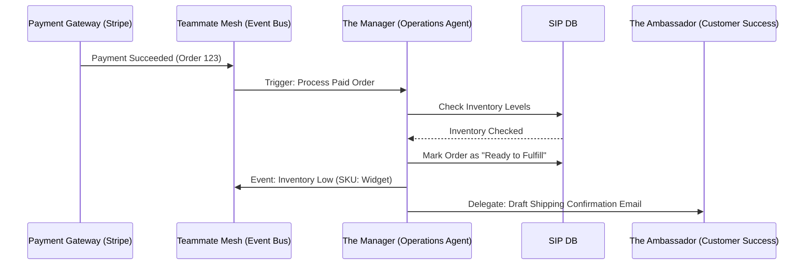

# OHC AI Agent Department Architecture: Operations & Fulfillment

## Problem Statement
Small business owners, such as Maya the baker or Carlos the handyman, struggle with managing the complexity of back-office operations. Tracking inventory, managing order fulfillment, updating booking availability, and handling refunds are tedious, error-prone tasks. Competitors (like Shopify or Wix) provide tools for these tasks but still require manual intervention. OHC needs a dedicated "Operations" AI Department ("The Manager") that autonomously handles these tasks behind the scenes, leaving the business owner to focus on their core product or service.

## Research Report
-   **Competitor Benchmark**: Shopify's "Shopify Flow" allows for automation but requires technical logic setup. OHC's approach must be zero-configuration.
-   **User Pain Points**: "Operational Fatigue" is a top 3 pain point (68% frequency). The sheer volume of minor tasks (e.g., updating a customer that an order shipped, or that a part is out of stock) drains energy.
-   **Opportunity**: By integrating an AI agent that listens to event streams (Teammate Mesh), OHC can automate standard operational tasks invisibly.

## Design Doc

### High-Level Architecture (Mermaid.js)

### Mobile UX Flow
-   **The Activity Feed**: Operational alerts (e.g., "Inventory for Vegan Cake is low") are pushed to the main dashboard activity feed.
-   **1-Tap Approval**: Actions requiring owner intervention (like initiating a refund or placing a supplier order) are presented as draft actions. Carlos can tap "Approve" or "Edit" on his mobile device.
-   **Zero Dashboard Clutter**: The Operations Agent doesn't have its own complex dashboard. It surfaces information *where the user already is* (the main feed).

### AI Agent Integration Points
-   **Event Triggers**: The Operations Agent listens for events: `order.created`, `order.paid`, `booking.requested`, `inventory.updated`.
-   **Inter-Department Delegation**: The Operations Agent doesn't talk directly to customers. It delegates communication to "The Ambassador" (Customer Success Agent).
-   **Decision Logic**: The agent uses simple rule sets (if inventory < threshold, then alert) augmented by LLM analysis for edge cases (e.g., a customer asks for a partial refund due to a minor defect).

### Key Design Decisions
-   **Autonomy vs. Control**: Routine tasks (updating status from "Paid" to "Processing") are fully autonomous. High-risk tasks (refunds, major supplier orders) always require "1-Tap Approval".
-   **Data Consistency**: The Operations Agent relies on the core OHC data model and must acquire locks via KAIROS before modifying state to prevent race conditions.

## Implementation Prompt
**To Implementer Agent:**
Implement the "Operations Agent" department ("The Manager") within the KAIROS Orchestrator framework. This agent must subscribe to the Teammate Mesh for order and inventory events. Create a worker loop that can process an incoming `order.paid` event, verify stock levels, update the order status, and generate a draft notification for the user if inventory drops below a dynamic threshold. Build the integration ensuring that high-risk actions (like refunds) are routed to the mobile dashboard as a "Draft Action" requiring explicit user approval. Do not over-engineer the database schema; use the existing `TASK` and `MEMORY` tables.

## Priority
P1

## Estimated Scope
Medium
