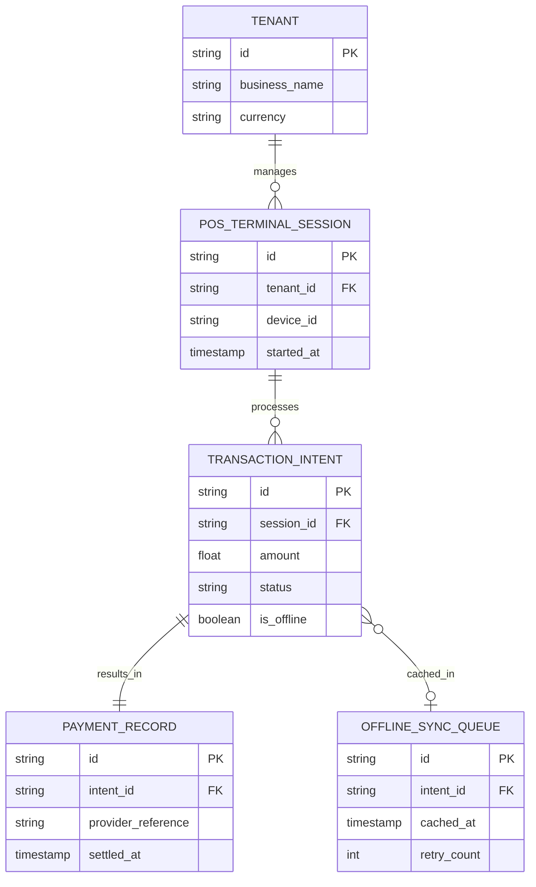
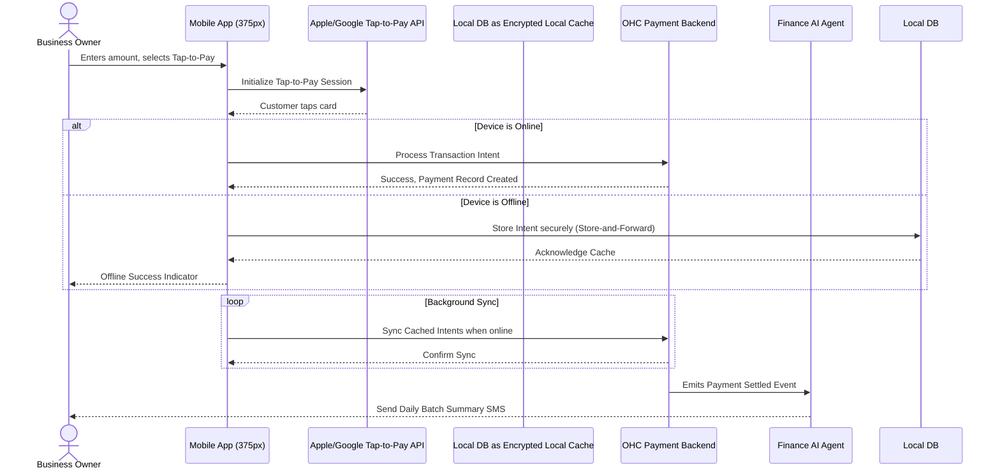

# Title: Tap-to-Pay Mobile POS Terminal Integration

## Problem Statement

For non-technical small business owners like Priya (boutique owner) and Fatima (food cart operator), accepting in-person payments is a critical bottleneck. They currently have to rely on expensive, clunky, dedicated hardware (like legacy POS terminals) or carry separate dongles that easily break or get lost. This friction violates our core promise of running a business entirely from a smartphone. When Carlos the handyman finishes a job, he shouldn't have to email an invoice and wait days for payment; he needs to be able to accept a contactless card payment right there on his Android phone. The lack of a native, hardware-free mobile POS (Tap-to-Pay) capability forces our users into fragmented workflows, delays revenue, and creates a disjointed customer experience.

## Research Report

### Cloud vs. Standalone Capability
- **Cloud Mode:** Enables seamless syncing of inventory, real-time analytics, and instant multi-location ledger updates.
- **Standalone/Offline Mode:** Crucial for users like Fatima operating in areas with spotty cellular service. The architecture must support store-and-forward transaction processing, safely caching payment tokens locally until a connection is restored.

### Competitive Analysis & Market Features

| Platform | In-Person POS Strategy | Tap-to-Pay Support | Offline Mode | Key Takeaway for OHC |
|---|---|---|---|---|
| **Shopify** | Dedicated POS app & hardware | Yes (iPhone & Android) | Limited (Cash/Custom) | Too complex, requires a separate app download. OHC must integrate POS seamlessly into the main app. |
| **Square** | Terminal hardware & mobile app | Yes | Yes (Store & Forward) | Industry standard, but their pricing models are creeping up. OHC's zero-hardware approach is a major differentiator. |
| **Wix** | Hardware partnerships | Yes (via Stripe) | Poor | Wix treats POS as an add-on. OHC must treat it as a native, first-class citizen. |
| **Stripe** | Stripe Terminal API | Yes (SDKs available) | Yes (Store & Forward) | Excellent developer tooling. We will leverage their underlying SDKs while wrapping them in our invisible AI orchestrator. |

### Persona Pain Points Addressed
- **Priya (Boutique):** Needs to line-bust during busy weekends. Tap-to-Pay on her iPhone eliminates the checkout counter bottleneck.
- **Fatima (Food Cart):** Operates outdoors. Needs a robust offline mode and a simple Arabic/English interface for quick transactions.
- **Carlos (Handyman):** Needs instant payment collection at the job site without carrying a separate card reader dongle.

## Design Doc

### Core Architectural Decisions
- **Zero Additional Hardware:** Rely entirely on Apple's Tap to Pay on iPhone and Google Pay's Tap and Pay APIs.
- **Unified Ledger:** Every Tap-to-Pay transaction instantly updates the same multi-tenant unified ledger as online transactions, ensuring inventory and revenue are always perfectly synchronized.
- **Store-and-Forward Offline Architecture:** Implement an encrypted local cache for payment intents when offline, which securely syncs to the backend via a background sync daemon once connectivity is restored.
- **AI Agent Integration:** The "Finance Department" agent will autonomously monitor for failed offline syncs, automatically reconcile batch settlements at the end of the day, and proactively notify the business owner of their daily earnings via SMS/push.

### UI Flow (375px Mobile First)
1. **Home/Dashboard Screen:** The user taps a prominent, persistent "Charge" FAB (Floating Action Button) at the bottom center of the screen.
2. **Amount Entry Screen:** A clean, large-typography numeric keypad appears (macOS-style translucent glass background over the dashboard). The user enters the amount and taps "Next".
3. **Payment Method Screen:** The default option is "Tap to Pay". Other options (Cash, Send Invoice) are visible below. The user taps "Tap to Pay".
4. **Tap to Pay Sheet:** An OS-level bottom sheet smoothly slides up, displaying the standard contactless symbol and instructing the customer to hold their card/phone near the device.
5. **Success Screen:** A celebratory checkmark appears. The user is prompted with one-tap options to send a receipt via SMS or Email, or start a new sale.

### Architectural Diagrams

#### Entity-Relationship Diagram

#### Transaction Flow Sequence

## Implementation Prompt

Implement the Tap-to-Pay mobile POS capability for OneHumanCorp. Your task is to build out the full stack required to support hardware-free contactless payments on mobile devices, ensuring seamless multi-tenant data isolation and a premium UI experience.

**Critical User Journey (CUJ):**
1. The user logs into their OHC dashboard on a mobile device.
2. The user initiates a new "Charge" for a specific amount.
3. The user selects "Tap to Pay" as the payment method.
4. The system presents the native contactless payment interface.
5. The transaction is processed successfully, updating the central ledger and triggering the Finance AI agent to record the transaction.

**Acceptance Criteria:**
- **Zero-Hardware Abstraction:** Implement an abstraction layer that allows the frontend to trigger native OS Tap-to-Pay APIs without coupling to a specific hardware vendor.
- **Offline Store-and-Forward:** Ensure that transaction intents initiated while the device is offline are securely stored locally and automatically retried when connectivity is restored.
- **Visual Excellence:** The UI must adhere to the macOS-style translucent glass mandate and utilize soft 16px curves for cards and 8px for buttons.
- **Mobile Parity:** The feature must be completely functional and optimized for a 375px viewport.
- **Test Coverage:** Provide at least 5 Playwright E2E tests covering the full flow from login to the success screen, including simulated offline scenarios.

## Priority
P0

## Estimated Scope
Large

## References & Sources
- [Shopify POS system review and features](https://www.shopify.com/pos/features)
- [Square POS for small businesses](https://squareup.com/us/en/point-of-sale)
- [Wix POS hardware and software](https://www.wix.com/pos)
- [Squarespace Point of Sale integration](https://www.squarespace.com/ecommerce/point-of-sale)
- [Stripe Terminal documentation](https://stripe.com/terminal)
- [Adyen in-person payments](https://www.adyen.com/pos-payments)
- [GoDaddy POS system overview](https://www.godaddy.com/payments/point-of-sale)
- [Toast POS for restaurants](https://pos.toasttab.com/)
- [Clover POS solutions](https://www.clover.com/pos-systems)
- [Lightspeed retail POS](https://www.lightspeedhq.com/pos/retail/)
- [Apple Tap to Pay on iPhone developer guide](https://developer.apple.com/tap-to-pay/)
- [Google Pay Tap and Pay API](https://developers.google.com/pay/api/)
- [SumUp mobile card readers](https://sumup.com/card-readers/)
- [Zettle by PayPal POS](https://www.paypal.com/us/business/pos)
- [Shopify Mobile POS app](https://www.shopify.com/pos/mobile)
- [Square Terminal card reader](https://squareup.com/us/en/hardware/terminal)
- [Stripe Tap to Pay on iPhone](https://stripe.com/use-cases/tap-to-pay-on-iphone)
- [Adyen Tap to Pay capabilities](https://www.adyen.com/knowledge-hub/guides/tap-to-pay)
- [Wix Payments overview](https://www.wix.com/payments)
- [GoDaddy Smart Terminal](https://www.godaddy.com/payments/smart-terminal)
- [Clover Flex mobile POS](https://www.clover.com/pos-systems/flex)
- [Toast Go 2 mobile POS for restaurants](https://pos.toasttab.com/hardware/toast-go-2)
- [Lightspeed restaurant POS](https://www.lightspeedhq.com/pos/restaurant/)
- [Square for Retail POS](https://squareup.com/us/en/point-of-sale/retail)
- [Shopify POS pricing and plans](https://www.shopify.com/pos/pricing)
- [Wix Retail POS solutions](https://www.wix.com/pos/retail)
- [Stripe Terminal SDKs and integration](https://stripe.com/docs/terminal/sdks)
- [Apple Developer: Accepting contactless payments](https://developer.apple.com/design/human-interface-guidelines/contactless-payments)
- [Google Wallet API for boarding passes and tickets](https://developers.google.com/wallet)
- [PayPal Here mobile POS](https://www.paypal.com/us/business/pos/paypal-here)
- [SumUp Point of Sale system](https://sumup.com/pos/)
- [Zettle card reader features](https://www.paypal.com/us/business/pos/zettle-reader)
- [Shopify vs Square POS comparison](https://www.nerdwallet.com/article/small-business/shopify-vs-square)
- [Best POS systems for small business 2024](https://www.forbes.com/advisor/business/software/best-pos-systems/)
- [Mobile POS market growth and trends](https://www.grandviewresearch.com/industry-analysis/mobile-pos-terminals-market)
- [Tap to Pay adoption statistics](https://www.emarketer.com/content/tap-to-pay-statistics)
- [Offline payments in mobile POS apps](https://squareup.com/help/us/en/article/5084-offline-payments)
- [Stripe Terminal offline mode capabilities](https://stripe.com/docs/terminal/features/offline)
- [Shopify POS offline capabilities](https://help.shopify.com/en/manual/sell-in-person/pos-classic/offline)
- [Clover POS offline mode](https://www.clover.com/help/take-payments-offline/)
- [Toast offline mode for restaurants](https://central.toasttab.com/s/article/Offline-Mode-1492711867175)
- [Lightspeed offline POS features](https://www.lightspeedhq.com/blog/offline-pos/)
- [Multi-location POS management](https://squareup.com/us/en/point-of-sale/multi-location)
- [Inventory management in mobile POS](https://www.shopify.com/pos/inventory-management)
- [Customer loyalty programs in POS](https://squareup.com/us/en/software/loyalty)
- [Analytics and reporting in POS systems](https://www.wix.com/pos/analytics)
- [Integrating POS with accounting software](https://quickbooks.intuit.com/integrations/pos/)
- [POS security and PCI compliance](https://www.pcisecuritystandards.org/)
- [Contactless payments security features](https://usa.visa.com/pay-with-visa/contactless-payments/contactless-security.html)
- [Future of mobile POS and Tap to Pay](https://www.juniperresearch.com/researchstore/fintech-payments/mobile-pos-mpos-research-report)
