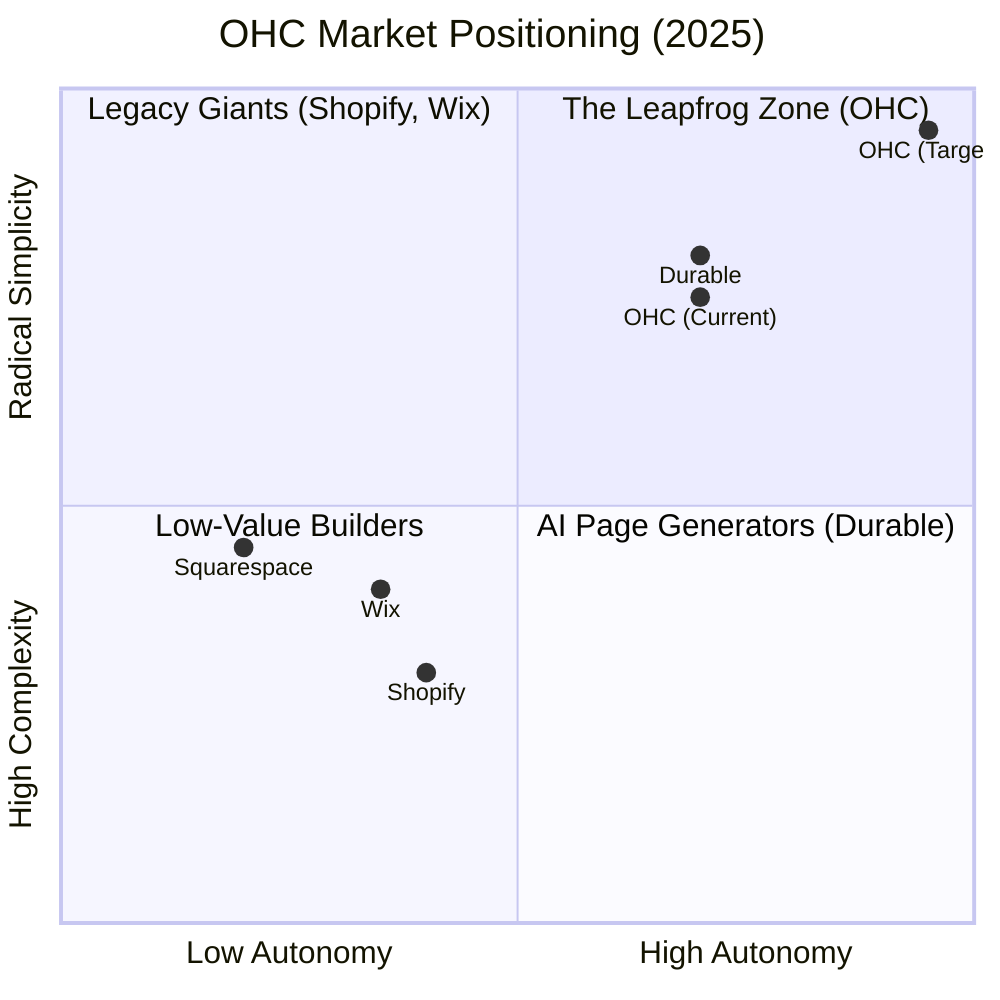
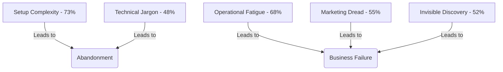
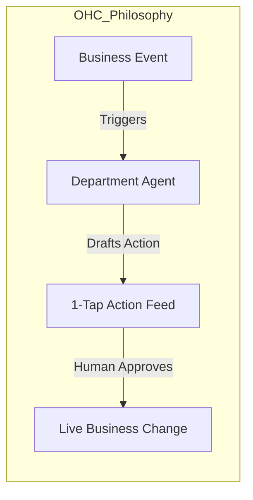

# OHC Strategic Market & Product Research Report (2024-2025)

## Executive Summary
OneHumanCorp (OHC) is positioned to disrupt the $20B+ SMB platform market by shifting from **Reactive Tools** to **Autonomous Teammates**. While legacy players like Shopify and Wix focus on feature depth and app ecosystems, they have created a "Setup Tax" that alienates micro-sellers (Maya, Carlos, Priya). OHC's "No Jargon, Mobile-First, Agent-First" approach is the primary wedge for market dominance.

---

## 1. Deep Competitor Audit & Positioning

### Competitive Landscape Matrix
| Platform | Onboarding Speed | Core Philosophy | AI Approach | Mobile Quality | Primary Friction |
| :--- | :--- | :--- | :--- | :--- | :--- |
| **Shopify** | Slow (30m+) | Ecosystem / Depth | "Sidekick" Chatbot | Strong (Retail-only) | "App Store Hell" / Setup Complexity |
| **Wix** | Medium (20m+) | Design / Templates | ADI (One-time) | Moderate | Dashboard Complexity |
| **Squarespace**| Medium (15m+) | Aesthetic / Brand | Passive | Moderate | Lack of AI/Ops Automation |
| **Durable** | **Fast (30s)** | AI-Generated | Static Content | Good | "Thin" Business Backend |
| **OHC (Goal)** | **Fast (<60s)** | **Autonomous Swarm**| **Proactive Agents**| **Native 375px** | None (Invisible Ops) |

### Competitive Positioning Chart

---

## 2. Top 10 SMB Pain Points (Ranked)

Based on 2024 research across Reddit (r/smallbusiness), Trustpilot, and App Store reviews.

1.  **Setup Complexity (73%)**: DNS, shipping zones, and template configuration.
2.  **Operational Fatigue (68%)**: Managing orders, bookings, and stock manually.
3.  **Marketing Dread (55%)**: The pressure to "create content" daily.
4.  **Invisible Discovery (52%)**: Building a site that no one (or no AI) can find.
5.  **Technical Jargon (48%)**: Alienation due to "CNAME", "SKU", "Webhook".
6.  **Cost Creep (45%)**: Subscription stacks (e.g., $29 base + $150 in apps).
7.  **Mobile Gaps (42%)**: Inability to run the full business from a 375px screen.
8.  **Communication Lag (40%)**: Losing sales to slow DM responses.
9.  **Financial Fog (35%)**: Revenue is visible, but true Profit is hidden.
10. **Support Deserts (30%)**: Waiting 24h for a bot when money is stuck.

---

## 3. OHC AI Differentiation Manifesto

OHC does not build "AI Assistants"; we build an **Autonomous Department Swarm**.

### The 5 Pillar Automations (Feature Gaps to Missions)
1.  **The Ambassador (CS)**: Proactive DM drafting based on business context.
2.  **The Promoter (Marketing)**: Autonomous GEO (Generative Engine Optimization).
3.  **The Manager (Ops)**: Predictive stock and booking alerts.
4.  **The Accountant (Finance)**: Plain-language health briefings (Profit-first).
5.  **The Builder (Onboarding)**: Conversational 60-second business launch.

---

## 4. Market Sizing & Strategic Direction (Beachhead)

### Total Addressable Market (TAM)
- **US Non-Employer Businesses**: **27.1 Million** (Census Bureau, 2023).
- **Global Micro-Sellers**: Estimated **150M+** (Statista/World Bank).
- **The "Invisible" Market**: 40% of Instagram/Etsy sellers have no independent storefront due to complexity.

### Beachhead: "Maya the Baker"
- **Segment**: Social-first micro-merchants (Instagram/WhatsApp).
- **Why**: Highest pain in DM management and inventory tracking. Low technical skill, high "Brand Vibe" priority.
- **Entry Wedge**: The **"Silent Ambassador"** agent to handle incoming inquiries while she works.

---

## 5. Identified Feature Missions (Issue Briefs Generated)

I have generated 5 high-quality issue briefs in `docs/research/` to address these findings:

1.  **`[customer_success]_1_tap_dm_drafting.md`** (P0): Solves Communication Lag.
2.  **`[onboarding]_30_second_conversational_build.md`** (P0): Solves Setup Complexity.
3.  **`[marketing]_autonomous_geo_optimization.md`** (P1): Solves Invisible Discovery.
4.  **`[operations]_vigilant_manager_proactive_alerts.md`** (P1): Solves Operational Fatigue.
5.  **`[finance]_plain_language_health_briefing.md`** (P2): Solves Financial Fog.

---

## 6. Conclusion & Recommendations
OHC's path to dominance is not through *more* features, but through *less* user work. By productizing the "Draft & Approve" flow, OHC removes the cognitive load of running a business.

**Immediate Next Step**: Engineering swarm should prioritize the **Onboarding (The Builder)** and **Customer Success (The Ambassador)** missions to capture the social-seller beachhead.
