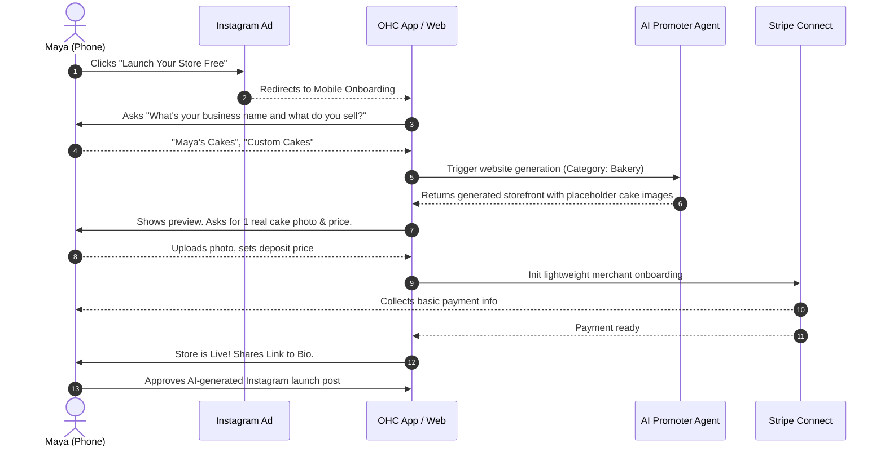
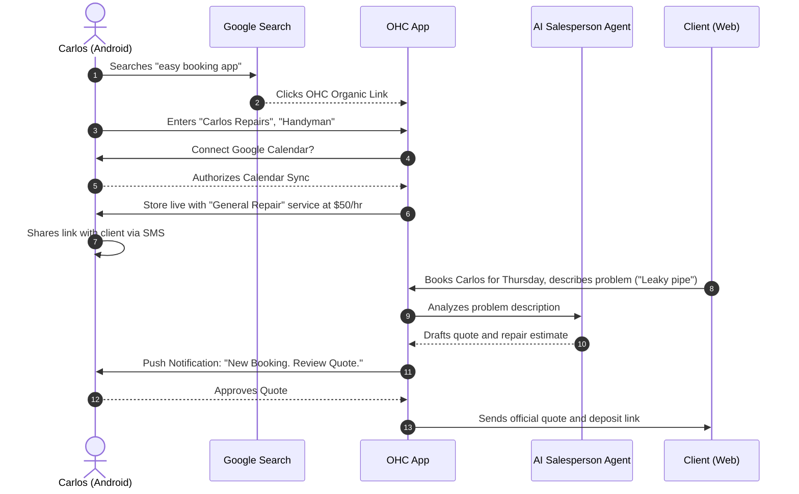
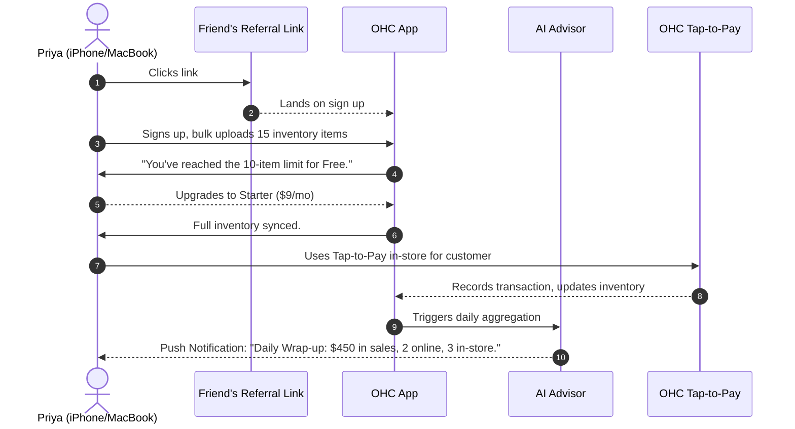
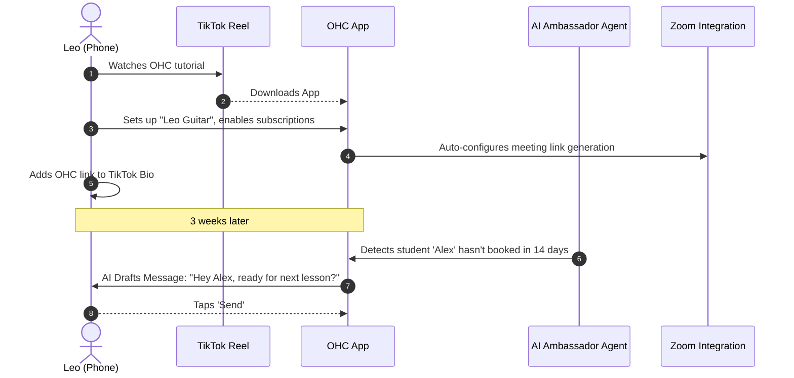
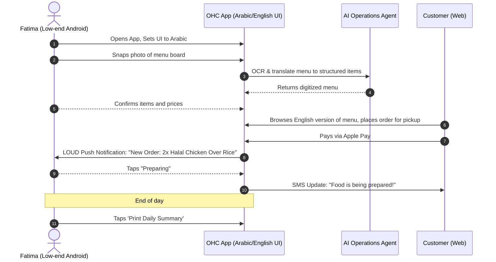

# [Business Journey Architecture] End-to-End User Journey for OHC Personas

## Title
Business Journey Architecture: End-to-End User Journey Standardization

## Problem Statement
Small business owners coming to OneHumanCorp (OHC) need to be able to go from idea to a live business in under 10 minutes. A complex onboarding process, unclear value propositions, or lack of ongoing engagement will cause non-technical users to churn. The current platform lacks a formally defined, end-to-end journey standardizing Acquisition, Onboarding, Activation, Retention, Revenue, and Referral across all target personas. Without this, there is high risk of friction points causing abandonment.

## Research Report

### Acquisition
How do our personas discover OHC?
*   **Maya (The Home Baker):** Targeted Instagram Ad ("Start your baking business from your phone in 10 minutes"). CTA: "Launch Your Store Free".
*   **Carlos (The Freelance Handyman):** Organic Google Search for "easy booking app for handyman". CTA: "Get Booked Today".
*   **Priya (The Boutique Owner):** Word of mouth (friend referral) or TikTok business tool roundup. CTA: "Sync Your Store Now".
*   **Leo (The Music Tutor):** TikTok/Instagram Reel showing a seamless link-in-bio booking page. CTA: "Create Your Booking Page".
*   **Fatima (The Food Cart Operator):** Local community organization recommendation or targeted Facebook ad for food operators. CTA: "Take Pre-Orders Now".

### Onboarding
Step-by-step wizard flow to get to live in under 10 minutes.
*   **Minimum Inputs Needed to Go Live:**
    1. Business Name & Category.
    2. Primary Goal (e.g., "Sell products", "Take bookings", "Show portfolio").
    3. One core entity (e.g., 1 product, 1 service, 1 portfolio item).
    4. Connect Payment (Stripe OAuth / basic banking info).
*   **What can be deferred:** Custom domain setup, advanced SEO configuration, full inventory sync, multi-language setup, detailed policy generation (AI drafts these initially).
*   **AI Intervention:** The "Marketing & Advertising" AI department instantly generates a drafted website and social media post during the onboarding loading screen.

### Activation
What does success look like?
*   **Day 1:** Live URL generated, shared on at least one social platform, first AI interaction completed.
*   **Week 1:** First transaction/booking processed, first AI-generated customer follow-up sent.
*   **Month 1:** Regular cadence established (e.g., 5+ orders/bookings), Weekly AI Health Report reviewed.

### Retention
What brings users back daily?
*   **Carlos:** Push notifications for new bookings ("New Booking Request: Plumbing Fix"), AI quote generation approvals.
*   **Priya:** Daily mobile analytics ("Revenue Today: $450"), inventory alerts.
*   **Maya:** Chatting with customers via the Customer Success agent's drafted replies.
*   **Leo:** Weekly schedule summaries and AI-driven inactive student reminders.
*   **Fatima:** Daily printable order list for pre-orders, real-time pickup notifications.

### Revenue
When do users upgrade from Free ($0) to Starter ($9/mo) or Pro ($29/mo)?
*   **Trigger:** Hitting the 10-product limit (Free tier) or wanting a custom domain.
*   **CTA Presentation:** Contextual, non-intrusive banners. E.g., when Maya tries to add her 11th cake design, the Operations agent gently suggests, "Your business is growing! Upgrade to Starter to add unlimited products and a custom domain for just $9/mo."

### Referral
What is the viral loop?
*   **Mechanism:** "Powered by OneHumanCorp" badge on Free tier storefronts and booking pages.
*   **Incentive:** "Invite a fellow business owner and both get 1 month of Pro free."
*   **Example:** Priya shares her new online store with a fellow boutique owner; the seamless checkout experience prompts the friend to click the badge and sign up.

---

## Design Doc

### Key Friction Points to Avoid
1.  **Technical Jargon:** Asking for "DNS Settings" during onboarding. Must use "Connect your domain" and handle DNS invisibly.
2.  **Payment Friction:** Forcing full Stripe KYC before letting them see the generated site. Allow deferring full KYC until the first payout.
3.  **Blank Canvas Syndrome:** Presenting an empty dashboard. AI must pre-populate products, a website, and a welcome post based on the business category.
4.  **Mobile Overwhelm:** Displaying desktop-optimized data tables on a 375px screen. Analytics must be conversational ("You made $200 today").

### AI Agent Integration Points
*   **Onboarding:** Promoter Agent generates the website. Legal Agent drafts the TOS.
*   **Activation:** Salesperson Agent drafts the first social post to share the new link.
*   **Retention:** Advisor Agent pushes the weekly health report notification.

### Mermaid.js Sequence Diagrams

#### Persona: Maya (The Home Baker)

#### Persona: Carlos (The Freelance Handyman)

#### Persona: Priya (The Boutique Owner)

#### Persona: Leo (The Music Tutor)

#### Persona: Fatima (The Food Cart Operator)

## Implementation Prompt
**For the Implementer Agent:**
Implement the Onboarding Wizard CUJ (Critical User Journey) for the Flutter Web and Mobile clients, backed by the Go API.
*   The flow must allow the user to input their business name and category, followed by connecting a payment method (simulate Stripe connect).
*   During the final loading screen, the frontend must mock an AI-generation state (calling the AI Promoter Agent) that returns a completed storefront structure.
*   All screens must be responsive, starting strictly from a 375px mobile layout.
*   Do not use technical jargon; keep all copy conversational and simple.
*   Ensure full E2E test coverage for this onboarding flow using Playwright/Flutter testing tools, simulating the complete path from landing to live storefront. Do not define specific backend database tables; focus on the API contract and client-side state.

## Priority
P0 (Critical)

## Estimated Scope
Large