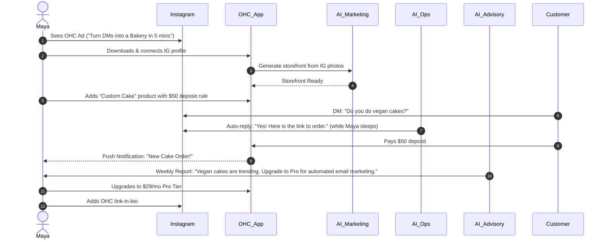
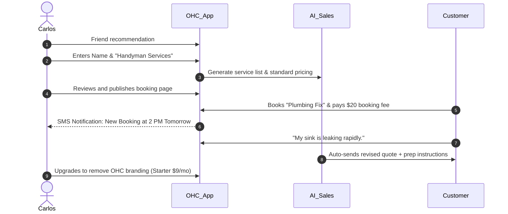
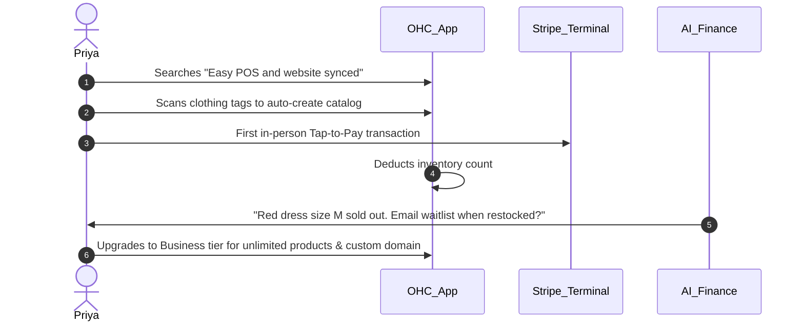
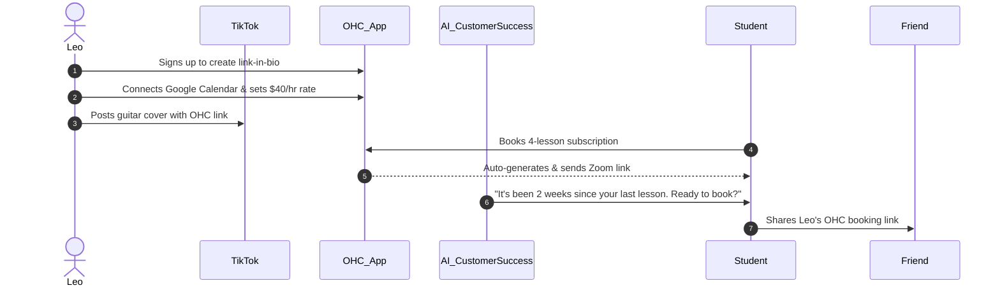
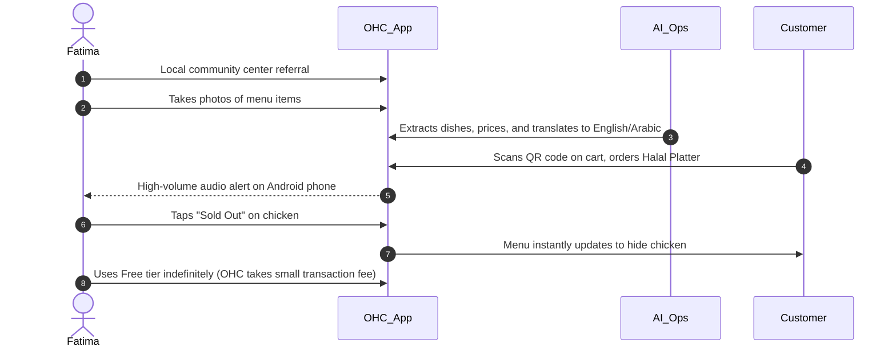

# [Business Journey] End-to-End User Journey Architecture

## Problem Statement
For the everyday small business owner—like a home baker, freelance handyman, or food cart operator—launching and managing an online presence is technically overwhelming. Existing platforms like Shopify, Wix, and Squarespace require significant setup time, basic technical knowledge (e.g., DNS setup, responsive design concepts), and constant manual intervention to operate. This friction causes many non-technical founders to abandon their online ambitions or rely entirely on fragmented social media interactions. OHC must provide a zero-configuration, AI-driven, and mobile-first experience that empowers users to go from idea to a live, transactional business in under 10 minutes without touching code or jargon.

## Research Report
### Competitive Analysis
| Platform | Setup Time | Tech Skill Required | Mobile Management | AI Integration | Target Persona |
| :--- | :--- | :--- | :--- | :--- | :--- |
| **OHC** | **< 10 min** | **Zero** | **Native/Mobile-First** | **Deep, invisible background agents** | **Non-technical (Maya, Carlos, Fatima)** |
| Shopify | 30-60 min | Low/Medium | Partial | Chatbot (Sidekick) | SMB / Tech-savvy |
| Wix | 20-40 min | Low/Medium | Partial | Website generation | Semi-technical |
| Squarespace| 30-60 min | Low | Poor | Limited | Creative Professional |

**Key Findings:**
1. **Mobile is the computer:** 85% of our target demographic (Maya, Carlos, Fatima) do not own or prefer not to use a laptop for business management. Shopify and Wix have companion apps, but complex tasks (like setting up variants or modifying themes) require desktop. OHC must be 100% manageable via a 375px screen.
2. **AI as infrastructure, not a chatbot:** Current market solutions treat AI as an optional assistant. OHC treats AI as the fundamental business operations engine (Marketing, Support, Operations) working silently in the background.
3. **Friction at Onboarding:** The highest drop-off rate in competitors occurs when asking for DNS setup, payment gateway keys, or catalog initial upload. OHC must automate this through conversational AI or one-click integrations (e.g., pulling data from an existing Instagram page).

## Design Doc

### The 6 Stages of the OHC Business Journey
1. **Acquisition:** How the user discovers OHC.
2. **Onboarding:** The step-by-step wizard to go live.
3. **Activation:** The "Aha!" moment (first product added, first dollar earned).
4. **Retention:** Daily engagement loops driven by AI insights.
5. **Revenue:** The upgrade path from Free to Starter/Pro.
6. **Referral:** Organic viral loops (e.g., "Powered by OHC" link-in-bio).

---

### Persona Journeys & Architecture Diagrams

#### 1. Maya (The Home Baker, 28)
**Goal:** Sell custom cakes with deposits via Instagram DMs.

#### 2. Carlos (The Freelance Handyman, 42)
**Goal:** Move from word-of-mouth to professional online booking.

#### 3. Priya (The Boutique Owner, 35)
**Goal:** Sync in-store inventory with an online storefront.

#### 4. Leo (The Music Tutor, 22)
**Goal:** Automate lesson bookings, Zoom links, and student follow-ups.

#### 5. Fatima (The Food Cart Operator, 50)
**Goal:** Take pre-orders easily in multiple languages.

### Identified Friction Points & Mitigations
- **Friction:** Initial catalog creation is tedious.
  - **Mitigation:** AI agent generates catalog from a single Instagram link or by scanning physical menus/tags using the camera.
- **Friction:** Setting up a custom domain is intimidating.
  - **Mitigation:** OHC provisions `[business].ohc.app` instantly. If they upgrade, OHC handles DNS programmatically behind the scenes.
- **Friction:** Getting the first customer.
  - **Mitigation:** The AI Promoter department automatically generates an optimized social media post with a booking/purchase link immediately upon going live.

## Implementation Prompt
**Task for Implementer:**
Implement the user onboarding API and initial screen flows to support the "10-minute Idea to Live Business" promise.
- Create the backend endpoints for business creation, integrating the AI Marketing agent to auto-generate the initial store configuration from user text input or social media link.
- Develop the Flutter UI (mobile-first 375px) for the 3-step onboarding wizard: (1) Business Name/Type, (2) Auto-generation loading screen with tips, (3) The "You are Live" dashboard with the shareable link.
- Ensure the UI utilizes the OHC Premium Token library (Glassmorphism, Outfit/Inter typography).
- Verify end-to-end functionality via an E2E Playwright/Flutter integration test.

**Acceptance Criteria:**
- User can create an account and business in under 3 screens.
- AI correctly interprets the business type and populates the initial database entities (Products, Services).
- The dashboard is perfectly usable on a 375px width simulator.

**Priority:** P0
**Estimated Scope:** Large
