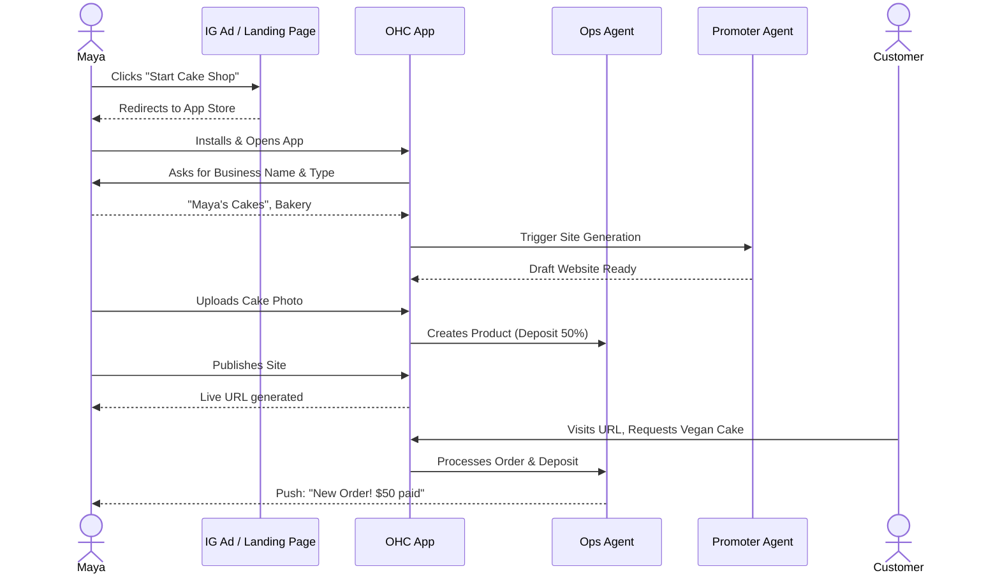
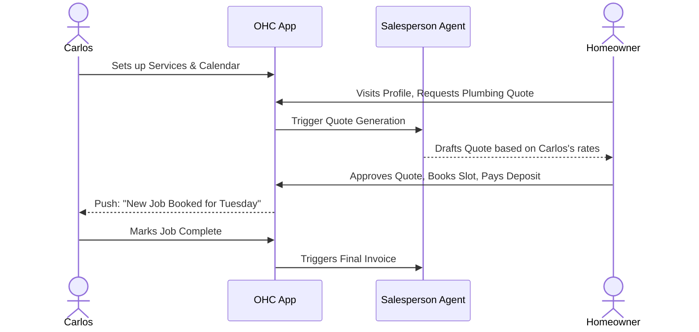

# Business Journey Architecture Design Doc

## 1. Overview
This document details the complete end-to-end user journeys for the primary OHC non-technical small business owner personas: Maya (The Home Baker), Carlos (The Freelance Handyman), Priya (The Boutique Owner), Leo (The Music Tutor), and Fatima (The Food Cart Operator). It analyzes how they acquire, onboard, activate, retain, and grow on the OHC platform.

## 2. Core Personas
- **Maya (28, non-technical):** Baker selling custom cakes via Instagram DMs. Runs everything from an iPhone.
- **Carlos (42, non-technical):** Handyman relying on word of mouth. Needs service booking and quotes. Android only.
- **Priya (35, semi-technical):** Boutique owner needing physical + online inventory sync, variants, and POS. Mac/iPhone user.
- **Leo (22, non-technical):** Music tutor teaching online and in-person. Needs subscription billing and booking.
- **Fatima (50, non-technical, limited English):** Food cart operator taking pre-orders. Needs a simple multi-lingual UI on low-end Android.

## 3. Journey Stages

### 3.1 Acquisition
- **Maya:** Discovers OHC through a targeted Instagram ad featuring another baker managing orders easily. CTA: "Start your cake shop in 3 mins."
- **Carlos:** Hears about OHC from a contractor friend or searches Google for "easy booking app for handyman".
- **Leo:** Sees a TikTok link-in-bio from another creator that says "Powered by OHC".
- **Priya:** Searches for "sync store and online boutique simple."

### 3.2 Onboarding
A crucial step for zero-technical-knowledge users.
- **Friction Point:** Too many fields to fill out upfront.
- **Solution:** Defer non-critical setup. Only ask for: Business Name, Industry, and Email/Phone.
- The "Promoter" AI agent immediately starts generating a site draft in the background.

### 3.3 Activation
- Success is defined as the first product/service added and the site going live (under 10 mins).
- **Maya:** Uploads a photo of her best cake. AI suggests a description and price. She hits "Publish."
- **Carlos:** Adds "Leaky Faucet Repair" at $80/hr. Sets calendar availability.
- **Fatima:** Adds "Chicken over Rice" for $10. Toggles Arabic language support.

### 3.4 Retention
- Pushing relevant insights via the "Advisor" and "Ambassador" agents.
- Daily/Weekly plain-language push notifications: "You got 3 new orders today!" or "Carlos, 2 people viewed your quote but didn't book. Should I send a follow-up?"

### 3.5 Revenue & Upgrades
- Upgrades are contextually suggested, not aggressively pushed.
- **Priya:** Upgrades to Pro when she needs multi-domain support and POS integration.
- **Leo:** Upgrades to Starter when his monthly lesson bookings exceed the free tier limit.

### 3.6 Referral
- Built-in virality. The free tier uses an OHC subdomain (e.g., `maya-cakes.ohc.store`), driving organic awareness. A simple "Refer another business owner and get a free month" prompt appears after a successful sale.

## 4. Sequence Diagrams (Mermaid.js)

### Maya's End-to-End Journey

### Carlos's Quote & Booking Journey

## 5. Summary & Next Steps
The end-to-end journey maps confirm that deferred onboarding and AI-assisted activation are critical to achieving the "zero to live in under 10 minutes" promise.
- **Gap Identified:** The current onboarding flow in `src/server/services/onboarding` requires too much manual environment provisioning, which is at odds with the deferred, AI-first approach designed here.
- **Action:** Initiate a redesign of the onboarding API to be purely declarative, allowing the "Promoter" agent to handle initial data entry.
