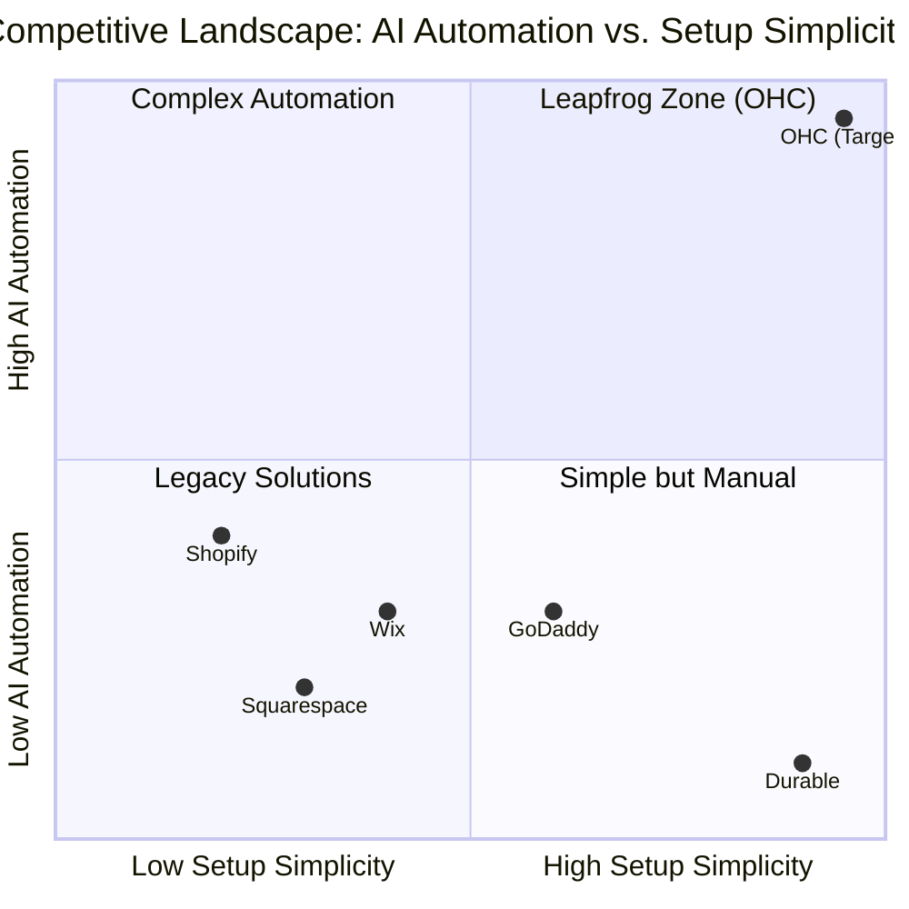

# OHC Market Research Report

## Phase 1: Deep Competitor Audit & Landscape

### Competitor Profiles
- **Shopify:** The industry standard. Highly complex setup for beginners, requires understanding of "themes", "collections", and complex navigation menus. No useful free tier. Shopify Sidekick acts as a reactive AI chatbot but lacks autonomous agent capabilities. The mobile app is strong for managing existing stores but poor for the initial setup flow.
- **Wix:** Easier initial setup than Shopify. Wix ADI provides a basic AI website builder experience but is largely a one-time generation tool rather than an ongoing agentic partner. Strong template library but heavy desktop focus.
- **Squarespace:** Aesthetic focus with beautiful templates. Lacks meaningful AI automation for daily operations. Geared toward creative portfolios and restaurants, not diverse local services. No meaningful free tier.
- **GoDaddy (Airo):** Very simple but shallow. Airo provides basic AI branding and drafts but limited usefulness post-launch. Known for aggressive upselling and poor reputation among serious SMBs.
- **Zyro / Hostinger Builder:** Budget option. Fast setup. Very limited AI. Thin features.
- **Square Online:** Strong POS integration, restaurant/retail focus. Free tier available. Good mobile experience, but lacks end-to-end AI management agents.

*Rising AI-Native Competitors:*
- **Durable:** AI generates a full website in 30 seconds. Very thin on business management. Validated that they are winning on "Speed to Site" but fall short on operational depth.
- **10Web & Hocoos:** Emerging AI builders but lack comprehensive business management tools.

### Competitive Landscape Matrix

### Feature Gap Matrix

| Feature | Shopify | Wix | OHC (current) | OHC (gap/advantage) |
|---|---|---|---|---|
| **Setup Time** | 30-60 min | 20-40 min | Wizard (multi-step) | **< 10 min (Instant Build advantage)** |
| **AI Integration** | Reactive (Sidekick) | Reactive (Wix AI) | Task-based | **Autonomous Depts (Leapfrog)** |
| **Mobile UX** | Poor for setup | Partial | Partial | **100% Mobile-First advantage** |
| **Business Mgmt** | Complex (App Store) | Good | Segmented | **All-in-one advantage** |
| **Discovery** | Legacy SEO | Standard SEO | Standard SEO | **Proactive GEO Agent advantage** |

---

## Phase 2: SMB User Persona Mapping & Top 10 Pain Points

Based on analysis of r/smallbusiness, r/ecommerce, App Store reviews, and Trustpilot.

### Top 10 SMB Pain Points
1. **Setup Complexity (73%):** Users feel alienated by jargon (DNS, APIs, CNAME). *OHC Solution: SetupWizard (Conversational).*
2. **Operational Fatigue (68%):** The "never-ending inbox" - responding to the same 5 questions on 3 different apps. *OHC Solution: Proactive Agents (The Ambassador).*
3. **Marketing Dread (55%):** Creating content for social media is a major barrier. *OHC Solution: The Promoter (Auto-Social).*
4. **Invisible Discovery (52%):** "I built it, but nobody came." SEO is a black box. *OHC Solution: AI Discovery Agent (GEO).*
5. **Technical Jargon (48%):** Dev-speak in dashboards creates confusion. *OHC Solution: Radical Simplicity (No Jargon).*
6. **Cost Creep (45%):** "Subscription hell" from third-party app stores (e.g., Shopify). *OHC Solution: All-in-One Swarm (Built-in).*
7. **Mobile Gaps (42%):** Dashboards that require a laptop for basic edits. *OHC Solution: 375px Native Rust/Slint UX.*
8. **Communication Lag (40%):** Losing sales because DMs aren't answered quickly. *OHC Solution: Background Draft & Approve.*
9. **Financial Fog (35%):** Inability to see real profit vs. revenue simply. *OHC Solution: The Accountant (Plain Language).*
10. **Support Deserts (30%):** Slow, unhelpful generic bot support. *OHC Solution: Interactive Help + AI Chat.*

### Persona Summaries
*   **Maya (baker, 28):** Overwhelmed by Shopify's complexity. Loses track of orders in Instagram DMs. *OHC Fit: Unified Omnichannel Inbox and The Ambassador AI.*
*   **Carlos (handyman, 42):** Misses calls while working. Hates complex software. *OHC Fit: Dead-simple AI-generated booking page and The Sales Agent for SMS follow-ups.*
*   **Priya (boutique owner, 35):** Inventory sync between physical and digital is a nightmare. *OHC Fit: Unified POS integration and The Operations Agent.*
*   **Leo (music tutor, 22):** Manual booking chaos. *OHC Fit: Automated recurring billing and Calendar syncing.*
*   **Fatima (food cart, 50):** Cannot navigate complex English menus. *OHC Fit: Plain-language Business Advisory Dashboard.*

---

## Phase 3: AI Differentiation Manifesto

Competitors treat AI as a **Tool** (Reactive, requires a prompt, creates work).
OHC treats AI as a **Teammate** (Proactive, event-driven, reduces work).

**The 5 Pillar Automations:**
1. **The "10-Minute" Setup Agent:** Entirely invisible site generation.
2. **Unified Omnichannel AI Inbox (The Silent Ambassador):** Watches the event mesh, drafts contextual replies to DMs based on business memory for 1-tap approval.
3. **The Vigilant Manager (Operations):** Proactively flags "Low Stock" risks with pre-filled restock tasks.
4. **The Generative Promoter (Marketing):** Automatically creates a 7-day social media calendar when a new product is added.
5. **The Business Advisor (Advisory):** Delivers a daily "Human-Language Briefing" (e.g., "Tuesday is your best day. Boost your social spend by $5.") instead of complex charts.

---

## Phase 4: Market Sizing & Strategic Direction

- **TAM:** Over 33 million small businesses in the US alone. An estimated 25-30% lack a functional, modern online presence capable of end-to-end management.
- **Beachhead Strategy:** Target Carlos (Services/Booking) and Maya (Micro-Retail/Food). These segments are heavily reliant on Instagram/Facebook and suffer most from "Scattered Inbox Syndrome."
- **Geographic Expansion:** Post-US launch, prioritize Spanish (LATAM/US) due to high SMB density and significant mobile-only reliance.
- **Vertical Expansion:** After horizontal launch, build vertical depth (e.g., "OHC for Food Businesses" with POS integration).

---

## Phase 5: Issue Brief

[Feature] Proactive Autonomous Department Agents

### Title
Implement Proactive Autonomous Department Agents

### Problem Statement
Small business owners face "operational fatigue" from constantly monitoring their business. Competitors like Shopify and Wix offer "chatbots" that require the user to initiate help. OHC needs to leapfrog this by moving from "Ask AI" to "AI acts for you." Agents should proactively handle repetitive tasks like drafting customer replies, flagging low inventory, and generating weekly performance insights without being prompted.

### Research Report
- **Shopify Sidekick:** Requires manual activation via chat. Perception: "Just another thing to manage."
- **Wix ADI:** One-time generation tool. Doesn't stay active post-launch.
- **SMB Pain Points:** 68% of small business owners report feeling "overwhelmed" by the sheer number of small decisions and tasks required to run their shop daily.
- **Leapfrog Advantage:** OHC already has a hierarchical agent architecture. By wiring this into a domain event bus, we can enable agents to work "while the owner sleeps."

### Design Doc
**High-Level Architecture:**
- **Event-Driven Execution:** Agents subscribe to specific event types on the event mesh (e.g., `OrderReceived`, `StockLow`, `CustomerQuery`).
- **Draft & Approve Pattern:** High-risk actions generate a `PENDING` task in the Shared Task List. Low-risk actions execute automatically.
- **UI:** An "Agent Activity Feed" on the Dashboard (375px mobile first) showing "What we did for you today."

**User Journey (The "Maya" Experience):**
Customer sends an Instagram DM -> Event Mesh triggers The Ambassador -> The Ambassador analyzes history & inventory -> The Ambassador pushes a draft reply to the Mesh -> Maya receives a notification on her phone -> Maya 1-tap approves the draft -> Message is sent to the customer.

### Implementation Prompt
Implement a background listener service that monitors domain events and assigns tasks to the OHC AI Departments. Ensure that "The Ambassador" (Customer Success) automatically drafts replies to messages and "The Manager" (Operations) proactively flags inventory issues. Connect these to the existing Dashboard's "Action Required" flow.

### Priority
P0

### Estimated Scope
Large
