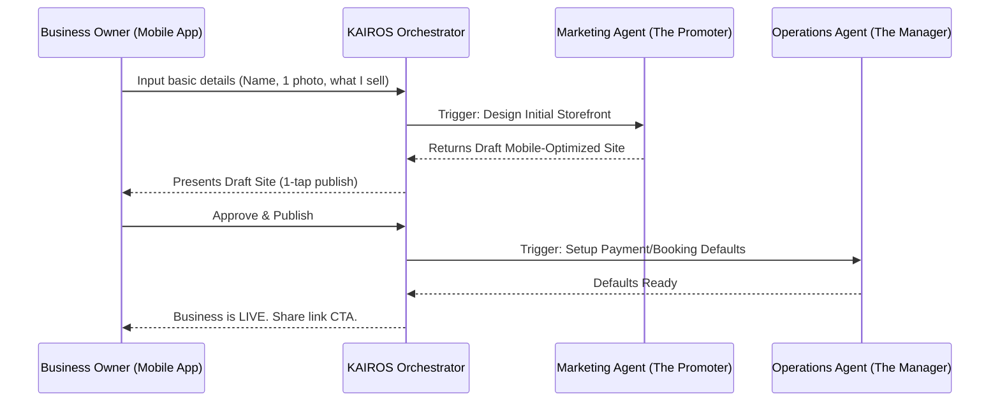

# Business Journey Architecture

## Title
End-to-End Business Journey Mapping and Mobile-First UX Architecture

## Problem Statement
Small business owners (like Maya the baker, or Carlos the handyman) are overwhelmed by standard platform setups (Shopify, Wix) which require complex, desktop-focused dashboards. They need a system that feels like "sending a few texts and uploading a photo" rather than "building a database." The current flow has too many friction points, causing users to abandon setup before reaching their first successful sale or booking. We need a fluid, mobile-first journey where AI handles the heavy lifting, allowing owners to go from idea to live business in under 10 minutes entirely from their phone.

## Research Report
### Competitive Analysis
*   **Shopify**: Setup takes 30-60 minutes. Deeply complex inventory and tax settings are exposed too early in the flow. Primarily built for desktop management with mobile as an afterthought.
*   **Wix/Squarespace**: Visual builders are extremely difficult to use on a 375px mobile screen. They assume the user understands "sections," "padding," and "blocks."
*   **GoDaddy**: A bit simpler, but relies on rigid templates that don't easily adapt. AI tools (Airo) feel bolted-on rather than invisible infrastructure.

### Findings
Users drop off when asked to categorize their business with strict industry codes, set up shipping zones, or design layouts manually. The optimal path defers non-essential decisions until *after* the business is live and the first product is added.

## Design Doc

### Architecture Diagram

### UI Wireframes / Screen Flow (375px Mobile First)
1.  **Welcome Screen**: Glassmorphic card, "What are you building today?" with a single text input (native keyboard).
2.  **AI Generation Screen**: Shimmer effect. "Our AI (The Promoter) is designing your site..."
3.  **Review Screen**: Full-screen preview of the site. A single primary CTA button at the bottom: "Looks Good, Go Live."
4.  **Success State**: Confetti micro-animation. Displays the new custom URL and a big "Share on Instagram" button.

### Mobile UX Flow
-   **Acquisition**: User clicks an Instagram ad demonstrating a 1-minute setup.
-   **Onboarding**: 3 screens max. Name, description, connect bank/Stripe (deferred if possible).
-   **Activation**: User shares their link and receives their first test or real order.
-   **Retention**: Daily push notifications from "The Advisor" with simple stats: "2 people viewed your cake catalog today!"

### AI Agent Integration Points
-   **Marketing & Advertising ("The Promoter")**: Automatically generates the website layout, color scheme, and initial copy based on the user's initial text input.
-   **Customer Success ("The Ambassador")**: Drafts a welcome email for the user's future customers.
-   **Business Advisory ("The Advisor")**: Immediately sets up a baseline health report to track the user's first week of visits.

### Key Design Decisions
-   **Deferred Complexity**: Do not ask for tax or shipping details during onboarding. Set intelligent defaults or prompt later via "The Advisor" when it actually matters.
-   **No "Builder" UI**: Users don't drag and drop. They tell the AI what they want, and the AI presents options.
-   **Mobile Parity**: The entire setup process requires no horizontal scrolling and uses native keyboards exclusively.

## Implementation Prompt
**Prompt for Implementer**:
Implement the mobile-first onboarding journey for new OHC tenants. Build a 3-screen Flutter flow (targeting 375px width) that captures a user's business idea and uses the KAIROS orchestrator to trigger the Marketing Agent to generate a draft storefront. The final screen must present a 1-tap "Go Live" button. Do not build a complex drag-and-drop editor. Focus on the happy path where a user can complete the flow in under 2 minutes. The UI must use the OHC Premium Token design system (Glassmorphism, Outfit/Inter typography). Write a Playwright E2E test that starts at the home page, goes through this flow, and verifies the "Go Live" success state.

## Priority
P0

## Estimated Scope
Medium
