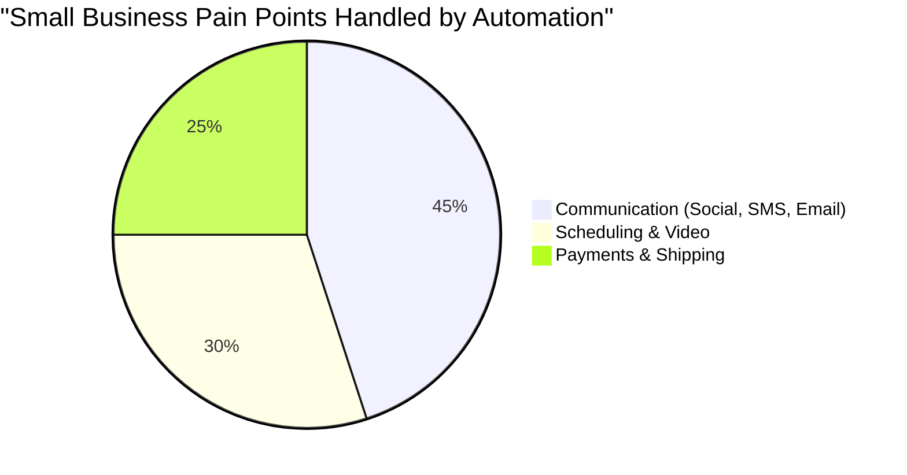

# OHC Third-Party Integration Research Report (Q3)

## Executive Summary

This report evaluates key third-party integrations that can dramatically improve the operational efficiency of small business owners using OHC. We focus heavily on minimizing technical complexity for the user while unlocking crucial business capabilities like communication, scheduling, payments, and logistics.

### Persona Pain Points

* **Fatima (Low-English-Proficiency, Service Provider):** Struggles to follow up with clients due to language barriers. Needs SMS notifications that automatically translate, simple scheduling that avoids double-booking, and straightforward payment links.
* **Carlos (Retail/E-commerce):** Overwhelmed by tracking multiple social media inboxes and manually calculating shipping rates for out-of-town orders.
* **Sarah (Consultant/Educator):** Spends too much time manually creating Zoom links for every lesson and managing client email lists.

### Competitive Landscape Heatmap

### Strategic Recommendations

* **OHC should prioritize Calendar & Scheduling integrations because** double bookings directly cost small business owners revenue and reputation.
* **OHC should build native unified messaging (Social Media + SMS) because** business owners like Carlos are currently using 4-5 different apps to track leads.
* **OHC should integrate localized payment providers because** Stripe is not sufficient for emerging markets where tools like Mercado Pago dominate.

---

## Issue Briefs

### 1. [Social Media] Unified Inbox for Instagram, Facebook, WhatsApp, and TikTok

**Title:** Unified Social Media Inbox Integration

**Problem Statement:**
Business owners are losing track of customer inquiries because they receive messages across Instagram DMs, Facebook comments, WhatsApp, and TikTok. Constantly switching apps leads to missed sales and frustrated customers.

**Research Report:**
*   **Findings:** Most small businesses receive up to 60% of their leads via social media messaging. Managing these across different apps is a top complaint.
*   **Ease of Use:** Must be a one-click OAuth connection to their Meta/TikTok business accounts.
*   **Pricing:** Official APIs (like WhatsApp Cloud API) charge per conversation after the first 1,000 free tier. Instagram and Facebook APIs are generally free for inbound messaging.
*   **Reputation:** Meta's APIs are reliable but have strict 24-hour reply window policies.

**Design Doc:**
*   **Integration Flow:** The user visits the OHC settings page and clicks "Connect Social Media". They authenticate via Meta/TikTok.
*   **User Experience (375px Mobile):** A new "Unified Inbox" tab appears on the mobile app. All messages are aggregated into a single feed. Each message clearly displays the source icon (e.g., Instagram).
*   **AI Points:** OHC's AI can automatically draft suggested replies based on previous customer interactions and the business's FAQ.
*   **Cloud vs. Standalone:** Cloud mode will utilize OHC webhooks to receive real-time messages. Standalone mode can poll APIs directly from the local device to maintain privacy.

**Implementation Prompt:**
Create a unified messaging interface that aggregates conversations from connected social media platforms. The user must be able to view and reply to messages directly from the OHC mobile app. Acceptance criteria include successful connection via OAuth, real-time message fetching, and successful delivery of replies back to the native platform.

**Priority:** P1
**Estimated Scope:** Large

---

### 2. [Calendar] Automated Calendar Sync & Scheduling

**Title:** Bi-Directional Calendar Sync and Booking Link Generation

**Problem Statement:**
Business owners are tired of the back-and-forth "when are you free?" texts. They also frequently double-book themselves because their business calendar isn't synced with their personal Google or Outlook calendar.

**Research Report:**
*   **Findings:** Tools like Cal.com and Calendly have proven the value of automated scheduling. Open-source solutions like Cal.com provide excellent APIs.
*   **Ease of Use:** The setup must require only logging into their Google/Microsoft account and setting available hours.
*   **Pricing:** Cal.com offers generous free tiers and developer-friendly APIs.
*   **Reputation:** Highly trusted; widely adopted in the SMB space.

**Design Doc:**
*   **Integration Flow:** The user connects their Google or Outlook account. They define a single "availability schedule" (e.g., Mon-Fri, 9am-5pm).
*   **User Experience (375px Mobile):** A simple shareable link is generated (`ohc.link/booking/carlos`). Customers view a clean, mobile-optimized calendar to select a time.
*   **AI Points:** AI can analyze calendar density and suggest blocking off "buffer times" if the user is scheduling back-to-back stressful meetings.
*   **Cloud vs. Standalone:** Both modes support OAuth; Standalone mode will store calendar access tokens locally in the SQLite database.

**Implementation Prompt:**
Implement a scheduling feature that allows business owners to share a public booking link. The system must automatically read availability from the user's connected personal calendars and write new appointments to them to prevent double bookings. Acceptance criteria include successful Google/Outlook authentication and the ability for a customer to successfully book an open slot.

**Priority:** P0
**Estimated Scope:** Medium

---

### 3. [Email] Intelligent Customer Newsletter Campaigns

**Title:** Simple Email Marketing & Campaign Management

**Problem Statement:**
Business owners want to send promotions or updates to their customers but find tools like Mailchimp too complicated, expensive, and overwhelming for simple text or image announcements.

**Research Report:**
*   **Findings:** Small businesses often pay for bloated email marketing software when they only need to send a simple update once a month.
*   **Ease of Use:** Needs to feel like sending an email from Gmail, but to a filtered list of their OHC customer database.
*   **Pricing:** Tools like Mailgun or SendGrid offer pay-as-you-go pricing that is much cheaper for low-volume senders than Mailchimp's monthly fees.
*   **Reputation:** Deliverability is key. Integrating with established email delivery APIs ensures emails don't end up in spam.

**Design Doc:**
*   **Integration Flow:** Users do not need to configure SMTP. OHC will handle delivery via a robust backend provider.
*   **User Experience (375px Mobile):** The user selects a group of customers (e.g., "Purchased in last 30 days"), types a subject and message, and hits "Send Campaign".
*   **AI Points:** AI can help suggest catchy subject lines to improve open rates, or translate the email for specific customer segments.
*   **Cloud vs. Standalone:** Cloud mode handles bulk delivery easily. Standalone mode will require the user to input their own SMTP credentials to send directly from their local network.

**Implementation Prompt:**
Build a feature that allows users to send broadcast emails to filtered segments of their customer list. The interface should focus on composing the message rather than complex template building. Acceptance criteria include segmenting customers, composing the email, and successfully handing off the payload to the email delivery service.

**Priority:** P2
**Estimated Scope:** Medium

---

### 4. [Payment] Localized Payment Processing Alternative

**Title:** Localized Payment Gateway Integrations (Mercado Pago / Alipay)

**Problem Statement:**
While Stripe is great, it doesn't support the preferred payment methods in many international markets. Business owners lose sales because customers cannot pay using their local digital wallets or bank transfer apps.

**Research Report:**
*   **Findings:** In LATAM, Mercado Pago is dominant. In Asia, Alipay and WeChat Pay are essential. Local payment methods significantly increase conversion rates.
*   **Ease of Use:** Must be a simple toggle in the payment settings: "Enable Mercado Pago".
*   **Pricing:** Transaction fees vary by region but are typically around 2-3%.
*   **Reputation:** These providers are the gold standard in their respective regions.

**Design Doc:**
*   **Integration Flow:** The user enters their merchant credentials for the respective local payment provider.
*   **User Experience (375px Mobile):** When a business owner generates an invoice, the customer's payment page dynamically displays the payment methods most relevant to their region.
*   **AI Points:** AI can auto-detect the customer's location from their phone number or IP and automatically prioritize the correct payment options on the checkout page.
*   **Cloud vs. Standalone:** Payment webhooks will be standard for Cloud. Standalone mode will rely on long-polling or checking transaction status upon customer return to the app.

**Implementation Prompt:**
Expand the payment platform to support region-specific payment gateways. The system must allow business owners to configure additional payment providers alongside the default options. Acceptance criteria include a successfully rendered checkout page showing the new payment method and successful capture of a test transaction.

**Priority:** P1
**Estimated Scope:** Large

---

### 5. [Shipping] Automated Shipping Rate Calculation and Labels

**Title:** Real-Time Shipping Rates and Label Generation

**Problem Statement:**
E-commerce business owners waste hours manually packing boxes, measuring them, and checking post office websites to calculate shipping costs, often undercharging customers and losing money.

**Research Report:**
*   **Findings:** APIs like EasyPost aggregate multiple carriers (USPS, FedEx, UPS, DHL) into a single interface.
*   **Ease of Use:** The owner simply inputs package dimensions and weight; the system should do the rest.
*   **Pricing:** EasyPost charges a very small fee (fractions of a cent) per label generated, making it highly affordable.
*   **Reputation:** Highly reliable uptime and excellent carrier coverage.

**Design Doc:**
*   **Integration Flow:** Business owner enters their default package sizes. When an order is placed, OHC fetches rates via the shipping API.
*   **User Experience (375px Mobile):** On the order details screen, the owner sees a "Buy Label" button. Clicking it generates a printable PDF shipping label and automatically texts the tracking number to the customer.
*   **AI Points:** AI can suggest the most cost-effective box size based on the items in the order.
*   **Cloud vs. Standalone:** Works identically in both modes via direct API calls.

**Implementation Prompt:**
Integrate a shipping API to automatically calculate shipping costs during checkout and allow the business owner to purchase and print shipping labels from the order management screen. Acceptance criteria include accurate rate calculation based on zip codes and successful generation of a printable PDF label.

**Priority:** P2
**Estimated Scope:** Medium

---

### 6. [SMS] Automated SMS Notifications and Reminders

**Title:** Global SMS Notifications for Customers

**Problem Statement:**
Customers miss appointments or forget to pick up orders because they don't check their emails. Business owners need a reliable way to text customers without using their personal phone numbers.

**Research Report:**
*   **Findings:** SMS has a 98% open rate compared to email's 20%. Providers like Twilio offer robust global delivery.
*   **Ease of Use:** Completely automated. The business owner simply toggles "Send SMS Reminders" on.
*   **Pricing:** Twilio charges per segment (e.g., $0.0079 per message in the US). Costs can add up, so it needs to be transparent.
*   **Reputation:** Twilio is the industry leader for reliability and global carrier compliance.

**Design Doc:**
*   **Integration Flow:** OHC manages the Twilio integration in the backend. The business owner doesn't need a Twilio account; they just buy "SMS Credits" within OHC.
*   **User Experience (375px Mobile):** A simple toggle switch in the appointment settings: "Send text reminder 24h before".
*   **AI Points:** AI automatically translates the SMS reminder into the customer's preferred language based on their profile settings.
*   **Cloud vs. Standalone:** Cloud mode will utilize a centralized Twilio account pool. Standalone mode allows power users to input their own Twilio API keys.

**Implementation Prompt:**
Create an automated SMS notification system for critical customer events (appointment reminders, order ready for pickup). Implement a credit system for billing. Acceptance criteria include successfully sending an SMS to a test number upon an event trigger and deducting the correct amount of credits.

**Priority:** P0
**Estimated Scope:** Medium

---

### 7. [Video] Auto-Generated Video Conferencing Links

**Title:** Automatic Zoom/Meet Link Generation for Services

**Problem Statement:**
Consultants, tutors, and remote service providers struggle with manually creating Zoom links for every booked appointment and emailing them to clients.

**Research Report:**
*   **Findings:** Zoom and Google Meet APIs allow for instant meeting creation.
*   **Ease of Use:** Must be seamless. When an online service is booked, the link should just appear.
*   **Pricing:** Zoom requires a Pro account for API access; Google Meet is accessible via standard Google Workspace APIs.
*   **Reputation:** Essential tools for the modern remote economy.

**Design Doc:**
*   **Integration Flow:** During calendar connection, the user authorizes Zoom or Google Meet.
*   **User Experience (375px Mobile):** When viewing an upcoming appointment, a large "Join Video Call" button is prominently displayed for both the business owner and the customer.
*   **AI Points:** AI can automatically transcribe the video call (if recorded) and generate a summary of action items for the business owner.
*   **Cloud vs. Standalone:** Both modes will utilize standard OAuth flows to generate links on behalf of the user.

**Implementation Prompt:**
Integrate video conferencing APIs to automatically generate meeting links when an "online" service is booked. The link must be attached to the appointment record and visible to both parties. Acceptance criteria include successful generation of a valid Zoom/Meet URL upon booking and automatic inclusion in the calendar invite.

**Priority:** P1
**Estimated Scope:** Small
