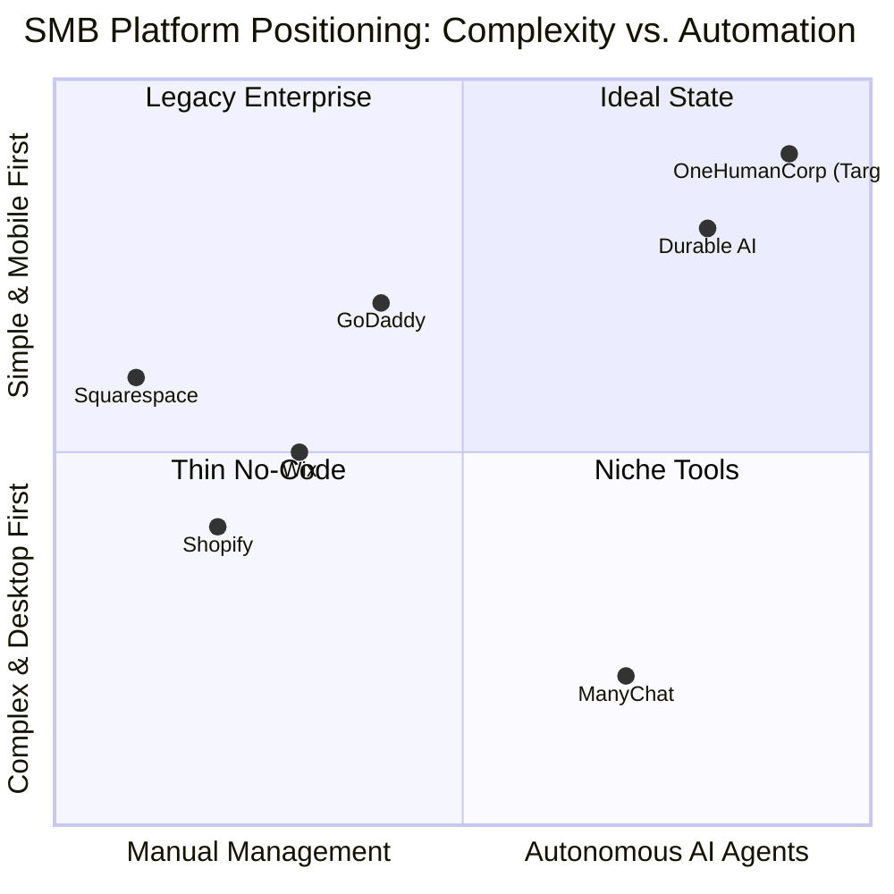

# OHC Market Dominance & Strategy Report: SMB Platform Gap

## Executive Summary
OneHumanCorp (OHC) is uniquely positioned to capture the non-technical small business (SMB) market by prioritizing radical simplicity and autonomous background AI agents. While competitors like Shopify and Wix offer powerful tools, they overwhelm users with complex onboarding and manual management. This report outlines OHC's strategy to leapfrog competitors by focusing on our core personas: the baker, the handyman, the boutique owner, the tutor, and the food cart operator.

---

## 1. Market Sizing & Strategic Direction

### Total Addressable Market (TAM)
- **Global:** Over 400 million small and medium-sized enterprises (SMEs) worldwide.
- **US Market:** ~33 million small businesses, with over 27 million being non-employer firms (solo entrepreneurs).
- **Online Presence:** Approximately 30-40% of small businesses still lack a dedicated website or online storefront, relying entirely on fragmented social media (Instagram, WhatsApp) or word-of-mouth.

### Strategic Beachhead
**The Service-to-Product Hybrid:** Focus first on personas like Priya (boutique owner) and Maya (baker) who blend physical goods with service elements (e.g., custom cake orders). They have the highest density of unmet needs regarding unified inventory and fragmented communication channels.

### Geographic & Vertical Expansion
- **Geography:** Following English markets, prioritize Spanish (LATAM/US Hispanic) and Portuguese (Brazil) due to high mobile-first SMB adoption and reliance on WhatsApp for commerce.
- **Vertical:** Maintain a horizontal platform but introduce "Smart Templates" tailored to specific workflows (e.g., "Food Cart Mode" vs. "Handyman Mode").

---

## 2. Competitor Audit & Feature Gap

We conducted a deep audit of the leading platforms, evaluating them specifically through the lens of a non-technical mobile-first user.

### Competitor Landscape

### Feature Gap Matrix

| Feature | Shopify | Wix | Squarespace | OHC (Current Gap) | OHC (Target Advantage) |
| :--- | :--- | :--- | :--- | :--- | :--- |
| **Setup Time** | Hours/Days | Hours | Hours | High friction | < 10 mins (AI Generated) |
| **Mobile Management** | Fragmented Apps | Limited Editor | View-mostly | Lacking full parity | 100% Mobile Parity (375px first) |
| **Customer Comms** | Basic Inbox | Basic Inbox | No unified inbox | Missing unified layer | AI Agent Auto-Drafting Replies |
| **Inventory Sync** | Add-on required | Good | Manual | Unreliable sync | Real-time POS/Online sync via AI |
| **AI Assistants** | Sidekick (Chat) | Setup only | Minimal | No background agents | Autonomous Background Agents |

**Actionable Gaps Identified for OHC:**
- [x] Gap: No AI agent for drafting customer replies from social channels. *(Brief created)*
- [x] Gap: Inventory sync is not mobile-first. *(Brief created)*
- [x] Gap: Product creation requires manual data entry. *(Brief created)*

---

## 3. SMB User Pain Point Research

Based on an analysis of r/smallbusiness, r/ecommerce, and Trustpilot reviews (1-2 stars for major platforms).

### Top 10 SMB Pain Points (Ranked)
1. **Inbox Overwhelm:** Managing Instagram DMs, WhatsApp, and Emails simultaneously.
2. **Setup Complexity:** "I just want to sell my product, not learn web design."
3. **Inventory Disconnect:** Selling out in-store but the website still shows stock.
4. **Product Entry:** Taking photos and writing descriptions takes too long on a phone.
5. **Missed Leads:** Failing to reply to inquiries while busy working (e.g., handyman on a roof).
6. **Hidden Fees:** Unpredictable pricing tiers and paid add-ons required for basic features.
7. **Mobile App Limitations:** Being forced to use a laptop for essential tasks.
8. **Marketing Paralysis:** Not knowing what to post on social media to drive sales.
9. **Shipping Chaos:** Manual label printing and tracking updates.
10. **Cash Flow Visibility:** Difficulty understanding daily profit vs. revenue.

### Persona Mapping
- **Maya (Baker):** Pain points 1, 4. Needs the AI Customer Reply Agent.
- **Priya (Boutique):** Pain point 3. Needs Mobile-First Inventory Sync.
- **Carlos (Handyman):** Pain point 5. Needs automated scheduling and unified inbox.

---

## 4. OHC AI Differentiation Manifesto

OHC will not use AI as a chat widget. We will use AI as an invisible, autonomous operations team.

**The 5 AI Automations OHC Will Implement First:**
1. **Auto-Drafting Customer Replies:** Saves 1-2 hours daily. The owner just taps "Approve" on their phone.
2. **1-Tap Product Generation:** Analyzes a photo, writes the description, and sets SEO tags instantly.
3. **Proactive Inventory Reordering:** Monitors stock levels and drafts supplier emails before items run out.
4. **Autonomous Social Media Generation:** Drafts weekly Instagram posts based on new inventory or low-selling items.
5. **Plain-Language Daily Briefing:** Translates complex analytics into a simple morning notification ("You made $400 yesterday, and 3 people are waiting for a reply").

**Evidence:** Users consistently abandon tools that require them to *learn* how to prompt AI. OHC wins by removing the prompting layer entirely. The AI works in the background and surfaces decisions for approval.
