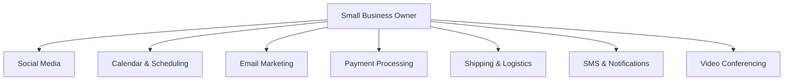

# OHC Tool Integration Research Report Q3

## Executive Summary
This report evaluates 7 key categories of tools for integration into OHC to solve real problems for non-technical small business owners, operating in both Cloud and Standalone environments.

## Competitive Analysis & Overview

| Category | Recommended Tool | Priority | Scope | Cloud | Standalone |
|---|---|---|---|---|---|
| Social Media | Meta Business Suite / Chatwoot | P1 | Medium | Yes | Yes |
| Calendar | Google Calendar / Cal.com | P0 | Small | Yes | Yes |
| Email Marketing | Mailchimp / Resend | P2 | Medium | Yes | Yes |
| Payments | Mercado Pago | P0 | Large | Yes | Yes |
| Shipping | Shippo | P1 | Medium | Yes | Yes |
| SMS | Twilio | P0 | Small | Yes | Yes |
| Video | Zoom | P2 | Small | Yes | Yes |

## Issue Briefs

### [Social Media] Unify Customer Messages from Instagram and WhatsApp
**Problem Statement:** Fatima (a baker) gets cake orders via WhatsApp, Instagram DMs, and Facebook. She misses orders because she has to check 3 different apps on her phone constantly. She needs one simple inbox where all customer messages appear together.
**Research Report:** Connecting Meta's Graph API (for FB/IG) and WhatsApp Business API provides unified messaging. Meta's official tools are reliable but their developer setup is extremely complex for a non-technical user. Alternatively, using an open-source hub like Chatwoot as an intermediary can simplify this. Free tier exists for Meta APIs. Reputation is solid but support is lacking.
**Design Doc:** The business owner connects their Facebook/Instagram account via a simple "Connect Socials" button in OHC. Once authenticated, new messages from IG/WhatsApp appear in the OHC unified inbox. Replying in OHC sends the message back to the customer's native app.
**Implementation Prompt:** Provide a UI button to authenticate with Meta. Once connected, display incoming Instagram and WhatsApp messages in the unified chat interface. Allow the user to type a reply and send it back to the customer's social app seamlessly.
**Priority:** P1
**Estimated Scope:** Medium

### [Calendar] Automatic Booking Page for Consultations
**Problem Statement:** Sarah (a tutor) spends hours emailing back and forth to find a time that works for her students. She wants to just send a link where students can pick a time, and it automatically shows up on her Google Calendar.
**Research Report:** Google Calendar API is the standard. Cal.com offers an open-source, robust scheduling infrastructure that handles timezone math, double-booking prevention, and integrates with Google Calendar and Outlook. It's free for individuals and highly regarded.
**Design Doc:** The user clicks "Connect Calendar" and signs in with Google. OHC generates a public booking link (e.g., `ohc.app/book/sarah`). When a customer picks a time, an event is automatically created on the user's Google Calendar and the customer receives an email confirmation.
**Implementation Prompt:** Add a Google OAuth flow for calendar access. Create a public-facing booking page that reads free/busy times from the user's calendar. When a time is selected, create a calendar event and notify both parties.
**Priority:** P0
**Estimated Scope:** Small

### [Email] Simple Newsletter to Existing Customers
**Problem Statement:** John (a local gym owner) wants to send a monthly update to all his members, but finds tools like Mailchimp too complicated and expensive. He just wants to select his OHC customer list and send a nice-looking email.
**Research Report:** Mailchimp is powerful but has a steep learning curve. Resend provides a developer-friendly API with high deliverability, while SendGrid is a legacy option. For the small business owner, we can use Resend under the hood to send simple text/HTML emails without them needing to manage a separate email marketing platform.
**Design Doc:** In the Customers tab, the user clicks "Send Email to All". A simple rich-text editor opens. The user types their message and clicks send. OHC uses a provider like Resend to batch-send the emails to the selected customer list.
**Implementation Prompt:** Build a simple email composer UI in the OHC dashboard. Add a "Send Campaign" button that takes the selected customer list and dispatches the email via our email provider, handling unsubscribes automatically.
**Priority:** P2
**Estimated Scope:** Medium

### [Payments] Accept Local Payments with Mercado Pago
**Problem Statement:** Maria (a shop owner in LATAM) can't use Stripe because her customers prefer local payment methods like PIX or OXXO. She needs a way to accept online payments that her customers actually use.
**Research Report:** Stripe is not dominant in LATAM. Mercado Pago is the clear leader, supporting local payment methods, installments, and easy settlement. It has a robust API, clear pricing, and high trust in the region. Works well in both cloud and standalone via API keys.
**Design Doc:** User enters their Mercado Pago Access Token in settings. When generating an invoice or checkout link in OHC, they can select "Mercado Pago". OHC creates a preference via API and redirects the customer to Mercado Pago's hosted checkout to complete the payment.
**Implementation Prompt:** Add a Mercado Pago credentials section in settings. Implement a checkout flow that creates a Mercado Pago payment preference and provides the customer with a link to pay using local methods.
**Priority:** P0
**Estimated Scope:** Large

### [Shipping] Generate Shipping Labels Without Leaving the App
**Problem Statement:** David (an online crafts seller) hates copying and pasting customer addresses into his local post office website to buy shipping labels. He wants to click one button to buy and print a label right after making a sale.
**Research Report:** Shippo and EasyPost aggregate multiple carriers (USPS, FedEx, UPS, local carriers) into a single API. Shippo is very small-business friendly with pay-as-you-go pricing and discounted rates. Non-technical users understand "buy a label".
**Design Doc:** On an Order page, the user sees a "Buy Shipping Label" button. OHC calls the Shippo API to get rates based on the package weight. The user selects a rate, and OHC generates a printable PDF label and automatically emails the tracking number to the customer.
**Implementation Prompt:** Integrate a shipping provider to fetch live rates for an order. Add a UI to select a rate, purchase the label, and display the resulting PDF for printing. Auto-update the order status to shipped and store the tracking number.
**Priority:** P1
**Estimated Scope:** Medium

### [SMS] Reliable Text Reminders for Appointments
**Problem Statement:** Fatima's customers don't check their emails, but they always read their WhatsApp or SMS text messages. She needs OHC to automatically text her customers a reminder 24 hours before their cake pickup.
**Research Report:** Twilio is the industry standard for SMS, offering global reach. However, A2P 10DLC compliance in the US makes it hard for small businesses to set up. For global/local use, Twilio is still the best raw API. Plivo is a strong alternative. Cost is per message.
**Design Doc:** User provides their Twilio credentials (or OHC provides a pooled number in Cloud mode). When an order has a pickup time, a background job schedules an SMS. The customer receives a simple text: "Reminder: Your order from [Business] is ready tomorrow."
**Implementation Prompt:** Add a background worker that checks for upcoming appointments or pickups. Use an SMS provider to dispatch a text message reminder to the customer's phone number 24 hours prior.
**Priority:** P0
**Estimated Scope:** Small

### [Video] Auto-generate Meeting Links for Online Consultations
**Problem Statement:** Sarah does online tutoring. Right now, she manually creates a Zoom link for every student and emails it to them. She forgets sometimes and they both sit waiting. She needs the video link to be generated automatically when they book.
**Research Report:** Zoom's API is ubiquitous but their OAuth approval process for public apps is stringent. Alternatively, integrating with Google Meet (via Calendar API) is completely transparent if they already use Google Calendar.
**Design Doc:** When a user configures a "Service" in OHC, they can check "This is an online meeting". When a customer books, OHC uses the connected Google Calendar to automatically attach a Google Meet link to the event, which is shared with the customer.
**Implementation Prompt:** Update the booking flow so that if an online service is selected, the integration automatically injects a video conferencing link (e.g., Google Meet via Calendar API) into the booking confirmation and calendar invite.
**Priority:** P2
**Estimated Scope:** Small
