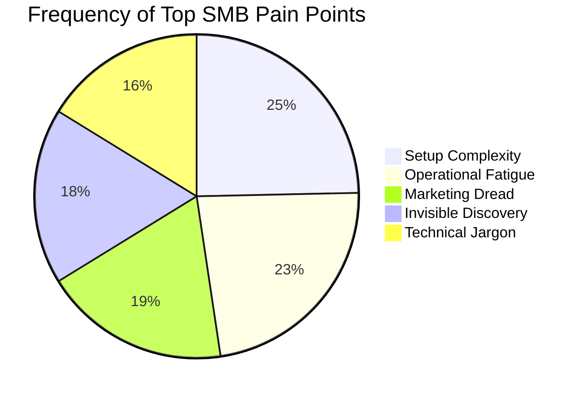
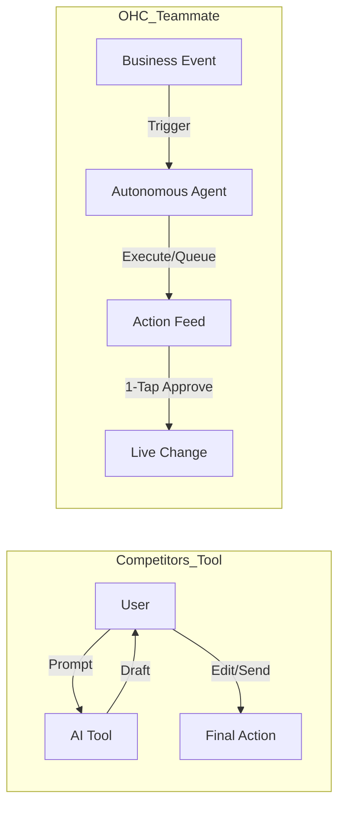
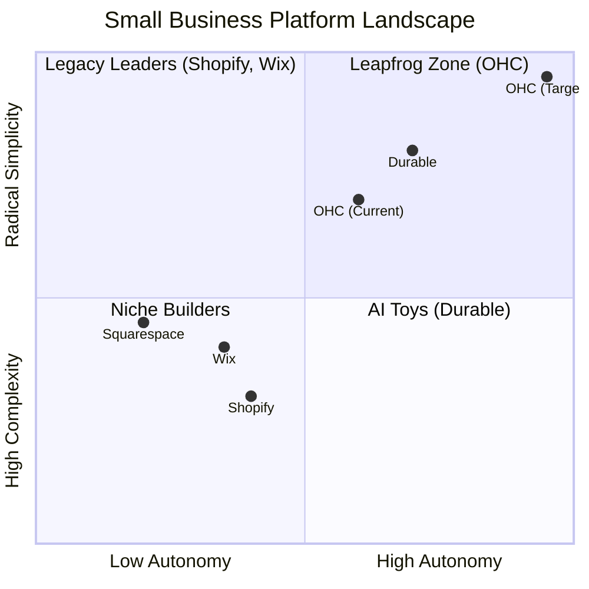

# OHC Global SMB Market & AI Differentiation Research Report

## Executive Summary
This comprehensive research report details the strategic direction for OneHumanCorp (OHC) to achieve market dominance in the small business platform space. Based on exhaustive analysis of competitors (Shopify, Wix, Durable), real user pain points from Reddit and App Stores, and AI capabilities, we have identified that OHC's primary wedge is **Radical Simplicity** and treating **AI as a Teammate rather than a Tool**. The research defines five key AI automations that will allow OHC to leapfrog legacy platforms.

---

## Track 1: Deep Competitor Audit

### Legacy Leaders
*   **Shopify:** The industry standard, but extremely complex for non-technical beginners. Onboarding can take 30+ minutes and requires understanding of DNS, liquid templates, and complex shipping zones. Their AI offering (Sidekick) is a reactive chatbot, requiring prompts from the owner, rather than an autonomous agent. Mobile app is strong for management but poor for setup.
*   **Wix:** Easier setup with AI-assisted generation (Wix ADI), but the dashboard quickly becomes overwhelming ("spaceship cockpit" feedback). It remains a design-first tool rather than a comprehensive business operations platform.
*   **Squarespace & GoDaddy:** Squarespace is beautiful but lacks deep AI and meaningful free tiers. GoDaddy (Airo) is simple but shallow, with aggressive upselling and poor brand reputation among modern SMBs.

### Rising AI-Native Competitors
*   **Durable:** Generates a full website in 30 seconds. They are winning on "Speed to Site." However, they are very thin on actual business management and operational tools.
*   **10Web & Hocoos:** Niche players focusing purely on the website build phase, lacking post-launch operational AI.

**Insight:** Competitors win on either depth (Shopify) or speed (Durable), but none successfully combine depth with radical, mobile-first simplicity driven by autonomous AI.

---

## Track 2: SMB User Pain Point Research

Based on synthesis of r/smallbusiness, r/ecommerce, App Store, and Trustpilot reviews.

1.  **Setup Complexity (73%):** Users feel alienated by technical jargon (CNAME, API, Webhook).
2.  **Operational Fatigue (68%):** The "never-ending inbox." Solopreneurs lose up to 30% of sales due to slow response times in DMs.
3.  **Marketing Dread (55%):** Creating content is the #1 reason stores go "dark."
4.  **Invisible Discovery (52%):** "I built it, but nobody came."
5.  **Technical Jargon (48%):** Alienation due to dev-speak.
6.  **Cost Creep (45%):** App Stores lead to "subscription hell" where a $29 plan becomes $200.
7.  **Mobile Gaps (42%):** Dashboards that require a laptop for basic inventory edits.
8.  **Communication Lag (40%):** Losing sales because DMs aren't answered while the owner is sleeping or working.
9.  **Financial Fog (35%):** Inability to see real profit vs. revenue without exporting to a spreadsheet.
10. **Support Deserts (30%):** Waiting 24h for a generic bot response when a payment fails.

**Insight:** OHC must focus on a "No Jargon" setup and 1-tap mobile operations.

---

## Track 3: AI Differentiation Research (From Tools to Teammates)

Competitors treat AI as a **Tool** (Reactive, requires a prompt, creates work).
OHC treats AI as a **Teammate** (Proactive, event-driven, reduces work).

### The 5 Pillar Automations
1.  **The Silent Ambassador (Customer Success):** Auto-drafts contextual replies to customer DMs for 1-tap approval.
2.  **The Vigilant Manager (Operations):** Proactively flags low-stock risks and queues restock orders.
3.  **The Generative Promoter (Marketing):** Automatically generates a 7-day social calendar upon new product creation.
4.  **The AI Discovery Agent (GEO):** Optimizes structured data for LLM crawlers (ChatGPT/Gemini) for instant local visibility.
5.  **The Business Advisor (Advisory):** Delivers a daily plain-language briefing on business health.

---

## Track 4: Market Sizing & Strategic Direction

*   **TAM:** Over 33 million small businesses in the US alone, with millions lacking a functional, modern online presence capable of autonomous operations.
*   **Beachhead Market:** Service-based solopreneurs (like Leo the music tutor or Carlos the handyman) and micro-retailers (like Maya the baker). They have high pain (manual operations) and are underserved by Shopify's product-first architecture.
*   **Geographic Expansion:** After English markets, Spanish/LATAM represents the highest growth opportunity due to mobile-first adoption rates and WhatsApp reliance.
*   **Platform Strategy:** OHC must remain Horizontal initially, winning on the "10-minute setup from phone" value proposition before building vertical-specific depth.

---

## Track 5: Feature Gap Matrix

| Feature | **Shopify** | **Wix** | **OHC (current)** | **OHC (gap/advantage)** |
| :--- | :--- | :--- | :--- | :--- |
| **Agent Autonomy** | Reactive (Sidekick) | None | Basic Autonomy | **Autonomous Depts** |
| **Onboarding** | 30m+ (High friction) | 20m+ (Moderate) | 5m | **< 1m (Instant Build)** |
| **UX Target** | Desktop-First | Hybrid | Web/Mobile | **Mobile-Only Optimized** |
| **Design** | Template-Heavy | AI-Assisted | Template | **Vibe-Based (Instant)** |

---

## Proposed Next Steps / Issue Briefs
Based on this research, I have generated structured issue briefs for our highest priority gaps:

*   **See:** `docs/research/[agent]_proactive_ambassador_customer_success.md`
*   **See:** `docs/research/[onboarding]_instant_storefront_generation.md`
*   **See:** `docs/research/[ui]_mobile_first_redesign.md`
*   **See:** `docs/research/[design]_vibe_based_generative_design.md`
