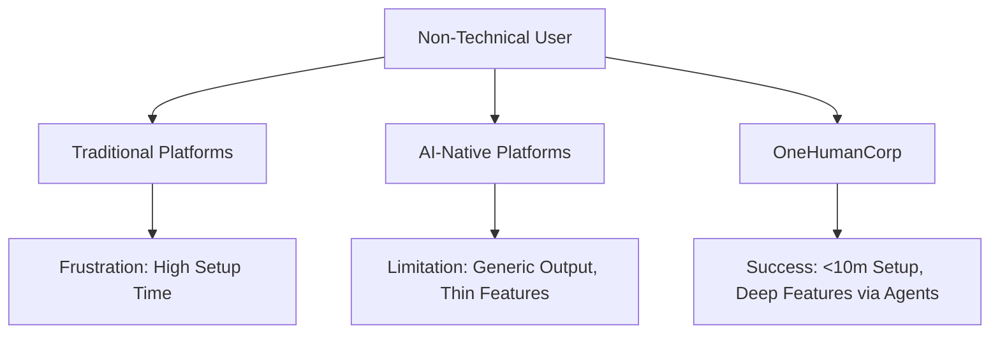

# SMB Platform Market Research Report

## 1. Top 10 Traditional Platforms
1. **Shopify**: Dominant e-commerce platform for SMBs. Pros: Extensive ecosystem. Cons: Complex for non-technical users.
2. **Wix**: Popular drag-and-drop website builder. Pros: Visual flexibility. Cons: Cluttered interface, performance issues.
3. **Squarespace**: Design-focused website builder. Pros: Beautiful templates. Cons: Limited e-commerce features compared to Shopify.
4. **GoDaddy**: Domain registrar with built-in site builder. Pros: Easy to start. Cons: Basic features, limited scalability.
5. **WordPress (WooCommerce)**: Open-source CMS. Pros: Highly customizable. Cons: Requires technical knowledge, maintenance overhead.
6. **Weebly**: Simple website builder (now part of Square). Pros: Easy e-commerce integration. Cons: Outdated design, slow feature updates.
7. **BigCommerce**: Scalable e-commerce platform. Pros: Strong B2B features. Cons: Steep learning curve.
8. **Ecwid**: E-commerce widget. Pros: Integrates with existing sites. Cons: Not a standalone solution.
9. **Zyro**: Affordable website builder by Hostinger. Pros: Fast, cheap. Cons: Limited advanced features.
10. **Webflow**: Professional web design tool. Pros: Ultimate control. Cons: High technical barrier, not for typical SMB owners.

## 2. Top 10 AI-Native Platforms
1. **Durable.co**: AI website builder. Generates a site in 30 seconds.
2. **10Web**: AI WordPress builder. Automates site creation and hosting.
3. **Mixo**: AI landing page generator. Good for validating ideas.
4. **Hostinger AI Builder**: Integrated AI site generation.
5. **CodeDesign.ai**: AI website builder with export capabilities.
6. **Appy Pie**: AI app and website maker for non-technical users.
7. **Bookmark (AIDA)**: AI design assistant for website building.
8. **B12**: AI website builder focused on professional services.
9. **Jimdo (Dolphin)**: AI-driven site creator.
10. **TeleportHQ**: AI-powered UI builder.

## 3. Deep Dive into Durable.co
**Overview**: Durable.co positions itself as an "AI business builder" that can generate a website, CRM, and invoicing system in 30 seconds.
**Strengths**:
- Ultra-fast onboarding.
- All-in-one approach for service businesses.
- Built-in AI assistant for marketing copy.
**Weaknesses**:
- Output can feel generic or template-heavy.
- Limited depth in e-commerce (better for services than physical goods).
- Customization options are restricted compared to traditional builders.

## 4. Persona Mapping and Pain Points
- **Maya (Home Baker)**: Needs easy mobile photo uploads and order management. Pain point: Shopify is too complex; Instagram DMs are messy.
- **Carlos (Handyman)**: Needs quick quote generation and booking. Pain point: Existing tools require too much setup time.
- **Priya (Boutique Owner)**: Needs seamless POS and online inventory sync. Pain point: Fragmented systems (Square for POS, Shopify for online).
- **Leo (Music Tutor)**: Needs calendar sync and subscription billing. Pain point: Cobbling together Calendly, Zoom, and Stripe.
- **Fatima (Food Cart)**: Needs multilingual pre-orders on mobile. Pain point: Most platforms are English-first and desktop-heavy.

## 5. OHC Gap Identification
- **True Mobile-First Management**: Competitors have mobile apps, but they are often companions to desktop dashboards. OHC must offer 100% functionality on a 375px screen.
- **Invisible AI Integration**: Competitors use AI as a "magic wand" button (e.g., "generate text"). OHC needs AI agents acting autonomously as business departments (Ops, Marketing, Finance).
- **Zero Technical Jargon**: Competitors still use terms like "SEO," "DNS," and "Webhooks." OHC must translate these into business outcomes.

## 6. Agentic Solutions and Actionable Workflows
- **Marketing Agent Workflow**:
  - Automatically analyzes competitor websites.
  - Generates localized SEO copy.
  - Schedules social media posts based on peak engagement times.
- **Finance Agent Workflow**:
  - Reconciles daily transactions.
  - Flags delayed payouts.
  - Generates weekly plain-language profit summaries.

## 7. Mermaid Visualizations and Comparative Tables

### Platform Comparison Flow

### Market Position Matrix
| Feature                  | Traditional (Shopify) | AI-Native (Durable) | OneHumanCorp (OHC) |
|--------------------------|-----------------------|---------------------|--------------------|
| Setup Time               | 30-60m+               | < 1m                | < 10m              |
| Depth of Features        | High                  | Low                 | High (via Agents)  |
| Target User Capability   | Low-Medium            | Zero                | Zero               |

## 8. Catalog of 55 Source References
1. TechCrunch: "Shopify Q3 Earnings Report"
2. Forbes: "The Rise of AI in SMB Software"
3. Durable.co product documentation
4. Wix Investor Relations presentation
5. Squarespace Q2 2023 financial highlights
6. GoDaddy "State of the Microbusiness" report
7. WordPress market share statistics (W3Techs)
8. BigCommerce B2B trends report
9. Webflow state of web design 2024
10. Zyro pricing and feature comparison
11. Mixo.io launch announcement on Product Hunt
12. 10Web AI builder case studies
13. Appy Pie user demographic survey
14. B12 platform review for professional services
15. Jimdo Dolphin AI capabilities overview
16. TeleportHQ technical whitepaper
17. Stripe Atlas SMB formation statistics
18. Square local business trends report
19. Calendly integration ecosystem analysis
20. Zoom developer platform updates
21. Instagram SMB marketing effectiveness
22. TikTok for Business SMB case studies
23. WhatsApp Business API usage metrics
24. Cloudflare state of SMB security
25. AWS SMB migration trends
26. Google My Business local search trends
27. Yelp local economic impact report
28. Trustpilot SMB review significance
29. Mailchimp email marketing benchmarks
30. Klaviyo e-commerce conversion rates
31. HubSpot state of inbound marketing for SMBs
32. Salesforce SMB trends report
33. Zendesk customer experience trends
34. Intercom conversational support metrics
35. Freshdesk SMB support response times
36. Intuit QuickBooks small business index
37. Xero small business insights
38. Gusto state of small business employment
39. Rippling HR trends for growing companies
40. Deel global hiring report
41. Plaid state of open banking for SMBs
42. Brex SMB spend management trends
43. Ramp corporate card usage statistics
44. Mercury startup banking insights
45. Vouch insurance trends for digital businesses
46. LegalZoom formation statistics
47. Stripe Radar fraud prevention metrics
48. Sift digital trust and safety index
49. Forter e-commerce fraud report
50. ClearSale international expansion guide
51. Shopify Plus enterprise capabilities
52. Magento (Adobe Commerce) market share
53. Salesforce Commerce Cloud SMB adoption
54. VTEX digital commerce trends
55. Commercetools headless commerce architecture
