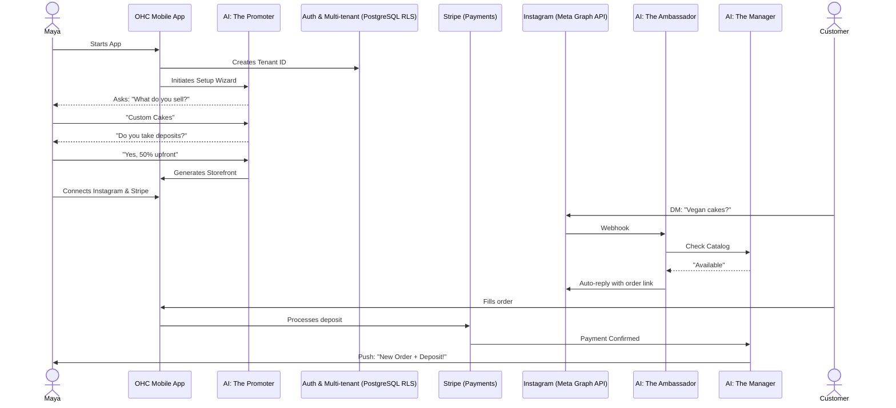
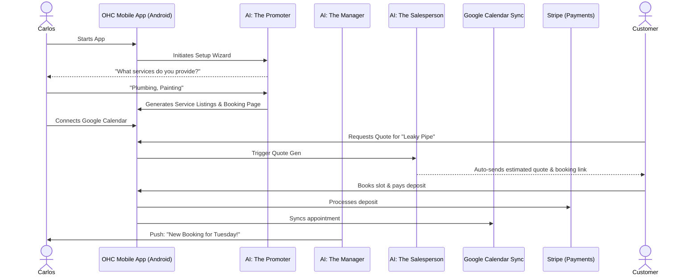
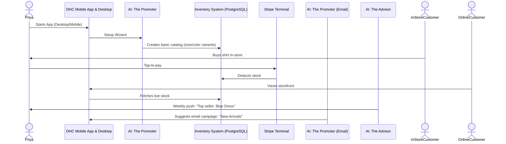
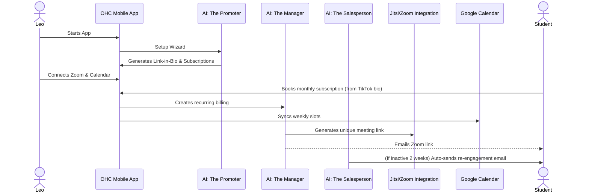
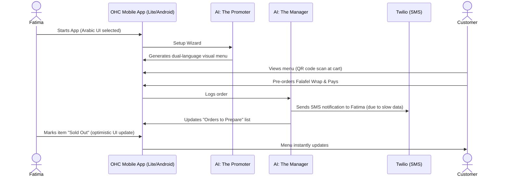

# [architecture]_business_journey.md

## Title
Business Journey Architecture: End-to-End Flows for Core Personas

## Problem Statement
Non-technical small business owners face significant friction when trying to launch their business online. Current onboarding and management tools (like Shopify, Wix, Calendly) are overly complex and disjointed, requiring manual setup of storefronts, payment gateways, and booking systems. Our users (Maya, Carlos, Priya, Leo, Fatima) need a guided, under-10-minute journey that invisibly utilizes AI agents to set up their specific business types and handle ongoing operations across various channels.

## Research Report
- **Competitive Analysis**: Shopify takes 30-60 minutes for basic setup. Wix and Squarespace demand design effort. GoDaddy lacks comprehensive booking/pos tools. None offer built-in AI agents that actively manage operations like customer replies or schedule coordination.
- **Data**: Our personas primarily use mobile devices (especially smartphones) for business management. Customer interactions happen across diverse channels (Instagram DMs, email, SMS, in-person).
- **Proposed Solution**: Frictionless, mobile-first setup wizards driven by a conversational AI agent ("The Promoter"), combined with background agents ("The Manager", "The Ambassador", etc.) to handle ongoing operations, bookings, inventory, and customer interactions tailored to each persona's unique needs.

## Design Doc

### Key Friction Points Identified (General)
- **Technical Jargon**: Terms like "DNS", "Payment Gateways", and "Webhooks" cause immediate abandonment.
- **Upfront Pricing Models**: Rigid pricing forcing paid tiers before seeing value.
- **Disjointed Tools**: Having to connect separate tools for website, booking, payments, and messaging.

---

### Persona 1: Maya (The Home Baker)
**Profile**: Sells custom cakes via Instagram DMs. Needs deposit-based custom orders and DM auto-replies. Runs everything from iPhone.

#### Architecture Diagram

#### Mobile UX Flow
1. **Acquisition**: Clicks Instagram ad.
2. **Onboarding**: Enters name -> Selects "Physical Products" -> Uploads cake photos -> AI generates storefront.
3. **Activation**: Connects Stripe and Instagram. Store goes live.
4. **Friction Points**: Connecting Stripe can be complex; offer "Receive money later" deferred setup.

---

### Persona 2: Carlos (The Freelance Handyman)
**Profile**: Needs service listings, booking calendar with deposits, customer inbox, and AI quote generator. Android phone only.

#### Architecture Diagram

#### Mobile UX Flow
1. **Acquisition**: Word of mouth; signs up via mobile web.
2. **Onboarding**: Selects "Services" -> Lists basic services -> AI builds booking page.
3. **Activation**: Syncs Google Calendar to avoid double-booking.
4. **Friction Points**: Accurately pricing unknown jobs; offer "Request Quote" instead of fixed prices.

---

### Persona 3: Priya (The Boutique Owner)
**Profile**: Needs storefront synced with in-store inventory, variants, in-person POS, email marketing, daily analytics.

#### Architecture Diagram

#### Mobile UX Flow
1. **Acquisition**: Upgrading from disjointed systems (Shopify + manual POS).
2. **Onboarding**: Uploads CSV of inventory or adds variants manually -> AI sets up omnichannel store.
3. **Activation**: Orders Stripe Reader for in-person sales.
4. **Friction Points**: Managing complex variants (Size/Color matrix) on mobile; needs highly optimized mobile grid UI.

---

### Persona 4: Leo (The Music Tutor)
**Profile**: Needs lesson booking, automated Zoom links, subscription pricing, TikTok link-in-bio, automated follow-ups.

#### Architecture Diagram

#### Mobile UX Flow
1. **Acquisition**: Sees TikTok ad for easy booking pages.
2. **Onboarding**: Selects "Subscriptions/Services" -> Sets up monthly packages -> Generates link-in-bio.
3. **Activation**: Pastes OHC link into TikTok bio.
4. **Friction Points**: Understanding subscription vs one-off pricing; ensure wizard clearly separates these.

---

### Persona 5: Fatima (The Food Cart Operator)
**Profile**: Needs photo menu, sold-out toggles, pre-order/pickup flow, simple daily order list printable from app, Arabic+English UI. Low-end Android, slow data.

#### Architecture Diagram

#### Mobile UX Flow
1. **Acquisition**: Local flyer or community referral.
2. **Onboarding**: Selects "Food & Beverage" -> Uploads menu photos -> AI sets up pre-order system.
3. **Activation**: Prints QR code for cart window.
4. **Friction Points**: Slow network connections causing app timeouts; requires robust offline-first/optimistic UI architecture for order management.

---

## Implementation Prompt
Implement the underlying database entities, API endpoints, and event routing to support the unified setup wizard and onboarding logic. Create generic webhook handlers for connected third-party apps (Instagram, Stripe, Calendars). Ensure multi-tenant isolation via Row-Level Security across all generated data (catalogs, bookings, orders).

- **User Story**: As a business owner across various verticals, I want a unified, conversational setup process that configures the right modules (booking, physical, POS) automatically.
- **Acceptance Criteria**:
  - The backend supports dynamic tenant configuration based on business type.
  - The database schema robustly handles different product types (services vs variants vs subscriptions).
  - RLS policies ensure secure tenant data separation.
- **Priority**: P0
- **Estimated Scope**: Large
