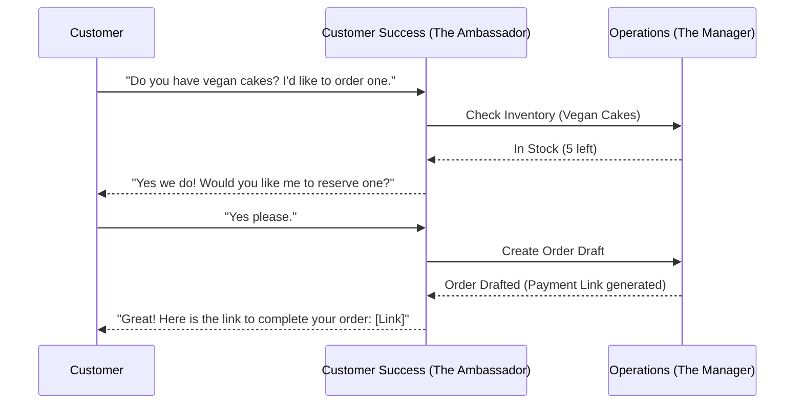

# AI Agent Department Architecture

## Problem Statement

Small business owners—whether a baker selling via Instagram, a handyperson relying on word-of-mouth, or a local boutique—are overwhelmed by the operational complexity of running a business. They want to focus on their craft, but are dragged down by administrative tasks: answering repetitive customer queries ("Do you do vegan cakes?"), updating inventory, managing bookings, sending payment links, following up on leads, and handling social media.

They lack the time, technical skills, and budget to manage 10 different SaaS tools or hire staff. What they need is an "invisible team" that handles these operational, marketing, and sales tasks autonomously, working in the background 24/7 so they can focus on their core product.

## Research Report

Small Business pain points currently revolve around operational sprawl. Platforms like Shopify, Wix, and Squarespace provide powerful tools but expect the user to act as the mechanic—configuring plugins, designing layouts, and setting up complex workflows.

- **Shopify:** Excellent for e-commerce, but has a steep learning curve. The burden is on the merchant to install the right apps (marketing, customer support) and configure them.
- **Wix/Squarespace:** Great drag-and-drop builders, but they are static tools. You still have to manually follow up with leads, write the content, and manage SEO.
- **GoDaddy:** Aims for simplicity, but often falls short on robust operational automation.

**The Paradigm Shift:** OHC introduces a shift from "Here are the tools, figure it out" to "Here is your team, they will handle it." We are organizing AI agents into Departments that mirror a real-world business structure, using friendly, accessible names.

## Design Doc

The OHC AI Agent system is structured into specialized **Departments**. Each department has a defined scope of responsibility, memory of past interactions, and ability to coordinate with other departments.

### Department Roster

1. **Operations ("The Manager"):**
   - **Scope:** Order processing, inventory tracking, fulfillment, refunds, and scheduling.
   - **Behavior:** Triggers automatically on an incoming order. It checks inventory, updates stock, and prepares the fulfillment slip.

2. **Customer Success ("The Ambassador"):**
   - **Scope:** Message replies, order updates, review requests, and re-engagement campaigns.
   - **Behavior:** Monitors incoming DMs (e.g., Instagram, WhatsApp). Replies to FAQs ("Yes, we make vegan cakes!"). When Operations marks an order as shipped, The Ambassador sends the tracking link.

3. **Sales & Acquisition ("The Salesperson"):**
   - **Scope:** Quote generation, lead follow-up, and upsell suggestions.
   - **Behavior:** When a user requests a quote via the site, it drafts a response, suggests complementary products, and follows up after 3 days if no response.

4. **Marketing & Advertising ("The Promoter"):**
   - **Scope:** Website design updates, SEO, social media posts, and promotional content.
   - **Behavior:** Proposes weekly social media posts based on current inventory. Generates QR codes for offline flyers.

5. **Finance & Payments ("The Accountant"):**
   - **Scope:** Payment processing, financial reports, subscription billing, and tax summaries.
   - **Behavior:** Reconciles daily transactions, follows up on failed deposits, and sends a weekly summary ("You made $400 this week!").

6. **Legal & Compliance ("The Protector"):**
   - **Scope:** Terms/policies, contracts, GDPR compliance.
   - **Behavior:** Ensures the storefront has basic required disclaimers.

7. **Business Advisory ("The Advisor"):**
   - **Scope:** Weekly health reports, next-action suggestions, and trend analysis.
   - **Behavior:** Sends a Sunday briefing: "Your vegan cakes are trending. Consider offering a vegan cupcake bundle next week."

### Architecture & Coordination

**How Departments Coordinate:**
Agents communicate through an asynchronous event bus (Event Mesh).
- *Event:* `OrderPlaced`
- *Action:* The Manager updates inventory.
- *Event:* `InventoryUpdated`
- *Action:* The Ambassador sends an order confirmation message to the customer.

**Agent Memory and Context:**
Agents share a unified context layer. The Ambassador knows what The Manager did because they both read from the same tenant-isolated unified timeline for a customer.

**Approval Workflows (Auto-execute vs. Draft-for-review):**
- **Draft-for-review (Default for new users):** The agent prepares an action (e.g., drafting an Instagram reply) and sends a notification: "I drafted a reply to Maya. Send?"
- **Auto-execute (For trusted workflows):** The user toggles "Handle FAQs automatically." The agent acts without asking.

**Throttling & Budgeting:**
AI actions are metered per tenant tier. The Event Mesh enforces limits, gracefully falling back or pausing agent activity when monthly limits are reached.

### Key Decisions

- **User-Centric Naming:** Agents are presented as "The Manager" or "The Promoter" rather than "LLM Worker Node 1".
- **Shared Timeline:** All agents append their actions to a single customer timeline, avoiding confusing overlapping messages.
- **Progressive Trust:** Agents start by asking permission for everything, and users gradually grant them autonomy as trust builds.

### Diagrams

## Implementation Prompt

**Role:** Implementer
**Task:** Build the core coordination framework for the AI Agent Departments (Operations, Customer Success, etc.).
**CUJ (Customer User Journey):**
1. The business owner navigates to the "My Team" tab on their mobile app.
2. They see a list of their available AI "employees" (The Manager, The Ambassador, etc.).
3. They toggle "The Ambassador" to automatically reply to simple FAQs.
4. An incoming customer message arrives; "The Ambassador" reads the unified customer timeline, determines the answer, replies to the customer, and logs the action on the timeline.

**Acceptance Criteria:**
- Create the structural foundation for Agent Departments to subscribe to events (e.g., incoming messages, order creations).
- Ensure agents can read from and append to a unified, tenant-isolated customer timeline.
- Implement a progressive trust mechanism where an agent action can be flagged as "draft-for-review" or "auto-execute" based on user settings.
- Ensure the feature is fully responsive and testable from a mobile viewport (375px width).

## Priority
P0 (Critical)

## Estimated Scope
Large