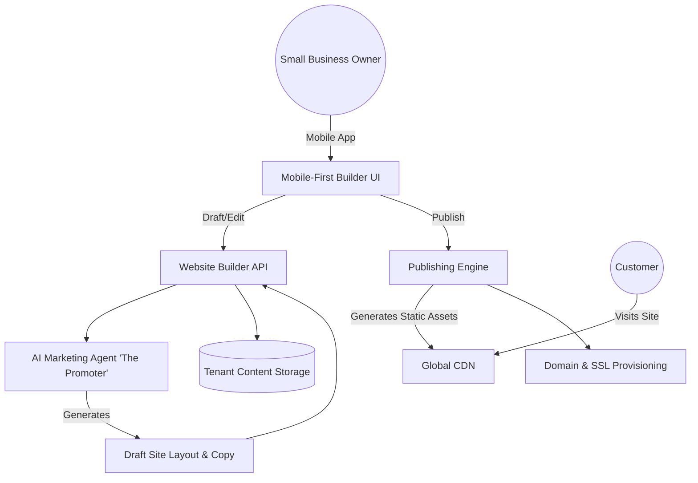

# 🏗️ Mobile-First AI Website & Storefront Builder Architecture

## Problem Statement
Small business owners like Maya (The Home Baker) and Carlos (Handyman) need a professional online presence to appear credible and accept orders or bookings. However, existing website builders are overwhelming, requiring them to choose from hundreds of templates, design layouts on a desktop computer, and navigate complex settings for SEO, DNS, and hosting. They need a simple, mobile-first builder that instantly generates a fully functional site and allows them to make quick edits from their phone without ever touching technical configurations.

## Research Report
- **Competitor Analysis:**
  - **Shopify / Wix / Squarespace:** Highly customizable but heavily desktop-optimized. The mobile apps are often companions to the desktop experience, not replacements. They present a steep learning curve for non-technical users.
  - **GoDaddy:** Offers simpler mobile builders but often lacks deep integration with the actual business operations (booking, inventory) without expensive add-ons.
- **The OHC Advantage:** "Radical Simplicity." Our builder will focus on pre-designed, high-converting content blocks (hero, product grid, booking calendar, contact form) rather than free-form canvas positioning. This guarantees the site always looks good and performs well on mobile.
- **Key Requirements:** One-click publishing, automatic SEO management, seamless custom domain connection, and zero-configuration SSL.

## Design Doc

### Architecture Diagram

### UI Wireframes & Mobile UX Flow
**Screen 1: AI Onboarding (375px)**
- Prompt: "Let's build your site. What's the main goal?" (e.g., Sell products, Get bookings, Display portfolio).
- Action: User selects an option and taps "Generate".

**Screen 2: The Live Preview (375px)**
- A full-screen preview of the AI-generated site.
- Floating action button: "Edit Page".
- Header: "Draft" badge with a prominent "Publish" button.

**Screen 3: The Block Editor (375px)**
- List of vertical blocks (e.g., [Hero Image], [About Me], [Top Products]).
- User can drag to reorder.
- Tapping a block opens a simple form to change text, swap an image, or toggle visibility. No pixel nudging or margin adjustments.

**Screen 4: Settings & Domain (375px)**
- Simple toggles for "Enable Search Engine Indexing".
- "Get a Custom Domain" button. User types `mayascakes.com`, OHC handles DNS setup seamlessly in the background.

### AI Agent Integration Points
- **The Promoter (Marketing & Advertising Agent):**
  - Triggers on initial site creation to generate the hero copy, "About Us" section, and suggest relevant stock imagery if the user hasn't uploaded any.
  - Automatically generates SEO meta titles and descriptions based on the business profile.
  - Suggests new blocks over time (e.g., "Add a Testimonials block to increase trust!").

### Key Design Decisions
- **Strict Block System over Free-form Canvas:** By restricting users to stacking pre-designed blocks, we guarantee the output is always mobile-responsive and visually premium. It eliminates the "broken layout" problem entirely.
- **Draft vs. Live State:** The user always edits a draft. The live site is only updated when they explicitly hit "Publish". This reduces fear of breaking the live storefront.
- **Abstracted Infrastructure:** SSL certificates, CDN invalidations, and DNS records are completely hidden from the user. OHC handles all infrastructure provisioning natively.

## Implementation Prompt
Implement the mobile-first drag-and-drop website builder.
- Build the core set of content blocks: Hero, Text, Product Grid, Booking Calendar, Testimonials, and Contact Form.
- Create the AI-assisted onboarding flow to generate an initial draft layout and copy.
- Implement the touch-optimized mobile editing interface (block reordering, simple property editing).
- Build the publishing mechanism that takes a draft state and deploys it.
- Ensure the architecture seamlessly supports custom domain connections and automatically generates SEO metadata.
- **Acceptance Criteria:** A user can create a site via AI, reorder and edit blocks on a mobile viewport, and publish the site to the public internet. The site must be fast, responsive, and include basic SEO.
- **Priority:** P0
- **Estimated Scope:** Large

