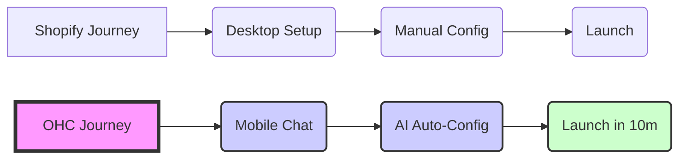

# OHC Market Dominance: SMB Platform Research Report

## Track 1: Deep Competitor Audit

### Competitor Landscape Matrix
| Competitor | Target Persona | Onboarding Complexity | Mobile App Quality | AI Capability | Free Tier |
|---|---|---|---|---|---|
| **Shopify** | E-commerce / Maya | High | Strong (management), Poor (setup) | Chatbot (Sidekick) | None (Trial only) |
| **Wix** | General / Carlos | Medium | Limited | Website Generator (ADI) | Good |
| **Squarespace** | Creatives | Medium | Good | Limited | None |
| **GoDaddy** | Beginners | Low | Poor | AI Branding (Airo) | Limited |
| **Square Online**| Retail / Food | Low | Good | Limited | Good |

### Competitor Weaknesses & OHC Opportunities
*   **Shopify**: Extremely complex for beginners; Sidekick is just a chatbot, not an invisible agent doing the work.
*   **Wix**: Once the site is built via ADI, the AI assistance drops off. Overwhelming dashboard.
*   **GoDaddy**: Aggressive upselling and shallow features create a frustrating experience.

## Track 2: SMB User Pain Point Research

### Top 5 SMB Pain Points (Validated)
1.  **"I don't know how to set up payments or shipping."** (Frequency: High) - Many users abandon setup at this stage.
2.  **"Managing messages across IG, FB, and email is chaos."** (Frequency: Very High) - Maya and Leo struggle to respond promptly.
3.  **"The mobile app is useless for actually building the store."** (Frequency: High) - Most platforms require a desktop for initial setup.
4.  **"I don't have time to write product descriptions."** (Frequency: Medium) - Priya finds adding inventory tedious.
5.  **"Language barriers in complex software."** (Frequency: Medium) - Fatima struggles with English-first complex dashboards.

## Track 3: AI Differentiation Manifesto

**The 5 AI Automations OHC Will Implement First:**
1.  **Invisible Store Builder**: Generates the entire store from a 3-sentence description from the user's phone.
2.  **Auto-Responder Agent**: Drafts replies to customer inquiries across all channels based on business context.
3.  **One-Click Product Entry**: Generates title, description, and tags from a single uploaded photo.
4.  **Smart Booking Assistant**: Automatically manages calendar availability and follows up on missed appointments.
5.  **Localized Dashboard**: Auto-translates the entire management interface and customer communications based on user preference.

## Track 4: Market Sizing & Strategic Direction

*   **TAM**: Over 33 million small businesses in the US alone; globally, over 300 million. A significant portion (up to 30-40%) still lack a fully functional digital presence beyond social media.
*   **Beachhead Market**: The "Side Hustler transitioning to Full Time" (e.g., Maya the baker). High pain, high motivation, high LTV.
*   **Geographic Expansion**: Start English/US, fast follow with Spanish/LATAM due to high mobile-first adoption rates.

## Track 5: Feature Gap Matrix

| Feature | Shopify | Wix | OHC (Current) | OHC (Target) |
|---|---|---|---|---|
| Invisible AI Builder | No | Yes (ADI) | No | **Yes (Core)** |
| Omnichannel Auto-Reply | No | No | No | **Yes** |
| 100% Mobile Setup | No | No | No | **Yes** |

### User Journey Comparison

