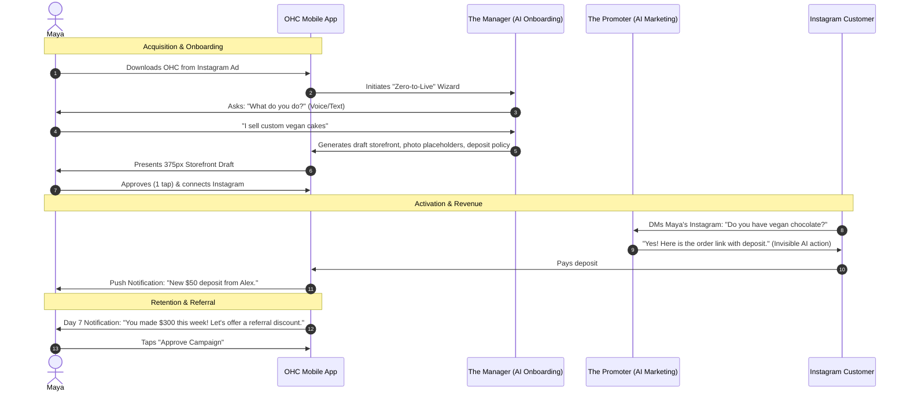
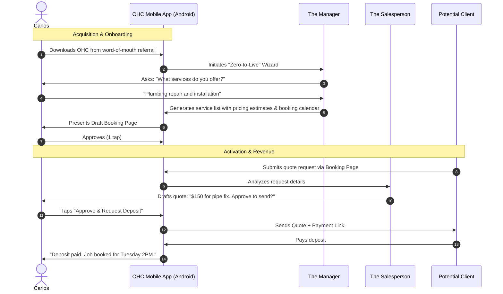
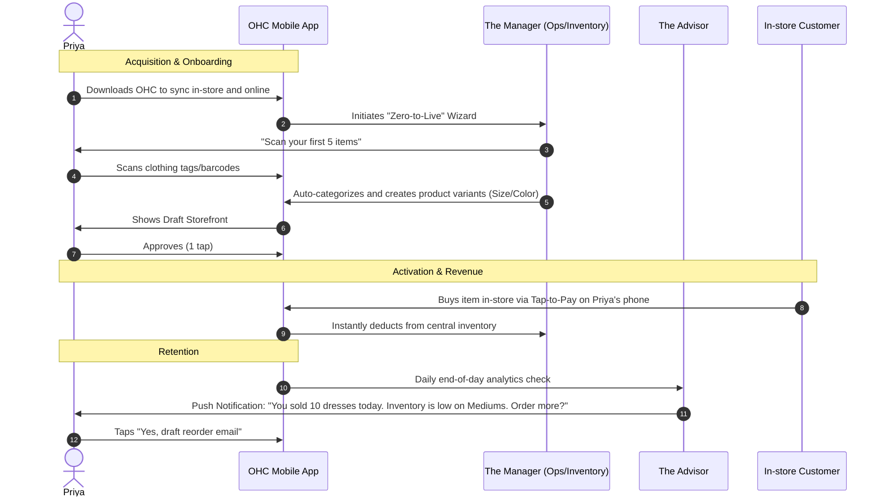
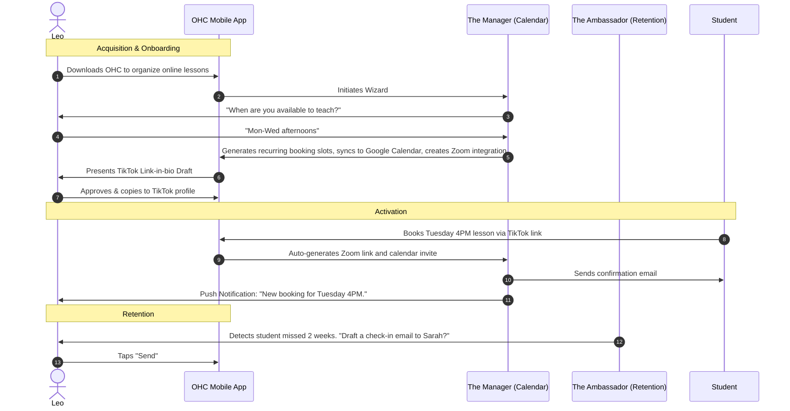
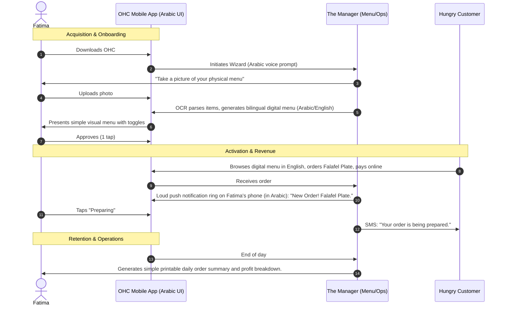

# [research] Business Journey Architecture: End-to-End Persona Flow

## Problem Statement
Small business owners—whether they are a baker like Maya or a handyman like Carlos—struggle with the friction of moving from an initial idea to a fully operational digital business. They face overwhelming technical decisions when building a storefront, configuring booking calendars, setting up online payments, and managing customer communications. The current onboarding and lifecycle flows on existing platforms treat businesses as static websites rather than dynamic entities. There is a critical need to design a complete, end-to-end "zero → live business in under 10 minutes" journey, optimized strictly for mobile devices, where AI agents invisibly manage complexity at every stage (Acquisition, Onboarding, Activation, Retention, Revenue, Referral).

## Research Report

### Persona-Specific Pain Points
| Persona | Business Type | Key Pain Points |
|---------|---------------|-----------------|
| **Maya (28)** | Baker | Instagram DM overload; manually tracking deposits; wants a storefront but has no time to maintain it; relies exclusively on iPhone. |
| **Carlos (42)** | Handyman | Losing leads due to missing online presence; word-of-mouth is unscalable; needs quick mobile quotes and deposits; Android only. |
| **Priya (35)** | Boutique Owner | Out of sync inventory between in-store and online; needs daily analytics without using complex dashboards; wants a newsletter. |
| **Leo (22)** | Music Tutor | Manual calendar management; forgotten Zoom links; struggles to retain inactive students; needs a TikTok link-in-bio presence. |
| **Fatima (50)** | Food Cart | Language barriers (Arabic/English); managing complex pre-orders; low-end Android phone; needs simple visual interfaces and printed lists. |

### Competitive Analysis
| Feature / Platform | Shopify | Wix | Squarespace | GoDaddy | OneHumanCorp (Target) |
|--------------------|---------|-----|-------------|---------|-----------------------|
| **Setup Time** | Days / Weeks | Days | Hours / Days | Hours | **< 10 minutes** |
| **AI Integration** | Bolt-on tools | Basic generators | Bolt-on tools | Simple text gen | **Invisible AI Departments** |
| **Mobile-First** | App companion | App companion | Desktop-first | App companion | **100% Mobile Native** |
| **Complexity Level** | High | Medium | Medium | Low-Medium | **Zero Code, Zero Manuals** |

### Actionable Recommendations
1. **Defer Friction:** Minimize the number of inputs required to go live. Ask only for the business name, category, and primary goal (e.g., "sell products", "book appointments"). AI should infer or draft the rest.
2. **Invisible Agents:** Immediately assign AI "Departments" (e.g., The Promoter, The Manager) during onboarding to show value before the user completes their profile.
3. **Mobile-First Activation:** Define "Activation" as the moment the first product is added or first payment received via mobile tap.
4. **Retention Loop:** Provide daily push-notification summaries from the AI "Advisor" instead of relying on the user to open analytics dashboards.

## Design Doc

### Architecture Diagrams (User Journeys)

#### 1. Maya (Baker) Journey

#### 2. Carlos (Handyman) Journey

#### 3. Priya (Boutique Owner) Journey

#### 4. Leo (Music Tutor) Journey

#### 5. Fatima (Food Cart) Journey

### UI Wireframes & Screen Flow (375px)
1. **Welcome Screen:** "What kind of business are we building today?" with large, touch-friendly icon buttons (Store, Service, Food, etc.).
2. **The "Magic" Loading Screen:** Glassmorphic spinner showing AI actions in real-time ("The Promoter is designing your storefront...", "The Protector is drafting your refund policy...").
3. **Activation Dashboard:** A clean, simplified home screen. A floating action button (FAB) for "Add Item/Service". A prominent "Share Store Link" card.
4. **Daily AI Briefing:** A dismissible card at the top of the dashboard: "Good morning Maya. You have 2 cakes to bake today. The Promoter replied to 3 DMs overnight."

### Mobile UX Flow
- **Input:** Relies heavily on voice-to-text or short natural language inputs to reduce typing fatigue.
- **Progressive Disclosure:** Advanced settings (like tax configuration or custom domain setup) are hidden behind the AI Advisor and only suggested when the user reaches relevant milestones (e.g., approaching Free Tier limits).
- **Offline Capabilities:** Local caching allows Carlos to draft quotes in a basement without cellular service; syncing happens automatically when connectivity is restored.

### Key AI Agent Integration Points
- **The Manager (Operations):** Takes the initial user input and scaffolds the core business entities (catalog, services) dynamically.
- **The Promoter (Marketing):** Intercepts social media DMs to answer questions and funnel users to the checkout link without the owner's intervention.
- **The Advisor (Business Advisory):** Drives retention by sending weekly plain-language summaries (e.g., "Mondays are slow. Let's run a 10% discount this Monday.").

### Key Design Decisions
- **AI as the Onboarding Guide:** Instead of a static form, onboarding is conversational and generative. *Why:* Reduces abandonment rates by eliminating the "blank page" syndrome.
- **Mobile Parity Guarantee:** No features exist on desktop that cannot be executed in <= 30 seconds on a 375px viewport. *Why:* Ensures accessibility for users like Carlos and Fatima who only have mobile devices.
- **Push-Driven Retention:** The platform pushes insights to the user rather than expecting them to pull data. *Why:* Non-technical users find traditional analytics dashboards intimidating.

## Implementation Prompt
**Task:** Implement the "Zero-to-Live" mobile onboarding wizard for new tenants.
**CUJ:** A new user opens the OHC mobile app for the first time. They are greeted by an AI assistant that asks for a plain language description of their business. The system must use this description to orchestrate multiple AI Departments to generate a draft storefront, default service/product listings, and core policies. The user reviews the draft on their 375px screen and approves it with a single tap, transitioning their business to a "Live" state.
**Acceptance Criteria:**
- Create the mobile-first onboarding UI components matching the Design System (Glassmorphism, 375px optimized).
- Implement the orchestration logic that routes the user's initial prompt to the relevant AI Departments to generate business assets.
- Ensure the onboarding process completes in under 10 minutes from a user-interaction standpoint.
- The user must be able to approve the generated storefront with a single tap.
- Provide a suite of E2E Playwright/Slint tests that navigate the entire onboarding wizard from a clean slate to a "Live" business dashboard.

## Priority
P0

## Estimated Scope
Large
