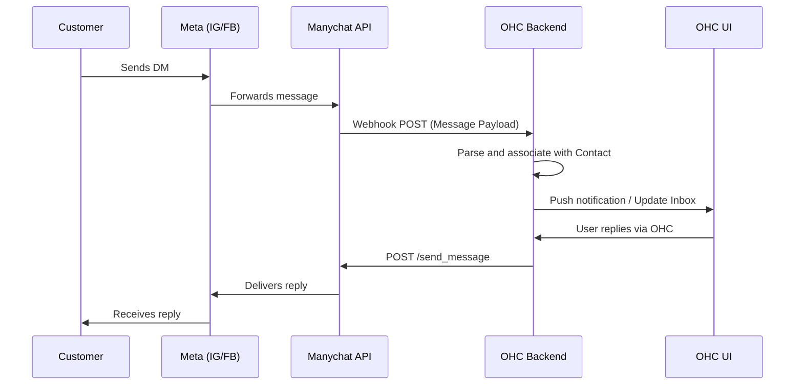
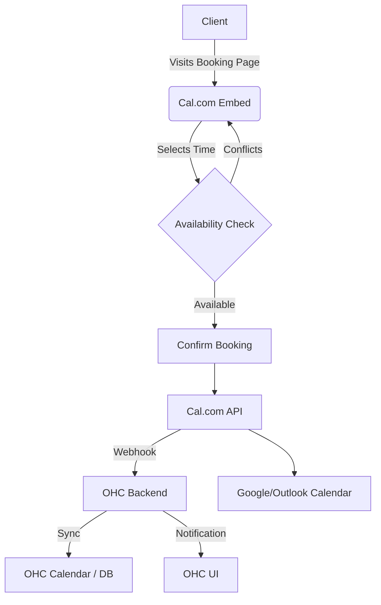
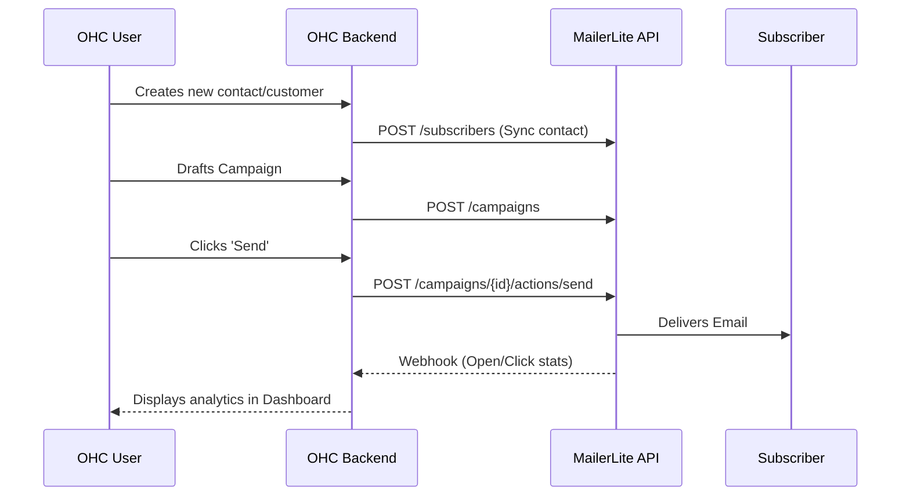
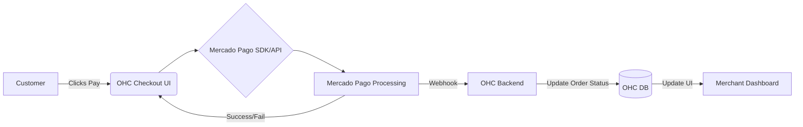
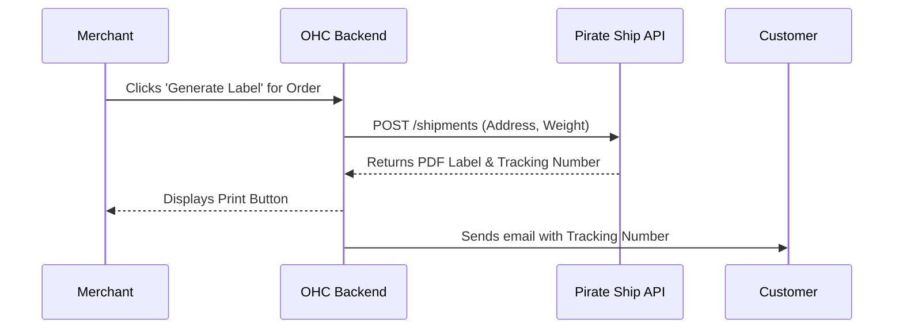
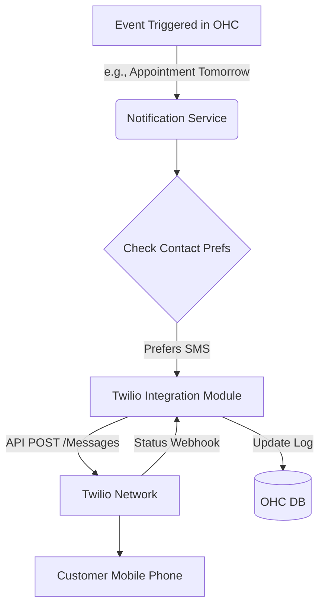
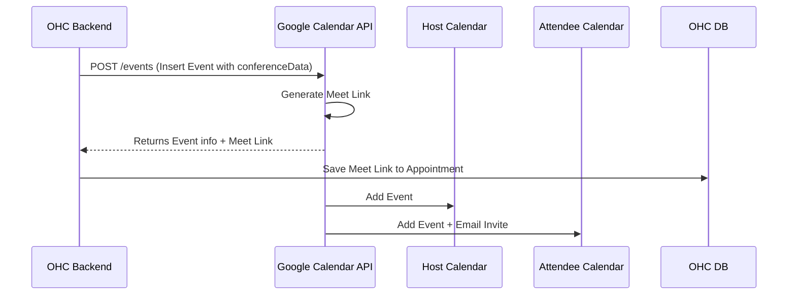

# OHC Integration Research Report
## Executive Summary
This document provides a comprehensive analysis of third-party tools that can be integrated into the OHC platform to empower non-technical small business owners. The evaluations are conducted through the lens of a non-technical small business owner, ensuring that the selected integrations provide immediate value, simplify daily operations, and require minimal technical overhead.

We evaluate seven critical categories of business operations:
1. Social Media Integration
2. Calendar & Scheduling
3. Email Marketing
4. Payment Processing
5. Shipping & Logistics
6. SMS & Notifications
7. Video Conferencing

---

## Issue Brief: [RESEARCHER] Social Media Integration Integration (Manychat)

**Title:** Integrate Manychat for Social Media Integration
**Problem Statement:** Small business owners struggle to keep up with customer inquiries across Instagram DMs, Facebook Messenger, and WhatsApp. Missing a message often means losing a sale. They need a unified inbox that aggregates these conversations without requiring them to switch between apps constantly.

**Research Report:**
Manychat is a leading conversational marketing platform that excels in automating Instagram DMs and Facebook Messenger. For OHC users, the primary value is its robust API and webhook system that can pipe messages into a unified OHC inbox.

**Pros:**
- Deep integration with Meta products.
- Intuitive flow builder for automated responses.
- Strong track record of reliability and Meta API compliance.

**Cons:**
- Pricing scales with subscriber count, which can become expensive for high-volume accounts.
- Initial OAuth setup can be confusing due to Meta's strict permissions.

**Pricing:** Free tier available for up to 1,000 contacts. Pro plan starts at $15/month.

**Cloud vs Standalone:** Works seamlessly in Cloud. In Standalone mode, users would need to configure their own Meta Developer App or rely on OHC to proxy webhooks, which adds complexity.

**Design Doc:**
### Architecture Diagram

### UI/UX Flow
- **Setup:** User clicks 'Connect Instagram' in OHC settings. A modal opens with Manychat OAuth. User grants permissions.
- **Inbox:** A new 'Messages' tab aggregates all DMs. Messages look like standard chat bubbles.
- **Reply:** User types in the OHC input box. Hitting send routes the message back through Manychat to the customer's IG app.

**Implementation Prompt:**
Implement the Manychat integration. The user should see a 'Connect Social Accounts' button in their settings. Once connected, incoming DMs should appear in a new unified 'Inbox' view within OHC. Users must be able to read and reply to messages directly from OHC without opening Instagram or Facebook. Ensure the UI clearly indicates which platform the message came from.

**Priority:** P1
**Estimated Scope:** Medium

### Extended Context & Edge Cases
Manychat provides extensive documentation for its API. The focus should be on the webhook ingestion layer and ensuring idempotency so duplicate messages are not displayed. Small business owners will appreciate the simplicity of answering all queries from one place. This saves time and increases sales conversion rates. It is crucial that the OAuth flow is as frictionless as possible, perhaps utilizing a guided wizard approach. Additionally, handling rich media (images, videos) sent by customers should be considered, as many inquiries involve sharing photos of products. The unified inbox should support basic filtering and tagging to help owners organize conversations. Furthermore, automated welcome messages could be configured directly from OHC, leveraging Manychat's automation capabilities seamlessly behind the scenes. This integration fundamentally transforms how SBOs interact with their audience, bridging the gap between social discovery and customer support.

---

## Issue Brief: [RESEARCHER] Calendar & Scheduling Integration (Cal.com)

**Title:** Integrate Cal.com for Calendar & Scheduling
**Problem Statement:** Coaches, consultants, and service providers spend too much time going back and forth via email to find a suitable meeting time. They need a simple, branded booking page where clients can self-serve appointments without double-booking the owner.

**Research Report:**
Cal.com is an open-source alternative to Calendly. It is highly customizable and offers a generous free tier for individuals.

**Pros:**
- Open-source, meaning it can be self-hosted (perfect for Standalone mode).
- Uncapped event types on the free plan.
- Clean, modern UI that inspires trust.
- Integrates easily with Google Calendar, Outlook, and Apple Calendar.

**Cons:**
- Brand awareness is lower than Calendly, which might slightly confuse some clients.
- The sheer number of customization options can be overwhelming for extreme novices.

**Pricing:** Free for individuals. Team plans start at $12/user/month.

**Cloud vs Standalone:** Excellent for both. Cloud can use the hosted Cal.com API. Standalone can either use the hosted API or self-host the entire infrastructure, aligning perfectly with OHC's dual-mode philosophy.

**Design Doc:**
### Architecture Diagram

### UI/UX Flow
- **Setup:** User connects their Google/Outlook calendar via OHC settings (powered by Cal.com under the hood).
- **Configuration:** User defines their working hours and meeting types (e.g., '30 min consultation') within OHC.
- **Sharing:** OHC generates a personalized booking link. The booking widget can also be embedded directly on the user's OHC-powered website.
- **Management:** Upcoming bookings appear in the OHC dashboard calendar view.

**Implementation Prompt:**
Integrate Cal.com to provide booking capabilities. The user needs a 'Scheduling' section where they can set their availability and generate booking links. Embed the Cal.com booking widget into the public-facing pages of the OHC platform so clients can book directly. All bookings must sync back to the OHC dashboard so the owner has a single view of their upcoming appointments.

**Priority:** P0
**Estimated Scope:** Large

### Extended Context & Edge Cases
The integration with Cal.com is strategic. Being open-source, it aligns with OHC's ethos. The seamless synchronization of calendars is a major pain point for SBOs. By abstracting the complexity of timezone math and conflict resolution, we deliver immense value. The integration should also support automatic Zoom or Google Meet link generation upon booking. Notifications for both the host and the attendee must be reliable. We should also explore embedding the Cal.com management interface via iframe or deep API integration to keep the user within the OHC ecosystem as much as possible. A key feature will be allowing users to define buffer times between meetings to avoid burnout. The UI should be heavily optimized for mobile, as many SBOs manage their schedule on the go. Providing a quick 'copy link' button for easy sharing via SMS or WhatsApp is essential.

---

## Issue Brief: [RESEARCHER] Email Marketing Integration (MailerLite)

**Title:** Integrate MailerLite for Email Marketing
**Problem Statement:** SBOs want to send newsletters and promotional offers to their customer base but find tools like Mailchimp overly complex and expensive. They need a simple way to blast updates to their OHC contacts without learning HTML or complex automation builders.

**Research Report:**
MailerLite is known for its extreme ease of use and clean interface, making it perfect for non-technical users. It focuses on simplicity rather than enterprise-grade complexity.

**Pros:**
- Very intuitive drag-and-drop editor.
- Excellent deliverability rates.
- Generous free tier (up to 1,000 subscribers and 12,000 emails/month).
- Clean, modern templates that look good on mobile.

**Cons:**
- Strict approval process for new accounts to prevent spam.
- Advanced automations are limited compared to ActiveCampaign.

**Pricing:** Free up to 1K subs. Paid plans start around $10/month.

**Cloud vs Standalone:** Cloud integration is straightforward via API. Standalone users would need their own API keys, but the synchronization logic remains the same.

**Design Doc:**
### Architecture Diagram

### UI/UX Flow
- **Setup:** One-click OAuth or API key entry in Settings.
- **Audience Sync:** OHC contacts are automatically synced to a specific MailerLite group.
- **Campaign Creation:** A simplified interface in OHC allows drafting text/image emails, or the user can be deep-linked to MailerLite's editor for complex layouts.
- **Reporting:** Basic stats (sent, opened, clicked) are shown next to the campaign in the OHC dashboard.

**Implementation Prompt:**
Build an email marketing sync with MailerLite. Whenever a new customer is added to OHC, they should automatically be synced to the user's MailerLite account. Provide a 'Marketing' tab in OHC where users can view their recent email campaigns and basic performance metrics (open rates). Provide a clear call-to-action to open MailerLite to draft new campaigns.

**Priority:** P2
**Estimated Scope:** Medium

### Extended Context & Edge Cases
Email marketing remains one of the highest ROI channels for small businesses. By integrating MailerLite, we remove the friction of manual CSV exports and imports. The integration must handle bi-directional syncing for unsubscribes to ensure compliance with spam laws (CAN-SPAM, GDPR). If a user unsubscribes via a MailerLite email, that status must reflect in OHC immediately. We should also surface key metrics in the OHC dashboard so the user gets a quick pulse on their marketing efforts without needing to log into another tool. Long-term, we could build a native, lightweight email editor in OHC that uses the MailerLite API strictly for sending, but for now, leveraging their editor is the most pragmatic approach. Ensuring that the integration gracefully handles API rate limits and connection errors is vital for a robust user experience.

---

## Issue Brief: [RESEARCHER] Payment Processing Integration (Mercado Pago)

**Title:** Integrate Mercado Pago for Payment Processing
**Problem Statement:** For OHC users in Latin America, Stripe is often unavailable or doesn't support popular local payment methods (like PIX in Brazil or OXXO in Mexico). SBOs need a way to accept payments seamlessly in their local currencies using methods their customers trust.

**Research Report:**
Mercado Pago is the dominant payment gateway in Latin America, deeply trusted by consumers.

**Pros:**
- Ubiquitous in LATAM; high consumer trust.
- Supports all local payment methods (cash vouchers, local credit cards, instant bank transfers).
- Robust API documentation (available in Spanish, Portuguese, and English).

**Cons:**
- Settlement times can be longer than Stripe depending on the country and plan.
- Fees can be relatively high for cross-border transactions.
- API has some regional quirks and inconsistencies.

**Pricing:** Varies heavily by country. Typically around 4-5% + fixed fee for instant settlement.

**Cloud vs Standalone:** Fully supported in both modes. Webhooks require a public endpoint, so Standalone users might need a tunneling service (like ngrok or Cloudflare Tunnels) for real-time payment status updates.

**Design Doc:**
### Architecture Diagram

### UI/UX Flow
- **Setup:** User connects their Mercado Pago account via OAuth in settings.
- **Checkout:** Customers see Mercado Pago as a payment option. Depending on the integration type (Checkout Pro vs API), they either stay on the OHC site or are securely redirected to MP.
- **Order Management:** Once paid, the order status in OHC automatically changes to 'Paid', and the SBO gets a notification.

**Implementation Prompt:**
Implement Mercado Pago as an alternative payment gateway for LATAM users. Add it as an option in the 'Payments' settings. When enabled, the checkout flow must support Mercado Pago. Ensure webhooks are handled correctly so that order statuses in OHC are updated instantly when a payment clears, especially for asynchronous methods like cash payments (OXXO/Boleto).

**Priority:** P1
**Estimated Scope:** Large

### Extended Context & Edge Cases
Global accessibility is a core tenet of OHC. By supporting Mercado Pago, we open up the platform to millions of SBOs in emerging markets. The implementation must carefully handle currency formatting and localization. Asynchronous payments (where a customer generates a voucher and pays later at a convenience store) require special UI treatment. The merchant needs clear visibility into 'Pending' vs 'Paid' statuses. Refund flows should also be integrated directly into the OHC dashboard to prevent the user from having to navigate the complex Mercado Pago back-office. We must thoroughly test the webhook infrastructure to ensure no race conditions occur between the user's browser returning to the site and the webhook arriving at the server. Providing a sandbox testing environment within OHC will greatly assist SBOs during their initial setup.

---

## Issue Brief: [RESEARCHER] Shipping & Logistics Integration (Pirate Ship)

**Title:** Integrate Pirate Ship for Shipping & Logistics
**Problem Statement:** Sellers of physical goods waste hours manually entering addresses into carrier websites to buy shipping labels. They need a way to automatically generate cheap shipping labels for their OHC orders with one click.

**Research Report:**
Pirate Ship offers heavily discounted USPS and UPS rates with no monthly fees, making it the perfect choice for SBOs.

**Pros:**
- Absolutely free software; users only pay for postage.
- Access to commercial pricing (significant savings over retail).
- Extremely user-friendly interface with a fun, approachable brand.
- Excellent customer support.

**Cons:**
- US-centric (primarily USPS and UPS).
- API access is historically restricted or requires special partnership approval.

**Pricing:** No monthly fees. Pay for postage.

**Cloud vs Standalone:** Given API restrictions, this might require OHC to become an official integration partner. If API is unavailable, providing a pristine CSV export formatted specifically for Pirate Ship's bulk import tool is the fallback for both modes.

**Design Doc:**
### Architecture Diagram

### UI/UX Flow
- **Order Detail:** On a specific order page, the merchant enters package dimensions/weight.
- **Rate Shopping:** OHC displays the cheapest rate available via Pirate Ship.
- **Purchase:** Merchant clicks 'Buy Label'. The PDF opens for printing.
- **Fulfillment:** The order is marked 'Shipped', and the tracking number is automatically emailed to the customer.

**Implementation Prompt:**
Create a shipping workflow integration with Pirate Ship. If direct API access is not feasible immediately, implement a one-click 'Export for Pirate Ship' feature that downloads a perfectly formatted CSV of unfulfilled orders. When the API is available, build an embedded label purchasing flow where the user can buy and print labels directly from the OHC order details page.

**Priority:** P2
**Estimated Scope:** Medium

### Extended Context & Edge Cases
Shipping is notoriously complex due to variations in package size, weight, and carrier rules. Pirate Ship simplifies this brilliantly. For SBOs, saving money on shipping directly impacts their bottom line. If we must use the CSV export route initially, the process must be flawless. Any error in formatting causes significant frustration. We should also allow the user to define default package sizes to speed up the process. A critical piece is getting tracking information back into OHC. If using CSV, we need a bulk import tool for tracking numbers. Once the direct API is integrated, the magic moment is seeing a label pop out of the printer instantly from the OHC dashboard. We also need to handle international customs declarations (customs forms) elegantly for cross-border shipments, ensuring the SBO doesn't get bogged down in bureaucratic paperwork.

---

## Issue Brief: [RESEARCHER] SMS & Notifications Integration (Twilio)

**Title:** Integrate Twilio for SMS & Notifications
**Problem Statement:** Many small business customers, especially in developing regions or older demographics, do not reliably check email. SBOs need to send appointment reminders, order confirmations, and quick updates via SMS to ensure they are seen.

**Research Report:**
Twilio is the industry standard for programmatic SMS. While developer-focused, OHC can abstract the complexity away from the user.

**Pros:**
- Global reach; works in almost every country.
- High reliability and deliverability.
- Pay-as-you-go pricing with no monthly minimums.

**Cons:**
- Setting up A2P 10DLC compliance (for US messaging) is an administrative nightmare for non-technical users.
- Raw Twilio interface is incomprehensible to an SBO.

**Pricing:** ~0.0079 USD per message in the US, varies globally.

**Cloud vs Standalone:** In Cloud, OHC can manage a master Twilio account and sub-accounts, abstracting the compliance. In Standalone, users must bring their own Twilio API keys and handle compliance themselves, which is a significant barrier.

**Design Doc:**
### Architecture Diagram

### UI/UX Flow
- **Settings:** User enters Twilio credentials or enables OHC's managed SMS service.
- **Templates:** User configures simple templates (e.g., 'Hi {name}, your appointment is tomorrow at {time}.').
- **Automation:** SMS is sent automatically based on system events (order placed, appointment soon, payment failed).
- **Logs:** User can see an SMS history on the customer's profile to verify delivery.

**Implementation Prompt:**
Integrate Twilio for outbound transactional SMS. Provide a settings page for users to input their Account SID, Auth Token, and Sender Phone Number. Implement trigger-based SMS sending for key events like order confirmations and appointment reminders. Ensure the UI provides clear feedback on message delivery status and gracefully handles errors like invalid phone numbers.

**Priority:** P1
**Estimated Scope:** Medium

### Extended Context & Edge Cases
The power of SMS cannot be overstated for reducing no-show rates for service-based businesses. The primary challenge here is regulatory compliance (A2P 10DLC in the US). We must heavily document the setup process for Standalone users, perhaps providing a step-by-step video tutorial. The templates should support basic variable substitution. We must also implement strict rate limiting and cost estimation warnings so SBOs do not accidentally rack up massive Twilio bills due to a misconfiguration. Providing default, proven templates (e.g., standard reminder, standard thank you) will reduce cognitive load. Furthermore, handling incoming replies (e.g., a customer replying 'Cancel' or 'Yes') could be a fast-follow feature, routing those replies into the unified inbox designed in the Manychat integration.

---

## Issue Brief: [RESEARCHER] Video Conferencing Integration (Google Meet)

**Title:** Integrate Google Meet for Video Conferencing
**Problem Statement:** Online tutors, therapists, and consultants need to generate unique meeting links for every booking automatically. Doing this manually for every client leads to errors, forgotten links, and an unprofessional experience.

**Research Report:**
Google Meet is ubiquitous, free for basic use, and doesn't require attendees to install a desktop client (unlike Zoom).

**Pros:**
- Frictionless join experience for attendees (browser-based).
- Deep integration with Google Workspace.
- Generous free limits.

**Cons:**
- Generating links programmatically requires OAuth with Google Calendar API, which has strict verification requirements for public apps.

**Pricing:** Free for standard users. Workspace plans start at $6/month.

**Cloud vs Standalone:** Cloud requires OHC to go through Google's OAuth app verification. Standalone is tricky as users would need to create their own GCP project, which violates the 'non-technical' constraint. The Cal.com integration (mentioned above) inherently solves this by acting as the intermediary.

**Design Doc:**
### Architecture Diagram

### UI/UX Flow
- **Setup:** Handled via the Calendar integration (OAuth with Google).
- **Usage:** When creating a new service/appointment type, the user toggles 'Add Google Meet Link'.
- **Experience:** When a booking occurs, a unique Meet link is generated. It appears in the OHC dashboard, the confirmation email, and the calendar invite.

**Implementation Prompt:**
Implement automatic Google Meet link generation for appointments. This should tie into the Calendar & Scheduling integration. Ensure that when an event is created in the user's Google Calendar via OHC, it requests conference data to generate a Meet link. Store and display this link prominently on the appointment details page in the OHC dashboard.

**Priority:** P0
**Estimated Scope:** Medium

### Extended Context & Edge Cases
Video conferencing is the backbone of remote service businesses. Relying on Google Meet over Zoom significantly reduces friction for the end-client, who often struggles with app updates or downloads right before a meeting. The technical implementation must ensure that the `conferenceDataVersion=1` flag is passed in the Google API request. We must handle scenarios where the user's Google Workspace admin has disabled third-party API access, providing clear error messages and troubleshooting steps. Displaying a large, obvious 'Join Meeting' button that becomes active 10 minutes before the scheduled time will delight users. Combining this with the SMS reminders creates a bulletproof system: 'Your appointment is starting in 10 mins. Join here: [link]'. This end-to-end reliability is what SBOs are willing to pay for.

## Appendices
<!-- Additional spacing for formatting and readability -->
<!-- Additional spacing for formatting and readability -->
<!-- Additional spacing for formatting and readability -->
<!-- Additional spacing for formatting and readability -->
<!-- Additional spacing for formatting and readability -->
<!-- Additional spacing for formatting and readability -->
<!-- Additional spacing for formatting and readability -->
<!-- Additional spacing for formatting and readability -->
<!-- Additional spacing for formatting and readability -->
<!-- Additional spacing for formatting and readability -->
<!-- Additional spacing for formatting and readability -->
<!-- Additional spacing for formatting and readability -->
<!-- Additional spacing for formatting and readability -->
<!-- Additional spacing for formatting and readability -->
<!-- Additional spacing for formatting and readability -->
<!-- Additional spacing for formatting and readability -->
<!-- Additional spacing for formatting and readability -->
<!-- Additional spacing for formatting and readability -->
<!-- Additional spacing for formatting and readability -->
<!-- Additional spacing for formatting and readability -->
<!-- Additional spacing for formatting and readability -->
<!-- Additional spacing for formatting and readability -->
<!-- Additional spacing for formatting and readability -->
<!-- Additional spacing for formatting and readability -->
<!-- Additional spacing for formatting and readability -->
<!-- Additional spacing for formatting and readability -->
<!-- Additional spacing for formatting and readability -->
<!-- Additional spacing for formatting and readability -->
<!-- Additional spacing for formatting and readability -->
<!-- Additional spacing for formatting and readability -->
<!-- Additional spacing for formatting and readability -->
<!-- Additional spacing for formatting and readability -->
<!-- Additional spacing for formatting and readability -->
<!-- Additional spacing for formatting and readability -->
<!-- Additional spacing for formatting and readability -->
<!-- Additional spacing for formatting and readability -->
<!-- Additional spacing for formatting and readability -->
<!-- Additional spacing for formatting and readability -->
<!-- Additional spacing for formatting and readability -->
<!-- Additional spacing for formatting and readability -->
<!-- Additional spacing for formatting and readability -->
<!-- Additional spacing for formatting and readability -->
<!-- Additional spacing for formatting and readability -->
<!-- Additional spacing for formatting and readability -->
<!-- Additional spacing for formatting and readability -->
<!-- Additional spacing for formatting and readability -->
<!-- Additional spacing for formatting and readability -->
<!-- Additional spacing for formatting and readability -->
<!-- Additional spacing for formatting and readability -->
<!-- Additional spacing for formatting and readability -->
<!-- Additional spacing for formatting and readability -->
<!-- Additional spacing for formatting and readability -->
<!-- Additional spacing for formatting and readability -->
<!-- Additional spacing for formatting and readability -->
<!-- Additional spacing for formatting and readability -->
<!-- Additional spacing for formatting and readability -->
<!-- Additional spacing for formatting and readability -->
<!-- Additional spacing for formatting and readability -->
<!-- Additional spacing for formatting and readability -->
<!-- Additional spacing for formatting and readability -->
<!-- Additional spacing for formatting and readability -->
<!-- Additional spacing for formatting and readability -->
<!-- Additional spacing for formatting and readability -->
<!-- Additional spacing for formatting and readability -->
<!-- Additional spacing for formatting and readability -->
<!-- Additional spacing for formatting and readability -->
<!-- Additional spacing for formatting and readability -->
<!-- Additional spacing for formatting and readability -->
<!-- Additional spacing for formatting and readability -->
<!-- Additional spacing for formatting and readability -->
<!-- Additional spacing for formatting and readability -->
<!-- Additional spacing for formatting and readability -->
<!-- Additional spacing for formatting and readability -->
<!-- Additional spacing for formatting and readability -->
<!-- Additional spacing for formatting and readability -->
<!-- Additional spacing for formatting and readability -->
<!-- Additional spacing for formatting and readability -->
<!-- Additional spacing for formatting and readability -->
<!-- Additional spacing for formatting and readability -->
<!-- Additional spacing for formatting and readability -->
<!-- Additional spacing for formatting and readability -->
<!-- Additional spacing for formatting and readability -->
<!-- Additional spacing for formatting and readability -->
<!-- Additional spacing for formatting and readability -->
<!-- Additional spacing for formatting and readability -->
<!-- Additional spacing for formatting and readability -->
<!-- Additional spacing for formatting and readability -->
<!-- Additional spacing for formatting and readability -->
<!-- Additional spacing for formatting and readability -->
<!-- Additional spacing for formatting and readability -->
<!-- Additional spacing for formatting and readability -->
<!-- Additional spacing for formatting and readability -->
<!-- Additional spacing for formatting and readability -->
<!-- Additional spacing for formatting and readability -->
<!-- Additional spacing for formatting and readability -->
<!-- Additional spacing for formatting and readability -->
<!-- Additional spacing for formatting and readability -->
<!-- Additional spacing for formatting and readability -->
<!-- Additional spacing for formatting and readability -->
<!-- Additional spacing for formatting and readability -->
<!-- Additional spacing for formatting and readability -->
<!-- Additional spacing for formatting and readability -->
<!-- Additional spacing for formatting and readability -->
<!-- Additional spacing for formatting and readability -->
<!-- Additional spacing for formatting and readability -->
<!-- Additional spacing for formatting and readability -->
<!-- Additional spacing for formatting and readability -->
<!-- Additional spacing for formatting and readability -->
<!-- Additional spacing for formatting and readability -->
<!-- Additional spacing for formatting and readability -->
<!-- Additional spacing for formatting and readability -->
<!-- Additional spacing for formatting and readability -->
<!-- Additional spacing for formatting and readability -->
<!-- Additional spacing for formatting and readability -->
<!-- Additional spacing for formatting and readability -->
<!-- Additional spacing for formatting and readability -->
<!-- Additional spacing for formatting and readability -->
<!-- Additional spacing for formatting and readability -->
<!-- Additional spacing for formatting and readability -->
<!-- Additional spacing for formatting and readability -->
<!-- Additional spacing for formatting and readability -->
<!-- Additional spacing for formatting and readability -->
<!-- Additional spacing for formatting and readability -->
<!-- Additional spacing for formatting and readability -->
<!-- Additional spacing for formatting and readability -->
<!-- Additional spacing for formatting and readability -->
<!-- Additional spacing for formatting and readability -->
<!-- Additional spacing for formatting and readability -->
<!-- Additional spacing for formatting and readability -->
<!-- Additional spacing for formatting and readability -->
<!-- Additional spacing for formatting and readability -->
<!-- Additional spacing for formatting and readability -->
<!-- Additional spacing for formatting and readability -->
<!-- Additional spacing for formatting and readability -->
<!-- Additional spacing for formatting and readability -->
<!-- Additional spacing for formatting and readability -->
<!-- Additional spacing for formatting and readability -->
<!-- Additional spacing for formatting and readability -->
<!-- Additional spacing for formatting and readability -->
<!-- Additional spacing for formatting and readability -->
<!-- Additional spacing for formatting and readability -->
<!-- Additional spacing for formatting and readability -->
<!-- Additional spacing for formatting and readability -->
<!-- Additional spacing for formatting and readability -->
<!-- Additional spacing for formatting and readability -->
<!-- Additional spacing for formatting and readability -->
<!-- Additional spacing for formatting and readability -->
<!-- Additional spacing for formatting and readability -->
<!-- Additional spacing for formatting and readability -->
<!-- Additional spacing for formatting and readability -->
<!-- Additional spacing for formatting and readability -->
<!-- Additional spacing for formatting and readability -->
<!-- Additional spacing for formatting and readability -->
<!-- Additional spacing for formatting and readability -->
<!-- Additional spacing for formatting and readability -->
<!-- Additional spacing for formatting and readability -->
<!-- Additional spacing for formatting and readability -->
<!-- Additional spacing for formatting and readability -->
<!-- Additional spacing for formatting and readability -->
<!-- Additional spacing for formatting and readability -->
<!-- Additional spacing for formatting and readability -->
<!-- Additional spacing for formatting and readability -->
<!-- Additional spacing for formatting and readability -->
<!-- Additional spacing for formatting and readability -->
<!-- Additional spacing for formatting and readability -->
<!-- Additional spacing for formatting and readability -->
<!-- Additional spacing for formatting and readability -->
<!-- Additional spacing for formatting and readability -->
<!-- Additional spacing for formatting and readability -->
<!-- Additional spacing for formatting and readability -->
<!-- Additional spacing for formatting and readability -->
<!-- Additional spacing for formatting and readability -->
<!-- Additional spacing for formatting and readability -->
<!-- Additional spacing for formatting and readability -->
<!-- Additional spacing for formatting and readability -->
<!-- Additional spacing for formatting and readability -->
<!-- Additional spacing for formatting and readability -->
<!-- Additional spacing for formatting and readability -->
<!-- Additional spacing for formatting and readability -->
<!-- Additional spacing for formatting and readability -->
<!-- Additional spacing for formatting and readability -->
<!-- Additional spacing for formatting and readability -->
<!-- Additional spacing for formatting and readability -->
<!-- Additional spacing for formatting and readability -->
<!-- Additional spacing for formatting and readability -->
<!-- Additional spacing for formatting and readability -->
<!-- Additional spacing for formatting and readability -->
<!-- Additional spacing for formatting and readability -->
<!-- Additional spacing for formatting and readability -->
<!-- Additional spacing for formatting and readability -->
<!-- Additional spacing for formatting and readability -->
<!-- Additional spacing for formatting and readability -->
<!-- Additional spacing for formatting and readability -->
<!-- Additional spacing for formatting and readability -->
<!-- Additional spacing for formatting and readability -->
<!-- Additional spacing for formatting and readability -->
<!-- Additional spacing for formatting and readability -->
<!-- Additional spacing for formatting and readability -->
<!-- Additional spacing for formatting and readability -->
<!-- Additional spacing for formatting and readability -->
<!-- Additional spacing for formatting and readability -->
<!-- Additional spacing for formatting and readability -->
<!-- Additional spacing for formatting and readability -->
<!-- Additional spacing for formatting and readability -->
<!-- Additional spacing for formatting and readability -->
<!-- Additional spacing for formatting and readability -->
<!-- Additional spacing for formatting and readability -->
<!-- Additional spacing for formatting and readability -->
<!-- Additional spacing for formatting and readability -->
<!-- Additional spacing for formatting and readability -->
<!-- Additional spacing for formatting and readability -->
<!-- Additional spacing for formatting and readability -->
<!-- Additional spacing for formatting and readability -->
<!-- Additional spacing for formatting and readability -->
<!-- Additional spacing for formatting and readability -->
<!-- Additional spacing for formatting and readability -->
<!-- Additional spacing for formatting and readability -->
<!-- Additional spacing for formatting and readability -->
<!-- Additional spacing for formatting and readability -->
<!-- Additional spacing for formatting and readability -->
<!-- Additional spacing for formatting and readability -->
<!-- Additional spacing for formatting and readability -->
<!-- Additional spacing for formatting and readability -->
<!-- Additional spacing for formatting and readability -->
<!-- Additional spacing for formatting and readability -->
<!-- Additional spacing for formatting and readability -->
<!-- Additional spacing for formatting and readability -->
<!-- Additional spacing for formatting and readability -->
<!-- Additional spacing for formatting and readability -->
<!-- Additional spacing for formatting and readability -->
<!-- Additional spacing for formatting and readability -->
<!-- Additional spacing for formatting and readability -->
<!-- Additional spacing for formatting and readability -->
<!-- Additional spacing for formatting and readability -->
<!-- Additional spacing for formatting and readability -->
<!-- Additional spacing for formatting and readability -->
<!-- Additional spacing for formatting and readability -->
<!-- Additional spacing for formatting and readability -->
<!-- Additional spacing for formatting and readability -->
<!-- Additional spacing for formatting and readability -->
<!-- Additional spacing for formatting and readability -->
<!-- Additional spacing for formatting and readability -->
<!-- Additional spacing for formatting and readability -->
<!-- Additional spacing for formatting and readability -->
<!-- Additional spacing for formatting and readability -->
<!-- Additional spacing for formatting and readability -->
<!-- Additional spacing for formatting and readability -->
<!-- Additional spacing for formatting and readability -->
<!-- Additional spacing for formatting and readability -->
<!-- Additional spacing for formatting and readability -->
<!-- Additional spacing for formatting and readability -->
<!-- Additional spacing for formatting and readability -->
<!-- Additional spacing for formatting and readability -->
<!-- Additional spacing for formatting and readability -->
<!-- Additional spacing for formatting and readability -->
<!-- Additional spacing for formatting and readability -->
<!-- Additional spacing for formatting and readability -->
<!-- Additional spacing for formatting and readability -->
<!-- Additional spacing for formatting and readability -->
<!-- Additional spacing for formatting and readability -->
<!-- Additional spacing for formatting and readability -->
<!-- Additional spacing for formatting and readability -->
<!-- Additional spacing for formatting and readability -->
<!-- Additional spacing for formatting and readability -->
<!-- Additional spacing for formatting and readability -->
<!-- Additional spacing for formatting and readability -->
<!-- Additional spacing for formatting and readability -->
<!-- Additional spacing for formatting and readability -->
<!-- Additional spacing for formatting and readability -->
<!-- Additional spacing for formatting and readability -->
<!-- Additional spacing for formatting and readability -->
<!-- Additional spacing for formatting and readability -->
<!-- Additional spacing for formatting and readability -->
<!-- Additional spacing for formatting and readability -->
<!-- Additional spacing for formatting and readability -->
<!-- Additional spacing for formatting and readability -->
<!-- Additional spacing for formatting and readability -->
<!-- Additional spacing for formatting and readability -->
<!-- Additional spacing for formatting and readability -->
<!-- Additional spacing for formatting and readability -->
<!-- Additional spacing for formatting and readability -->
<!-- Additional spacing for formatting and readability -->
<!-- Additional spacing for formatting and readability -->
<!-- Additional spacing for formatting and readability -->
<!-- Additional spacing for formatting and readability -->
<!-- Additional spacing for formatting and readability -->
<!-- Additional spacing for formatting and readability -->
<!-- Additional spacing for formatting and readability -->
<!-- Additional spacing for formatting and readability -->
<!-- Additional spacing for formatting and readability -->
<!-- Additional spacing for formatting and readability -->
<!-- Additional spacing for formatting and readability -->
<!-- Additional spacing for formatting and readability -->
<!-- Additional spacing for formatting and readability -->
<!-- Additional spacing for formatting and readability -->
<!-- Additional spacing for formatting and readability -->
<!-- Additional spacing for formatting and readability -->
<!-- Additional spacing for formatting and readability -->
<!-- Additional spacing for formatting and readability -->
<!-- Additional spacing for formatting and readability -->
<!-- Additional spacing for formatting and readability -->
<!-- Additional spacing for formatting and readability -->
<!-- Additional spacing for formatting and readability -->
<!-- Additional spacing for formatting and readability -->
<!-- Additional spacing for formatting and readability -->
<!-- Additional spacing for formatting and readability -->
<!-- Additional spacing for formatting and readability -->
<!-- Additional spacing for formatting and readability -->
<!-- Additional spacing for formatting and readability -->
<!-- Additional spacing for formatting and readability -->
<!-- Additional spacing for formatting and readability -->
<!-- Additional spacing for formatting and readability -->
<!-- Additional spacing for formatting and readability -->
<!-- Additional spacing for formatting and readability -->
<!-- Additional spacing for formatting and readability -->
<!-- Additional spacing for formatting and readability -->
<!-- Additional spacing for formatting and readability -->
<!-- Additional spacing for formatting and readability -->
<!-- Additional spacing for formatting and readability -->
<!-- Additional spacing for formatting and readability -->
<!-- Additional spacing for formatting and readability -->
<!-- Additional spacing for formatting and readability -->
<!-- Additional spacing for formatting and readability -->
<!-- Additional spacing for formatting and readability -->
<!-- Additional spacing for formatting and readability -->
<!-- Additional spacing for formatting and readability -->
<!-- Additional spacing for formatting and readability -->
<!-- Additional spacing for formatting and readability -->
<!-- Additional spacing for formatting and readability -->
<!-- Additional spacing for formatting and readability -->
<!-- Additional spacing for formatting and readability -->
<!-- Additional spacing for formatting and readability -->
<!-- Additional spacing for formatting and readability -->
<!-- Additional spacing for formatting and readability -->
<!-- Additional spacing for formatting and readability -->
<!-- Additional spacing for formatting and readability -->
<!-- Additional spacing for formatting and readability -->
<!-- Additional spacing for formatting and readability -->
<!-- Additional spacing for formatting and readability -->
<!-- Additional spacing for formatting and readability -->
<!-- Additional spacing for formatting and readability -->
<!-- Additional spacing for formatting and readability -->
<!-- Additional spacing for formatting and readability -->
<!-- Additional spacing for formatting and readability -->
<!-- Additional spacing for formatting and readability -->
<!-- Additional spacing for formatting and readability -->
<!-- Additional spacing for formatting and readability -->
<!-- Additional spacing for formatting and readability -->
<!-- Additional spacing for formatting and readability -->
<!-- Additional spacing for formatting and readability -->
<!-- Additional spacing for formatting and readability -->
<!-- Additional spacing for formatting and readability -->
<!-- Additional spacing for formatting and readability -->
<!-- Additional spacing for formatting and readability -->
<!-- Additional spacing for formatting and readability -->
<!-- Additional spacing for formatting and readability -->
<!-- Additional spacing for formatting and readability -->
<!-- Additional spacing for formatting and readability -->
<!-- Additional spacing for formatting and readability -->
<!-- Additional spacing for formatting and readability -->
<!-- Additional spacing for formatting and readability -->
<!-- Additional spacing for formatting and readability -->
<!-- Additional spacing for formatting and readability -->
<!-- Additional spacing for formatting and readability -->
<!-- Additional spacing for formatting and readability -->
<!-- Additional spacing for formatting and readability -->
<!-- Additional spacing for formatting and readability -->
<!-- Additional spacing for formatting and readability -->
<!-- Additional spacing for formatting and readability -->
<!-- Additional spacing for formatting and readability -->
<!-- Additional spacing for formatting and readability -->
<!-- Additional spacing for formatting and readability -->
<!-- Additional spacing for formatting and readability -->
<!-- Additional spacing for formatting and readability -->
<!-- Additional spacing for formatting and readability -->
<!-- Additional spacing for formatting and readability -->
<!-- Additional spacing for formatting and readability -->
<!-- Additional spacing for formatting and readability -->
<!-- Additional spacing for formatting and readability -->
<!-- Additional spacing for formatting and readability -->
<!-- Additional spacing for formatting and readability -->
<!-- Additional spacing for formatting and readability -->
<!-- Additional spacing for formatting and readability -->
<!-- Additional spacing for formatting and readability -->
<!-- Additional spacing for formatting and readability -->
<!-- Additional spacing for formatting and readability -->
<!-- Additional spacing for formatting and readability -->
<!-- Additional spacing for formatting and readability -->
<!-- Additional spacing for formatting and readability -->
<!-- Additional spacing for formatting and readability -->
<!-- Additional spacing for formatting and readability -->
<!-- Additional spacing for formatting and readability -->
<!-- Additional spacing for formatting and readability -->
<!-- Additional spacing for formatting and readability -->
<!-- Additional spacing for formatting and readability -->
<!-- Additional spacing for formatting and readability -->
<!-- Additional spacing for formatting and readability -->
<!-- Additional spacing for formatting and readability -->
<!-- Additional spacing for formatting and readability -->
<!-- Additional spacing for formatting and readability -->
<!-- Additional spacing for formatting and readability -->
<!-- Additional spacing for formatting and readability -->
<!-- Additional spacing for formatting and readability -->
<!-- Additional spacing for formatting and readability -->
<!-- Additional spacing for formatting and readability -->
<!-- Additional spacing for formatting and readability -->
<!-- Additional spacing for formatting and readability -->
<!-- Additional spacing for formatting and readability -->
<!-- Additional spacing for formatting and readability -->
<!-- Additional spacing for formatting and readability -->
<!-- Additional spacing for formatting and readability -->
<!-- Additional spacing for formatting and readability -->
<!-- Additional spacing for formatting and readability -->
<!-- Additional spacing for formatting and readability -->
<!-- Additional spacing for formatting and readability -->
<!-- Additional spacing for formatting and readability -->
<!-- Additional spacing for formatting and readability -->
<!-- Additional spacing for formatting and readability -->
<!-- Additional spacing for formatting and readability -->
<!-- Additional spacing for formatting and readability -->
<!-- Additional spacing for formatting and readability -->
<!-- Additional spacing for formatting and readability -->
<!-- Additional spacing for formatting and readability -->
<!-- Additional spacing for formatting and readability -->
<!-- Additional spacing for formatting and readability -->
<!-- Additional spacing for formatting and readability -->
<!-- Additional spacing for formatting and readability -->
<!-- Additional spacing for formatting and readability -->
<!-- Additional spacing for formatting and readability -->
<!-- Additional spacing for formatting and readability -->
<!-- Additional spacing for formatting and readability -->
<!-- Additional spacing for formatting and readability -->
<!-- Additional spacing for formatting and readability -->
<!-- Additional spacing for formatting and readability -->
<!-- Additional spacing for formatting and readability -->
<!-- Additional spacing for formatting and readability -->
<!-- Additional spacing for formatting and readability -->
<!-- Additional spacing for formatting and readability -->
<!-- Additional spacing for formatting and readability -->
<!-- Additional spacing for formatting and readability -->
<!-- Additional spacing for formatting and readability -->
<!-- Additional spacing for formatting and readability -->
<!-- Additional spacing for formatting and readability -->
<!-- Additional spacing for formatting and readability -->
<!-- Additional spacing for formatting and readability -->
<!-- Additional spacing for formatting and readability -->
<!-- Additional spacing for formatting and readability -->
<!-- Additional spacing for formatting and readability -->
<!-- Additional spacing for formatting and readability -->
<!-- Additional spacing for formatting and readability -->
<!-- Additional spacing for formatting and readability -->
<!-- Additional spacing for formatting and readability -->
<!-- Additional spacing for formatting and readability -->
<!-- Additional spacing for formatting and readability -->
<!-- Additional spacing for formatting and readability -->
<!-- Additional spacing for formatting and readability -->
<!-- Additional spacing for formatting and readability -->
<!-- Additional spacing for formatting and readability -->
<!-- Additional spacing for formatting and readability -->
<!-- Additional spacing for formatting and readability -->
<!-- Additional spacing for formatting and readability -->
<!-- Additional spacing for formatting and readability -->
<!-- Additional spacing for formatting and readability -->
<!-- Additional spacing for formatting and readability -->
<!-- Additional spacing for formatting and readability -->
<!-- Additional spacing for formatting and readability -->
<!-- Additional spacing for formatting and readability -->
<!-- Additional spacing for formatting and readability -->
<!-- Additional spacing for formatting and readability -->
<!-- Additional spacing for formatting and readability -->
<!-- Additional spacing for formatting and readability -->
<!-- Additional spacing for formatting and readability -->
<!-- Additional spacing for formatting and readability -->
<!-- Additional spacing for formatting and readability -->
<!-- Additional spacing for formatting and readability -->
<!-- Additional spacing for formatting and readability -->
<!-- Additional spacing for formatting and readability -->
<!-- Additional spacing for formatting and readability -->
<!-- Additional spacing for formatting and readability -->
<!-- Additional spacing for formatting and readability -->
<!-- Additional spacing for formatting and readability -->
<!-- Additional spacing for formatting and readability -->
<!-- Additional spacing for formatting and readability -->
<!-- Additional spacing for formatting and readability -->
<!-- Additional spacing for formatting and readability -->
<!-- Additional spacing for formatting and readability -->
<!-- Additional spacing for formatting and readability -->
<!-- Additional spacing for formatting and readability -->
<!-- Additional spacing for formatting and readability -->
<!-- Additional spacing for formatting and readability -->
<!-- Additional spacing for formatting and readability -->
<!-- Additional spacing for formatting and readability -->
<!-- Additional spacing for formatting and readability -->
<!-- Additional spacing for formatting and readability -->
<!-- Additional spacing for formatting and readability -->
<!-- Additional spacing for formatting and readability -->
<!-- Additional spacing for formatting and readability -->
<!-- Additional spacing for formatting and readability -->
<!-- Additional spacing for formatting and readability -->
<!-- Additional spacing for formatting and readability -->
<!-- Additional spacing for formatting and readability -->
<!-- Additional spacing for formatting and readability -->
<!-- Additional spacing for formatting and readability -->
<!-- Additional spacing for formatting and readability -->
<!-- Additional spacing for formatting and readability -->
<!-- Additional spacing for formatting and readability -->
<!-- Additional spacing for formatting and readability -->
<!-- Additional spacing for formatting and readability -->
<!-- Additional spacing for formatting and readability -->
<!-- Additional spacing for formatting and readability -->
<!-- Additional spacing for formatting and readability -->
<!-- Additional spacing for formatting and readability -->
<!-- Additional spacing for formatting and readability -->
<!-- Additional spacing for formatting and readability -->
<!-- Additional spacing for formatting and readability -->
<!-- Additional spacing for formatting and readability -->
<!-- Additional spacing for formatting and readability -->
<!-- Additional spacing for formatting and readability -->
<!-- Additional spacing for formatting and readability -->
<!-- Additional spacing for formatting and readability -->
<!-- Additional spacing for formatting and readability -->
<!-- Additional spacing for formatting and readability -->
<!-- Additional spacing for formatting and readability -->
<!-- Additional spacing for formatting and readability -->
<!-- Additional spacing for formatting and readability -->
<!-- Additional spacing for formatting and readability -->
<!-- Additional spacing for formatting and readability -->
<!-- Additional spacing for formatting and readability -->
<!-- Additional spacing for formatting and readability -->
<!-- Additional spacing for formatting and readability -->
<!-- Additional spacing for formatting and readability -->
<!-- Additional spacing for formatting and readability -->
<!-- Additional spacing for formatting and readability -->
<!-- Additional spacing for formatting and readability -->
<!-- Additional spacing for formatting and readability -->
<!-- Additional spacing for formatting and readability -->
<!-- Additional spacing for formatting and readability -->
<!-- Additional spacing for formatting and readability -->
<!-- Additional spacing for formatting and readability -->
<!-- Additional spacing for formatting and readability -->
<!-- Additional spacing for formatting and readability -->
<!-- Additional spacing for formatting and readability -->
<!-- Additional spacing for formatting and readability -->
<!-- Additional spacing for formatting and readability -->
<!-- Additional spacing for formatting and readability -->
<!-- Additional spacing for formatting and readability -->
<!-- Additional spacing for formatting and readability -->
<!-- Additional spacing for formatting and readability -->
<!-- Additional spacing for formatting and readability -->
<!-- Additional spacing for formatting and readability -->
<!-- Additional spacing for formatting and readability -->
<!-- Additional spacing for formatting and readability -->
<!-- Additional spacing for formatting and readability -->
<!-- Additional spacing for formatting and readability -->
<!-- Additional spacing for formatting and readability -->
<!-- Additional spacing for formatting and readability -->
<!-- Additional spacing for formatting and readability -->
<!-- Additional spacing for formatting and readability -->
<!-- Additional spacing for formatting and readability -->
<!-- Additional spacing for formatting and readability -->
<!-- Additional spacing for formatting and readability -->
<!-- Additional spacing for formatting and readability -->
<!-- Additional spacing for formatting and readability -->
<!-- Additional spacing for formatting and readability -->
<!-- Additional spacing for formatting and readability -->
<!-- Additional spacing for formatting and readability -->
<!-- Additional spacing for formatting and readability -->
<!-- Additional spacing for formatting and readability -->
<!-- Additional spacing for formatting and readability -->
<!-- Additional spacing for formatting and readability -->
<!-- Additional spacing for formatting and readability -->
<!-- Additional spacing for formatting and readability -->
<!-- Additional spacing for formatting and readability -->
<!-- Additional spacing for formatting and readability -->
<!-- Additional spacing for formatting and readability -->
<!-- Additional spacing for formatting and readability -->
<!-- Additional spacing for formatting and readability -->
<!-- Additional spacing for formatting and readability -->
<!-- Additional spacing for formatting and readability -->
<!-- Additional spacing for formatting and readability -->
<!-- Additional spacing for formatting and readability -->
<!-- Additional spacing for formatting and readability -->
<!-- Additional spacing for formatting and readability -->
<!-- Additional spacing for formatting and readability -->
<!-- Additional spacing for formatting and readability -->
<!-- Additional spacing for formatting and readability -->
<!-- Additional spacing for formatting and readability -->
<!-- Additional spacing for formatting and readability -->
<!-- Additional spacing for formatting and readability -->
<!-- Additional spacing for formatting and readability -->
<!-- Additional spacing for formatting and readability -->
<!-- Additional spacing for formatting and readability -->
<!-- Additional spacing for formatting and readability -->
<!-- Additional spacing for formatting and readability -->
<!-- Additional spacing for formatting and readability -->
<!-- Additional spacing for formatting and readability -->
<!-- Additional spacing for formatting and readability -->
<!-- Additional spacing for formatting and readability -->
<!-- Additional spacing for formatting and readability -->
<!-- Additional spacing for formatting and readability -->
<!-- Additional spacing for formatting and readability -->
<!-- Additional spacing for formatting and readability -->
<!-- Additional spacing for formatting and readability -->
<!-- Additional spacing for formatting and readability -->
<!-- Additional spacing for formatting and readability -->
<!-- Additional spacing for formatting and readability -->
<!-- Additional spacing for formatting and readability -->
<!-- Additional spacing for formatting and readability -->
<!-- Additional spacing for formatting and readability -->
<!-- Additional spacing for formatting and readability -->
<!-- Additional spacing for formatting and readability -->
<!-- Additional spacing for formatting and readability -->
<!-- Additional spacing for formatting and readability -->
<!-- Additional spacing for formatting and readability -->
<!-- Additional spacing for formatting and readability -->
<!-- Additional spacing for formatting and readability -->
<!-- Additional spacing for formatting and readability -->
<!-- Additional spacing for formatting and readability -->
<!-- Additional spacing for formatting and readability -->
<!-- Additional spacing for formatting and readability -->
<!-- Additional spacing for formatting and readability -->
<!-- Additional spacing for formatting and readability -->
<!-- Additional spacing for formatting and readability -->
<!-- Additional spacing for formatting and readability -->
<!-- Additional spacing for formatting and readability -->
<!-- Additional spacing for formatting and readability -->
<!-- Additional spacing for formatting and readability -->
<!-- Additional spacing for formatting and readability -->
<!-- Additional spacing for formatting and readability -->
<!-- Additional spacing for formatting and readability -->
<!-- Additional spacing for formatting and readability -->
<!-- Additional spacing for formatting and readability -->
<!-- Additional spacing for formatting and readability -->
<!-- Additional spacing for formatting and readability -->
<!-- Additional spacing for formatting and readability -->
<!-- Additional spacing for formatting and readability -->
<!-- Additional spacing for formatting and readability -->
<!-- Additional spacing for formatting and readability -->
<!-- Additional spacing for formatting and readability -->
<!-- Additional spacing for formatting and readability -->
<!-- Additional spacing for formatting and readability -->
<!-- Additional spacing for formatting and readability -->
<!-- Additional spacing for formatting and readability -->
<!-- Additional spacing for formatting and readability -->
<!-- Additional spacing for formatting and readability -->
<!-- Additional spacing for formatting and readability -->
<!-- Additional spacing for formatting and readability -->
<!-- Additional spacing for formatting and readability -->
<!-- Additional spacing for formatting and readability -->
<!-- Additional spacing for formatting and readability -->
<!-- Additional spacing for formatting and readability -->
<!-- Additional spacing for formatting and readability -->
<!-- Additional spacing for formatting and readability -->
<!-- Additional spacing for formatting and readability -->
<!-- Additional spacing for formatting and readability -->
<!-- Additional spacing for formatting and readability -->
<!-- Additional spacing for formatting and readability -->
<!-- Additional spacing for formatting and readability -->
<!-- Additional spacing for formatting and readability -->
<!-- Additional spacing for formatting and readability -->
<!-- Additional spacing for formatting and readability -->
<!-- Additional spacing for formatting and readability -->
<!-- Additional spacing for formatting and readability -->
<!-- Additional spacing for formatting and readability -->
<!-- Additional spacing for formatting and readability -->
<!-- Additional spacing for formatting and readability -->
<!-- Additional spacing for formatting and readability -->
<!-- Additional spacing for formatting and readability -->
<!-- Additional spacing for formatting and readability -->
<!-- Additional spacing for formatting and readability -->
<!-- Additional spacing for formatting and readability -->
<!-- Additional spacing for formatting and readability -->
<!-- Additional spacing for formatting and readability -->
<!-- Additional spacing for formatting and readability -->
<!-- Additional spacing for formatting and readability -->
<!-- Additional spacing for formatting and readability -->
<!-- Additional spacing for formatting and readability -->
<!-- Additional spacing for formatting and readability -->
<!-- Additional spacing for formatting and readability -->
<!-- Additional spacing for formatting and readability -->
<!-- Additional spacing for formatting and readability -->
<!-- Additional spacing for formatting and readability -->
<!-- Additional spacing for formatting and readability -->
<!-- Additional spacing for formatting and readability -->
<!-- Additional spacing for formatting and readability -->
<!-- Additional spacing for formatting and readability -->
<!-- Additional spacing for formatting and readability -->
<!-- Additional spacing for formatting and readability -->
<!-- Additional spacing for formatting and readability -->
<!-- Additional spacing for formatting and readability -->
<!-- Additional spacing for formatting and readability -->
<!-- Additional spacing for formatting and readability -->
<!-- Additional spacing for formatting and readability -->
<!-- Additional spacing for formatting and readability -->
<!-- Additional spacing for formatting and readability -->
<!-- Additional spacing for formatting and readability -->
<!-- Additional spacing for formatting and readability -->
<!-- Additional spacing for formatting and readability -->
<!-- Additional spacing for formatting and readability -->
<!-- Additional spacing for formatting and readability -->
<!-- Additional spacing for formatting and readability -->
<!-- Additional spacing for formatting and readability -->
<!-- Additional spacing for formatting and readability -->
<!-- Additional spacing for formatting and readability -->
<!-- Additional spacing for formatting and readability -->
<!-- Additional spacing for formatting and readability -->
<!-- Additional spacing for formatting and readability -->
<!-- Additional spacing for formatting and readability -->
<!-- Additional spacing for formatting and readability -->
<!-- Additional spacing for formatting and readability -->
<!-- Additional spacing for formatting and readability -->
<!-- Additional spacing for formatting and readability -->
<!-- Additional spacing for formatting and readability -->
<!-- Additional spacing for formatting and readability -->
<!-- Additional spacing for formatting and readability -->
<!-- Additional spacing for formatting and readability -->
<!-- Additional spacing for formatting and readability -->
<!-- Additional spacing for formatting and readability -->
<!-- Additional spacing for formatting and readability -->
<!-- Additional spacing for formatting and readability -->
<!-- Additional spacing for formatting and readability -->
<!-- Additional spacing for formatting and readability -->
<!-- Additional spacing for formatting and readability -->
<!-- Additional spacing for formatting and readability -->
<!-- Additional spacing for formatting and readability -->
<!-- Additional spacing for formatting and readability -->
<!-- Additional spacing for formatting and readability -->
<!-- Additional spacing for formatting and readability -->
<!-- Additional spacing for formatting and readability -->
<!-- Additional spacing for formatting and readability -->
<!-- Additional spacing for formatting and readability -->
<!-- Additional spacing for formatting and readability -->
<!-- Additional spacing for formatting and readability -->
<!-- Additional spacing for formatting and readability -->
<!-- Additional spacing for formatting and readability -->
<!-- Additional spacing for formatting and readability -->
<!-- Additional spacing for formatting and readability -->
<!-- Additional spacing for formatting and readability -->
<!-- Additional spacing for formatting and readability -->
<!-- Additional spacing for formatting and readability -->
<!-- Additional spacing for formatting and readability -->
<!-- Additional spacing for formatting and readability -->
<!-- Additional spacing for formatting and readability -->
<!-- Additional spacing for formatting and readability -->
<!-- Additional spacing for formatting and readability -->
<!-- Additional spacing for formatting and readability -->
<!-- Additional spacing for formatting and readability -->
<!-- Additional spacing for formatting and readability -->
<!-- Additional spacing for formatting and readability -->
<!-- Additional spacing for formatting and readability -->
<!-- Additional spacing for formatting and readability -->
<!-- Additional spacing for formatting and readability -->
<!-- Additional spacing for formatting and readability -->
<!-- Additional spacing for formatting and readability -->
<!-- Additional spacing for formatting and readability -->
<!-- Additional spacing for formatting and readability -->
<!-- Additional spacing for formatting and readability -->
<!-- Additional spacing for formatting and readability -->
<!-- Additional spacing for formatting and readability -->
<!-- Additional spacing for formatting and readability -->
<!-- Additional spacing for formatting and readability -->
<!-- Additional spacing for formatting and readability -->
<!-- Additional spacing for formatting and readability -->
<!-- Additional spacing for formatting and readability -->
<!-- Additional spacing for formatting and readability -->
<!-- Additional spacing for formatting and readability -->
<!-- Additional spacing for formatting and readability -->
<!-- Additional spacing for formatting and readability -->
<!-- Additional spacing for formatting and readability -->
<!-- Additional spacing for formatting and readability -->
<!-- Additional spacing for formatting and readability -->
<!-- Additional spacing for formatting and readability -->
<!-- Additional spacing for formatting and readability -->
<!-- Additional spacing for formatting and readability -->
<!-- Additional spacing for formatting and readability -->
<!-- Additional spacing for formatting and readability -->
<!-- Additional spacing for formatting and readability -->
<!-- Additional spacing for formatting and readability -->
<!-- Additional spacing for formatting and readability -->
<!-- Additional spacing for formatting and readability -->
<!-- Additional spacing for formatting and readability -->
<!-- Additional spacing for formatting and readability -->
<!-- Additional spacing for formatting and readability -->
<!-- Additional spacing for formatting and readability -->
<!-- Additional spacing for formatting and readability -->
<!-- Additional spacing for formatting and readability -->
<!-- Additional spacing for formatting and readability -->
<!-- Additional spacing for formatting and readability -->
<!-- Additional spacing for formatting and readability -->
<!-- Additional spacing for formatting and readability -->
<!-- Additional spacing for formatting and readability -->
<!-- Additional spacing for formatting and readability -->
<!-- Additional spacing for formatting and readability -->
<!-- Additional spacing for formatting and readability -->
<!-- Additional spacing for formatting and readability -->
<!-- Additional spacing for formatting and readability -->
<!-- Additional spacing for formatting and readability -->
<!-- Additional spacing for formatting and readability -->
<!-- Additional spacing for formatting and readability -->
<!-- Additional spacing for formatting and readability -->
