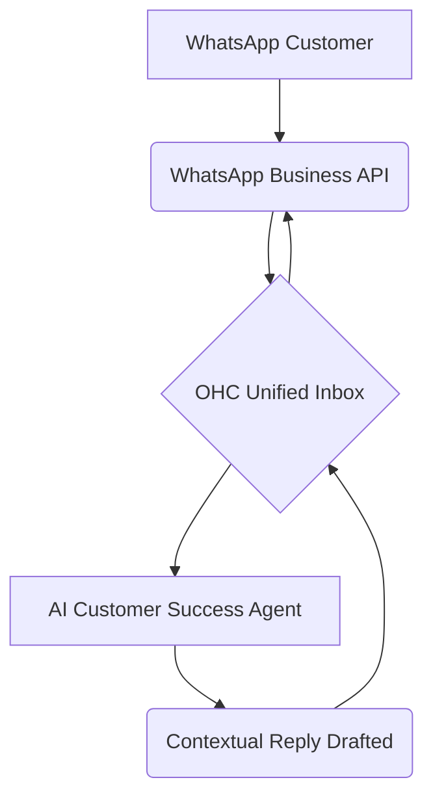
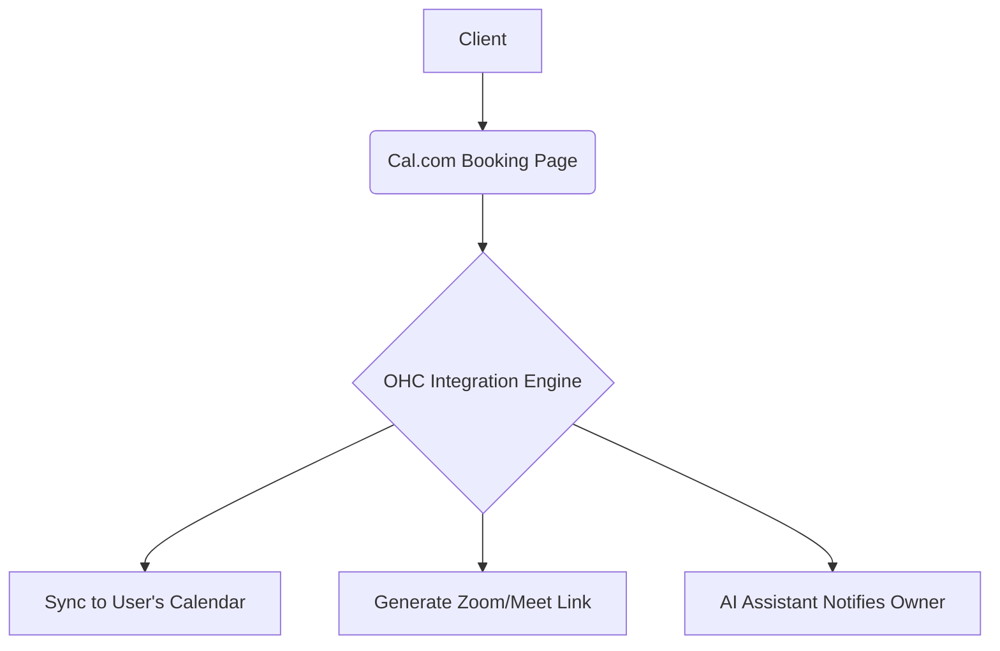
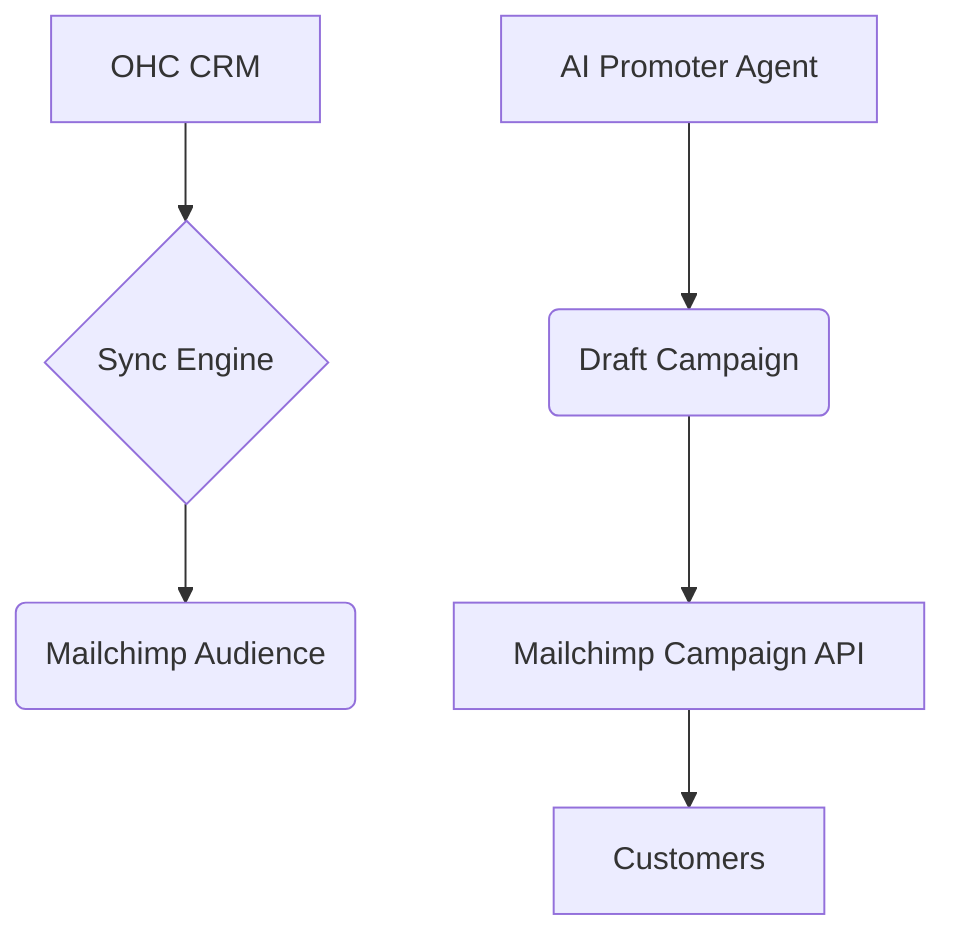
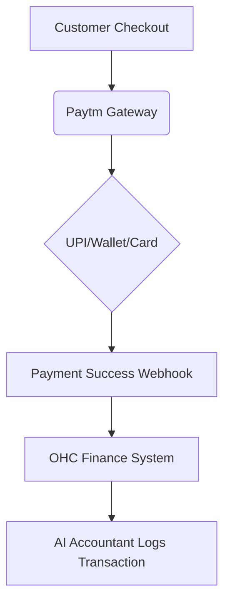
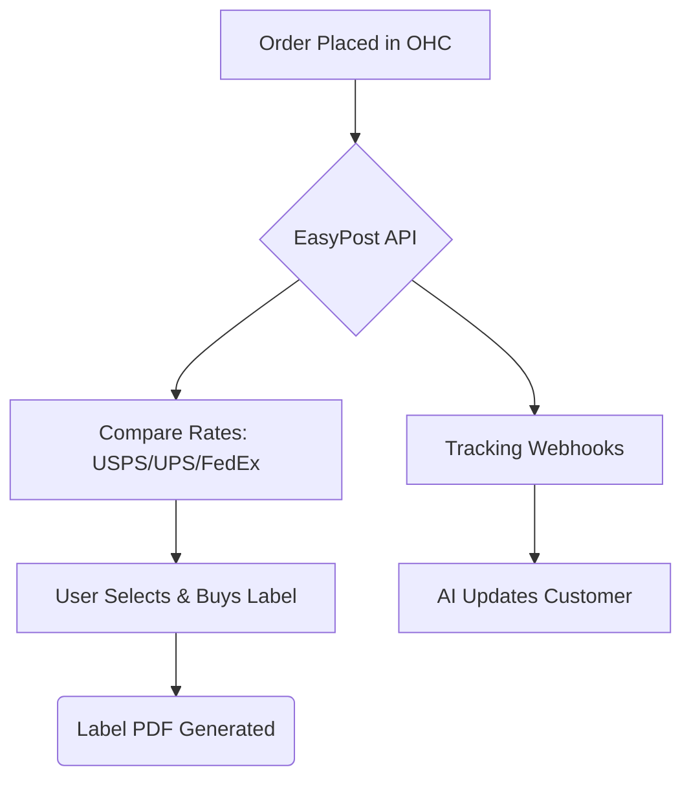
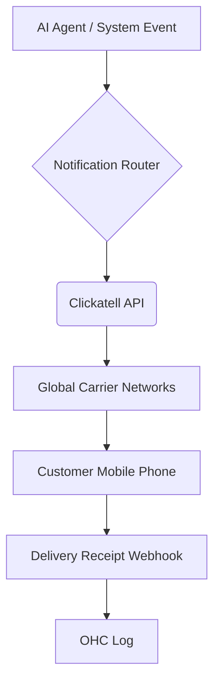
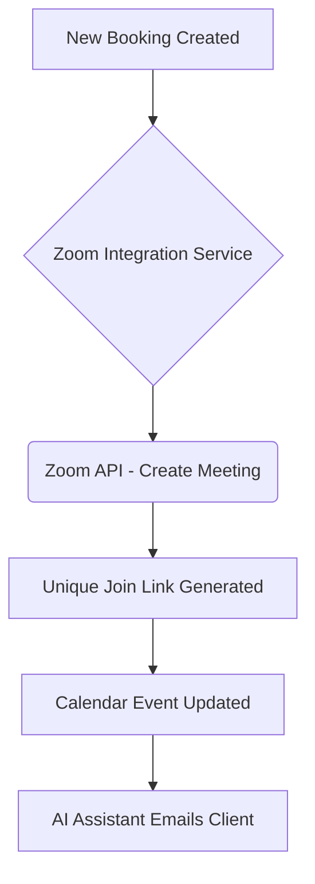

## [Social Media] Issue Brief: WhatsApp Business Integration

**Title**: Scout 🔍: Integrate WhatsApp Business for Automated Unified Inbox
**Problem Statement**:
Small business owners like Fatima (Local Grocer) rely heavily on WhatsApp for receiving orders, customer inquiries, and managing daily operations. Managing these messages manually across multiple numbers or devices leads to missed orders and slow responses. They need an automated system to consolidate WhatsApp messages into a unified inbox, allowing the AI to handle routine questions automatically without technical configuration.
**Research Report**:
- **Tool**: WhatsApp Business API (Cloud API).
- **Evaluation**: The WhatsApp Business API provides programmatic access to send and receive messages. By integrating it, OHC's "Customer Success" AI agent can monitor incoming inquiries and generate contextual replies (e.g., store hours, order status).
- **Ease of Use**: Easy for the user to connect via Facebook Developer portal or embedded signup flow.
- **Pricing**: Conversation-based pricing (first 1,000 user-initiated conversations free per month, then tiered).
- **Cloud vs. Standalone**: Ideal for Cloud mode. In Standalone mode, requires user to register a developer app, creating friction.
**Design Doc**:

- A user goes to the "Integrations" page and links their WhatsApp Business number.
- OHC registers the webhook to receive messages.
- Incoming messages show up in the OHC unified inbox.
- The AI agent processes inquiries and drafts responses.
**Implementation Prompt**:
Develop a seamless WhatsApp Business API integration. Implement an embedded signup/connection flow for users to link their WhatsApp Business numbers. Set up robust webhook endpoints to ingest messages into the OHC unified inbox. Ensure the AI agent can read these messages and formulate replies based on business context. Add a configuration toggle for users to review AI replies before sending or allow auto-reply.
**Priority**: P0
**Estimated Scope**: Large
## [Calendar] Issue Brief: Cal.com Integration for Scheduling

**Title**: Scout 🔍: Integrate Cal.com for Automated Meeting Generation
**Problem Statement**:
Small business owners like Sarah (Freelance Consultant) spend too much time going back and forth over email or text trying to find a suitable time to meet with clients. They need a simple, professional way for clients to book consultations, seamlessly syncing with their existing calendar without double booking.
**Research Report**:
- **Tool**: Cal.com
- **Evaluation**: Cal.com provides an open-source, customizable scheduling infrastructure. It handles timezone conversions, calendar conflict resolution (Google, Outlook, Apple), and automatic video link generation.
- **Ease of Use**: Excellent. Users just share a link, and clients pick a time.
- **Pricing**: Free for individuals; affordable team plans. Open-source version available.
- **Cloud vs. Standalone**: Works well in both. The open-source nature means OHC could potentially self-host it or deeply integrate it for Standalone mode, though Cloud API is more straightforward for multi-tenant.
**Design Doc**:

- A user sets their availability in OHC, which pushes to Cal.com.
- OHC provides a customized booking link to the user.
- Clients book times via the link.
- OHC receives the webhook, updates the internal CRM, and notifies the AI agent to prepare for the meeting.
**Implementation Prompt**:
Integrate Cal.com API to allow seamless appointment scheduling. Build a UI for users to connect their calendars and define availability rules. Use Cal.com's webhooks to capture newly booked, rescheduled, or canceled meetings and reflect these changes in OHC's internal calendar and CRM systems. Ensure the AI assistant provides daily briefing summaries of upcoming appointments.
**Priority**: P1
**Estimated Scope**: Medium
## [Email Marketing] Issue Brief: Mailchimp Integration

**Title**: Scout 🔍: Integrate Mailchimp for Automated Email Campaigns
**Problem Statement**:
Small business owners like Alex (Gym Owner) want to send newsletters and promotional offers to their members but find dedicated email marketing software too complex. They need a simple way to automatically sync their customer list from OHC to a reliable email sender and trigger campaigns without dealing with list management, templates, or bounce handling.
**Research Report**:
- **Tool**: Mailchimp API
- **Evaluation**: Mailchimp is an industry standard for email marketing, offering robust list management, high-quality templates, excellent deliverability, and built-in spam compliance handling.
- **Ease of Use**: Very recognizable brand. OAuth connection is simple for non-technical users.
- **Pricing**: Free tier up to 500 contacts, scalable pricing thereafter. Very accessible for small businesses.
- **Cloud vs. Standalone**: Primarily Cloud. Standalone users can still use it by connecting their personal Mailchimp account via API key or OAuth.
**Design Doc**:

- A user connects their Mailchimp account via the OHC integrations page.
- OHC automatically keeps the OHC customer list synced with a designated Mailchimp Audience.
- The "Marketing/Promoter" AI agent can draft campaigns based on business events (e.g., new product launch) and push them to Mailchimp as drafts for the user to review.
**Implementation Prompt**:
Implement a two-way sync between OHC's internal customer list and Mailchimp Audiences. Provide an OAuth connection flow for Mailchimp. Ensure new customers added in OHC are automatically subscribed in Mailchimp (with proper opt-in handling). Enable the AI Promoter agent to interact with the Mailchimp Campaigns API to create draft newsletters based on recent business updates.
**Priority**: P1
**Estimated Scope**: Medium
## [Payment] Issue Brief: Paytm Integration for India Market

**Title**: Scout 🔍: Integrate Paytm for Localized Payment Processing (India)
**Problem Statement**:
Small business owners like Rahul (Electronics Shop in India) cannot easily use Stripe due to local market preferences and regulatory requirements. Their customers expect to pay using UPI, Paytm Wallet, or local bank transfers. They need a localized payment gateway to process transactions smoothly without high cross-border fees or failed payments.
**Research Report**:
- **Tool**: Paytm Payment Gateway API
- **Evaluation**: Paytm is a dominant payment processor in India, supporting UPI, wallets, net banking, and cards. It provides fast settlement speeds and high reliability in the Indian market.
- **Ease of Use**: Merchants need to complete local KYC to get a Paytm business account. Once approved, API integration is straightforward.
- **Pricing**: Competitive local rates, often 0% for UPI and standard percentage fees for cards/wallets.
- **Cloud vs. Standalone**: Works in both. Requires merchant API keys and webhook configuration.
**Design Doc**:

- A user operating in India selects Paytm as their preferred payment provider in OHC.
- They enter their Merchant ID and API Keys.
- OHC presents Paytm as a checkout option for invoices and online storefronts.
- Webhooks update OHC when a payment succeeds or fails.
**Implementation Prompt**:
Integrate the Paytm Payment Gateway to support Indian merchants. Implement the checkout flow to generate Paytm payment links or integrate the JS SDK. Set up secure webhook handlers to capture payment success, failure, and refund events, updating the OHC invoice status accordingly. Ensure the AI Accountant agent can read these transactions for automated bookkeeping.
**Priority**: P2
**Estimated Scope**: Medium
## [Shipping] Issue Brief: EasyPost Integration

**Title**: Scout 🔍: Integrate EasyPost for Multi-Carrier Shipping & Tracking
**Problem Statement**:
Small business owners like Priya (Boutique) spend hours manually weighing packages, visiting different carrier websites (USPS, FedEx, UPS) to compare rates, and manually typing tracking numbers into emails. They need a unified system that automatically calculates the cheapest rate, prints the label, and tracks the package in one place.
**Research Report**:
- **Tool**: EasyPost API
- **Evaluation**: EasyPost provides a single API to integrate with dozens of carriers globally. It handles rate comparison, label generation, address verification, and real-time tracking updates via webhooks.
- **Ease of Use**: Excellent. Users connect their existing carrier accounts or use EasyPost's default accounts.
- **Pricing**: Free tier available (120k shipments/year free), then pennies per label. Very friendly for small businesses.
- **Cloud vs. Standalone**: Highly suitable for Cloud. Usable in Standalone with individual API keys.
**Design Doc**:

- When an order is ready to ship, OHC requests rates via EasyPost.
- The user selects a rate and generates a label (PDF) directly in OHC.
- EasyPost sends webhooks as the package moves.
- The AI Customer Success agent automatically emails the customer with tracking updates.
**Implementation Prompt**:
Integrate the EasyPost API to provide end-to-end shipping management. Build a UI for users to compare rates, purchase shipping labels, and download the PDFs. Implement address verification to prevent shipping errors. Set up tracking webhooks to automatically update order statuses in OHC and trigger AI-generated shipping notification emails to customers.
**Priority**: P1
**Estimated Scope**: Large
## [SMS] Issue Brief: Clickatell Integration for Global Notifications

**Title**: Scout 🔍: Integrate Clickatell for Reliable Global SMS Notifications
**Problem Statement**:
Small business owners like Fatima (Local Grocer) serve customers who may have limited internet access, low English proficiency, or simply prefer text messages over email. Missed emails lead to missed pickups or unpaid invoices. They need a reliable way to send SMS notifications for order readiness, appointment reminders, and critical updates.
**Research Report**:
- **Tool**: Clickatell API
- **Evaluation**: Clickatell is a global leader in SMS delivery, offering robust carrier coverage, especially in emerging markets (Africa, Asia). It handles complex routing and delivery receipts reliably.
- **Ease of Use**: Users don't need to interact with it directly; OHC handles the API.
- **Pricing**: Pay-per-message pricing. Varies heavily by destination country.
- **Cloud vs. Standalone**: Primarily Cloud, where OHC acts as the centralized sender. In Standalone, users would need their own API keys.
**Design Doc**:

- A system event (e.g., "Order Ready") triggers the Notification Router.
- If the customer prefers SMS, OHC sends a request to Clickatell.
- Clickatell delivers the SMS and sends a delivery receipt back to OHC.
- OHC logs the successful delivery.
**Implementation Prompt**:
Integrate the Clickatell API as an SMS provider in the notification service. Implement a robust sending queue to handle rate limits and retries. Set up webhooks to capture delivery receipts and update the notification status in the database. Ensure the AI agents can trigger SMS messages for critical alerts, keeping the content concise to fit within SMS character limits.
**Priority**: P1
**Estimated Scope**: Medium
## [Video] Issue Brief: Zoom Integration for Online Consultations

**Title**: Scout 🔍: Integrate Zoom API for Auto-Generated Meeting Links
**Problem Statement**:
Small business owners like Sarah (Freelance Consultant) offer online coaching or consultations. Manually creating a Zoom meeting, copying the link, and emailing it to the client for every booking is tedious and prone to human error (e.g., sending the wrong link). They need meetings to be generated and shared automatically when an appointment is booked.
**Research Report**:
- **Tool**: Zoom API (Server-to-Server OAuth or User Managed App)
- **Evaluation**: Zoom is the ubiquitous standard for video conferencing. The API allows creating, updating, and deleting meetings programmatically, as well as retrieving recordings.
- **Ease of Use**: Users must authorize the OHC app via OAuth. Once connected, it's invisible and automatic.
- **Pricing**: Free tier allows API access, but meetings are limited to 40 minutes for multiple participants. Paid plans remove limits.
- **Cloud vs. Standalone**: Works well in Cloud (OHC App). Standalone users would need a Server-to-Server OAuth app, which is technically demanding.
**Design Doc**:

- A client books a consultation via the scheduling system.
- OHC makes an API call to Zoom to create a unique meeting for that specific time.
- Zoom returns the join URL and password.
- OHC embeds the URL into the calendar invite and the automated confirmation email.
**Implementation Prompt**:
Integrate the Zoom API to automatically provision video meetings. Build an OAuth flow for users to connect their Zoom accounts to OHC. Modify the scheduling workflow to detect when an online meeting is booked, trigger the Zoom API to generate a unique link, and attach that link to the calendar event and customer notifications.
**Priority**: P2
**Estimated Scope**: Medium
