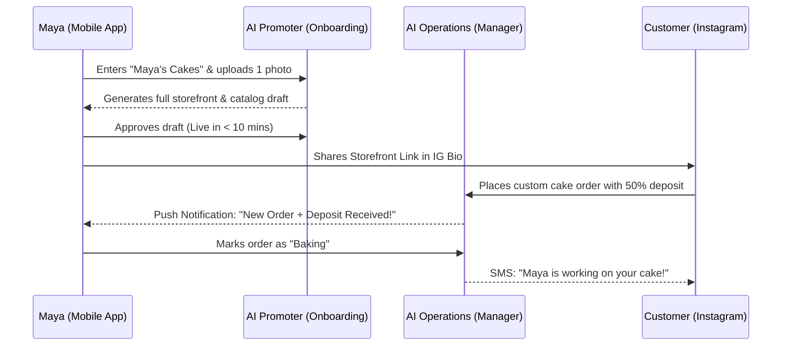
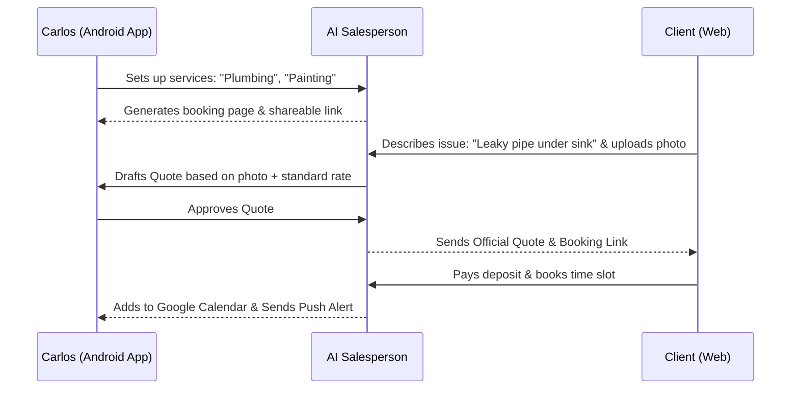
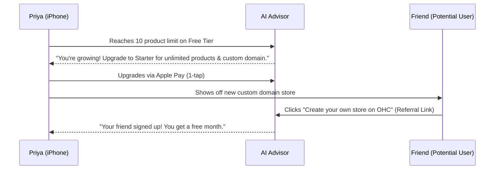
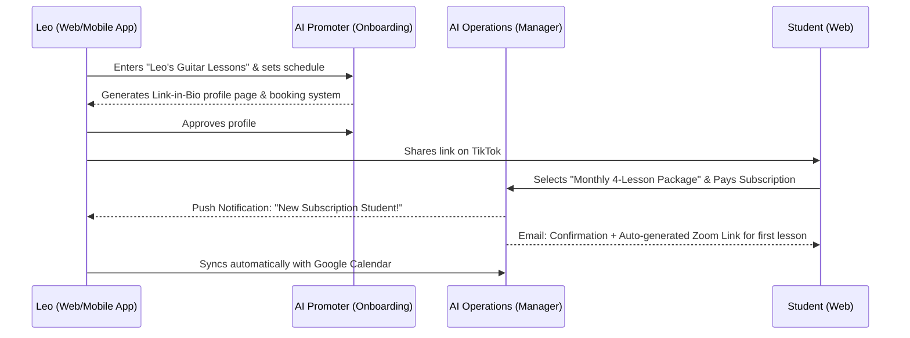
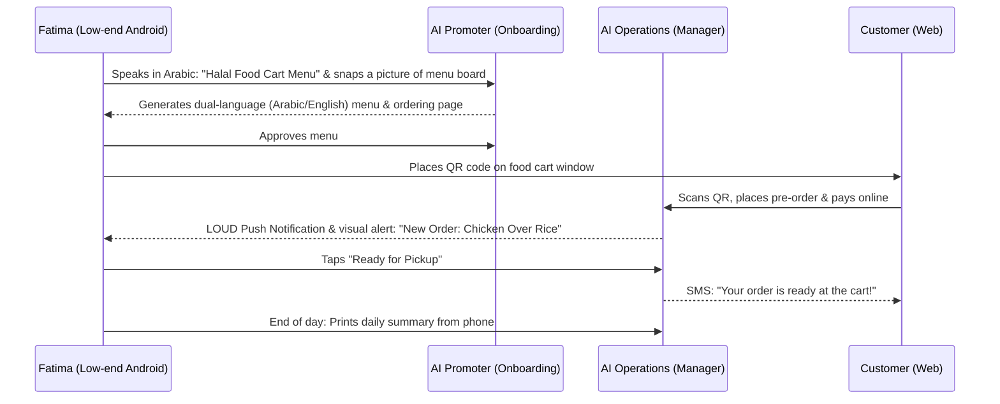

# [research] Business Journey Architecture

## Title
End-to-End Business Journey Architecture and Onboarding Optimization

## Problem Statement
Small business owners (like Maya the Baker, Carlos the Handyman, Priya the Boutique Owner, Leo the Music Tutor, and Fatima the Food Cart Operator) are often intimidated by the initial setup process of traditional platforms like Shopify or Wix. They abandon the process when asked technical questions about DNS, payment gateways, or complex inventory matrices before they even see value. We need a frictionless, guided, AI-assisted journey that takes a user from discovering OHC to a live business in under 10 minutes, entirely from a 375px mobile screen. If the process feels like "setting up software" instead of "opening my doors," we have failed.

## Research Report
### Findings & Competitive Analysis
- **Shopify:** Requires 30-60 minutes. The initial flow demands a store name, physical address, and product details before showing a live preview. High abandonment rate for non-technical users.
- **Wix / Squarespace:** 20-40 minutes. Often relies on complex desktop editors. Mobile apps are mostly companions, not creation tools.
- **GoDaddy (Airo):** Faster setup but generic templates. Upsells domains aggressively before value is proven.
- **OHC Opportunity:** By leveraging our AI Agents ("The Operations Manager", "The Promoter", "The Salesperson"), OHC can invert the onboarding paradigm. Instead of asking the user to build the store, the AI asks 3 simple questions (Name, Business Type, Vibe) and builds a fully functional, live-preview storefront instantly.

### Persona Analysis
- **Maya (Baker):** Discovers OHC via Instagram ad. Needs immediate visual confirmation of her cake catalog. Activation is her first custom order deposit. Upgrades to Starter when she needs a custom domain.
- **Carlos (Handyman):** Discovers OHC via word-of-mouth. Needs a simple booking link to send to a client today. Activation is his first booked time slot. Retained by daily schedule push notifications.
- **Priya (Boutique):** Needs inventory sync and POS. Discovers via organic search for "easy phone POS". Upgrades when she hits the 10-product limit of the Free tier.
- **Leo (Music Tutor):** Discovers via TikTok link-in-bio of another creator. Needs subscription packages. Viral loop: students see "Powered by OHC" when booking.
- **Fatima (Food Cart):** Needs dual-language (Arabic/English) and offline-capable pre-order list. Activation is receiving a loud push notification for her first online order.

## Design Doc

### Architecture Diagrams (Mermaid.js)

#### 1. Maya (The Home Baker) - Product & Deposit Journey

#### 2. Carlos (The Handyman) - Booking & Quote Journey

#### 3. Priya (The Boutique Owner) - Viral Loop & Upgrade

#### 4. Leo (The Music Tutor) - Subscription & Zoom Journey

#### 5. Fatima (The Food Cart Operator) - Multilingual Pre-Order Journey

### UI Flow & Screen Description (375px Mobile First)

#### Onboarding (The "Zero to Live" Flow)
1. **Screen 1 (Acquisition):** Big, friendly text: "What do you do?" (e.g., "I bake cakes", "I fix pipes"). Native keyboard pops up immediately.
2. **Screen 2 (Magic):** "The Promoter is building your business..." (Lottie animation of AI agent working). Glassmorphism UI elements sliding into place.
3. **Screen 3 (The Reveal):** A fully live, interactive preview of their storefront with AI-generated placeholder text and images matching their industry.
4. **Screen 4 (Activation CTA):** "Looks great. Let's get paid. Connect Bank/Stripe" (1-tap integration).

#### Friction Points Identified & Resolved
- **DNS/Domain Setup:** Deferred. Users start on an `ohc.page/mayascakes` subdomain. Domain setup is moved to the Upgrade flow.
- **Complex Inventory:** Deferred. Users add *one* product or service to go live. The rest can be added later via the "Agent Activity Feed".
- **Tax/Legal:** Deferred. The Legal & Compliance agent generates standard TOS automatically based on the business type.

### Key Design Decisions
- **Deferred Complexity:** We do not ask for anything that isn't strictly necessary for the first transaction. Everything else is handled by background AI agents post-launch.
- **Agent-Led Setup:** The user does not "build" the site; they "approve" the AI's work. This shifts the cognitive load from creation to curation.
- **Push-Notification Activation:** True activation happens when the user's phone buzzes with their first order. The app must ensure notification permissions are requested effectively.

## Implementation Prompt
Implement the new AI-guided onboarding flow and agent-led store generation for mobile clients (Flutter).
- **User-Facing Outcome:** A user downloads the app, enters their business type, and the AI immediately generates a functional, branded storefront preview within 3 screens.
- **Critical User Journey (CUJ):** The user approves the generated store, connects a payment method, and successfully shares their link to receive a test order, all from a 375px-wide viewport without horizontal scrolling.
- **Acceptance Criteria:**
  1. The onboarding flow requires fewer than 5 taps to see a live preview.
  2. The UI utilizes the OHC Premium Token library (Glassmorphism, Outfit/Inter fonts).
  3. All complex configuration (domains, advanced inventory, policies) is deferred to post-activation agent tasks.

## Priority
P0

## Estimated Scope
Large
