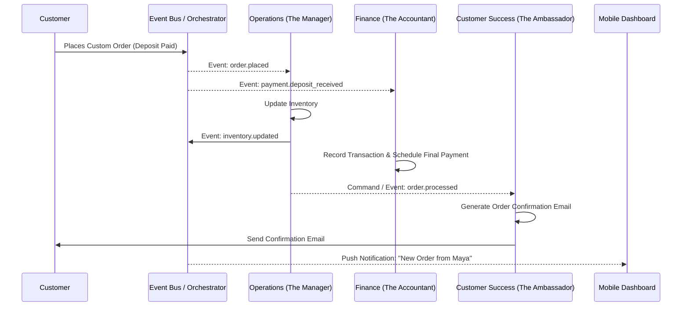
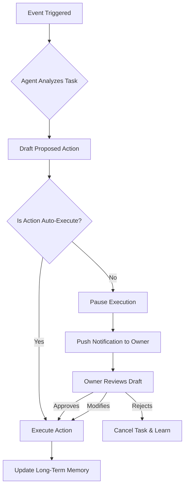

# [Architecture] AI Agent Department

## Problem Statement
Small business owners (our core personas like Maya the baker and Carlos the handyman) lack the time, expertise, and resources to handle all the operational complexity of running a business. They need an invisible, reliable staff that functions cohesively across different business domains (marketing, sales, operations, finance) without requiring complex configuration or prompt engineering. Currently, AI agents in platforms are often isolated chatbots rather than an integrated workforce that autonomously coordinates tasks like processing orders, sending confirmations, and analyzing business health.

## Research Report

### Persona Pain Points
- **Maya (The Home Baker):** "I spend 3 hours a day just replying to Instagram DMs and coordinating delivery times. I want an assistant who just handles the back-and-forth and lets me bake."
- **Carlos (The Handyman):** "I miss jobs because I can't reply to quotes fast enough when I'm under a sink. I need someone to instantly send an estimate when a request comes in."
- **Priya (The Boutique Owner):** "I have no time to figure out why sales dipped on Tuesday, let alone write marketing emails to bring people back in."

### Competitive Analysis
| Feature | OHC Agent Departments | Shopify Sidekick | Wix AI | GoDaddy Airo |
|---|---|---|---|---|
| **Paradigm** | Autonomous coordinated workforce | Reactive chatbot | Setup wizard / generator | Setup wizard |
| **Cross-Department Collaboration** | High (e.g., Ops -> Customer Success) | None (isolated queries) | None | None |
| **Proactive Action** | Yes (scheduled, event-driven) | No (requires user prompt) | No | No |
| **Approval Flow** | Draft-for-review vs. Auto-execute | Read-only / suggestions | Draft only | Draft only |

### Actionable Recommendations
1. **Event-Driven Invocation:** Shift from chat-first interfaces to event-driven triggers. A new order webhook should automatically trigger the Operations and Finance agents.
2. **Specialized Departments:** Give each agent a specific persona and toolset ("The Manager", "The Accountant") so business owners intuitively understand their responsibilities.
3. **Draft vs. Auto-Execute Tiers:** Build trust progressively. Start with "Draft for Review" for sensitive actions (e.g., sending a quote, posting to social media) and allow users to toggle to "Auto-execute" once comfortable.

## Design Doc

### High-Level Architecture Overview
The AI Agent Department architecture is built on an event-driven choreography pattern. Departments (Agents) are isolated workers that subscribe to domain-specific events, maintain localized context (memory), and coordinate via a centralized Event Bus (e.g., Kafka, NATS, or PostgreSQL PUB/SUB).

### Key Design Decisions
1. **Trigger Mechanisms:**
   - **On Event:** Driven by system Webhooks or Pub/Sub (e.g., `order.created`, `customer.message_received`).
   - **On Schedule:** Cron-based triggers (e.g., Business Advisory running a weekly health check every Sunday at 8 AM).
   - **On Demand:** User explicitly asks an agent to do something via UI or chat (e.g., "Draft a new refund policy").
2. **Inter-Department Coordination:** Choreography via Event Bus. When "Operations" completes an order, it emits an `order.fulfilled` event. "Customer Success" listens to this event and emails the customer.
3. **Memory & Context:**
   - **Short-Term Context:** Provided in the event payload.
   - **Long-Term Memory:** Stored as `pgvector` embeddings for past interactions (e.g., customer history, previous successful quotes) scoped strictly by `tenant_id`.
4. **Action Approvals:** Each action has a defined `risk_level`. High-risk actions (e.g., sending money, publishing a post) pause execution and place a `Task` in a Draft state for owner approval via the UI/Mobile App. Low-risk actions (e.g., drafting a report, syncing inventory) auto-execute.
5. **Throttling & Budgeting:** Implemented via Redis token buckets at the tenant level. Each department consumes a specific number of "AI Tokens" per action, governed by the tenant's SaaS Tier limits.

### AI Department Flow Architecture

### Approval & Safety Flow

### Mobile UX Flow (375px First)
1. **The "Staff Room" Screen:** A tab showing active departments. Each department has a status indicator (e.g., "The Promoter: Drafting Instagram Post...", "The Manager: Processing 3 Orders").
2. **The "To Review" Inbox:** A unified feed where owners review Draft Actions.
   - Example Card: "The Promoter drafted a response to Sarah's email." -> Buttons: [Approve & Send] [Edit] [Discard].
3. **Department Settings:** A simple toggle screen for each agent.
   - "Auto-reply to common questions?" [Toggle ON/OFF]
   - "Auto-post weekly updates to Facebook?" [Toggle ON/OFF]

## Implementation Prompt
**For Implementer Agent:**
Implement the backend foundation for the AI Agent Department system. The feature should allow a tenant to configure different AI "Departments" (e.g., Operations, Customer Success) with specific approval thresholds (Draft vs. Auto-execute).
- **CUJ:** A user signs up, the system provisions their default departments, a mock `order.created` event is fired, the Operations agent updates mock inventory, and the Customer Success agent drafts a confirmation email that waits in a "Pending Approval" state for the user to review.
- **Acceptance Criteria:**
  - Define the data models for `AgentDepartment`, `AgentTask`, and `TaskApproval`.
  - Implement an event dispatcher that routes domain events to the correct department's job queue.
  - Create a "Draft for Review" mechanism that pauses agent execution until a user explicitly approves the `AgentTask`.
  - Ensure strict tenant isolation (`tenant_id`) on all queries.
  - Expose REST/gRPC endpoints for the mobile client to fetch "Pending Approvals" and submit decisions (Approve/Reject/Modify).
  - Add E2E tests validating the complete flow from event emission to task approval.

**Priority:** P1 (High)
**Estimated Scope:** Large
