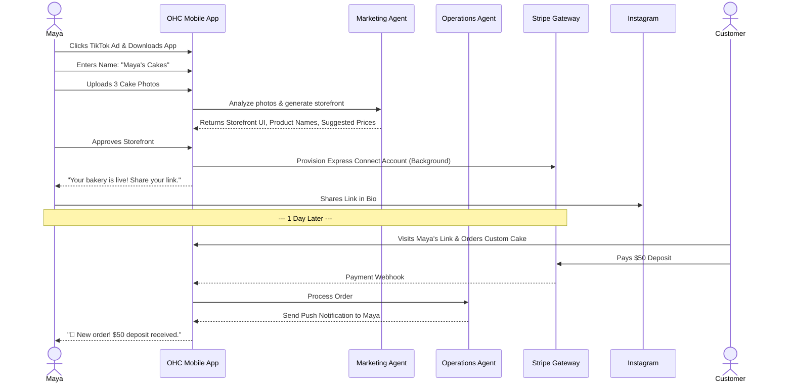
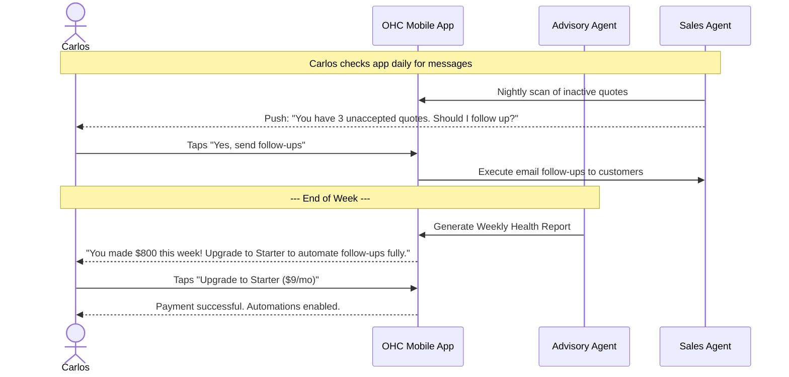
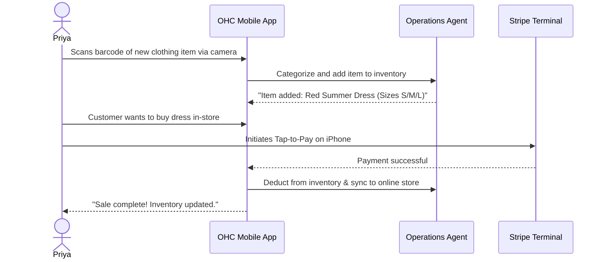
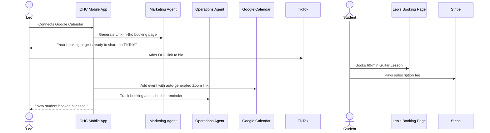
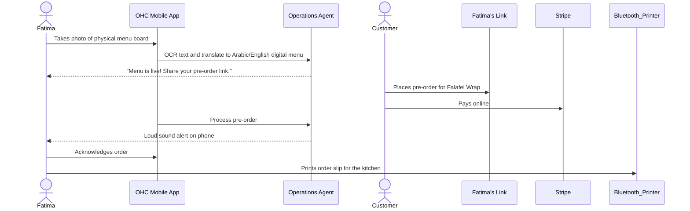

# [architecture] Business Journey Architecture

## Title
End-to-End Business Journey Architecture & Flow Optimization

## Problem Statement
Small business owners (our core personas like Maya the baker, Carlos the handyman) are fundamentally non-technical. Traditional platforms (Shopify, Wix) overwhelm them with complex configuration, technical jargon, and multi-day setup processes. To deliver on the OHC Promise of "zero → live business in under 10 minutes", we need a meticulously designed, mobile-first business journey that handles Acquisition, Onboarding, Activation, Retention, Revenue, and Referral smoothly. If we introduce friction, require technical decisions, or ask for too much upfront information, users will abandon the flow. We must map exactly how the AI agents invisibly remove this friction.

## Research Report

### Competitive Analysis
- **Shopify**: Setup takes 30-60 mins. Requires technical understanding of shipping zones, tax Nexus, payment gateways. Mobile app is primarily for management, not initial store builder.
- **Wix/Squarespace**: Setup takes 20-40 mins. Overwhelming template choices. Requires desktop for serious customization.
- **GoDaddy/Zyro**: Fast, but generic and limiting.

### OHC Core Personas Journey Breakdown
1. **Maya (The Home Baker, 28)**
   - *Acquisition*: Discovers OHC via a TikTok ad showing "Turn Instagram DMs into a real bakery in 5 mins." CTA: "Start Your Bakery - Free".
   - *Onboarding*: Uploads 3 photos of cakes. AI automatically names the products, sets suggested prices, and generates a storefront design based on the photo aesthetics.
   - *Activation*: Success is receiving her first custom order deposit via Stripe within 24 hours.
   - *Retention*: Checks the app daily to see order statuses and respond to AI-drafted messages.
   - *Revenue*: Upgrades to Starter ($9/mo) when she exceeds 10 products or wants a custom `.com` domain. Triggered by AI Advisor: "You're getting lots of traffic! Get a professional domain."
   - *Referral*: Shares her personalized OHC referral link in her Instagram bio.

2. **Carlos (The Freelance Handyman, 42)**
   - *Acquisition*: Hears about OHC from another contractor. CTA on landing page: "Get More Jobs Booked Today."
   - *Onboarding*: Enters his service area (ZIP code). AI generates a list of standard handyman services (plumbing, painting) with average local prices. He confirms them.
   - *Activation*: Success is having his first calendar booking with a $50 deposit.
   - *Retention*: Push notifications for new quote requests. AI agent activity summaries ("Sent 3 quotes today").
   - *Revenue*: Upgrades to Starter to use the automated AI follow-up for inactive leads.
   - *Referral*: Uses the built-in "Share with a colleague" feature to get a free month.

3. **Priya (The Boutique Owner, 35)**
   - *Acquisition*: Searching for "sync physical store with online store easy." CTA: "Sell In-Store and Online Automatically."
   - *Onboarding*: Connects her existing inventory spreadsheet or adds items via mobile camera barcode scanning. AI auto-categorizes items and tags variants (color, size).
   - *Activation*: Completes her first in-person POS tap-to-pay using her iPhone.
   - *Retention*: Daily morning push notification: "Yesterday's Sales & Today's Top Selling Item."
   - *Revenue*: Upgrades to Pro ($29/mo) for advanced analytics and email newsletter automation.
   - *Referral*: Refers other local main street businesses via word-of-mouth with her referral code.

4. **Leo (The Music Tutor, 22)**
   - *Acquisition*: Sees another creator using OHC for a link-in-bio on TikTok.
   - *Onboarding*: Connects Google Calendar. AI creates a simple booking page and automatically sets up 30/60 min lesson packages.
   - *Activation*: First student books a recurring weekly lesson.
   - *Retention*: Push notifications when students cancel or reschedule. Weekly summary of upcoming lessons.
   - *Revenue*: Upgrades to Starter to allow subscription billing for his students.
   - *Referral*: Shares his OHC-powered link-in-bio on TikTok, which includes a subtle "Powered by OHC" badge (viral loop).

5. **Fatima (The Food Cart Operator, 50)**
   - *Acquisition*: Community outreach or flyers in local markets. App supports Arabic. CTA: "Take Pre-Orders Easily."
   - *Onboarding*: Takes photos of her menu board. AI OCRs the text and translates it into a digital Arabic/English menu.
   - *Activation*: Receives first pre-order notification with sound alert on her phone.
   - *Retention*: Prints the daily order list from her phone to a bluetooth receipt printer.
   - *Revenue*: Remains on Free tier for a long time, but eventually upgrades to Starter for more than 10 menu items.
   - *Referral*: Other cart owners see her using the app.

### Friction Points to Avoid
- Asking for business entity type (LLC, Sole Prop) during onboarding. (Defer this to Finance/Legal agents later).
- Forcing template selection. (AI should auto-generate the best layout).
- Complicated shipping setups. (Start with flat rate or local pickup by default).

## Design Doc

### Mobile UX Flow (375px First)
1. **Landing Screen**: Clear CTA, simple value proposition. No jargon.
2. **Onboarding Wizard**: Conversational UI (e.g., "What do you sell?", "Take a photo of your best product"). 1 question per screen. Large touch targets (≥ 44x44px).
3. **Magic Moment (Loading Screen)**: "Our AI is building your business..." with smooth micro-animations.
4. **Dashboard**:
    - Top: Immediate Action Required (e.g., "1 New Message", "Order to fulfill").
    - Middle: Quick Actions ("Add Product", "Share Link").
    - Bottom: Plain-language metrics ("$150 made this week").
5. **AI Advisor Drawer**: Swipe up from bottom to see insights and suggestions from the Business Advisory department.

### Sequence Diagrams

#### Maya's Journey (Acquisition to Activation)

#### Carlos's Journey (Retention to Revenue)

## Implementation Prompt
**For the Frontend Implementer:**
Implement the Onboarding Wizard flow in Flutter for mobile (375px baseline width). The flow must consist of a sequence of screens taking minimal inputs (Business Name, Business Category, and an Image Upload component). Use Riverpod for state management. The final step must display a loading screen with a subtle Glassmorphism animation (`backdrop-filter: blur(20px)`) simulating the AI building the store, followed by a transition to the main Dashboard. Ensure touch targets are at least 44x44px. Do not implement the actual backend AI generation—mock the AI response (storefront UI layout and suggested products) to allow for complete E2E testing of the user journey.

**For the Backend Implementer:**
Implement the initial `Tenant` provisioning API and the AI Onboarding worker queue. When the onboarding API is called, store the initial data in PostgreSQL using row-level security (tenant isolation). Dispatch an async job to the AI Job Queue (using `SKIP LOCKED`) for the `Marketing & Advertising` agent to generate the initial storefront JSON configuration based on the user's uploaded images. Implement a fallback/mock response for the AI worker to ensure tests pass reliably.

## Priority
P0 (Critical)

## Estimated Scope
Large

#### Priya's Journey (Activation to Retention)

#### Leo's Journey (Acquisition to Activation)

#### Fatima's Journey (Onboarding to Activation)

