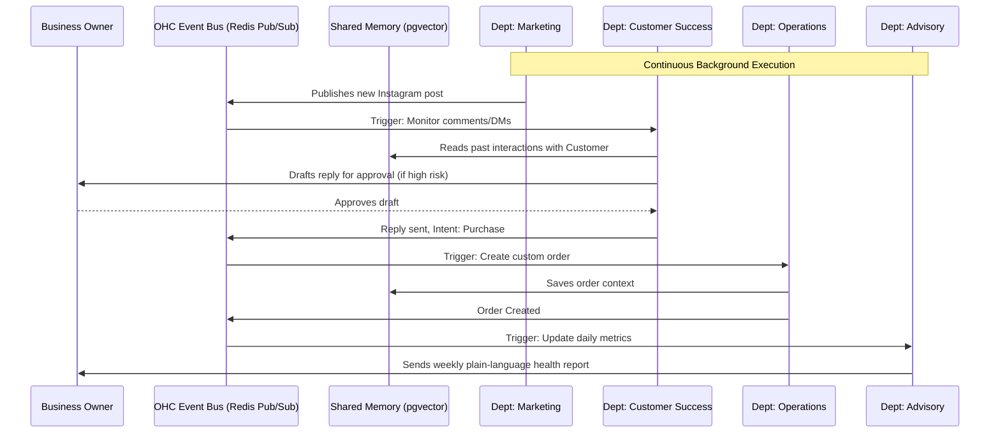

# AI Agent Department Coordination Architecture

## Problem Statement
Small business owners—like Maya the baker or Carlos the handyman—do not understand software agents, directed acyclic graphs, job queues, or RAG pipelines. They just want their business to run smoothly. When a platform exposes raw "AI Agents" or a single conversational chatbot, it fails to model the actual complexity of running a business. OHC needs an architecture that organizes AI agents into recognizable "Departments" (e.g., Operations, Marketing, Sales, Finance) that operate autonomously and coordinate invisibly in the background. The complexity of routing tasks, sharing context, and escalating to human approval must be entirely abstracted behind a friendly, real-world business metaphor.

## Research Report
### Competitive Analysis
- **Shopify (Sidekick)**: Provides a single chat interface. It acts as an assistant but does not run continuous, autonomous background operations across distinct functional areas.
- **Wix (Wix AI) / Squarespace**: Focuses primarily on initial setup and content generation (website design). Lacks post-launch, cross-departmental business operations.
- **GoDaddy (Airo)**: Provides domain-centric setup assistance but fails to act as a continuous operating system for the business.

### OHC Opportunity
OHC treats AI as infrastructure. By dividing the AI workforce into functional Departments ("The Promoter", "The Manager", "The Accountant"), we map exactly to how a business owner thinks. Furthermore, these departments need to coordinate (e.g., Customer Success lands a sale $\rightarrow$ Operations fulfills it $\rightarrow$ Finance tracks the revenue $\rightarrow$ Advisory reports on it).

## Design Doc

### Architecture Diagram

### Key Design Decisions
1. **Departmental Abstraction**: Instead of one monolithic agent, we use specialized agents with narrow scopes (System Prompts). This reduces hallucination and makes the prompt architecture manageable.
2. **Event-Driven Coordination**: Departments communicate via a robust event bus rather than direct synchronous API calls. This allows agents to operate asynchronously and handle retry logic via the background job queue (PostgreSQL `SKIP LOCKED`).
3. **Shared Episodic Memory**: All departments read from and write to a shared vector database (pgvector). This ensures "The Accountant" knows what "The Salesperson" promised a customer.
4. **Approval Escalation**: Critical actions (e.g., spending ad money, refunding a large amount) trigger a push notification to the owner for one-tap approval.

### Mobile UX Flow (375px Baseline)
- **Home Screen (The Dashboard)**: Features a Glassmorphism card at the top indicating "AI Staff Status".
  - Examples: "The Promoter is scheduling 3 posts." or "The Advisor has your weekly report."
- **Staff Page**: A list of the 7 Departments.
  - Each department has a toggle (Active / Paused).
  - Tapping a department (e.g., "The Ambassador") opens its settings: "Tone of voice", "Auto-reply vs. Draft for review".
- **Action Required Sheet**: A bottom sheet pops up when an agent needs human approval.
  - "The Ambassador drafted a reply to Maya about a vegan cake. Send?" $\rightarrow$ [Approve] / [Edit].
- **Visuals**: Premium feel. 20px blur, Outfit/Inter typography, large 44x44px touch targets.

## Implementation Prompt
**For the Implementer Agent:**
Implement the foundational `DepartmentOrchestrator` and `Department` interfaces in Go.
1. Define the core `Department` interface with methods for handling events, querying shared memory, and requesting human approval.
2. Create dummy implementations for the 7 core departments (Operations, Marketing, Sales, Customer Success, Finance, Legal, Advisory) that register themselves with the orchestrator.
3. Design the database schema (or structs if in-memory for now) to represent a Department's configuration (Tone, Auto-Approve limits) per Tenant.
4. Ensure the orchestrator can dispatch an event (e.g., `OrderPlaced`) to the appropriate departments based on their subscriptions.
Do not implement the actual LLM calls yet; focus on the structural wiring, event routing, and multi-tenant isolation. Ensure 100% test coverage for the routing logic.

## Priority
P0

## Estimated Scope
Large
