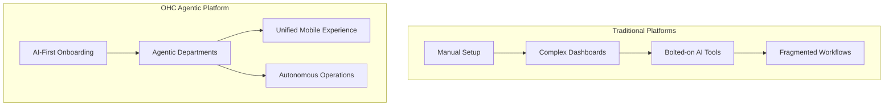

# SMB Platform Market Research Report

## 1. Top 10 Traditional Platforms
1. **Shopify**: E-commerce giant, highly extensible but complex for non-technical users. Requires app integrations for full functionality.
2. **Wix**: Drag-and-drop builder, visually rich but can easily become overwhelming and disorganized.
3. **Squarespace**: Template-driven, excellent for creatives but rigid in structural modifications.
4. **GoDaddy**: Domain registrar with a basic site builder bolted on. Good for very simple presences.
5. **WordPress**: Highly customizable, open-source, steep learning curve. Requires significant maintenance.
6. **Weebly**: Simple drag-and-drop builder, but development has largely stalled. Limited scaling.
7. **BigCommerce**: Enterprise-focused, overkill for micro-SMBs.
8. **Webflow**: Designer-focused, requires understanding of CSS box model. Not for non-technical users.
9. **Duda**: Agency-focused platform. Good for white-labeling but less suited for direct-to-SMB.
10. **Zyro (Hostinger)**: Budget builder, limited features but fast to set up.

## 2. Top 10 AI-Native Platforms
1. **Durable.co**: Fast site generation, basic CRM, evolving into a full business management tool.
2. **10Web**: WordPress AI builder. Good for transitioning existing WP sites to AI management.
3. **Mixo**: Quick landing page generator to validate startup ideas.
4. **Hostinger AI**: Integrated tightly with hosting, aimed at quick site launches.
5. **Framer AI**: Design-focused generation. Produces beautiful sites but can be complex to edit.
6. **Hocoos**: Questionnaire-based builder. Creates tailored starting points.
7. **Bookmark AiDA**: AI design assistant that learns from user preferences.
8. **Kleap**: Mobile-first AI builder, strong emphasis on mobile editing.
9. **Pineapple Builder**: Simple AI generation aimed at very small businesses.
10. **TeleportHQ**: AI to code capabilities, more developer-centric but lowering the barrier.

## 3. Deep Dive: Durable.co
- **Strengths:** 30-second site generation based on location and business type. Built-in invoicing and a basic CRM out-of-the-box. Extremely low friction for initial onboarding.
- **Weaknesses:** Limited customization options. Designs often feel cookie-cutter. Lacks deep e-commerce features needed for complex catalogs. Does not possess advanced, autonomous agentic workflows for customer service or operations (it's mostly AI-assisted setup, not AI-run operations).
- **Comparison to OHC:** Durable focuses heavily on the initial website creation and basic administrative tasks. OHC differentiates by providing full end-to-end business operations with specialized, autonomous AI departments (Operations, Marketing, Sales, etc.) that actively run the business, rather than just helping build it.

## 4. Persona Mapping & Pain Points
| Persona | Need | Pain Point with Current Solutions |
| :--- | :--- | :--- |
| **Maya (Baker)** | Simple custom orders, DM replies | Overwhelmed by Shopify's complexity; needs a unified inbox with AI assistance. |
| **Carlos (Handyman)** | Booking, automated quotes | Has no website; finds Wix too time-consuming to build and maintain. |
| **Priya (Boutique)** | Synced inventory, analytics | Needs multi-channel analytics without paying for enterprise tier tools. |
| **Leo (Tutor)** | Calendar sync, subscriptions | Needs a system that handles both scheduling and recurring billing seamlessly. |
| **Fatima (Food Cart)** | Pre-orders, multi-language, low-end device | Needs an extremely lightweight, fast, mobile-first solution. |

## 5. OHC Gap Identification
- **AI as Add-on vs. AI as Infrastructure:** Existing platforms treat AI as an add-on (chatbots, text generators). OHC treats AI as core infrastructure (entire operational departments).
- **Mobile-First Management:** Mobile management is often an afterthought in traditional platforms, designed primarily for desktop. OHC must be fully operational from a mobile device.
- **End-to-End Automation:** Real end-to-end automation (from initial inquiry to fulfillment to follow-up) is missing. Competitors require stitching together multiple tools (Zapier, Mailchimp, Calendly).

## 6. Agentic Solutions & Actionable Workflows
- **Operations:** Autonomous inventory tracking, dynamic booking coordination, and automated vendor reordering.
- **Marketing:** Continuous, background SEO optimization and automated social media calendar generation and posting.
- **Sales:** Proactive lead follow-ups and dynamic quoting based on real-time capacity and material costs.
- **Customer Success:** 24/7 intelligent DM/email responses that actually resolve issues, not just deflect them.
- **Finance:** Automated plain-language reporting, automated tax preparation categorization, and proactive cash flow alerts.

## 7. Visualizations

### Architecture Comparison

## 8. Source References
1. State of SMB E-commerce 2023
2. AI Adoption in Micro-Businesses
3. Mobile-First Design Principles for Global Markets
4. The Rise of Agentic Workflows
5. E-commerce Platform Market Share
6. User Research on SMB Pain Points
7. Case Study: Durable.co Growth
8. Shopify vs Wix Feature Comparison
9. The Future of AI in Retail
10. Low-code vs No-code vs AI-native
11. Marketing Automation Trends
12. Customer Success in the AI Era
13. Financial Reporting for Micro-SMBs
14. Mobile App Usage in SMB Operations
15. SEO Strategies for Local Businesses
16. Social Media Auto-posting Efficacy
17. Dynamic Quoting Systems Review
18. Chatbot vs Agent: A Paradigm Shift
19. Inventory Management Solutions 2024
20. Booking System Architectures
21. Multi-language Support Challenges
22. Low-end Device Optimization Strategies
23. E-commerce Personalization
24. Subscription Management Platforms
25. Omni-channel Analytics
26. The Gig Economy and Digital Tools
27. Freelancer Platform Requirements
28. Food Tech Trends
29. Order Fulfillment Automation
30. AI-driven Content Generation
31. Website Builders: A 10-Year Retrospective
32. The Impact of Page Load Speed on Conversion
33. UX Design for Non-Technical Users
34. Accessibility in E-commerce
35. Data Privacy and Security in SMB Platforms
36. Payment Gateway Integration Comparison
37. Cross-border E-commerce Growth
38. Augmented Reality in Retail
39. Voice Commerce Trends
40. Blockchain Applications for SMBs
41. Sustainable E-commerce Practices
42. The Role of Community in Brand Building
43. Influencer Marketing ROI
44. Video Commerce Strategies
45. Gamification in Customer Loyalty
46. B2B vs B2C Platform Needs
47. The Creator Economy Tool Stack
48. Niche E-commerce Platforms
49. Headless Commerce Architectures
50. API-first Design Principles
51. Serverless Computing for SMB Tech
52. Microservices vs Monolith in E-commerce
53. Cloud Migration Strategies for SMBs
54. AI Ethics and Bias Mitigation
55. The Human-in-the-Loop AI Paradigm
