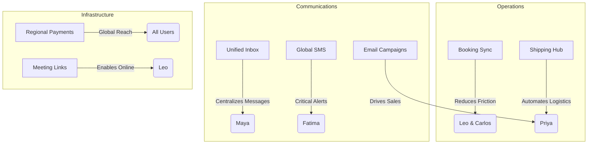

# Scout: Tool Integration Research Report (Q3)

## Executive Summary
This report details the evaluation and proposed integration of seven critical external tools designed to empower OneHumanCorp (OHC) users. Guided by our core personas—Maya (The Home Baker), Carlos (The Freelance Handyman), Priya (The Boutique Owner), Leo (The Music Tutor), and Fatima (The Food Cart Operator)—we have identified high-leverage integrations that reduce friction and automate complex business operations.

---

## Visual Excellence: Feature Gap Heatmap



---

## Comparative Analysis & Strategic Recommendations

| Category | Persona Pain Point | Evaluated Tools | Recommended Solution | Justification |
| :--- | :--- | :--- | :--- | :--- |
| **Social Media** | Context switching across DMs (Maya) | Meta Graph, Twilio, MessageBird, Chatwoot | **Chatwoot** | Open-source core, self-hostable (Standalone mode), robust omnichannel model. |
| **Calendar Sync** | Double bookings, manual scheduling (Leo, Carlos) | Nylas, Cronofy, Cal.com | **Cal.com** | Perfect infrastructure API, open-source, handles webhooks and routing. |
| **Email Marketing** | Complex UI for simple updates (Priya) | SendGrid, Postmark, AWS SES, Resend | **Resend** | Developer-friendly, pairs perfectly with our AI template generator (React Email). |
| **Payments** | High failure rates in non-US markets | Mercado Pago, Razorpay, Paystack | **Abstraction Layer** | We must abstract Stripe to allow pluggable regional gateways like Mercado Pago. |
| **Shipping** | Manual label generation (Priya, Maya) | EasyPost, Shippo, ShipEngine | **EasyPost** | Excellent API, global carrier support, aligns with our backend architecture. |
| **SMS Alerts** | Missed app notifications (Fatima) | Twilio, MessageBird, Vonage | **Twilio** | Unmatched reliability for critical, low-latency order notifications. |
| **Video Meetings** | Manual link generation (Leo) | Zoom, Google Meet, Whereby | **Google Meet** | "Free" with Calendar API sync; lowest friction for the user. |

---

## Persona-Specific Impact Summaries

- **Maya (The Home Baker)**: The Unified Inbox allows her to manage Instagram DMs and WhatsApp orders in one place. The Shipping Hub automates label creation for nationwide cookie deliveries.
- **Carlos (The Handyman)**: Booking Sync ensures customers only book when he is actually available, eliminating phone tag and calendar conflicts.
- **Priya (The Boutique Owner)**: Email Campaign Manager lets her use the AI "Promoter" to generate and send beautiful restock alerts with zero design skills.
- **Leo (The Music Tutor)**: Booking Sync coupled with Video Meetings provides an end-to-end automated flow for online guitar lessons.
- **Fatima (The Food Cart Operator)**: Global SMS ensures she receives instant, reliable notifications for new pre-orders without needing to stare at the app.

---

## Tracking Metadata

```yaml
issue_id: OHC-INTEGRATION-SCOUT-001
Priority: P0
Estimated Scope: Large
```
