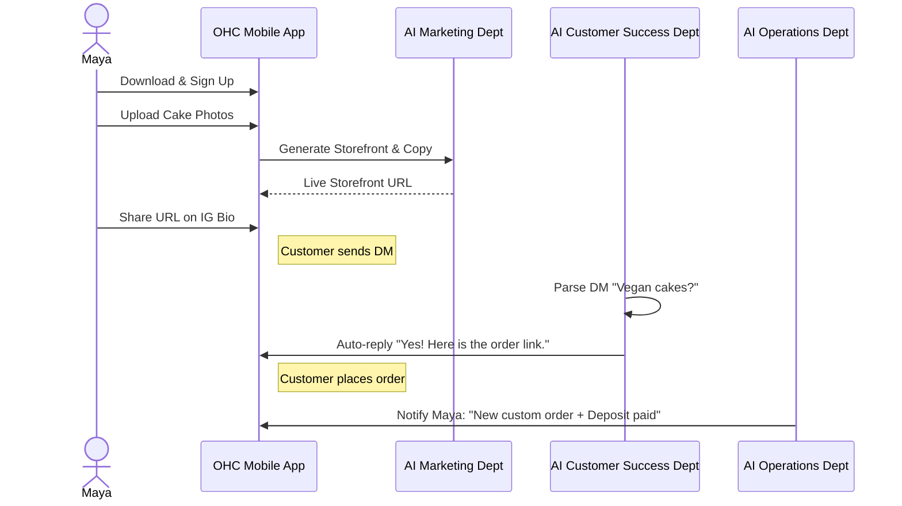
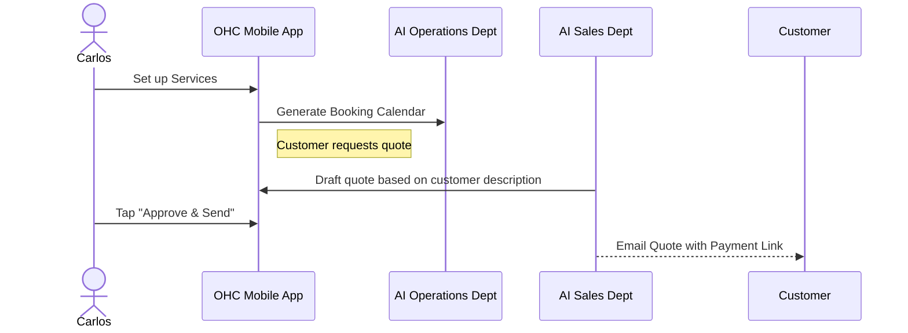
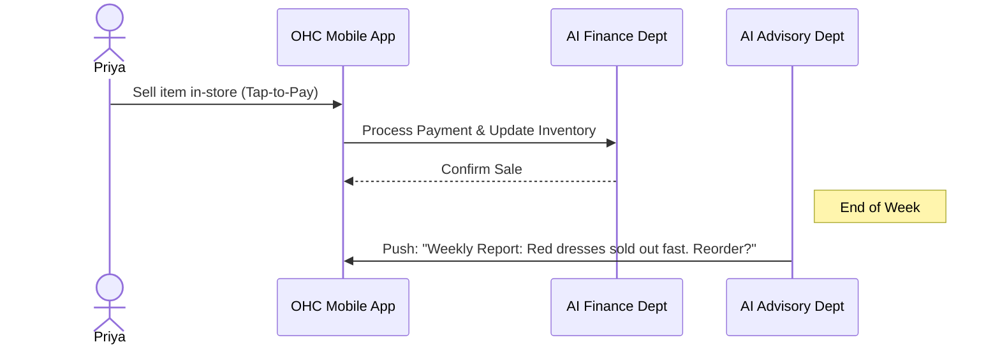
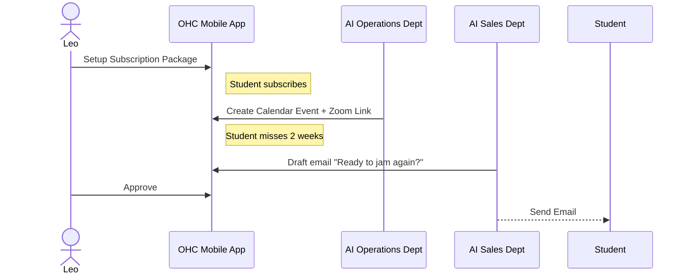
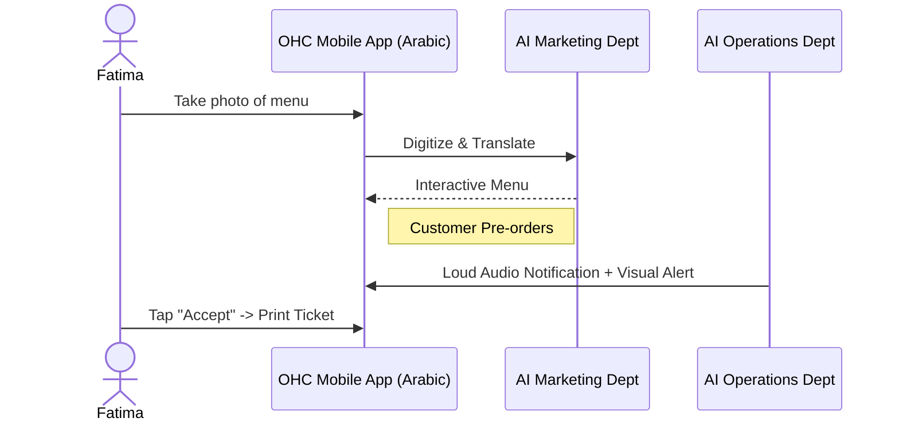

# [Architecture] Business Journey Architecture & Mobile-First User Flows

## Title
End-to-End Business Journey Map & Persona Architectures

## Problem Statement
Small business owners—often non-technical individuals like bakers, handymen, and boutique owners—abandon platform onboarding when confronted with complex, jargon-heavy setup flows. OHC promises a "zero to live in 10 minutes" experience, completely managed from a 375px mobile screen. Currently, the architecture lacks a fully documented, role-specific journey map that seamlessly connects acquisition, onboarding, activation, retention, revenue scaling, and virality, while integrating AI departments invisibly at every step. Without this, engineering efforts risk building disjointed features rather than a cohesive, "magical" product flow.

## Research Report

### Competitive Analysis
- **Shopify:** Complex onboarding (30-60 min). Requires significant cognitive load to configure themes, plugins, and payment gateways. Heavy desktop reliance. AI is an afterthought (Sidekick chatbot).
- **Wix/Squarespace:** Drag-and-drop interfaces are powerful but overwhelming on mobile. 20-40 min setup. Geared towards users with some design intuition.
- **GoDaddy:** Simpler, but rigid. Basic features.
- **OHC (Our Differentiation):** "Grandmother test" compliant. 10-minute setup. AI-first infrastructure where departments (Operations, Marketing, Finance) proactively execute tasks rather than just answering questions.

### Friction Point Analysis (Non-Technical Persona)
1. **Acquisition to Onboarding Handoff:** Users often drop off if asked for too much upfront data (e.g., complex business category taxonomy).
   *Solution:* Deferred data collection. Only ask for Name, Business Type, and 1-2 product photos to start.
2. **First Product Creation:** Uploading and formatting images, writing descriptions, and setting prices is tedious.
   *Solution:* AI Marketing Agent generates descriptions from a single photo.
3. **Payment Setup:** Connecting Stripe or bank accounts is intimidating.
   *Solution:* OHC native wallet/Stripe Connect with delayed full KYC (allow first $500 without full ID verification if supported by Stripe).
4. **Mobile Management:** Horizontal scrolling or hidden menus on 375px screens lead to frustration.
   *Solution:* Strict adherence to 44x44px touch targets and native keyboard integrations.

## Design Doc

### Journey Map & UX Flow (Mobile-First 375px)

#### Persona 1: Maya (The Home Baker, 28)
- **Acquisition:** Clicks Instagram ad highlighting "Sell cakes in DMs automatically."
- **Onboarding (Minutes 0-3):** Enters "Maya's Cakes". Uploads 3 cake photos. AI Marketing agent auto-generates storefront design (Premium Glassmorphism).
- **Activation (Minutes 3-10):** Adds Stripe account for deposits. Sets "Custom Order" form.
- **Retention:** Receives daily push notifications summarizing DM inquiries handled by the AI Customer Success agent.
- **Revenue:** Upgrades to Pro when hitting the 100 free AI actions limit due to high DM volume.

#### Persona 2: Carlos (The Freelance Handyman, 42)
- **Acquisition:** Word-of-mouth referral from another tradesperson.
- **Onboarding:** Selects "Service Business". Inputs "Plumbing, Painting".
- **Activation:** Syncs Google Calendar. AI Operations agent sets up booking slots.
- **Retention:** Uses the OHC App inbox to review AI-generated quotes before they are sent to customers.
- **Referral:** Shares a unique "Get 10% off OHC" link with his contractor network.

#### Persona 3: Priya (Boutique Owner, 35)
- **Acquisition:** Searches "Easy inventory sync for physical store".
- **Onboarding:** Connects existing simple inventory spreadsheet.
- **Activation:** Uses OHC app to tap-to-pay for in-store customers.
- **Retention:** Checks daily morning dashboard generated by AI Business Advisory.

#### Persona 4: Leo (Music Tutor, 22)
- **Acquisition:** TikTok ad targeting musicians.
- **Onboarding:** Creates "Link-in-bio" profile page.
- **Activation:** Sets up recurring monthly subscription for 4 lessons/mo.
- **Retention:** AI Operations auto-generates Zoom links. AI Sales follows up with churned students.

#### Persona 5: Fatima (Food Cart, 50, Limited English)
- **Acquisition:** Local community flyer.
- **Onboarding:** Selects Arabic UI. Snaps photo of paper menu. AI Marketing digitizes menu.
- **Activation:** Toggle "Pre-orders Live".
- **Retention:** Loud audio notifications on phone for incoming orders. One-tap "Sold Out" buttons.

### Key Architectural Invariants
1. **Deferred Configuration:** The core database schema must allow `NULL` states for complex settings (like tax details) during the first 10 minutes.
2. **AI Action Queuing:** AI agent actions (e.g., drafted emails, generated quotes) must be stored in a verifiable queue where the user can "Approve" or "Reject" with a single tap on mobile.
3. **Optimistic UI:** Every mobile interaction (toggling sold-out, approving quote) must immediately reflect in the UI, resolving network sync in the background with retry logic.

## Implementation Prompt
**For the Implementer Agent:**
Implement the core onboarding and journey scaffolding based on the Persona architecture above.
1. Build the mobile-first (375px) onboarding UI flow in Flutter that defers complex data entry.
2. Create the unified "Inbox/Action Center" component where users see AI-drafted actions (quotes, replies) requiring 1-tap approval.
3. Ensure the underlying state management supports optimistic updates for these 1-tap approvals.
4. Acceptance Criteria:
   - A user can complete the initial signup and arrive at the dashboard in under 3 screens.
   - The Action Center correctly displays a mocked AI generated task.
   - Tapping "Approve" on a task optimistically removes it from the list.
   - All designs must adhere to the Premium Glassmorphism design tokens.

## Priority
P0

## Estimated Scope
Large