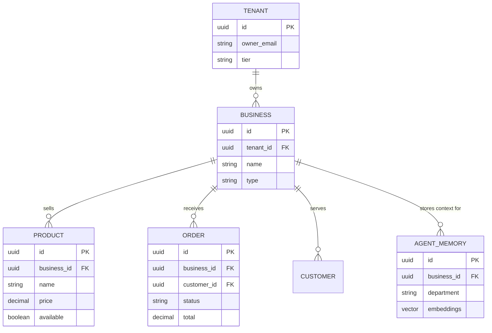

# Data Model Architecture Evolution

## Problem Statement
The current OneHumanCorp data model needs to be rigorously defined to support seamless multi-tenant operations, robust offline mobile capabilities, and high-performance AI agent interactions. Small business owners like Maya and Carlos depend on a perfectly isolated, fast, and reliable platform. If the data model fails to support offline caching, clear tenant boundaries, or efficient AI memory retrieval, the business promise of "zero technical knowledge required" fails.

## Research Report
Reviewing competitive offerings (Shopify, Wix, Squarespace) reveals that a rigid data model is often the main barrier to scaling a small business. A flexible, entity-based model is required.
- **Multi-Tenancy:** Row-level security (RLS) in PostgreSQL is non-negotiable for strict tenant isolation.
- **AI Memory:** AI agents require rapid access to vector-embedded historical interactions.
- **Mobile Offline:** Critical data entities must support robust caching and optimistic UI updates.

## Design Doc

### Architecture Diagram

### Key Invariants
- **Isolation:** A business owner can only see and modify their own tenant's data. All queries must enforce `tenant_id` via RLS.
- **Immutability of Financials:** Once an order is completed or a payment is captured, the record is immutable; adjustments require explicit refund/credit entities.
- **Offline Resilience:** Products, Orders, and Customers must be cached locally on mobile devices.

### Mobile UX Flow & AI Integration
- The mobile app pulls a localized snapshot of the data model on startup.
- AI agents read from the `AGENT_MEMORY` vector store to retrieve historical context before executing actions, completely decoupled from the real-time operational tables to prevent lock contention.

## Implementation Prompt
Implement the foundational SQL schemas and Go entity structs for the `Tenant`, `Business`, and `AgentMemory` models. Ensure PostgreSQL Row Level Security (RLS) is applied to all tables using the `tenant_id`. Implement vector indexing on the `AgentMemory` table for fast similarity search.

## Priority
P0

## Estimated Scope
Medium
