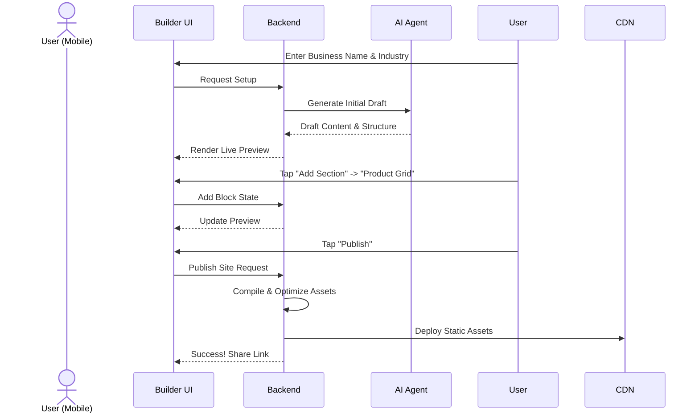

# 🔍 Scout: Tool Integration Research Q2

## [Social Media] Manychat Integration
**Title**: Integrate Manychat for Unified Social Media Inbox
**Problem Statement**: Small business owners like Maya (The Home Baker) receive orders and inquiries across Instagram DMs, Facebook Messenger, and WhatsApp. Managing these manually is overwhelming and leads to missed sales. They need a single, unified inbox where an AI agent can read and reply to messages from all platforms automatically.
**Research Report**:
- **Tool**: Manychat
- **Target Persona**: Maya (Home Baker), Priya (Boutique Owner)
- **Advantages**: Excellent Instagram and WhatsApp API integrations. Robust webhook support for routing messages to OHC's backend. Extremely popular among SMBs for basic automation.
- **Risks**: Pricing scales with contacts, which may be expensive for high-volume, low-margin businesses. Requires Meta business verification for some features.
- **Pricing**: Free tier available (up to 1,000 contacts). Pro tier starts at $15/mo.
- **Compatibility**: Cloud (via webhooks/OAuth). Standalone (would require local reverse proxy for webhooks, possible but complex).
**Design Doc**:
- User goes to the Operations dashboard and clicks "Connect Instagram".
- User authenticates with Facebook/Instagram via OAuth.
- OHC registers webhooks to receive new DMs.
- When a DM arrives, the Customer Success agent reads it, generates a reply (e.g., "Yes, we do vegan cakes!"), and sends it back via Manychat's API.
- The user sees a unified "Customer Inbox" on their phone showing the conversation history.
**Implementation Prompt**: Implement an OAuth flow to connect a user's Instagram/Facebook account via Manychat. Create a webhook endpoint that receives incoming messages, stores them in the unified inbox, and triggers the Customer Success agent to draft a reply.
**Priority**: P0
**Estimated Scope**: Large

## [Calendar] Calendly Integration
**Title**: Integrate Calendly for Automated Booking
**Problem Statement**: Service providers like Carlos (Handyman) and Leo (Music Tutor) lose time going back and forth over email/text to find a time to meet. They need a way for customers to simply click a link, see available times, and book a slot directly on their calendar.
**Research Report**:
- **Tool**: Calendly
- **Target Persona**: Carlos (Handyman), Leo (Music Tutor)
- **Advantages**: Industry standard, highly recognizable to customers. Excellent conflict resolution and timezone handling. Easy API integration.
- **Risks**: If a user cancels via Calendly directly instead of OHC, state might go out of sync without robust webhook handling.
- **Pricing**: Free tier available. Premium starts at $10/mo.
- **Compatibility**: Cloud (OAuth). Standalone (requires API key).
**Design Doc**:
- User goes to Sales dashboard and connects Calendly.
- OHC pulls available event types (e.g., "30-min Consultation") and displays them on the user's public storefront.
- When a customer clicks to book, they are shown the Calendly widget.
- Upon successful booking, a webhook notifies OHC to record the appointment in the Operations dashboard.
**Implementation Prompt**: Create an integration that allows a user to connect their Calendly account. Fetch their existing event types and display a booking widget on their public profile page. Ensure booked events sync back to the OHC dashboard.
**Priority**: P1
**Estimated Scope**: Medium

## [Email Marketing] Mailchimp Integration
**Title**: Integrate Mailchimp for Customer Re-engagement
**Problem Statement**: Priya (Boutique Owner) wants to email her past customers when new stock arrives, but she doesn't know how to export lists and manage campaigns. She needs an automated way to email customers without leaving the OHC app.
**Research Report**:
- **Tool**: Mailchimp
- **Target Persona**: Priya (Boutique Owner), Leo (Music Tutor)
- **Advantages**: Market leader, great API, supports tags and segments. High deliverability.
- **Risks**: Strict anti-spam policies might suspend users if they import bad lists.
- **Pricing**: Free tier available (up to 500 contacts). Essentials starts at $13/mo.
- **Compatibility**: Cloud (OAuth). Standalone (API Key).
**Design Doc**:
- When a customer buys something, they are automatically added to the Mailchimp audience with tags (e.g., "Bought: Cake").
- The Marketing agent suggests campaigns ("Send an email to past customers about your new holiday cakes").
- The user approves the AI-generated email, and OHC triggers Mailchimp to send it.
- The user sees open rates and clicks in the OHC Marketing dashboard.
**Implementation Prompt**: Build an integration that syncs OHC customers to a Mailchimp audience automatically after purchase. Allow the AI Marketing agent to create and send email campaigns via the Mailchimp API.
**Priority**: P1
**Estimated Scope**: Medium

## [Payment] Mercado Pago Integration
**Title**: Integrate Mercado Pago for LATAM Payments
**Problem Statement**: Small business owners in Latin America cannot easily use Stripe and need a trusted local payment processor to accept credit cards and local methods like Pix or Pago Fácil.
**Research Report**:
- **Tool**: Mercado Pago
- **Target Persona**: Global users outside the US/EU.
- **Advantages**: Dominant in LATAM. Supports local payment methods (Pix in Brazil, OXXO in Mexico). Good developer docs.
- **Risks**: Settlement times can be longer. API is slightly less standardized than Stripe.
- **Pricing**: Variable by country (e.g., ~4-5% per transaction).
- **Compatibility**: Cloud (OAuth). Standalone (API Key).
**Design Doc**:
- User selects their country during onboarding. If LATAM, Mercado Pago is offered alongside Stripe.
- User connects their Mercado Pago account.
- Customers see a "Pay with Mercado Pago" button at checkout.
- Webhooks update the order status in OHC when payment succeeds.
**Implementation Prompt**: Add Mercado Pago as a secondary payment provider. Implement the checkout flow to redirect to Mercado Pago and handle the success/failure webhooks to update order status.
**Priority**: P2
**Estimated Scope**: Large

## [Shipping] Shippo Integration
**Title**: Integrate Shippo for Automated Label Generation
**Problem Statement**: Priya (Boutique Owner) spends hours copying and pasting addresses into carrier websites to print shipping labels. She needs to click one button in OHC to buy and print a label.
**Research Report**:
- **Tool**: Shippo
- **Target Persona**: Priya (Boutique Owner), Maya (Home Baker)
- **Advantages**: Aggregates rates from USPS, UPS, FedEx, DHL. Simple API. No monthly fee for pay-as-you-go.
- **Risks**: International shipping requires complex customs declarations which might be hard to automate fully for non-technical users.
- **Pricing**: Free tier (pay per label + postage).
- **Compatibility**: Cloud (OAuth). Standalone (API Key).
**Design Doc**:
- When an order is placed, OHC sends the dimensions/weight to Shippo to get rates.
- The Operations agent shows the cheapest shipping option.
- The user clicks "Buy Label", and OHC downloads the PDF label for printing.
- OHC automatically emails the customer the tracking number.
**Implementation Prompt**: Connect the Shippo API to fetch shipping rates based on order weight/dimensions. Allow the user to purchase a label and automatically email the tracking link to the customer.
**Priority**: P1
**Estimated Scope**: Large

## [SMS] Twilio Integration
**Title**: Integrate Twilio for SMS Order Notifications
**Problem Statement**: Fatima (Food Cart Operator) relies on her phone for everything and might miss app push notifications in a noisy environment. She needs reliable SMS alerts when a new pre-order arrives so she can start cooking.
**Research Report**:
- **Tool**: Twilio
- **Target Persona**: Fatima (Food Cart Operator)
- **Advantages**: Global coverage, incredibly reliable. Programmable messaging.
- **Risks**: A2P 10DLC compliance in the US is complex and requires business registration, which might be a barrier for informal businesses.
- **Pricing**: Pay-as-you-go (~$0.0079 per SMS in US).
- **Compatibility**: Cloud (Centralized OHC Twilio account). Standalone (User provides API key).
**Design Doc**:
- User goes to Settings and toggles "Send me SMS for new orders".
- When an order is paid, the Operations agent triggers a Twilio API call to send an SMS: "New order! 2x Falafel for John. Pickup in 15m."
- (Future: Customers can also receive SMS receipts).
**Implementation Prompt**: Integrate the Twilio SDK to send outbound SMS notifications. Add a setting for the business owner to opt-in to SMS alerts for new orders. Ensure compliance with local messaging regulations.
**Priority**: P2
**Estimated Scope**: Medium

## [Video] Zoom Integration
**Title**: Integrate Zoom for Auto-Generated Meeting Links
**Problem Statement**: Leo (Music Tutor) manually creates a Zoom link for every new lesson and emails it to the student. This is prone to error and looks unprofessional. He needs links to be generated automatically when a lesson is booked.
**Research Report**:
- **Tool**: Zoom
- **Target Persona**: Leo (Music Tutor)
- **Advantages**: Ubiquitous for online lessons. Strong API for meeting creation.
- **Risks**: Zoom OAuth requires annual app review and compliance checks.
- **Pricing**: Free tier (40-min limit). Pro starts at $15/mo.
- **Compatibility**: Cloud (OAuth). Standalone (Server-to-Server OAuth).
**Design Doc**:
- User connects their Zoom account via the Sales dashboard.
- When a customer books an online service (e.g., via Calendly or native booking), OHC calls the Zoom API to create a meeting.
- The Zoom link is embedded in the automated calendar invite and confirmation email sent to the customer.
**Implementation Prompt**: Create an OAuth integration with Zoom. Automatically generate a unique Zoom meeting link when a customer books a virtual service, and include this link in the customer's confirmation email.
**Priority**: P1
**Estimated Scope**: Medium

---

# [architecture] Website & Storefront Builder

## Problem Statement
Small business owners lack the technical expertise to build and maintain a professional online presence. They need a simple, mobile-first, and highly performant website and storefront builder that requires zero coding knowledge. The current ecosystem lacks a truly accessible tool that allows users to launch a functional business site in under 10 minutes from their mobile device.

## Research Report
### Competitive Analysis
- **Shopify:** Powerful but overwhelming for non-technical users. Requires significant time investment.
- **Wix/Squarespace:** Drag-and-drop complexity is high; templates often break on mobile.
- **OHC Advantage:** OHC's builder must be radically simple. AI handles the heavy lifting of design, SEO, and optimization, allowing users to focus purely on content. The interface must be primarily touch-driven and mobile-first.

## Design Doc

### Architecture Diagram

```mermaid
graph TD
    subgraph Client [Mobile/Web Client]
        A[Website Builder UI]
        B[Live Preview Engine]
    end

    subgraph API [Backend API]
        C[Storefront Service]
        D[AI Marketing Agent]
        E[Asset Optimizer]
    end

    subgraph Storage [Data Layer]
        F[(PostgreSQL - Site Drafts/Config)]
        G[Edge CDN - Live Assets]
        H[Cloud Storage - Uploads]
    end

    A <-->|State Updates| C
    A -->|Generate Content| D
    B <--|Render Draft| C
    A -->|Upload Image| E
    E -->|Store WebP| H
    C <-->|Persist| F
    C -->|Publish| G
```

### Key Components

1.  **Content Blocks:** Pre-defined functional units (Hero, Product Grid, Service Booking, Testimonials, Contact Form) rather than low-level HTML/CSS elements.
2.  **Templates & Customization:** Users select "vibes" and primary colors. Strict constraints ensure aesthetic quality and performance. AI generates initial drafts based on basic business info.
3.  **Publishing Lifecycle:** Drafts are saved instantly. The "Publish" action compiles the state into static, edge-cached assets (HTML/CSS/WebP) for zero-latency delivery.
4.  **Automated SEO:** AI generates meta tags, JSON-LD schema, and sitemaps invisibly.
5.  **Custom Domains & SSL:** Auto-provisioned free subdomains. Automated SSL management for custom domains.

### Mobile UX Flow (375px First)



1.  **Setup Wizard:** Minimal input required (Name, Industry). AI auto-generates a complete functional draft instantly.
2.  **Editing:** Touch-friendly "Add Section" and reorder handles. No precise drag-and-drop. Text input uses native mobile keyboards.
3.  **Publishing:** Single-tap action. Clear feedback and immediate access to the live URL and shareable links.

### Key Design Decisions
-   **Constraint over Flexibility:** Limiting customization ensures users cannot build "ugly" or non-performant sites.
-   **Static Compilation:** Publishing generates static assets for maximum performance and security, rather than dynamic rendering on every request.
-   **AI-First Generation:** Staring at a blank canvas is the biggest hurdle. AI provides a 90% complete starting point.

## Implementation Prompt
**Task:** Implement the Website & Storefront Builder backend services and frontend UI.
**Outcome:** A user can successfully complete the setup wizard, edit their site using pre-defined content blocks, preview the changes, and publish the site to a live, accessible URL.
**Acceptance Criteria:**
- The builder UI must be fully functional and responsive on a 375px mobile screen.
- AI generation must produce a coherent initial draft based on minimal input.
- Publishing must result in a publicly accessible, optimized static site.
- SEO metadata and SSL must be handled automatically without user intervention.
- Include comprehensive unit and E2E tests covering the complete creation and publishing flow.

## Priority
P0 (Critical)

## Estimated Scope
Large
