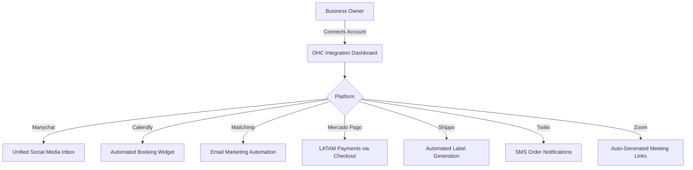

# Scout: Tool Integration Research Q2

## Problem Statement
Small business owners like Maya (The Home Baker) and Priya (Boutique Owner) receive orders and inquiries across Instagram DMs, Facebook Messenger, and WhatsApp. Managing these manually is overwhelming and leads to missed sales. They need a single, unified inbox where an AI agent can read and reply to messages from all platforms automatically.

## Research Report

| Tool | Target Persona | Advantages | Risks | Pricing | Compatibility |
|---|---|---|---|---|---|
| **Manychat** | Maya (Home Baker), Priya (Boutique Owner) | Excellent Instagram and WhatsApp API integrations. Robust webhook support for routing messages to OHC's backend. Extremely popular among SMBs for basic automation. | Pricing scales with contacts, which may be expensive for high-volume, low-margin businesses. Requires Meta business verification for some features. | Free tier available (up to 1,000 contacts). Pro tier starts at $15/mo. | Works in both Cloud and Standalone modes (via webhooks/OAuth). Standalone would require local reverse proxy for webhooks, possible but complex. |
| **Calendly** | Carlos (Handyman), Leo (Music Tutor) | Industry standard, highly recognizable to customers. Excellent conflict resolution and timezone handling. Easy API integration. | If a user cancels via Calendly directly instead of OHC, state might go out of sync without robust webhook handling. | Free tier available. Premium starts at $10/mo. | Works in both Cloud and Standalone modes (OAuth vs API Key). |
| **Mailchimp** | Priya (Boutique Owner), Leo (Music Tutor) | Market leader, great API, supports tags and segments. High deliverability. | Strict anti-spam policies might suspend users if they import bad lists. | Free tier available (up to 500 contacts). Essentials starts at $13/mo. | Works in both Cloud and Standalone modes (OAuth vs API Key). |
| **Mercado Pago** | Global users outside the US/EU | Dominant in LATAM. Supports local payment methods (Pix in Brazil, OXXO in Mexico). Good developer docs. | Settlement times can be longer. API is slightly less standardized than Stripe. | Variable by country (e.g., ~4-5% per transaction). | Works in both Cloud and Standalone modes (OAuth vs API Key). |
| **Shippo** | Priya (Boutique Owner), Maya (Home Baker) | Aggregates rates from USPS, UPS, FedEx, DHL. Simple API. No monthly fee for pay-as-you-go. | International shipping requires complex customs declarations which might be hard to automate fully for non-technical users. | Free tier (pay per label + postage). | Works in both Cloud and Standalone modes (OAuth vs API Key). |
| **Twilio** | Fatima (Food Cart Operator) | Global coverage, incredibly reliable. Programmable messaging. | A2P 10DLC compliance in the US is complex and requires business registration, which might be a barrier for informal businesses. | Pay-as-you-go (~$0.0079 per SMS in US). | Works in both Cloud and Standalone modes (Centralized vs API Key). |
| **Zoom** | Leo (Music Tutor) | Ubiquitous for online lessons. Strong API for meeting creation. | Zoom OAuth requires annual app review and compliance checks. | Free tier (40-min limit). Pro starts at $15/mo. | Works in both Cloud and Standalone modes (OAuth vs Server-to-Server OAuth). |

## Design Doc

## Implementation Prompt
Implement backend and frontend support for connecting these integrations. Update the catalog to include their metadata, provide client wrappers (even if mock for now to satisfy E2E and module imports), update UI to allow connecting, and ensure tests pass.

## Priority
P0 - P2

## Estimated Scope
Medium to Large
