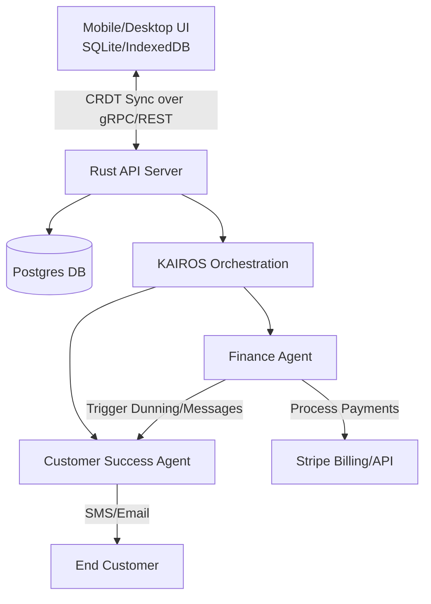

# Architecture Design: Autonomous Subscription & Recurring Billing Engine

## 1. Introduction

### Problem Statement
Small businesses, such as Leo the Music Tutor and Maya the Baker, require recurring subscription capabilities (e.g., lesson packages, monthly custom cake boxes) without navigating complex configurations, setting up webhooks, or relying on third-party paid tools like ReCharge. Currently, creating edge-cached, offline-first subscriptions seamlessly is incredibly difficult for non-technical users.

### Proposed Solution
An integrated Autonomous Subscription and Recurring Billing Engine that leverages an offline-first architecture using SQLite/IndexedDB with CRDT (Conflict-free Replicated Data Type) synchronization. This enables offline validation (e.g., student package redemption without internet). The system relies on the **Finance Agent** to handle background workflows—including dunning, payment collection, and invoicing—autonomously, with zero manual setup required from the business owner.

---

## 2. Personas & Use Cases

### Leo the Music Tutor
- **Need:** Sells 4-lesson monthly packages. Needs to track student package balances, auto-renew subscriptions when balance is low, and redeem lessons offline if internet access is weak in his studio.
- **Agent Action:** The Finance Agent automatically charges the card on file when Leo marks a student's balance as exhausted or at the start of the billing cycle. It handles failed payments (dunning) by softly messaging the student via the Customer Success Agent.

### Maya the Baker
- **Need:** Offers a "Cake of the Month" subscription. Requires predictable recurring revenue, combined with localized shipping/pickup schedules.
- **Agent Action:** Operations Agent syncs with the Finance Agent. Once the subscription renews successfully, the Operations Agent schedules the pickup date and alerts Maya to bake.

---

## 3. High-Level Architecture

### Core Components
1. **Local Edge Data Store (Mobile/Desktop UI)**
   - **IndexedDB/SQLite:** Stores offline-ready subscription states, customer balances, and recent payment histories.
   - **CRDT Synchronization:** Uses CRDTs to manage state mutations (like redeeming a lesson) while offline, resolving conflicts cleanly when the device reconnects to the OHC backend.

2. **Central OHC Backend (Rust + PostgreSQL)**
   - **Multi-Tenant Database:** Securely stores subscription plans, billing cycles, and encrypted payment tokens via Stripe.
   - **State Machine Synchronization:** Receives CRDT patches from edge clients and applies them to the authoritative database.

3. **Autonomous AI Worker (The Finance Agent)**
   - Runs in the background as part of the KAIROS Orchestration Engine.
   - Constantly evaluates subscription states, billing dates, and payment intents.
   - Interacts with Stripe APIs to process charges.
   - Manages the dunning process autonomously via AI-generated natural language emails/SMS instead of robotic payment failure notices.

### System Architecture Diagram

---

## 4. Technical Workflows

### 4.1. Offline-First Package Redemption (CRDT Sync)
1. **Offline Action:** Leo redeems 1 lesson from a student's 4-lesson package on his phone without internet.
2. **Local Mutation:** The local SQLite DB updates the balance from `4` to `3` using a CRDT counter (e.g., a PN-Counter).
3. **Reconnection:** Once Leo's phone reconnects, it pushes the CRDT patch to the Rust API.
4. **Resolution:** The Rust backend merges the CRDT state into PostgreSQL.
5. **Threshold Trigger:** If the balance drops to `0`, the Rust backend emits an internal `SubscriptionExhausted` event.

### 4.2. Autonomous Billing & Dunning
1. **Event Triggered:** The `SubscriptionExhausted` or a time-based `BillingCycleDue` event is placed on the KAIROS job queue.
2. **Finance Agent Activation:** The Finance Agent picks up the job.
3. **Payment Processing:** The Finance Agent calls the Stripe API via idempotent requests to charge the customer.
4. **Success Path:** If successful, the backend resets the CRDT balance to `4` (or updates the billing cycle) and syncs down to the edge. The Operations Agent is notified.
5. **Dunning Path (Failure):**
   - If the payment fails, the Finance Agent instructs the Customer Success Agent.
   - The CS Agent drafts a personalized message (e.g., "Hi Alex, Leo's guitar lessons package is up for renewal, but the card declined. Click here to update!").
   - The subscription is placed in a `grace_period` state, synced offline so Leo knows the student is pending payment but can still optionally allow a lesson.

---

## 5. Implementation Strategy

### 5.1. Data Layer (PostgreSQL)
- `subscriptions` table: `id`, `tenant_id`, `customer_id`, `plan_id`, `status`, `current_period_end`.
- `subscription_balances` table: `subscription_id`, `balance` (CRDT JSON representation), `last_synced_at`.
- `dunning_campaigns` table: Tracks AI agent follow-ups to avoid spamming the customer.

### 5.2. Edge Layer (Tauri/Flutter)
- Integrate a lightweight CRDT library compatible with Rust (backend) and JS/Dart (frontend).
- Implement background sync workers that flush changes when `navigator.onLine` is true.

### 5.3. Agent Orchestration
- Extend the `Finance Agent` with tools: `charge_subscription`, `get_subscription_status`, `initiate_dunning`.
- Ensure idempotency keys are strictly derived from the `tenant_id`, `subscription_id`, and `billing_period`.

---

## 6. Security and Compliance

- **Zero Data Leakage:** All data is strictly partitioned by `tenant_id`. Stripe tokens are stored securely; OHC never stores raw PAN data.
- **Idempotency:** Payment endpoints and Finance Agent tools require an idempotency key to prevent double billing.
- **Offline Limits:** Local DBs only sync data relevant to the active `tenant_id`. Limits on offline balance changes prevent malicious exploitation of local counters.

## 7. Conclusion

By shifting subscription logic from complex manual setup into an **AI-managed background process**, and combining it with **CRDT offline-first edge state**, OHC delivers an unparalleled, zero-configuration recurring revenue engine perfectly tuned for small business owners like Leo and Maya.
