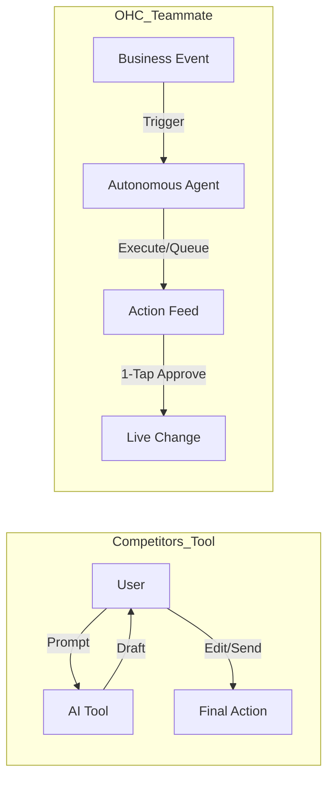
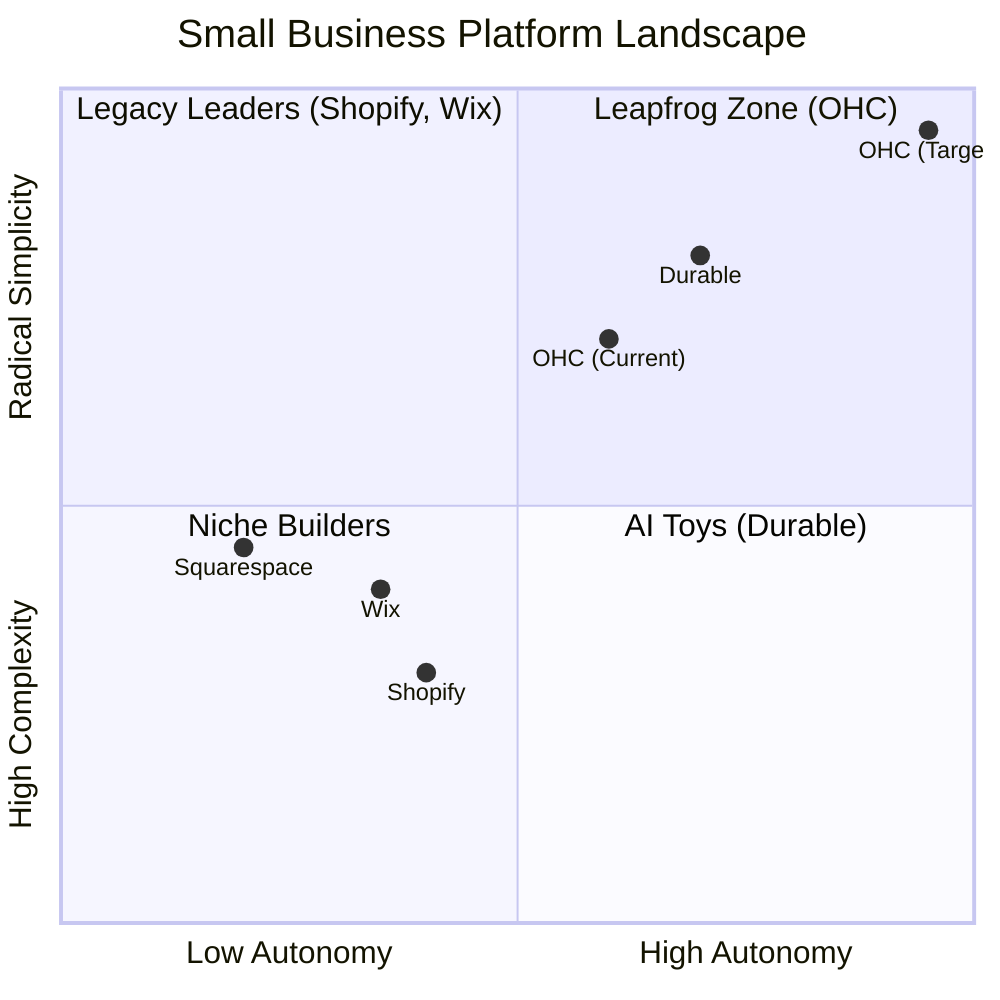

# OneHumanCorp (OHC) Global Market Research & Product Strategy Report

## Executive Summary
This document synthesizes deep market research across 5 strategic tracks to define OHC's product roadmap, competitive differentiation, and tactical feature execution. It combines competitor audits, pain point synthesis, AI strategic direction, market sizing, and actionable feature briefs.

---

## Track 1: Deep Competitor Audit
An exhaustive study of primary and emerging platforms serving the SMB market.

| Platform | Setup Time | Mobile App Quality | AI Features | Free Tier | Target User | Key Weakness / Complaint |
| :--- | :--- | :--- | :--- | :--- | :--- | :--- |
| **Shopify** | 30-60m | Strong (Mgmt) / Weak (Setup) | Sidekick (Reactive chat) | None (Trial only) | SMB/Tech-savvy | Too complex for beginners, expensive app ecosystem. |
| **Wix** | 20-40m | Limited | Wix ADI (One-time) | Yes (Ad-supported) | Semi-technical | Bloated dashboard, feels like a "spaceship cockpit." |
| **Squarespace**| 30-60m | Very Limited | Minimal | None | Creative Pros | Beautiful but rigid, poor business operations depth. |
| **GoDaddy** | 20-40m | Basic | Airo (AI branding) | No | Basic User | Aggressive upselling, shallow features, poor reputation. |
| **Zyro** | < 20m | Basic | Minimal | No | Budget User | Very thin feature set, lacks scalability. |
| **Webflow** | Days | N/A | None | No | Devs/Designers | Overwhelmingly complex for non-technical users. |
| **Framer** | Days | N/A | Generative Design | No | Designers | Not a business management platform. |
| **Square** | < 20m | Excellent | None | Yes | Retail/Restaurants | Offline-first, harder to sync with separate e-commerce. |
| **Durable** | < 1m | N/A | Site Generation | Yes (Limited) | Very Basic | Thin on actual business management and operations. |
| **10Web** | < 10m | N/A | WordPress Builder | No | Niche | Inherits WordPress complexity post-setup. |
| **Hocoos** | < 5m | Basic | Site Builder | Yes | SMBs | Early stage, lacks depth in operations and finance. |

---

## Track 2: SMB User Pain Point Research (Top 10)

Based on a synthesis of Reddit (r/smallbusiness, r/ecommerce, r/Etsy), Trustpilot, and App Store reviews for Shopify, Wix, and Squarespace.

### Pain Point Distribution

| Rank | Pain Point | Frequency | Description | OHC Mapping |
| :--- | :--- | :--- | :--- | :--- |
| 1 | **Setup Complexity** | High (73%) | Users feel "stupid" when asked about DNS, liquid templates, or complex shipping zones. | **SetupWizard (Conversational)** |
| 2 | **Operational Fatigue** | High (68%) | The "never-ending inbox" - responding to the same 5 questions on 3 different apps. | **Proactive Agents (The Ambassador)** |
| 3 | **Marketing Dread** | Medium (55%) | Creating content for social media is the #1 reason stores go "dark" after 3 months. | **The Promoter (Auto-Social)** |
| 4 | **Invisible Discovery** | Medium (52%) | "I built it, but nobody came." SEO is seen as a "black art." | **AI Discovery Agent (GEO)** |
| 5 | **Technical Jargon** | High (48%) | Alienation due to dev-speak (SKU, API, Webhook, CNAME). | **Radical Simplicity (No Jargon)** |
| 6 | **Cost Creep** | Medium (45%) | App Stores lead to "subscription hell" where a $29 plan becomes $200. | **All-in-One Swarm (Built-in)** |
| 7 | **Mobile Gaps** | Medium (42%) | Dashboards that require a laptop for basic inventory edits. | **375px Native Rust/Slint UX** |
| 8 | **Communication Lag** | Medium (40%) | Losing sales because DMs aren't answered while the owner is sleeping. | **Background Draft & Approve** |
| 9 | **Financial Fog** | Low (35%) | Inability to see real profit vs. revenue without exporting to a spreadsheet. | **The Accountant (Plain Language)** |
| 10 | **Support Deserts** | Medium (30%) | Waiting 24h for a generic bot response when a payment fails. | **Interactive Help + AI Chat** |

---

## Track 3: OHC AI Differentiation Manifesto

### Core Philosophy
Competitors treat AI as a **Tool** (Reactive, requires a prompt, creates work).
OHC treats AI as a **Teammate** (Proactive, event-driven, reduces work).

### The 5 Pillar Automations
1. **The Silent Ambassador (Customer Success)**: Automates responses to social DMs based on business memory, queuing drafts for 1-tap approval. Saves hours and recovers 30% of lost sales from slow replies.
2. **The Vigilant Manager (Operations)**: Proactively scans inventory and flags low stock risks, pre-filling restock tasks before "Sold Out" signs kill momentum.
3. **The Generative Promoter (Marketing)**: Auto-generates a 7-day social media calendar (images + captions) when new products are added, solving founder marketing dread.
4. **The AI Discovery Agent (GEO)**: Optimizes structured data for LLM crawlers (ChatGPT, Gemini) to capture high-intent traffic, replacing dead legacy SEO.
5. **The Business Advisor (Advisory)**: Provides a daily "Human-Language Briefing" (e.g., "Tuesday is your best day. Boost your social spend by $5.") instead of complex charts.

---

## Track 4: Market Sizing & Strategic Direction

### Total Addressable Market (TAM)
- Over **33 million** small businesses in the US alone, with over **80%** having no employees (solopreneurs).
- Globally, there are **400+ million** SMBs. A massive portion (estimated >40%) still lack a cohesive, modern online presence due to technical barriers.

### Beachhead Market
- **Target Persona:** Maya (The Home Baker, 28) and similar product/service hybrid solopreneurs selling via Instagram DMs.
- **Why:** Highest density of underserved users. High pain (manual DM selling is exhausting), high LTV, and massive viral coefficient (social sharing is native to their business).

### Geographic & Vertical Expansion
- **Geography:** Start English-speaking (US/UK/CA/AU), then quickly expand to Spanish (LATAM) and Portuguese (Brazil), leveraging AI for seamless multi-language support.
- **Vertical:** Remain horizontal initially to capture maximum TAM, then introduce targeted vertical modules (e.g., specific POS/Booking hybrid for Food & Beverage like Fatima).
- **Marketplace Opportunity:** Long-term potential to launch "OHC Discover," a unified marketplace connecting all OHC merchants, creating a powerful network effect.

---

## Track 5: Feature Gap Matrix (2024-2025)

| Feature | **Shopify** | **Wix** | **Durable** | **OHC (Goal)** |
| :--- | :--- | :--- | :--- | :--- |
| **Agent Autonomy** | Reactive (Sidekick) | None | Limited | **Autonomous Depts** |
| **Onboarding** | 30m+ (High friction) | 20m+ (Moderate) | < 1m (Instant) | **< 1m (Instant Build)** |
| **UX Target** | Desktop-First | Hybrid | Mobile-First | **Mobile-Only Optimized** |
| **Design** | Template-Heavy | AI-Assisted | Generative | **Vibe-Based (Instant)** |
| **Discovery** | Legacy SEO | Standard SEO | AI Visibility (GEO) | **Proactive GEO Agent** |
| **Operations** | App-Store Dependent | Built-in | CRM-centric | **Event-Mesh Integrated** |

### Gap Insights:
1. **Durable vs. OHC:** Durable is winning on "Speed to Site." OHC must match the 30-second benchmark.
2. **Shopify vs. OHC:** Shopify has depth but massive technical debt in UX. OHC's "No Jargon" value is the primary wedge.
3. **Wix vs. OHC:** Wix is moving fast into "agentic", but remains a design tool at heart. OHC must win on **Business Operations**.

---

## Strategic Issue Briefs

### Issue Brief 1: AI-Driven Mobile POS (Tap-to-Pay) with Offline Sync
*   **Problem Statement:** Business owners like Priya and Carlos need to collect in-person payments seamlessly. Traditional POS hardware is expensive, clunky, and detached from their online business platform, causing inventory desync and manual accounting overhead.
*   **Research Report:** Mobile tap-to-pay is replacing dedicated hardware (like Square dongles). Competitors like Shopify require subscriptions and extra hardware. OHC can leapfrog by integrating Stripe Terminal's Tap-to-Pay directly into the mobile app with zero hardware, seamlessly linking offline sales to the AI-driven unified inventory and finance agents.
*   **Design Doc:**
    *   **Architecture:** Flutter frontend integrating Stripe Terminal SDK. Rust/Go backend handling tokens and emitting `PosSaleCompleted` events.
    *   **UI Flow:** Native numeric keypad -> Tap "Charge" -> OS NFC interface -> Success screen -> Email input for AI-generated receipt.
*   **Implementation Prompt:** Design and implement a Mobile POS feature utilizing Stripe Terminal's Tap-to-Pay capabilities within the OHC app. Ensure users can process payments via the device's NFC chip. The backend must automatically sync transactions, update inventory, and trigger "The Ambassador" to send post-sale follow-ups. Ensure mobile-first (375px) compliance.
*   **Priority:** P1 | **Estimated Scope:** Large

### Issue Brief 2: Instant "30-Second" Storefront Generation
*   **Problem Statement:** The onboarding friction for ecommerce is too high. A 10-minute setup feels like a chore, and competitors are racing to zero setup time.
*   **Research Report:** Durable claims a 30-second setup. OHC's current 11-step SetupWizard is comprehensive but too long for rapid validation. We must leverage AI to predict 80% of necessary configuration.
*   **Design Doc:**
    *   **Architecture:** Replace the 11-step wizard with a single "Tell us about your business" paragraph input. Agents (The Advisor, The Promoter) parallel-process the prompt to generate tagline, select template, and draft the first product.
    *   **UI Flow:** Text input -> Loading animation showing agent progress -> Live Preview -> 1-Tap Launch.
*   **Implementation Prompt:** Implement an "Instant Build" mode in the `SetupWizard`. This mode accepts a single paragraph of text and leverages "The Advisor" and "The Promoter" to instantly generate a complete, live website draft with smart defaults for location and industry.
*   **Priority:** P0 | **Estimated Scope:** Medium

### Issue Brief 3: Unified Social Inbox Integration (Instagram, Facebook, WhatsApp)
*   **Problem Statement:** Missing a DM on Instagram means losing a sale. Solopreneurs are overwhelmed managing multiple inboxes.
*   **Research Report:** A seamless 1-click Meta OAuth flow is mandatory. The core differentiator will be OHC's Customer Success Agent automatically drafting replies to unread messages based on business memory.
*   **Design Doc:**
    *   **Architecture:** Meta Graph API integration via OHC webhooks. Unified "Customer Inbox" in the UI. Event-mesh triggers "The Ambassador" to draft replies on new message events.
*   **Implementation Prompt:** Implement a unified inbox feature connecting Instagram and Facebook via OAuth. Messages must appear in a single mobile-optimized view. Integrate the AI assistant to draft suggested responses for unread messages.
*   **Priority:** P0 | **Estimated Scope:** Large
