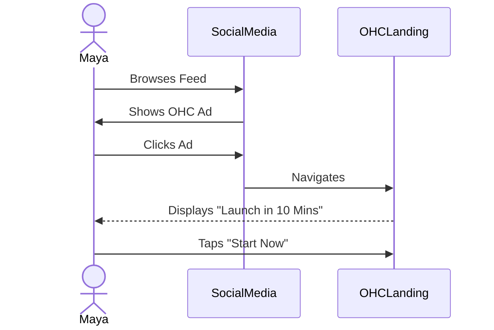
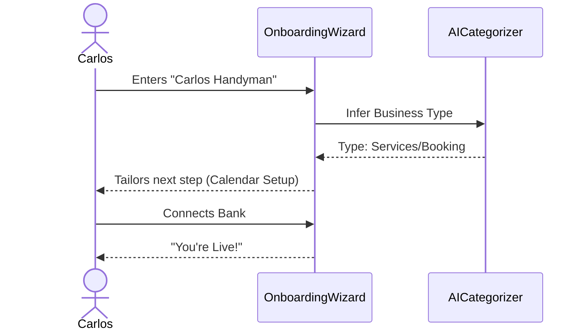

# OHC Business Journey Architecture Research Report

## 1. Executive Summary

This report documents the architectural design for the end-to-end user journey within OneHumanCorp (OHC). OHC is designed as a platform where any non-technical small business owner can launch and manage a live business from their mobile phone within 10 minutes. This document explicitly focuses on the non-technical persona experiences, mapping out the core flows (Acquisition, Onboarding, Activation, Retention, Revenue, Referral), and aligning them to the underlying architecture without prescribing exact implementation details.

Every flow is designed with our "Grandmother test" and Mobile Parity constraints in mind. Mobile is the baseline; desktop experiences are additive. All UIs must incorporate the OHC Premium Design Standard (Glassmorphism, 15px blur, Outfit/Inter typography).

## 2. Real User Personas

Our architectural journey mapping revolves around the following real-world personas to guarantee broad platform support across different business models:

*   **Maya (baker, 28)**: Physical goods, custom orders. Focus on visual storefront, deposit-based orders, Instagram DM auto-reply agent. Mobile only.
*   **Carlos (handyman, 42)**: Service/Booking. Needs listings, calendar booking, deposits, quote agent. Android only.
*   **Priya (boutique owner, 35)**: Hybrid Physical/In-store. Inventory sync, variants, POS, newsletter.
*   **Leo (music tutor, 22)**: Digital services/Subscriptions. Lesson booking, meeting links, recurring billing, student follow-up agent.
*   **Fatima (food cart, 50)**: Food/Beverage. Pre-orders, pick-up notifications, simple mobile UX (Arabic/English support).

## 3. The End-to-End Business Journey

### 3.1. Acquisition
*   **Scenario**: Maya sees an Instagram ad highlighting how to sell cakes online in 10 minutes.
*   **Flow**: Ad Click -> Mobile Optimized Landing Page -> Single clear CTA ("Launch your Bakery").
*   **Architecture Consideration**: The landing page must be instantly responsive, using server-side rendering or static generation to ensure immediate loading even on poor connections.

### 3.2. Onboarding
*   **Strategy**: Progressive disclosure. Ask the absolute minimum to get the core business online. Defer complex setup (like tax settings or custom domains) until later.
*   **Flow**:
    1.  Business Name & Category (e.g., "Maya's Cakes", Bakery).
    2.  Upload 1-3 photos.
    3.  Set payment receiving method (e.g., Connect bank).
*   **Friction Point**: Non-technical users abandon when asked for complex configurations. The onboarding must strictly enforce "Simple Mode" by default.

### 3.3. Activation
*   **Definition of Success**: The business is published and can accept its first order or booking.
*   **Flow**: First product/service added. The user views their live site on their phone.
*   **Milestones**:
    *   Day 1: Storefront live, link shared on social media.
    *   Week 1: First transaction completed.

### 3.4. Retention
*   **Strategy**: Drive daily engagement through high-value notifications and AI agent summaries.
*   **Flow**: Push notifications for new orders, daily summaries of AI agent activities (e.g., "I replied to 5 DMs while you slept").
*   **Architecture Consideration**: Requires a robust background job processing system and reliable push notification delivery tailored for mobile operating systems.

### 3.5. Revenue (Upgrading)
*   **Strategy**: Contextual upsells based on business success.
*   **Flow**: Maya reaches 10 products (Free Tier limit). When she attempts to add the 11th, a friendly, soft-limit prompt appears explaining the value of the Starter Tier ($9/mo) and how it helps her grow.
*   **Friction Point**: Hard errors block users and cause frustration. The pricing model must use soft limits and clear value propositions.

### 3.6. Referral
*   **Strategy**: Built-in viral loops.
*   **Flow**: Priya shares her success with a friend via an embedded sharing tool. The friend clicks a personalized link that highlights Priya's store as an example of what can be built.

## 4. Architectural Integration Points

*   **Mobile-First UX**: The entire journey must be designed primarily for 375px viewports. Desktop experiences (1440px) are secondary.
*   **Premium UI Tokens**: All UIs generated for this journey must utilize OHC's Glassmorphism (`backdrop-filter: blur(20px) saturate(200%)`) and defined motion easing (`cubic-bezier(0.4, 0, 0.2, 1)`).
*   **Invisible AI Agents**: Agents must seamlessly integrate into these flows. For example, during onboarding, the "Operations Manager" agent is automatically provisioned and begins structuring the incoming product catalog based on the uploaded photos.

## 5. Next Steps
*   Implement the proposed Business Journey architecture into actionable tasks for the engineering swarm.
*   Begin generating the corresponding Issue Briefs for the specific flows (Onboarding Wizard, Retention Notifications, etc.).