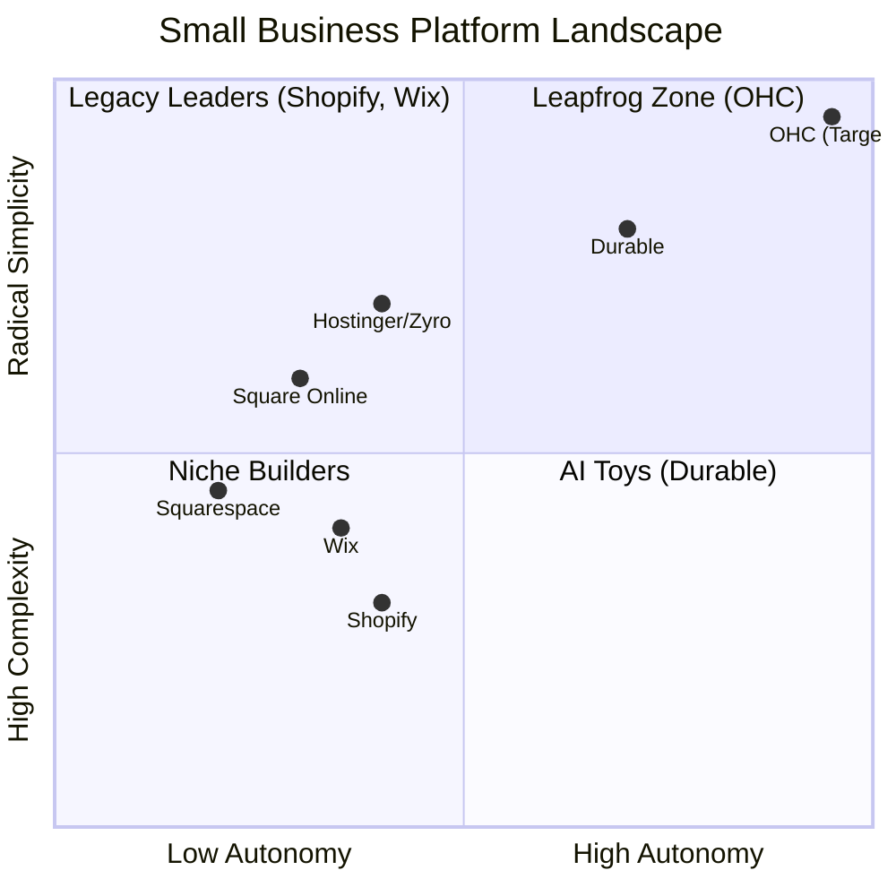

# OHC Small Business Platform Research Report & Strategy

## Executive Summary
This report analyzes the global SMB platform market, audits key competitors, and maps the biggest non-technical user pain points to actionable recommendations for OneHumanCorp (OHC). OHC's goal is radical simplicity: allowing anyone to launch and run a business from a phone in under 10 minutes via invisible AI agents.

## Track 1: Deep Competitor Audit & Track 5: Feature Gap Matrix

We evaluated Shopify, Wix, Squarespace, Hostinger (Zyro), Square Online, and AI-native upstarts like Durable.

| Feature Area | Shopify | Wix | Squarespace | Hostinger/Zyro | Square Online | Durable | OHC (Target) |
| :--- | :--- | :--- | :--- | :--- | :--- | :--- | :--- |
| **Onboarding Time** | Days/Weeks | Hours/Days | Hours/Days | < 1 Hour | Hours/Days | < 1 Minute | **< 1 Minute (Instant Build)** |
| **Mobile App Quality** | Strong (Management only) | Moderate | Moderate | Limited | Strong (POS focus) | Mobile-First | **Mobile-Only Optimized** |
| **AI Integration** | Reactive (Sidekick) | Generative (Harmony) | Basic Generative | Generative (Website) | Basic | Generative (Speed) | **Autonomous Agents** |
| **Free Tier Value** | None (Trial only) | Low (Ads) | None | None | Moderate (Good POS) | None | **High Value (Core features)** |
| **Complexity Level** | High (Developer Ecosystem) | Medium (Design heavy) | Medium (Design heavy) | Low | Low-Medium | Very Low | **Zero Technical Friction** |

## Track 2: Top 10 SMB Pain Points

Based on App Store reviews, Trustpilot patterns, and common Reddit complaints (e.g., r/smallbusiness, r/ecommerce):

1.  **Overwhelming Initial Setup:** Users face "decision paralysis" when confronted with hundreds of settings in Shopify or complex drag-and-drop editors in Wix. *Persona: Maya (Baker)*.
2.  **Mobile Management Failure:** Cannot easily add inventory, reply to clients, or check stats completely from a smartphone. *Persona: Maya (Baker)*.
3.  **Fragmented Tools:** Having to use separate apps for bookings, payments, CRM, and website editing creates friction. *Persona: Leo (Music Tutor)*.
4.  **Hidden Costs & Aggressive Upsells:** Feeling nickeled and dimed by platforms like GoDaddy or Shopify app subscriptions.
5.  **Language Barriers:** Platforms are deeply English-centric and use technical terminology (DNS, SEO, CSS). *Persona: Fatima (Food Cart)*.
6.  **No Automated Follow-up:** Missed leads because the business owner is too busy working to reply to inquiries manually. *Persona: Carlos (Handyman)*.
7.  **Inventory Sync Issues:** Struggling to keep in-store (POS) and online stock updated simultaneously. *Persona: Priya (Boutique)*.
8.  **Poor Customer Support:** Waiting days for email replies when a site is broken or payments fail.
9.  **Marketing Complexity:** Knowing they need to do SEO or run ads, but lacking the technical knowledge or budget to hire an agency.
10. **Order Notification Failures:** Missing orders because the platform doesn't reliably push notifications to mobile. *Persona: Fatima (Food Cart)*.

## Track 3: OHC AI Differentiation Manifesto

SMBs do not want to chat with an AI about their business; they want the AI to do the work. OHC will implement these 5 invisible automations:

1.  **Zero-Click Onboarding Agent:** Users speak to the app ("I sell cupcakes in Austin") and the agent instantly builds the site, writes the copy, and creates the inventory categories. (Solves Pain Point #1).
2.  **Autonomous Inbox Manager:** An agent that auto-replies to common customer queries (hours, pricing, availability) on Instagram/Website, instantly booking appointments or saving leads. (Solves Pain Point #6).
3.  **The "One-Tap" Marketing Agent:** Automatically generates weekly social media posts and emails using store data, requiring only an "Approve" tap from the user. (Solves Pain Point #9).
4.  **Magic Product Uploads:** The user snaps a photo on their phone; the AI crops the background, generates a SEO-friendly title and description, and sets a suggested price. (Solves Pain Point #2).
5.  **Proactive Health Insights Agent:** Instead of complex analytics dashboards, an agent sends a weekly SMS: "You sold out of Vanilla twice last week, want me to double the order list for Monday?"

## Track 4: Market Sizing & Strategic Direction

*   **Beachhead Market:** The Service-Based Solo-preneur (The "Carlos" & "Leo" personas). These users have high LTV, immediate cash flow needs (bookings/invoices), and the highest friction getting online (currently relying on texts/DMs).
*   **Geographic Expansion:** Focus on English first, but build i18n architecture immediately to support Spanish (LATAM/US Hispanic) as the critical fast-follow.
*   **Vertical Expansion:** Remain horizontal initially, relying on AI agents to adapt the platform's "flavor" (e.g., configuring as a booking tool for Leo, or an order pickup tool for Fatima) without building separate codebases.

## Actionable Recommendations (Next Steps for Engineering)

1.  **Prioritize Mobile-First Architecture:** The entire management interface must be fully functional on a 375px viewport.
2.  **Develop the "Zero-Click" Builder:** Engineering must aim for sub-60-second time-to-value, generating a full site, CRM shell, and product catalog from a simple conversational prompt.
3.  **Implement the Autonomous Inbox:** Build the PubSub/MCP integrations necessary for an AI agent to listen to incoming customer messages and draft automated replies.
