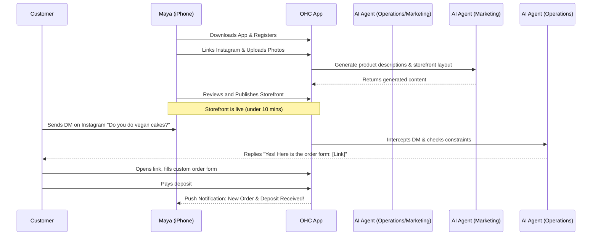
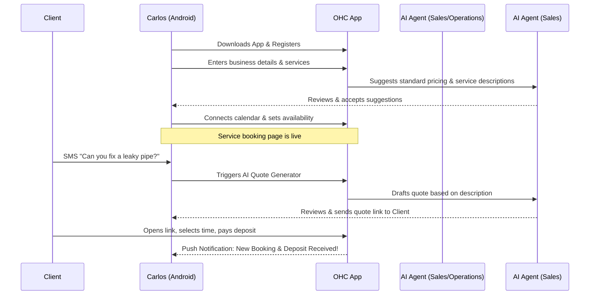
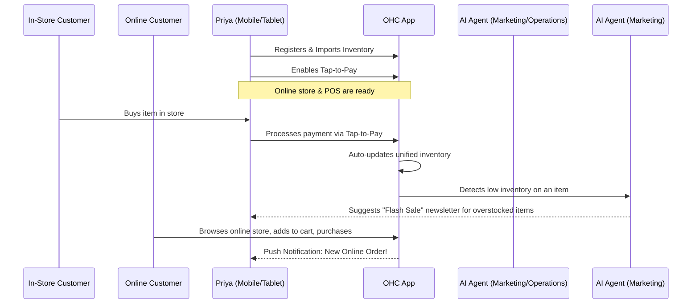
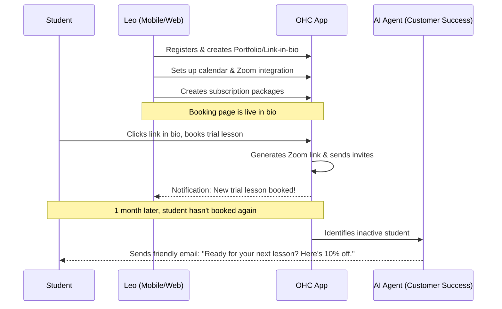
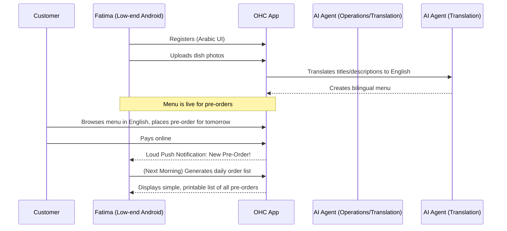

# Business Journey Architecture

## Overview
This document outlines the complete end-to-end user journey for each persona in the OneHumanCorp platform. The focus is to design the core flows from a non-technical small business owner's perspective, mapping how they acquire customers, onboard, activate, retain, generate revenue, and trigger viral referrals.

## Personas & Journey Diagrams

### 1. Maya (Baker, 28)
**Context:** Sells custom cakes via Instagram DMs. Needs a beautiful storefront with a photo catalog, deposit-based custom orders, and an AI agent to handle DM inquiries. Runs everything from an iPhone.

**Acquisition:** Discovers OHC via an Instagram ad highlighting seamless DM-to-storefront conversion.
**Onboarding:** Downloads the app, creates an account with Apple/Google, links her Instagram, and uploads cake photos. The AI agent auto-generates titles, descriptions, and a storefront layout based on the photos.
**Activation:** Custom order form is published. First customer pays a deposit via the form link in her Instagram bio. Success is measured by having the storefront live and receiving the first deposit.
**Retention:** Push notifications on new orders, AI agent summarizing daily DM inquiries handled, and weekly revenue reports.
**Revenue:** Upgrades from Free to Starter tier when she exceeds 10 products or needs a custom domain.
**Referral:** Word of mouth to other bakers in her local community, sharing her beautiful, high-converting storefront link.

### 2. Carlos (Handyman, 42)
**Context:** No website, relies on word of mouth. Needs service listings, a booking calendar with deposit payments, a customer inbox, and an AI quote generator. Uses an Android phone only.

**Acquisition:** Discovers OHC via organic search or referral when looking for a "simple scheduling app for contractors."
**Onboarding:** Downloads app, creates account, enters business name and typical services. AI suggests standard pricing and descriptions based on local averages. Sets up his availability in the calendar.
**Activation:** Sends first booking link via SMS to a recurring client. Success is securing the first deposit-backed appointment.
**Retention:** Daily schedule push notifications, simple inbox for client messages, AI agent drafting quotes for new requests.
**Revenue:** Upgrades to Starter when he needs to manage more than a few bookings a week or wants a custom domain to look more professional.
**Referral:** Mentions the easy booking system to other tradespeople he collaborates with on job sites.

### 3. Priya (Boutique Owner, 35)
**Context:** Sells clothing in-store and wants to go online. Needs storefront + inventory sync, product variants, in-person tap-to-pay, email newsletters, and daily mobile analytics.

**Acquisition:** Discovers OHC via a YouTube tutorial or blog post about moving a brick-and-mortar store online easily.
**Onboarding:** Creates account (likely on iPad/Desktop then uses phone). Imports basic inventory list. Sets up tap-to-pay on her phone.
**Activation:** Processes first in-person sale via tap-to-pay, inventory auto-syncs. First online order is received.
**Retention:** Daily mobile analytics dashboards, AI agent suggesting newsletter topics based on low inventory or seasonal trends.
**Revenue:** Quickly upgrades to Pro for unlimited products and advanced analytics, given her existing physical inventory scale.
**Referral:** Shares her success in Facebook groups for small boutique owners, highlighting the easy POS + online sync.

### 4. Leo (Music Tutor, 22)
**Context:** Teaches online + in-person. Needs lesson booking with calendar sync, auto-generated meeting links, subscription lesson packages, AI follow-up for inactive students, and a portfolio page.

**Acquisition:** Finds OHC via a TikTok showing "how to set up a tutoring business link-in-bio."
**Onboarding:** Sets up account, creates a portfolio page with YouTube video embeds of his playing, sets up calendar integration (Zoom/Google Meet), and creates subscription packages.
**Activation:** A student books a trial lesson via his link-in-bio.
**Retention:** Automated reminders to students, AI agent sending follow-up emails to students who haven't booked in a month.
**Revenue:** Upgrades from Free to Starter when he launches recurring subscription packages (which may be a premium feature).
**Referral:** Adds a "Powered by OHC" badge to his link-in-bio, driving other tutors/creators to the platform.

### 5. Fatima (Food Cart, 50)
**Context:** Takes halal food pre-orders. Needs a photo menu with sold-out toggles, pre-order/pickup with payment, phone notification on new orders, printable daily order lists, Arabic + English UI. Works on a low-end Android.

**Acquisition:** Community referral. Another local food vendor helps her set it up.
**Onboarding:** Very assisted onboarding. Uses Arabic UI. Takes photos of her dishes. AI translates descriptions to English automatically to create a bilingual menu.
**Activation:** Receives first pre-order for the next day. Prints the daily order list.
**Retention:** The app becomes essential to her daily operation (printing the order list every morning). Push notifications are loud and clear for immediate pickup orders.
**Revenue:** Remains on the Free or Starter tier. Value is derived from transaction fees or a low monthly fee for the ordering system.
**Referral:** High density referral—other food carts in the same plaza see her using it and want the same system.

## Architectural Friction Points to Avoid
- **Mandatory Desktop Setup:** Onboarding must be completable entirely on a mobile device (even low-end).
- **Complex Typography/Design Choices:** Users shouldn't need to choose fonts or padding. The platform enforces the premium design system (Outfit/Inter, Glassmorphism).
- **Manual AI Prompting:** Users should never see an empty text box asking them to "Prompt the AI." AI actions should be contextually suggested (e.g., "Draft a reply," "Generate description from photo").
- **Payment Gateway Complexity:** Stripe/payment onboarding must be abstracted or simplified to the absolute minimum required fields to start accepting money.

## Conclusion
The architecture must prioritize extreme simplicity, mobile-first operations, and invisible AI orchestration. The user should feel like they have a staff of experts working for them, rather than a complex software tool they need to learn.