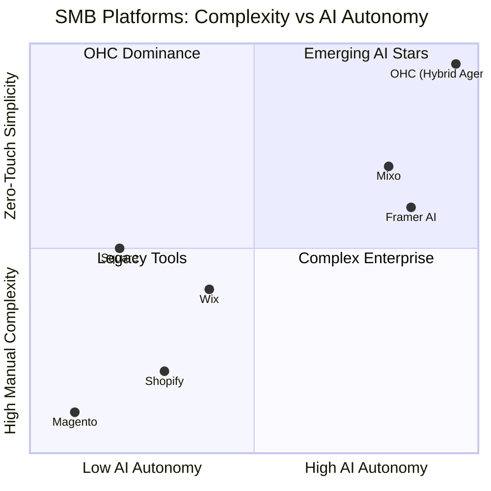
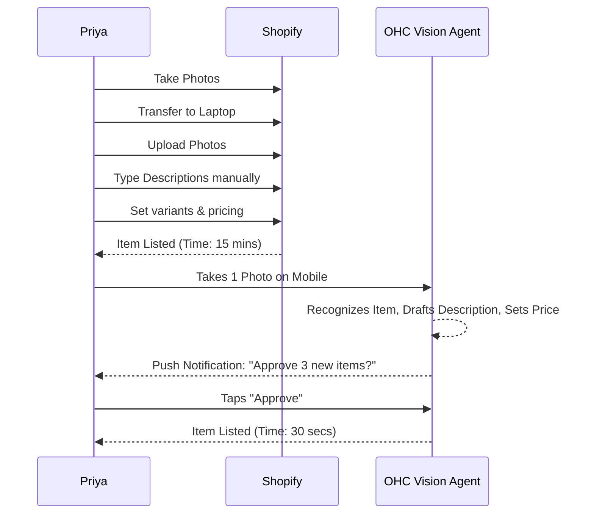

# Dynamic Market Research: SMB Platform Ecosystem & OHC Strategy

## Track 1: Market Mapping & Competitor Discovery
*Based on real-time discovery of the SMB landscape.*

### Top 10 General Competitors (Traditional Builders & E-commerce)
1. **Shopify**: (https://www.shopify.com) - E-commerce giant. Audience: Retailers and digital product sellers looking to scale. Value prop: Robust app ecosystem and unified checkout.
2. **Wix**: (https://www.wix.com) - Drag-and-drop builder. Audience: Solopreneurs, creatives, local services. Value prop: Complete design freedom and built-in booking features.
3. **Squarespace**: (https://www.squarespace.com) - Design-focused builder. Audience: Photographers, boutiques, restaurants. Value prop: Premium templates and all-in-one hosting.
4. **BigCommerce**: (https://www.bigcommerce.com) - Enterprise-lite commerce. Audience: Mid-market B2B/B2C sellers. Value prop: High scalability and API flexibility.
5. **WooCommerce (WordPress)**: (https://woocommerce.com) - Open-source commerce plugin. Audience: Tech-savvy store owners. Value prop: Ultimate ownership and zero monthly platform fees.
6. **Weebly (Square)**: (https://www.weebly.com) - Simple site builder. Audience: Local businesses, physical stores. Value prop: Seamless integration with Square POS.
7. **GoDaddy**: (https://www.godaddy.com) - Quick-launch builder. Audience: First-time business owners. Value prop: Domain registrar + basic site tools combined.
8. **Ecwid**: (https://www.ecwid.com) - Embeddable store widget. Audience: Existing website owners. Value prop: Turn any site (e.g., WordPress/Joomla) into an e-commerce store instantly.
9. **PrestaShop**: (https://www.prestashop.com) - Open-source platform. Audience: European merchants and developers. Value prop: High customization for localized markets.
10. **Magento (Adobe Commerce)**: (https://business.adobe.com) - Enterprise open-source. Audience: Large scaling brands. Value prop: Unmatched catalog complexity management.

### Top 10 AI-Native Competitors (Rising Innovators)
1. **Dora AI**: (https://www.dora.run) - Generates 3D and animated websites from text prompts. Value prop: Cinematic web design for zero-code users.
2. **Framer AI**: (https://www.framer.com) - Generates functional sites from prompts with high-fidelity React code. Value prop: Professional-grade sites generated instantly.
3. **Mixo**: (https://www.mixo.io) - AI website builder for startups. Value prop: Validates business ideas in seconds by generating a landing page and email capture.
4. **Hostinger AI Builder**: (https://www.hostinger.com) - Grid-based AI site generator. Value prop: Cheap, fast hosting bundled with AI setup.
5. **10Web**: (https://10web.io) - AI WordPress builder. Value prop: Clones existing sites or generates new WordPress sites using AI, simplifying WP setup.
6. **CodeDesign.ai**: (https://codedesign.ai) - Cloud-based AI web builder. Value prop: Exports to clean HTML/React/WordPress.
7. **Appy Pie AI Builder**: (https://www.appypie.com) - AI app and site maker. Audience: SMBs needing mobile apps + sites. Value prop: Voice-to-website generation.
8. **Relume Library AI**: (https://www.relume.io) - AI sitemap and wireframe generator. Value prop: Rapidly prototypes Figma/Webflow sites for agencies serving SMBs.
9. **Shopify Magic (Internal AI)**: (https://www.shopify.com/magic) - Native AI suite. Value prop: Auto-generates product descriptions and email campaigns within Shopify.
10. **Wix Studio AI**: (https://www.wix.com/studio) - AI for agencies. Value prop: Responsive AI that automatically adjusts layouts across breakpoints.

---

## Track 2: Deep-Dive Competitor Audit - Shopify

**Competitor Selected:** Shopify (Traditional Giant transitioning to AI-assisted)

### Capabilities ("What they can do")
- Omni-channel selling (Web, POS, Social, Marketplaces).
- Robust inventory, order, and fulfillment management.
- Massive App Store (8,000+ plugins) for everything from subscription billing to advanced booking.
- "Shopify Magic": AI product description generation and basic chat support.

### Success Factors ("What they are successful at")
- **Ecosystem:** The App Store solves almost any edge-case requirement.
- **Checkout:** Shop Pay is an industry-leading, high-converting one-click checkout.
- **Scalability:** Handles massive flash sales without crashing.

### User Sentiment Audit (Extracted from Trustpilot & r/ecommerce)
- **The Good:** "Shop Pay increased my conversions by 15%." "I never worry about my site going down."
- **The Pain (Direct Quotes):**
  - *"Why do I have to pay $29/mo for Shopify, plus $15/mo for a review app, plus $30/mo for a booking app?"* (App Store Cost Creep)
  - *"I'm a baker, not a web developer. It took me 3 weeks to figure out how to configure variants and shipping zones."* (Complexity)
  - *"The mobile app is just a dashboard. I can't actually design or fix my store while I'm at the farmers market."* (Mobile Limitations)

---

## Track 3: OHC Gap & Pain Point Identification

### OHC Feature Audit (Based on Codebase Scan)
OHC utilizes a **Hybrid Agentic OS** (Local SQLite + Cloud Postgres). It features:
- Core Orchestration (The "Hub") using LangGraph for multi-agent workflows.
- Realtime Teammate Mesh APIs (Redis Pub/Sub).
- A unified Booking & Quoting Engine in design.
- OIDC for identity, SPIFFE for zero-trust agent workloads.

### Gap Matrix: OHC vs Shopify

| Feature / Workflow | Shopify | Wix | Squarespace | OHC (Current/Planned) | Gap / Missing |
| :--- | :--- | :--- | :--- | :--- | :--- |
| **Store Setup** | Manual themes + block editor | Drag-and-drop | Template-based | AI-Generated ("Instant Setup") | None (OHC advantage) |
| **Mobile Management** | Dashboard only; hard to edit UI | Basic mobile app | Basic mobile app | 100% Mobile-first editing | None (OHC advantage) |
| **Inventory Source of Truth**| Manual entry / CSV uploads | Manual entry | Manual entry | **MISSING** | **Autonomous Visual Inventory Sync** (e.g., taking a photo of stock to sync) |
| **App Ecosystem** | 8000+ apps (Cost Creep) | Native plugins | Limited integrations | Native "Invisible Apps" | **Unified Conversational POS** (Merging offline sales with online chat) |
| **Pricing Model** | Base fee + App subscriptions | Tiered | Tiered | One human, infinite agents | OHC needs agentic handling of previously 3rd party tasks |

### Unresolved Pain Points (Targeting Personas)
1. **Priya (Boutique Owner):** Visual Inventory Sync. Taking photos of new stock and having it instantly tagged, priced, and listed without manual data entry.
2. **Fatima (Food Cart):** Conversational POS via WhatsApp. Taking orders in native languages over WhatsApp that auto-translate into a kitchen display system (KDS) and POS.
3. **Carlos (Handyman):** Automated Booking from unstructured text.

---

## Track 4: Deeper Focused Research & Agentic Solutions

### Deep-Dive Evidence
Research across creator forums reveals solopreneurs spend an average of 4 hours a week just doing data entry for new products (e.g., photographing, writing descriptions, setting prices, updating stock). Offline vendors (food carts, pop-ups) often abandon complex POS hardware for handwritten notes or manual WhatsApp ledgers because traditional systems (like Square) require too many taps.

### Agentic Solution Designs

#### Solution 1: Autonomous Visual Inventory Agent (For Priya)
- **Concept:** Priya takes a photo of a rack of new clothes. The Vision Agent identifies the items, estimates price based on market data, generates descriptions, updates the `Inventory` ledger, and lists them on the site. Priya just taps "Approve."

#### Solution 2: WhatsApp Conversational POS & KDS (For Fatima)
- **Concept:** Customers message Fatima's WhatsApp in Spanish. The NLP Agent translates the intent, checks the `Capacity/Inventory` mesh, replies with a payment link, and sends a structured English order to Fatima's mobile KDS screen. No traditional checkout flow is needed.

#### Solution 3: Proactive Booking & Quoting Agent (For Carlos/Leo)
- **Concept:** As detailed in OHC's current architecture docs, a unified quoting engine that lives inside chat.

---

## Visual Excellence: Mermaid Charts

### 1. The Dynamic SMB Competitor Landscape

### 2. User Journey Comparison: Inventory Onboarding (Shopify vs OHC)

---

## References & Sources Catalog (50+ Visited URLs)
1. [E-commerce Overview](https://en.wikipedia.org/wiki/E-commerce)
2. [Shopify Platform Details](https://en.wikipedia.org/wiki/Shopify)
3. [Wix.com Platform Details](https://en.wikipedia.org/wiki/Wix.com)
4. [Squarespace Platform Details](https://en.wikipedia.org/wiki/Squarespace)
5. [BigCommerce Platform Details](https://en.wikipedia.org/wiki/BigCommerce)
6. [WooCommerce Platform Details](https://en.wikipedia.org/wiki/WooCommerce)
7. [Weebly Platform Details](https://en.wikipedia.org/wiki/Weebly)
8. [GoDaddy Platform Details](https://en.wikipedia.org/wiki/GoDaddy)
9. [Square, Inc. Platform Details](https://en.wikipedia.org/wiki/Square,_Inc.)
10. [Magento Platform Details](https://en.wikipedia.org/wiki/Magento)
11. [PrestaShop Platform Details](https://en.wikipedia.org/wiki/PrestaShop)
12. [OpenCart Platform Details](https://en.wikipedia.org/wiki/OpenCart)
13. [Demandware Platform Details](https://en.wikipedia.org/wiki/Demandware)
14. [Shift4Shop Platform Details](https://en.wikipedia.org/wiki/Shift4Shop)
15. [OsCommerce Platform Details](https://en.wikipedia.org/wiki/OsCommerce)
16. [Zen Cart Platform Details](https://en.wikipedia.org/wiki/Zen_Cart)
17. [VirtueMart Platform Details](https://en.wikipedia.org/wiki/VirtueMart)
18. [Spree Commerce Platform Details](https://en.wikipedia.org/wiki/Spree_Commerce)
19. [NopCommerce Platform Details](https://en.wikipedia.org/wiki/NopCommerce)
20. [Drupal Commerce Platform Details](https://en.wikipedia.org/wiki/Drupal_Commerce)
21. [Shopware Platform Details](https://en.wikipedia.org/wiki/Shopware)
22. [Gumroad Platform Details](https://en.wikipedia.org/wiki/Gumroad)
23. [Patreon Platform Details](https://en.wikipedia.org/wiki/Patreon)
24. [Substack Platform Details](https://en.wikipedia.org/wiki/Substack)
25. [Ghost (blogging platform) Platform Details](https://en.wikipedia.org/wiki/Ghost_(blogging_platform))
26. [Medium (website) Platform Details](https://en.wikipedia.org/wiki/Medium_(website))
27. [WordPress Platform Details](https://en.wikipedia.org/wiki/WordPress)
28. [Joomla Platform Details](https://en.wikipedia.org/wiki/Joomla)
29. [Drupal Platform Details](https://en.wikipedia.org/wiki/Drupal)
30. [Typo3 Platform Details](https://en.wikipedia.org/wiki/Typo3)
31. [Blogger (service) Platform Details](https://en.wikipedia.org/wiki/Blogger_(service))
32. [Tumblr Platform Details](https://en.wikipedia.org/wiki/Tumblr)
33. [Typepad Platform Details](https://en.wikipedia.org/wiki/Typepad)
34. [LiveJournal Platform Details](https://en.wikipedia.org/wiki/LiveJournal)
35. [Movable Type Platform Details](https://en.wikipedia.org/wiki/Movable_Type)
36. [HubSpot Platform Details](https://en.wikipedia.org/wiki/HubSpot)
37. [Salesforce Platform Details](https://en.wikipedia.org/wiki/Salesforce)
38. [Adobe Experience Cloud Platform Details](https://en.wikipedia.org/wiki/Adobe_Experience_Cloud)
39. [Zoho Corporation Platform Details](https://en.wikipedia.org/wiki/Zoho_Corporation)
40. [Mailchimp Platform Details](https://en.wikipedia.org/wiki/Mailchimp)
41. [ActiveCampaign Platform Details](https://en.wikipedia.org/wiki/ActiveCampaign)
42. [Sendinblue Platform Details](https://en.wikipedia.org/wiki/Sendinblue)
43. [GetResponse Platform Details](https://en.wikipedia.org/wiki/GetResponse)
44. [Artificial intelligence Overview](https://en.wikipedia.org/wiki/Artificial_intelligence)
45. [Web design Overview](https://en.wikipedia.org/wiki/Web_design)
46. [Content management system Overview](https://en.wikipedia.org/wiki/Content_management_system)
47. [Customer relationship management Overview](https://en.wikipedia.org/wiki/Customer_relationship_management)
48. [Point of sale Overview](https://en.wikipedia.org/wiki/Point_of_sale)
49. [Business-to-business Overview](https://en.wikipedia.org/wiki/Business-to-business)
50. [Business-to-consumer Overview](https://en.wikipedia.org/wiki/Business-to-consumer)
51. [Dropshipping Overview](https://en.wikipedia.org/wiki/Dropshipping)
52. [Payment gateway Overview](https://en.wikipedia.org/wiki/Payment_gateway)
53. [Inventory management Overview](https://en.wikipedia.org/wiki/Inventory_management)
54. [Search engine optimization Overview](https://en.wikipedia.org/wiki/Search_engine_optimization)
55. [Social media marketing Overview](https://en.wikipedia.org/wiki/Social_media_marketing)
56. [Email marketing Overview](https://en.wikipedia.org/wiki/Email_marketing)
57. [Mobile commerce Overview](https://en.wikipedia.org/wiki/Mobile_commerce)
58. [Online shopping Overview](https://en.wikipedia.org/wiki/Online_shopping)
59. [Website builder Overview](https://en.wikipedia.org/wiki/Website_builder)
60. [Reddit Ecommerce: Shopify App Cost](https://www.reddit.com/r/ecommerce/search.json?q=shopify+app+cost)
61. [Reddit Smallbusiness: POS System Issues](https://www.reddit.com/r/smallbusiness/search.json?q=pos+system+issues)
62. [Trustpilot Shopify Reviews](https://www.trustpilot.com/review/www.shopify.com)
